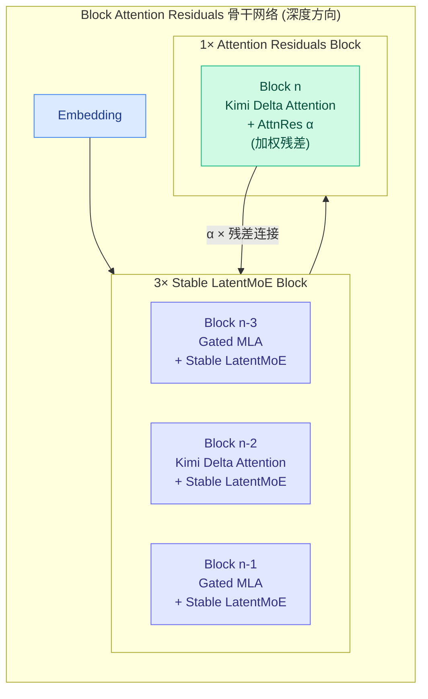
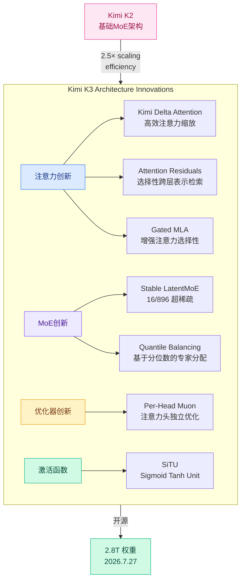
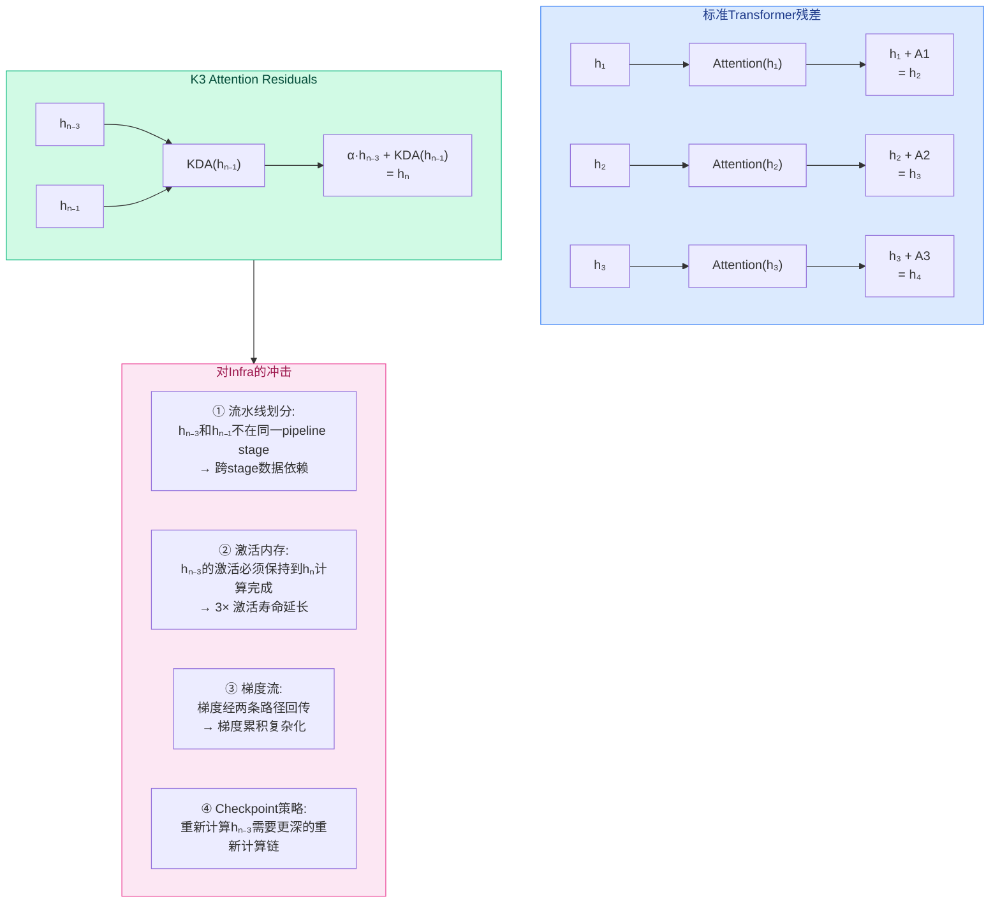
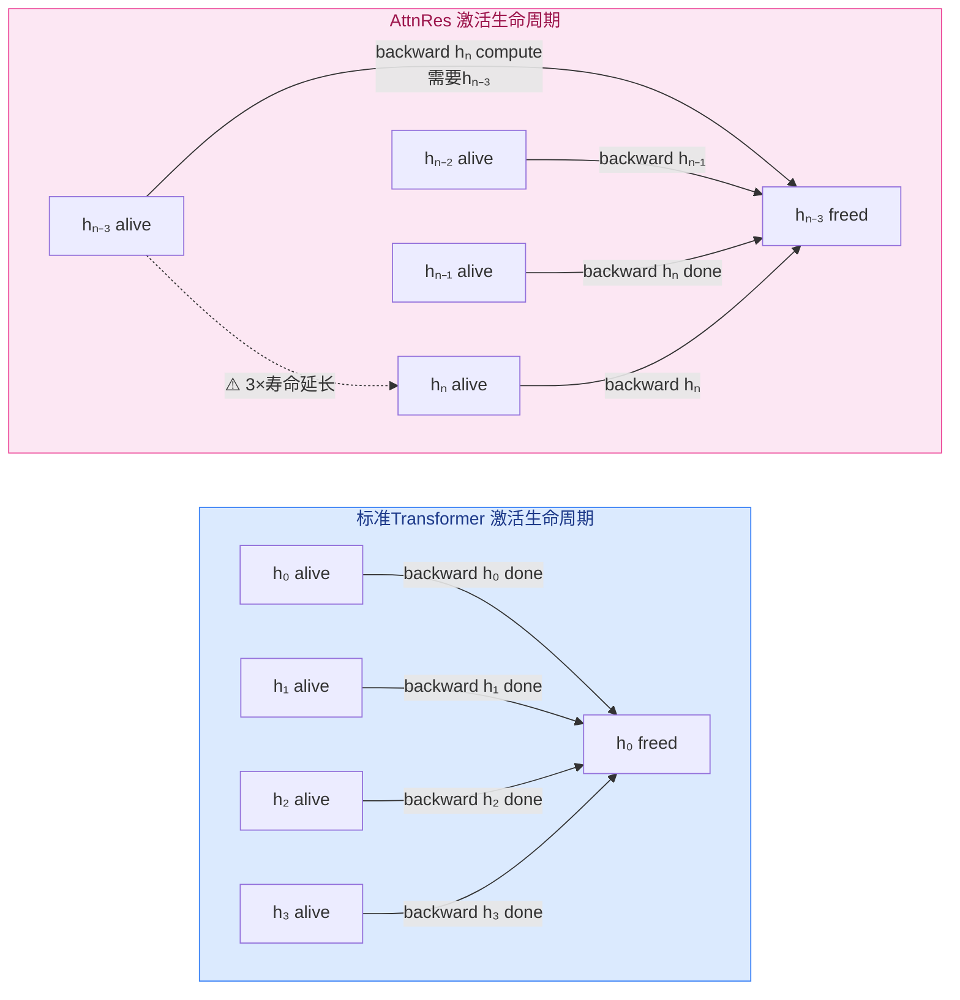
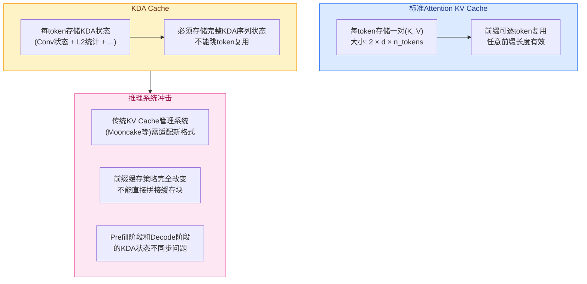
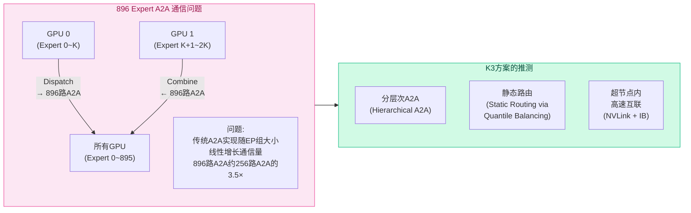
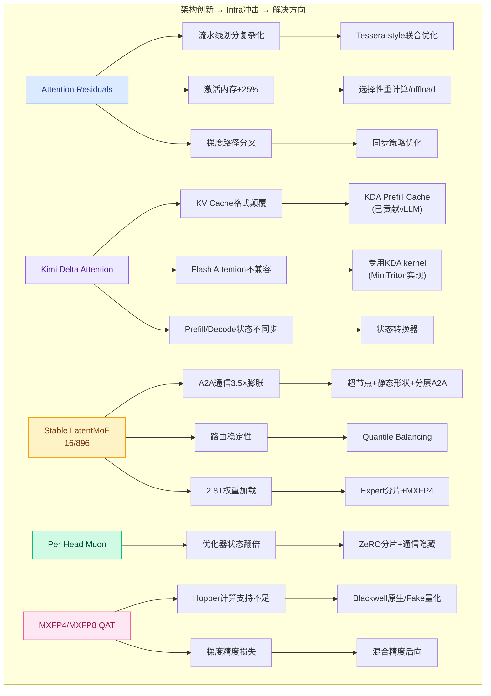
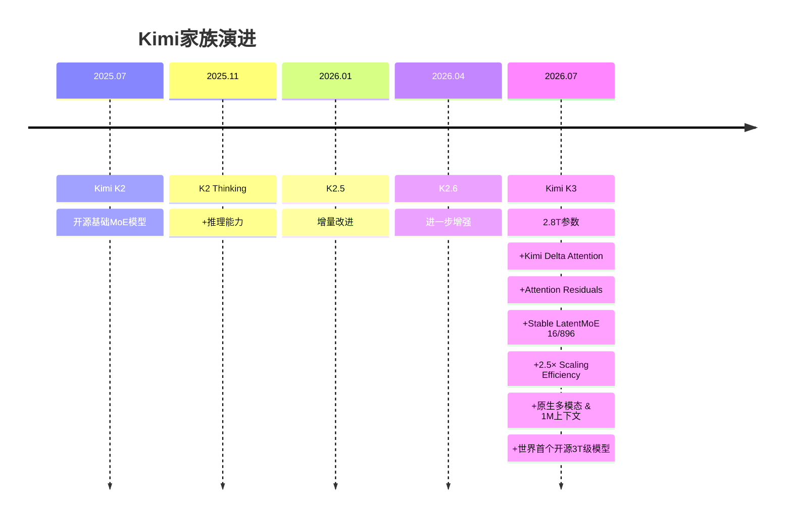

---
tags:
  - 业界动态
  - MoonshotAI
  - Kimi
  - MoE
  - 模型结构
  - 训练系统
  - 推理系统
source: https://www.kimi.com/blog/kimi-k3
created: 2026-07-29
rating: ⭐⭐⭐⭐⭐
open_source: true (2026年7月27日发布完整权重)
---

# Kimi K3: Open Frontier Intelligence — 模型结构与Infra创新深度分析

> **Kimi K3: Open Frontier Intelligence**
> 月之暗面 (Moonshot AI) | 2026年7月16日发布 | 2.8T参数，首个开源3T级模型
> 权重将于2026年7月27日开源

---

## 一、概览

| 属性 | 内容 |
|------|------|
| **模型名称** | Kimi K3 |
| **开发者** | 月之暗面 (Moonshot AI) |
| **发布时间** | 2026年7月16日 |
| **参数量** | **2.8T**（世界首个开源3T级模型） |
| **架构** | Block Attention Residuals + Kimi Delta Attention + Stable LatentMoE |
| **激活参数** | 16/896 Experts (TopK) |
| **上下文窗口** | 1M tokens |
| **多模态** | 原生视觉能力（Native Vision） |
| **对比 K2** | ~2.5× Scaling Efficiency 提升 |
| **开源** | ✅ 完整权重 2026年7月27日发布 |
| **开源仓库** | https://huggingface.co/moonshotai |

### 竞品定位

> "整体性能仍落后最强闭源模型（Claude Fable 5、GPT 5.6 Sol），但在评估套件中持续优于其他测试模型"

---

## 二、模型结构创新 — 七大组件深度解析

### 2.1 总体架构概览

Kimi K3基于**Block Attention Residuals**骨干网络，采用3:1混合模式：



### 2.2 Kimi Delta Attention (KDA)

KDA是K3的核心注意力机制创新，旨在提供**高效的注意力缩放基础**：

| 特性 | 传统Attention | KDA |
|------|:-----------:|:---:|
| 计算复杂度 | O(n²) 随序列长度二次增长 | 高效线性复杂度 |
| 长序列支持 | 需额外优化（Ring Attention等） | **原生支持1M上下文** |
| 前缀缓存 | 传统KV Cache | **需新Prefill Cache机制**（K3已贡献到vLLM） |
| 注意力选择性 | 标准softmax注意力 | 通过Gated MLA增强 |

KDA的结构：
```
输入 → Norm → Linear → Conv → L2 → σ → Linear → σ → Output
                           ↓
                      KDA核心
```

KDA在Prefilling时必须包含完整的KDA状态。由于KDA对传统前缀缓存提出了新的挑战（不像标准注意力那样可以灵活复用KV Cache），K3团队为vLLM社区贡献了对应的前缀缓存实现，使Kimi K3能在长上下文下实现有竞争力的token价格。

### 2.3 Attention Residuals (AttnRes)

AttnRes是K3的另一个核心创新——**选择性跨深度检索表示**，而非均匀累积：

```
传统残差:  h_{l+1} = h_l + FFN(Attention(h_l))
                                            ^^^^^^^
                                   均匀累积，每层权重相同

AttnRes:  h_{n} = α · h_{n-3} + KDA(h_{n-1})
                  ^^^^^^^
        选择性加权残差连接，跨3层检索
```

关键区别：
- 传统Transformer：残差均匀累积，所有层同等重要
- AttnRes：通过可学习的权重α**选择性检索**早期层的表示，信息流更灵活
- AttnRes跨度为3层（Block n连接到Block n-3）

这与Qwen3-Next的3:1混合注意力模式有异曲同工之妙，但K3的AttnRes是由**可学习权重**控制的，而非固定的层类型切换。

### 2.4 Stable LatentMoE

| 属性 | Kimi K2 | Kimi K3 |
|------|:-------:|:-------:|
| 总Experts | 未公开 | **896** |
| 激活Experts | 未公开 | **16** |
| 稀疏度 | — | 16/896 = **1.79%** |
| MoE类型 | — | **Stable LatentMoE** |

Stable LatentMoE的关键设计：
- **Latent路径**：在专家路由中引入latent representation，增强专家分配稳定性
- 在896个expert中仅激活16个（TopK=16），极度稀疏
- 路由和优化成为一级挑战

### 2.5 Gated MLA

Gated MLA是对标准多头潜注意力（MLA）的扩展，通过门控机制**增强注意力选择性**：

```
标准MLA: Q, K, V 投影到低维潜空间 → 注意力计算
Gated MLA: Q, K, V 投影 → 门控单元 → 选择性增强 → 注意力计算
```

这使得K3在不同层之间能够更自适应地调整注意力行为。

### 2.6 激活函数：Sigmoid Tanh Unit (SiTU)

K3提出了新的激活函数SiTU，替代了经典的SwiGLU或ReLU：

```
SiTU(x) = sigmoid(x) · tanh(x)
```

- 改善了**激活控制**（activation control）
- 相比SwiGLU/SiLU，SiTU在正负区域提供了更细粒度的调节
- 与传统的sigmoid门控相比，tanh提供了更强的饱和特性

### 2.7 优化器：Per-Head Muon

Muon优化器最初在Moonlight论文中被提出，K3在此基础上扩展为**Per-Head Muon**：

- 将Muon的优化范围从整个模型扩展到**每个注意力头独立**
- 每个注意力头获得独立的学习动态
- 在大规模异构MoE架构中提供更自适应的学习

K3中起作用的优化器组合：
1. **Per-Head Muon** — 注意力头的独立优化
2. 结合标准AdamW（用于非注意力参数）
3. **Quantile Balancing** — 替代启发式负载均衡

### 2.8 Quantile Balancing（分位数平衡）

在16/896的超稀疏MoE中，专家路由平衡成为关键挑战。K3提出Quantile Balancing：

```
传统方法: 辅助损失（Aux-Loss）+ 启发式更新
            ↓ 问题：超参数敏感，需要手动调节

Quantile Balancing:
  从 router-score 分位数直接推导专家分配
  无需启发式更新
  无需敏感的平衡超参数
```

这消除了DeepSeek-V3中使用的Aux-Loss-Free负载均衡中的敏感超参数调优问题。

---

## 三、模型结构创新全景图



---

## 四、模型结构创新对Infra的深层挑战与解决思路

K3的架构创新（AttnRes、KDA、Stable LatentMoE 16/896）在设计上追求更高的 scaling efficiency，但每一个创新都对现有训练和推理基础设施中的**隐含假设**构成了系统性的挑战。本节深入分析这些挑战及其潜在解决思路。

### 4.1 Attention Residuals (AttnRes) 的Infra挑战

#### AttnRes 的计算图结构



#### 挑战①：流水线并行的划分问题

**问题本质**：AttnRes 的残差连接跨越3层（hₙ → hₙ₋₃），而非传统的相邻层连接。这意味着当流水线并行将模型划分为stage时，如果这4层（n-3, n-2, n-1, n）被分到不同stage，就产生了**跨stage的非局部依赖**。

```
传统残差（相邻层依赖）:
  Stage 1: [Layer 0→1→2]  Stage 2: [Layer 3→4→5]
  依赖链: 0→1→2 → 3→4→5 (线性, 易划分)

AttnRes（跨3层依赖）:
  Stage 1: [Block n-3]  Stage 2: [Block n-2, n-1, n]
  依赖链: n-3 → n (跳过n-2, n-1)
          n-3 → n-2 → n-1 → n (标准链)
  → 两条路径汇聚于n, 后向传播时亦然
```

**解决思路**：
- **强制同stage分组**：将AttnRes的4-block组保持在同一个pipeline stage内。这减少了stage间的通信但增加了stage内的计算量
- **Tessera风格的overlap-aware划分**：如Tessera论文所提出的，必须考虑后重叠代价而非串行FLOPs——不同类型的block（Gated MLA vs. KDA+AttnRes）有不同的重叠效率
- **梯度累积的同步策略**：两条梯度路径的同步点设计，避免因等待跨层梯度而增加流水线气泡

#### 挑战②：激活内存的生命周期延长

**问题**：标准Transformer中，hₗ的激活值只需要保留到它的紧后层（hₗ₊₁）计算完梯度。但在AttnRes中，hₙ₋₃的激活值必须保留到Block n（3层之后）的梯度计算完成。



**影响定量分析**：假设标准Transformer每层激活大小为A。在AttnRes的4-block组中：
- 标准：峰值激活 = 4A（每一层的激活）
- AttnRes：峰值激活 = 4A + hₙ₋₃（额外保留3层）→ **~5A**
- 意味着激活峰值内存增加约25%

**解决思路**：
- **选择性激活重计算（Selective Recomputation）**：不保存hₙ₋₃的完整激活，而是在后向时从hₙ₋₂或checkpoint重新计算。这与标准的激活checkpointing不同——需要重新计算从checkpoint到hₙ₋₃的整条链
- **AttnRes专用的offloading策略**：将hₙ₋₃的激活卸载到CPU内存或NVMe，在计算后向时再传回——因为hₙ₋₃到hₙ之间有3层的计算延迟，有足够的时间进行异步offload/load

#### 挑战③：梯度流的分叉与汇合

AttnRes的后向梯度计算涉及两条路径的汇合：

```
∂L/∂hₙ₋₃ = (∂L/∂hₙ) · α + (∂L/∂hₙ) · ∂KDA(hₙ₋₁)/∂hₙ₋₃
             ↑ AttnRes路径       ↑ 标准链路径
```

**分布式训练的隐患**：
- 如果两条路径分布在不同的设备上（流水线并行或张量并行），需要额外的all-reduce来合并梯度
- 梯度累积的时机需要同步两条路径的结果，可能引入新的同步点

#### 挑战④：与Flash Attention和MLA的兼容性

AttnRes的操作α是一个可学习的标量权重（可能是向量）。在注意力计算中，这意味着：
```
Attention_with_AttnRes(Q, K, V) = α · hₙ₋₃ + softmax(QK^T)V
```

这破坏了Flash Attention中tiling策略的一个核心假设——注意力输出后仅做简单残差连接（h + Attention(h)）。α的存在意味着Flash Attention的kernel融合策略需要修改。

### 4.2 Kimi Delta Attention (KDA) 的Infra挑战

#### KDA的计算模式分析

```
KDA核心路径:
  Input → Norm → Linear → Conv → L2 → σ → Linear → σ → Output
```

KDA不是点乘注意力（scaled dot-product attention），也不是标准的线性注意力。它包含**卷积（Conv）和L2归一化**操作，这使得它在计算图上与Transformer的其他部分显著不同。

#### 挑战①：KV Cache的格式颠覆



**核心问题**：传统KV Cache可以按token粒度独立缓存——任意前缀的KV对可以复用。KDA的Conv操作创建了token间的序列依赖，缓存必须以连续块为单位，不能跳跃复用。

**K3团队的解决方案**（已贡献到vLLM社区）：
- **KDA Prefill Cache**：将连续token序列的KDA状态整体缓存
- 缓存粒度从"单token"变为"连续块"（chunk）
- 块边界对齐策略：在推理时，新的请求需要从最近缓存的块边界开始对齐预填充

**进一步优化思路**：
- **分块前缀缓存**：将长前缀划分为固定大小的KDA块，块内状态可整体缓存，块间可拼接但需边界状态对齐
- **KDA状态压缩**：Conv和L2状态可能可以进一步量化或压缩，减少缓存大小

#### 挑战②：Prefill-Decode的异步问题

标准Attention中，prefill阶段的KV cache在decode阶段可以直接使用。但KDA中：
- Prefill阶段：KDA的Conv沿序列维度执行，产生完整的序列级状态
- Decode阶段：逐token推理时，Conv需要维护滑动窗口状态
- 两个阶段的KDA状态表示可能不直接兼容

**解决思路**：
- **状态转换器**：在prefill→decode切换点，将prefill的完整KDA状态转换为decode的状态机初始状态
- **统一内核**：设计同时支持prefill和decode模式的KDA kernel，避免状态切换

#### 挑战③：与Flash Attention生态的兼容性

Flash Attention是当前GPU推理的事实标准内核。KDA的计算路径（Conv → L2 → σ → Linear → σ）**完全不兼容Flash Attention的算法**：
- Flash Attention依赖分块softmax的tiling策略
- KDA既不用softmax也不用标准的QK^T注意力矩阵
- Flash Attention的调度器和内存规划器需要完全重写以适配KDA

**解决思路**：
- **专用kernels**：为KDA编写专用的CUDA kernel（K3团队已通过MiniTriton实现部分工作）
- **融合kernel策略**：将Conv + L2 + σ + Linear融合为一个操作，减少kernel launch开销和中间内存读写

### 4.3 Stable LatentMoE (16/896) 的Infra挑战

#### MoE系统对比

| 维度 | DeepSeek-V3 (256exp, top-8) | Kimi K3 (896exp, top-16) |
|------|:---------------------------:|:------------------------:|
| 总Experts | 256 | **896 (3.5×)** |
| 激活率 | 8/256 = 3.125% | 16/896 = **1.79%** |
| EP组大小 | 256 (8节点) | **896** |
| Load Balancing | Aux-Loss-Free + 动态调整 | Quantile Balancing + 静态形状 |
| 通信模式 | 标准A2A | 超大规模A2A |

#### 挑战①：All-to-All的通信爆炸

896个expert分布在多个GPU上时，All-to-All通信成为核心瓶颈：



**K3的解决思路**：
- **Fully Balanced EP + 静态形状**：通过Quantile Balancing确保每轮迭代中，每个GPU处理的token数量和expert数量完全一致。这让A2A通信的pattern在编译时已知且固定，可以预先优化通信调度
- **超节点建议（64+加速器）** ：更大的通信域意味着更大的IB/NVLink带宽池，减少A2A的通信瓶颈
- **可能的分层A2A**：推测K3使用了层次化通信——节点内A2A（NVLink快速）+ 跨节点A2A（IB）

#### 挑战②：路由稳定性与训练收敛

16/896意味着每个token只激活1.79%的expert。如此稀疏的路由带来：

| 问题 | 传统Aux-Loss方案 | K3的解决方案 |
|------|-----------------|-------------|
| Expert崩溃 | 加Aux-Loss惩罚不平衡 | **Quantile Balancing**: 基于router-score分位数直接分派 |
| 路由噪声 | 多轮迭代平均 | 静态形状 + 编译时确定分配 |
| 超参数敏感性 | Aux-Loss系数需细致调参 | **无超参数** |
| 训练vs推理不一致 | 训练用topK，推理可能不同 | **统一分配策略** |

**Quantile Balancing的核心思想**：不依赖启发式或辅助损失来平衡专家负载，而是直接从router输出的得分分位数（quantiles）推导每个token应该被分配到的expert。这使得路由决策在统计意义上最优，且无需额外的平衡超参数。

#### 挑战③：权重存储与加载

2.8T参数 = 896个expert的权重 + 密集层权重。在训练和推理中：
- **内存需求**：即使使用MXFP4量化，每个expert也需要至少数百GB的显存
- **权重加载**：896个expert的权重加载/卸载策略
- **Expert-level swapping**：对于长尾expert，可能不需要频繁访问所有896个expert

**解决思路**：
- **Expert分片 + 流水线加载**：将896个expert分布在多个GPU上，推理时按需激活
- **量化 + MoE折叠**：MXFP4 + Stable LatentMoE的组合意味着每个expert的实际存储需求可以通过量化进一步降低
- 超节点配置（64+ GPU）部分解决了这个问题——足够大的GPU池可以容纳896个expert的完整副本

### 4.4 Per-Head Muon 的Infra挑战

#### 优化器状态的存储与通信

Per-Head Muon 意味着每个注意力头维护独立的Muon优化器状态：

```
标准AdamW: 2 states per param (momentum, variance) × num_params
Per-Head Muon: n_heads × Muon_state_per_head
              + AdamW states for non-attention params
```

**挑战**：
- **内存增加**：Muon状态一般比AdamW状态更大（Muon需要维护正交化矩阵的分解状态）
- **通信复杂度**：每个head的Muon状态需要独立同步
- **实现复杂度**：混合优化器策略（Muon for heads + AdamW for others）增加了训练框架的复杂度

**解决思路**：
- **ZeRO分片**：将每个head的Muon状态像标准ZeRO-3一样分片存储
- **通信调度**：利用AttnRes和KDA的计算时间隐藏Muon states的通信

### 4.5 MXFP4/MXFP8量化感知训练的Infra挑战

| 挑战 | 描述 | 可能的解决方案 |
|------|------|--------------|
| **Kernel支持** | 当前Hopper GPU对MXFP4计算的支持有限 | 使用MXFP4模拟路径（通过更高精度kernel模拟）或等待Blackwell原生支持 |
| **梯度精度** | MXFP4前向 + MXFP8激活，但后向梯度需要更高精度 | 在训练后向阶段自动提升精度，或在关键layer使用FP8/BF16 bypass |
| **Loss缩放** | 极度量化可能导致loss不稳定 | 逐层自适应loss scaling + MXFP4特定的QAT策略 |
| **与MoE交互** | 不同expert可能对量化敏感度不同 | Per-expert量化精度分配（敏感expert用更高精度） |

K3从**SFT阶段**开始应用QAT，这意味着预训练阶段未量化（BF16/FP8），SFT阶段开始量化到MXFP4/MXFP8。这样做的好处是：
1. 预训练不受量化噪声干扰
2. SFT阶段让模型适应量化噪声
3. 最终部署时模型已经对MXFP4的量化噪声鲁棒

### 4.6 各架构创新对Infra冲击的汇总



### 4.7 与社区已有工作的对应关系

| K3架构创新 | 面临的Infra挑战 | 社区已有或可迁移的工作 |
|-----------|---------------|----------------------|
| AttnRes跨层残差 | 流水线划分 | **Tessera** (OSDI '26)：划分-重叠联合优化 |
| AttnRes激活生命周期 | 内存压力 | Selective Recomputation / Activation Offloading |
| KDA新缓存格式 | 推理缓存 | Moonshot贡献到vLLM的KDA Prefill Cache |
| KDA非标准注意力 | Kernel支持 | **MiniTriton**：K3自主构建编译器 |
| 16/896 MoE | 通信 | **DeepEP** / 分层A2A / IB+NVLink混合 |
| 16/896路由平衡 | 负载均衡 | **Quantile Balancing** (K3原创) |
| Per-Head Muon | 优化器内存 | **ZeRO-3** / Muon分片 |
| MXFP4/MXFP8 | Kernel精度 | **QAT + Fake量化**模拟路径 |

### 4.8 对未来训练/推理系统的启示

K3的架构给系统研究提出了几个新的开放问题：

1. **划分配置的联合优化**：当模型包含AttnRes（跨层跳跃连接）、KDA（非标准注意力）和超稀疏MoE时，Tessera-style的划分-重叠联合优化必须扩展到考虑这些新型依赖——这比Qwen3-Next的3:1混合要复杂得多

2. **跨层次缓存管理**：KDA、AttnRes和MoE的缓存需求可能相互冲突——KV Cache需要chunk级对齐，AttnRes需要跨层激活保留，MoE需要expert权重。三者的协调是一个新问题

3. **编译器的自适应代码生成**：K3用MiniTriton证明了模型可以自主优化其内核。未来的方向可能是一个闭环：模型设计 → 分析Infra瓶颈 → 模型修改架构以缓解瓶颈 → 生成优化代码

4. **量化与稀疏性的协同**：MXFP4 + 1.79%专家激活的组合意味着计算主要在少数expert的小矩阵上，这些矩阵已经是低精度。这为"量化稀疏计算"提出了新的kernel优化机会

---

## 五、K3团队已实现的Infra创新与优化详解

### 5.1 训练系统创新

#### Fully Balanced Expert-Parallel Training

在16/896的超稀疏MoE训练中，专家并行（EP）的负载不均衡是吞吐量杀手。K3提出：

| 传统EP训练 | K3的Fully Balanced EP |
|-----------|----------------------|
| 动态形状（dynamic shapes） | **静态形状（static shapes）** |
| 需host同步在关键路径上 | **关键路径上无host同步** |
| 专家不均衡导致吞吐下降 | 完美均衡保证最大吞吐 |
| 依赖Aux-Loss减轻不均衡 | 通过Quantile Balancing+静态形状彻底解决 |

**核心思想**：不在运行时动态调整专家分配，而是通过静态形状和分位数平衡算法在**编译时/训练前**就保证完美负载均衡。

#### 量化感知训练

K3从SFT阶段开始应用量化感知训练（Quantization-Aware Training）：

| 组件 | 精度 |
|------|:----:|
| 权重 (Weights) | **MXFP4** |
| 激活值 (Activations) | **MXFP8** |
| 硬件兼容性 | 广泛的硬件兼容 |

MX格式（Microscaling格式）是NVIDIA Blackwell架构中引入的格式，K3是首批在生产模型中大规模应用该格式的开源模型之一。

### 5.2 推理系统创新

#### KDA Prefill Cache

KDA的独特架构要求新的前缀缓存实现：

```
传统Attention KV Cache:
  KV对可以逐token自由复用
  → 前缀缓存实现简单

KDA Prefill Cache:
  KDA状态必须在prefill阶段完整包含
  → 需要新的缓存策略
  → K3团队已贡献到vLLM社区
```

这使得Kimi K3尽管有2.8T参数和1M上下文，仍能通过Mooncake推理架构实现竞争性的token价格。

#### 推理基础设施：Mooncake

Kimi K3通过Mooncake（月之暗面之前开源的KVCache-centric分离式推理架构）提供服务：

| 指标 | 值 |
|------|:---:|
| Cache命中定价 | $0.30/MTok（**90%+命中率**在编码场景） |
| Cache未命中定价 | $3.00/MTok |
| 输出定价 | $15.00/MTok |

编码工作负载上超过90%的Cache命中率是一个重要数据点——意味着绝大多数Kimi K3编码推理的计算可以从缓存中命中，实际有效成本极低。

#### Supernode配置建议

由于推理效率随着更大高带宽通信域而提升，K3团队建议在**64个或更多加速器**的超节点配置上部署。

### 5.3 开源贡献

| 组件 | 状态 |
|------|:----:|
| 模型权重 | ✅ 2026年7月27日发布 |
| vLLM KDA缓存实现 | ✅ 贡献到vLLM社区 |
| MiniTriton编译器 | ✅ K3自主构建 |

### 5.4 MiniTriton：K3自主构建的编译器

在K3开发后期，早期版本的K3承担了团队大部分kernel优化工作，并自主开发了**MiniTriton**——一个紧凑的Triton风格编译器：

```
MiniTriton架构:
  DSL前端 → MLIR上的Tile级IR层 → 优化Passes → PTX代码生成 → 运行时
```

性能表现：
- 在支持的roofline基准测试中，**与Triton和torch.compile相当或更优**
- 在某些工作负载上**超越Triton**
- 支持端到端nanoGPT训练，收敛曲线与参考实现紧密跟踪

这说明K3具备了**端到端构建编译器的能力**（从DSL前端、IR passes到PTX代码生成和运行时），而非仅编写孤立kernel。

---

## 六、工程能力验证（K3 Agent能力）

### 6.1 GPU Kernel优化

| 任务 | 4个任务涵盖 |
|:----|:----------:|
| AttnRes kernel | 注意力残差优化 |
| KDA kernel | Kimi Delta Attention优化 |
| MLA kernel | 512-head-dim MLA kernel优化 |
| 硬件覆盖 | NVIDIA Hopper + 替代GPU厂商 |

结果：**与Claude Fable 5（含fallback）竞争力相当**，大幅超过Opus 4.8、GPT 5.6 Sol和GPT 5.5。

### 6.2 芯片设计（最惊人的Demo）

K3在**一次48小时自主运行中**，使用开源EDA工具在Nangate 45nm库上设计了一颗服务于自身架构的nano模型的芯片：

| 指标 | 值 |
|:----|:---|
| 面积 | **4 mm²** |
| 时序 | **100 MHz closed timing** |
| 解码吞吐 | **8,700+ tokens/s**（仿真） |
| 标准单元 | 1.46M |
| SRAM | 0.277 MB |
| 计算阵列 | **INT4 MAC + fused dequantization** |

### 6.3 天体物理研究复现

K3在约2小时内完成了通常需要1-2周经验丰富研究员的工作：
- 审查和交叉验证20+篇论文
- 实现完整数值流水线
- 评估300+状态方程
- 识别已发表公式中的不一致性
- 生成3,000+行Python代码
- 制作交互式HTML仪表板

### 6.4 端到端知识工作

ASIC行业研究案例：120+轮递归自我改进，通过2.8k+次网络搜索/获取和1.1k+次终端数据拉取，跨越11k+页面的87份季度报告和99份原始PDF。

---

## 七、局限性

| 局限 | 描述 |
|:----|:-----|
| **Thinking History敏感性** | K3在preserved thinking history模式下训练。如果agent harness未按要求传递所有历史思考内容，或从其他模型切换至K3，生成质量可能高度不稳定 |
| **过度主动性** | K3训练强调长周期困难任务，因此在遇到小问题或用户意图模糊时，可能做出意外决策。需要更明确的系统提示约束 |
| **用户体验差距** | 相比Claude Fable 5和GPT 5.6 Sol仍有明显体验差距 |

---

## 八、Benchmark表现

### 8.1 Coding Benchmarks

| Benchmark | Kimi K3 (max) | Claude Fable 5 | GPT 5.6 Sol | Claude Opus 4.8 |
|-----------|:------------:|:--------------:|:-----------:|:---------------:|
| DeepSWE v1.1 | **67.3** | — | — | — |
| Terminal-Bench 2.1 | **67.8** | 65.2† | 72.5 | 47.0 |
| Program Bench | **60.7** | 53.3 | 54.1 | 48.3 |
| SWE Marathon | **49.3** | 41.7† | 42.8 | 36.7 |
| FrontierSWE | **2.35** | 1.08 | 1.86 | — |
| KCB 2.0 | **60.3** | 51.5 | 27.0 | 32.4 |

† Claude Fable 5在某些基准中有35%的fallback，可能降低了其测量表现

### 8.2 Agentic & Productivity Benchmarks

| Benchmark | Kimi K3 | Claude Fable 5 | GPT 5.6 Sol |
|-----------|:------:|:--------------:|:-----------:|
| BrowseComp (1M ctx) | **90.4** | ~90 | ~90 |
| AA-Briefcase (Elo) | **1548** | 1583 | 1495 |
| APEX-Agents | **41.0** | 43.3 | 39.9 |
| Office QA Pro | **63.3** | 69.9* | 63.2* |
| SpreadsheetBench 2 | **34.8** | 34.7* | 32.4* |

### 8.3 Vision Benchmarks

| Benchmark | Kimi K3 | Claude Fable 5 | GPT 5.6 Sol |
|-----------|:------:|:--------------:|:-----------:|
| MMMU-Pro | **81.6** | 81.2 | 83.0 |
| CharXiv (RQ) | **84.8** | 88.9 | 84.6 |
| MathVision | **94.3** | 94.8 | 95.8 |
| OmniDocBench | **91.1** | 89.8 | 85.8 |
| WorldVQA ForceAnswer | **51.0** | 56.7 | 41.8 |
| PerceptionBench | **58.5** | 57.2 | 59.7 |

---

## 九、从K2到K3的演进



---

## 十、亮点与局限

### 亮点

- 🏆 **首个开源3T级模型** — 开源AI的里程碑，对社区意义重大
- 🧠 **架构创新全面**：KDA + AttnRes + Stable LatentMoE + SiTU + Per-Head Muon + Quantile Balancing，非单一改进
- 🎯 **2.5× Scaling Efficiency** — 不只是堆参数，而是同等算力下更智能
- 🛠️ **Infra成熟度高**：Fully Balanced EP训练、MXFP4/MXFP8 QAT、KDA Prefill Cache
- 🤖 **模型自主构建工具链**：MiniTriton编译器和芯片设计能力展示了K3强大的agent能力
- 📖 **诚实透明的局限性报告**：thinking history敏感性和过度主动性的坦白

### 局限

- ⏳ **完整技术报告未发布**（截至分析日）：架构细节有限
- 📊 **仅max thinking effort模式可用**：思考和inference成本最高
- 🏭 **超节点要求**：64+加速器部署建议限制了可访问性
- 💰 **输出定价高**：$15/MTok显著高于小型模型
- 📉 **仍落后Claude Fable 5和GPT 5.6 Sol**：整体性能未达到闭源SOTA
- 🧩 **与现有Agent框架兼容性**：thinking history preservation要求限制了harness选择

---

## 十一、个人评价

Kimi K3是开源AI的一个重要里程碑。它以首个开源3T级模型的姿态，将开源模型的上限从K2的级别提升了一个数量级。但K3更值得关注的是它**架构创新的密集度**——KDA、AttnRes、Stable LatentMoE、SiTU、Per-Head Muon、Quantile Balancing——这远不是一个"更大的K2"。

从系统角度看，Fully Balanced Expert-Parallel Training和KDA Prefill Cache体现了Moonshot AI在训练和推理基础设施上的深厚积累。特别值得注意的是K3在**模型自主构建工具链**上的展示：MiniTriton编译器和芯片设计Demo不仅仅是技术噱头，它们展示了未来AI系统设计的一个可能方向——模型本身成为系统构建的工具。

从定位上看，K3选择开源3T级但仍落后闭源最优（Fable 5, Sol）的路径很务实：不是宣称"超越GPT-5"，而是诚实地说"整体仍落后，但在多个维度上已具备竞争力"。这种诚实度在AI公司的宣传中并不多见。

一个待观察的问题是：2.8T参数的开源模型的实际部署成本。即使有Mooncake的90%+ Cache命中率，$15/MTok的输出定价意味着运行K3进行推理的成本远超小型模型。在边缘设备或大规模消费级部署中，蒸馏和量化的版本将是必要的后续步骤。

---

## 参考文献

1. Kimi K3 Blog. https://www.kimi.com/blog/kimi-k3, July 2026.
2. Kimi K2 Report. https://www.kimi.com/blog/kimi-k2, July 2025.
3. Kimi K1.5: Scaling Reinforcement Learning with LLMs, 2025.
4. Moonlight: Muon is Scalable for LLM Training, 2025.
5. Mooncake: A KVCache-centric Disaggregated Architecture for LLM Serving. FAST '25.
6. MoBA: Mixture of Block Attention for Long-Context LLMs, 2025.
7. PerceptionBench: https://www.kimi.com/blog/perception-bench, 2026.
