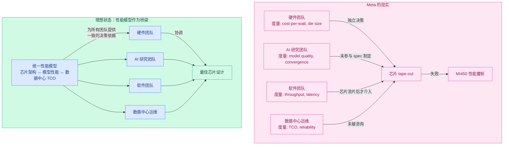
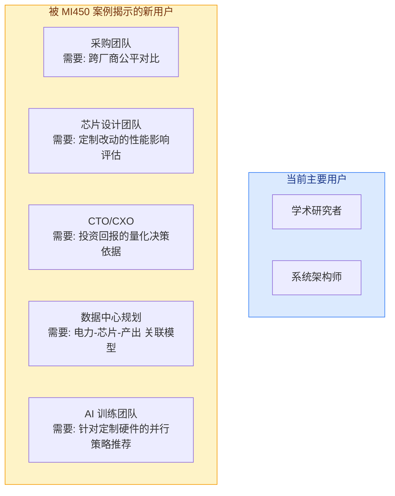

---
tags:
  - 业界动态分析
  - Meta
  - AI基础设施
  - AMD
  - 芯片设计
  - 组织文化
source: https://www.semianalysis.com/p/metas-infrastructure-team-needs-a-culture
date: 2026-07-27
rating: ⭐⭐⭐⭐⭐
---

# SemiAnalysis: Meta 基础架构团队需要一场文化变革 — 深度解读

> **原文**: "Meta's Infrastructure Team Needs A Culture Reset" | SemiAnalysis | 2026年7月22日
> **涉及机构**: Meta, AMD, Nvidia, TSMC
> **核心议题**: Meta 的 AI 芯片战略失误暴露了组织文化的深层问题

---

## 一、背景

### 1.1 事件概要

2026年7月22日，SemiAnalysis 发布了一篇引爆科技圈的深度分析《Meta's Infrastructure Team Needs A Culture Reset》。文章的核心指控是：**Meta 的基础架构团队存在严重的组织文化问题，导致一系列数十亿美元级的系统性失误**——从收购整合失败到服务器过度设计，再到定制芯片性能腰斩。

这篇付费文章迅速被多家中文媒体（36氪、美股研究社、Bitget）转载解读。与 Meta 同周宣布的 $600 亿 AMD 大单形成鲜明对比——在一场全行业瞩目的战略合作背后，是芯片设计环节的系统性失败。

文章举了四个具体案例（Rivos 收购、Grand Teton 服务器、Ariel 定制机柜、MI450 定制芯片），全部指向同一个模式：**Infra 团队按照自己熟悉的推荐系统（RecSys）经验推导设计需求，而真正要用这些硬件打仗的 GenAI 团队缺乏发言权。**

### 1.2 时间线

| 时间 | 事件 |
|------|------|
| 2021 | Grand Teton 服务器立项（LLM 时代前） |
| 2022.10 | Grand Teton 在 OCP Summit 发布 |
| 2023 | Meta "效率年" — 裁员 21,000+ 人 |
| 2024 | 与 AMD 启动定制 MI450 芯片合作；Rivos 收购（$25 亿） |
| 2024 底 | MTIA v1 部署推荐系统；Olympus 项目（基于 Rivos IP）取消 |
| 2025 初 | Iris 芯片 tape-out；Ariel NVL36x2 机柜部署 |
| 2025 底 | 基础架构领导层离职潮；Rivos 联合创始人 Mark Hayter 离职 |
| 2026 Q1 | 资本支出上调至 $1,250 - $1,450 亿；Phoebe 项目推迟到 2028 |
| 2026年7月16日 | Meta 与 AMD 宣布 $600 亿+、6GW 合作 |
| **2026年7月22日** | **SemiAnalysis 发布文化重置文章** |
| 2026年9月 | Iris 芯片量产启动 |
| 2026年 | GB300 一代 Meta 放弃定制，回归标准 NVL72 配置 |

### 1.3 核心矛盾

```
Meta 战略层的宏大叙事:
    Zuck 的超级智能愿景
    → $1,450 亿年资本支出
    → 6GW AMD 合作
    → 自研芯片组合 (MTIA + Iris + MI450)
    
        VS
    
基础设施层的现实:
    MI450 性能腰斩
    → 组织孤岛无法协同
    → "成本优先"文化导致设计失误
    → 人才流失与士气危机
```

---

## 二、SemiAnalysis 的核心论点详解：四个案例

### 2.1 案例一：Rivos 收购——$25 亿买了个"人头池"

Rivos 是一家面向数据中心的 RISC-V 芯片公司，拥有 CPU、数据并行加速器及配套软件能力，已完成高性能处理器流片并构建了兼容 CUDA 软件生态的软件栈。Meta 支付了超过 **$25 亿** 收购 Rivos，主要动机包括获取其 SIMT core IP（Meta 既有 MTIA 偏 SIMD 架构，而 NVIDIA GPU 的 SIMT 在可编程性上更灵活），以及获得自行管理芯片制造与测试的 COT（Customer-Owned Tooling）能力。

**收购后的组织溃败：**

SemiAnalysis 披露，收购完成后灾难性的事件接连发生：

1. **Olympus 项目取消** — 原计划采用 Rivos GPU IP 的 Olympus 芯片项目因系统与封装方案过于激进、软件远未就绪而被取消
2. **Phoebe 项目推迟** — 替代项目被推迟到 2028 年流片
3. **团队被拆散** — Rivos 团队被分散到不同组织，原团队协作模式被破坏
4. **大规模裁员** — 约 30% 随收购加入的 Rivos 工程师在后续裁员中被解雇
5. **核心人才流失** — 联合创始人 Mark Hayter 已离职，一批前 Rivos 员工在 5 月首批 RSU 归属后跳槽到 Gerard Williams 的新创公司 Nuvacore
6. **CEO 待走** — 文章推测 CEO Puneet Kumar 也在等股份完全归属后离开

> "这就像花大价钱买下一支完整的 F1 车队，进门后先把车手、空气动力学和维修团队分给三个事业部，然后问大家为什么还没拿冠军。"

SemiAnalysis 还指出了一个财务对比：从零组建一个拥有 COT 能力的团队年成本约 $1 亿量级，但 Meta 为这个能力支付了 $25 亿，账怎么算都不对。Rivos 案例暴露的问题不是"技术买错了"，而是更基础的组织问题——收购方没有稳定的软件栈、封装与系统方案，也缺少能跨越数年周期的明确整合 owner。

### 2.2 案例二：Grand Teton——为一个不存在的需求，加了一整个 switch tray

Meta 的 H100 服务器 Grand Teton（已贡献给 OCP）与标准 NVIDIA HGX 服务器的最大区别是多了一个 **switch tray**：4 颗 Broadcom PCIe switch、16 块 SSD、8 个 NIC，目的是提供额外 PCIe lanes 让每台服务器能多塞 8 块 SSD。

**问题所在：**

第一，这个需求是 Infra 团队"推导"出来的，而非模型团队提出的。Infra 认为训练 checkpoint 需要更多本地存储，但实际生产中模型团队对这些存储的使用远低于预期，该设计最终被取消。这是典型的"缺乏软硬件协同设计"——你辛辛苦苦给用户加了个大冰箱，结果人家根本不做饭。

第二，技术上存在更优解。NVIDIA Hopper 代的 ConnectX-7 NIC 已集成 PCIe switching 功能，实际上"设计掉了"独立 PCIe switch 的必要性。基于 Sapphire Rapids 的 80 条 PCIe lanes，完全可以设计出不需要额外 switch tray、还能挂 8 块 E1.S SSD 的方案。

**结果：** BOM 更贵、功耗更高、集成更复杂、TCO 更差。NVIDIA 的网卡依赖一点没减，还额外多了对 Broadcom 的依赖。

> **⚠️ 注意：知乎译者对此案例有不同看法。** Grand Teton 于 2022 年 10 月 OCP Summit 发布，立项在 2021 年左右，那时 LLM 浪潮远未到来，Meta 的核心负载确实是 RecSys 和常规 AI 训练。用"LLM 团队的 checkpoint 存储用量低于预期"去批评一个 LLM 时代之前定型的设计，本质上是用 2024 年的需求考卷批改 2021 年的设计答卷。这个案例的批评力度可能偏弱。

### 2.3 案例三：Ariel NVL36x2——全球唯一客户的"定制款"

到了 Blackwell 这代，故事升级了。Meta 定制了名为 **Ariel** 的 GB200 机柜。标准 GB200 是 2 颗 B200 GPU 配 1 颗 Grace CPU（2:1），Ariel 改为 1:1——实现方式是在标准 Bianca 计算板上少焊一颗 GPU。

Meta 是 **这个 SKU 全球唯一的客户**。动机还是那个熟悉的执念：RecSys 需要更高的 CPU:GPU 配比，embedding tables 需要大量 CPU-bound 处理，Grace 的 LPDDR 内存正好存放那些小规模、分散读取的 embedding 数据。

**代价：**

| 维度 | 标准 GB200 NVL72 | Meta Ariel NVL36x2 |
|------|:---------------:|:------------------:|
| GPU 数/机架 | 72 | 36 |
| 跨机架互联 | 不需要 | 需要 ACC 电缆连接 |
| 交换机数量 | 基准 | 翻倍 |
| 延迟 | 基准 | 多一跳 |
| TCO | 基准 | **+14%** |

更讽刺的是可靠性判断也押错了。Meta 当初担心 NVL72 单机架铜背板不稳定，赌 36x2 更稳。结果背板技术快速成熟，跨机架布线反而成了问题源头。36x2 这个形态在 **GB300 一代被业界整体放弃**。

最痛的一点：**Meta 的整个 GB200 机群都是这个 Ariel SKU。** 也就是说，在 GB200 作为 GenAI 旗舰系统的窗口期，Meta 的 LLM 团队拿到的是一套比竞争对手标准配置更差、还更贵的系统。文章估算这个决策让 Meta 付出了 **数十亿美元的代价**。到了 GB300，Meta 老老实实买了标准配置。

### 2.4 案例四：MI450 定制版（进行时）——历史正在重演

如果说前三个是"往事"，第四个案例就是正在发生的事，也是文章火力最猛的部分。

AMD 在 2026 Q1 财报电话会上确认为 Meta 提供基于 MI450 的定制 GPU。这个定制版是完整 MI450X 的 **"半血版"**：

| 指标 | AMD 标准 MI450 | Meta 定制 MI450 | 影响 |
|------|:-------------:|:---------------:|:----:|
| Compute die 数量 | 完整 | 减半 | 吞吐量受限 |
| HBM4 堆叠 | 12-Hi | 8-Hi | 容量大幅缩减 |
| 适用场景 | 训练+推理 | 仅推理 | 战略价值缩水 |
| 工艺 | TSMC 2nm + hybrid bonding | 相同 | 工程奇迹被砍半 |

要知道，MI450 是市场上制程最先进的 GPU：2nm、hybrid bonding、12 stacks HBM、最大 CoWoS reticle size。Meta 选择把这个工程奇迹砍半——文章的用词是"blunts the proposition completely"。

**关键的组织问题：** 这个决定是在 **TBD Lab（Meta 的前沿模型实验室）** 成立之前、或者说有机会发表意见之前就拍板的。面对 compute 和 HBM 都严重缩水的系统，TBD Lab 毫无兴趣，对外部算力客户也没有吸引力。

Zuckerberg 明明下过指令——系统设计必须服务整个业务，既支持 GenAI 也支持 RecSys。但从执行结果看，"整个业务"在实践中被翻译成了"RecSys 优先"。

> "So much for Zuckerberg's edict." 🤷 — SemiAnalysis

文章预判：如果只有半血版可选，TBD Lab 会毫不犹豫地倒向 NVIDIA 的 Rubin，这将直接重创 AMD 在 Meta 的出货量。SemiAnalysis 在文章中甚至**罕见地公开喊话 AMD**：绕过 Infra 团队，直接去跟 TBD Lab 谈标准版 MI450。

### 2.5 插曲：DSF 网络不算翻车，但暴露了同一种本能

文章还花了大量篇幅讨论 Meta 的 DSF（Disaggregated Scheduled Fabric）网络架构——基于 Broadcom Jericho3-AI 和 Ramon3 交换芯片，运行 FBOSS/OCP-SAI 软件栈，用 VOQ + cell-spraying + credit scheduler 在 fabric 层解决 RoCE 的拥塞问题。

公允地说，SemiAnalysis 认为 DSF **不算失误**：在 2024 年 NIC 还不够智能的时点，这是可用的最佳答案。但后来 NIC 厂商把 RoCE 拥塞处理直接做进硅片，更便宜的 NSF（基于 Tomahawk 5 浅缓冲交换机）路线胜出，Meta 也果断转向了。按建模 DSF 比 NSF 贵约 11%，且被单一供应商锁定。

但这个案例依然照出了同一种组织本能：**不惜代价追求技术上的 best-in-class**。问题在于，best-in-class 的定义一年之后就变了。对比之下，Amazon/OCI/GCP 均选择坚持使用 Tomahawk 系列芯片走开放以太网路线——更保守的选择在长周期基础设施中受到的冲击更小。

> 知乎译者的正面对照：阿里云 HPN 网络架构的决策过程。2022 年底 GPT 刚出圈时，阿里云网络团队的做法正是 SemiAnalysis 给 Meta 开的药方——与模型及产品团队紧密协作，从实际 LLM 训练负载的特征出发判断需求，选定 RoCE + 白盒自研交换机路线（后发表于 SIGCOMM'24 HPN 论文）。这条路线不仅为公司节约大量成本，也支撑了 HPN 系列智算网络架构的持续演进。**同样面对技术路线的高度不确定性，让真正消费基础设施的团队参与决策，结论会更经得起需求演变的检验。**

### 2.6 病根诊断：不是技术问题，是文化问题

把五个案例（含 DSF）摆在一起，模式高度一致——每一个决策，在某个团队优化的某个狭窄指标上都说得通；但对公司整体而言，每一个都是糟糕的选择。SemiAnalysis 归纳的病因如下：

1. **六个月绩效周期 + 末位淘汰** — Meta 的半年绩效周期和强制校准机制强化短期行为，员工自然优化短期胜利而非长期战略。出现了"window washing"——推动能快速交付的高可见度项目，交付完立刻转向或放弃。Infra 恰恰是最吃长期主义的领域，用短周期考核去驱动长周期资产建设，"方向盘和油门装反了"。

2. **供应链没有话语权，决策被政治驱动** — 供应链团队对工程团队几乎没有制衡，技术决策变成部门博弈的产物。频繁的 design win 取消也让供应商失去信心，一些供应商已更愿意把资源优先给 Amazon 和 Google。

3. **财务纪律缺失** — AI 预算巨大，管理者创建项目和 headcount 去"填满"预算、证明预算的合理性。文章直接点名：这和 Reality Labs 烧掉数十亿美元后被连年裁员的剧本如出一辙。

4. **没人挑战领导层** — 错误决策得不到纠正，等发现时已经是整个 GB200 机群的量级。

---

## 三、Meta 的 AI 基础设施全景

### 3.1 芯片与硬件组合

```
Meta 的 AI 芯片矩阵 (2026)
┌─────────────────────────────────────────────────────────┐
│                                                         │
│  MTIA v1/v2    Iris           MI450 (定制)   MI300X/MI350│
│  ──────────    ────           ────────────   ───────────│
│  自研          自研           AMD 合作       AMD 采购    │
│  7nm/5nm       3nm           2nm (TSMC N2)  现有产品    │
│  推荐系统      AI 推理       大规模推理      训练+推理    │
│  ✅ 已部署     🔄 9月量产     🔴 半血版      ✅ 已部署   │
│                                                         │
│  + 海量 Nvidia GPU (H100, B200, 未来 Vera Rubin)        │
│  + Grand Teton 服务器 + Ariel NVL36x2 定制机柜          │
│  + GB300 NVL72 标准配置（已回归）                       │
└─────────────────────────────────────────────────────────┘
```

### 3.2 $600 亿 AMD 合作的真相

就在 SemiAnalysis 文章发布前一周（7月16日），Meta 与 AMD 宣布了 AI 行业历史上最大的芯片交易之一：

| 维度 | 细节 |
|------|------|
| 交易价值 | $600 亿+（部分报道称 $1,000 亿+） |
| 电力承诺 | 6GW AI 基础设施 |
| 芯片类型 | 定制 AMD Instinct MI450 (TSMC 2nm) |
| AMD 认股权证 | Meta 获得 1.6 亿股 AMD 股票权证 |
| 对比 | AMD 同时与 OpenAI 签署了 6GW 协议，与 Anthropic 签署了 2GW 协议 |

SemiAnalysis 的文章实际上解释了这项交易背后的"丑陋真相"：Meta 之所以需要 AMD 定制芯片，是因为自研芯片路线（MTIA/Iris）无法满足 LLM 训练和推理的需求，而 MI450 定制项目本身也因 Infra 团队在 TBD Lab 成立前就拍板了"半血版"设计而陷入困境。

### 3.3 四个案例的损失汇总

| 案例 | 直接损失 | 类型 |
|------|---------|------|
| Rivos 收购 | $25 亿收购费 + 团队流失 | 收购整合失败 |
| Grand Teton | BOM 更贵、功耗更高、TCO 更差 | 硬件过度设计 |
| Ariel NVL36x2 | TCO +14%, 数十亿美元级 | 定制化失败，GB300 回归标准 |
| MI450 定制 | 算力减半，战略价值缩水 | 芯片设计失误（进行中）|

### 3.4 Zuck 的超级智能赌注

Mark Zuckerberg 正在执行一个名为 "Meta Superintelligence" 的计划：

- **目标**：人工超级智能（ASI）
- **资本承诺**：到 2030 年投入数千亿美元建设数据中心
- **策略**：垂直整合——从芯片到数据中心到基础模型到产品

但华尔街的耐心正在消磨。Meta 的市值在 2025-2026 年间对每一次 capex 上调都做出负面反应：

> "Meta just bumped its 2026 capex forecast up to as much as $145 billion for the AI boom—and investors flinched." — Fortune

而 SemiAnalysis 的文章揭示了一个更令人担忧的问题：**钱花得比对手多，拿到手的基础设施却比对手差。**

---

## 四、行业影响

### 4.1 对 AMD 的影响

- 尽管 MI450 定制芯片出现问题，AMD 的 AI 业务仍处于历史最好时期
- 同时与 Meta (6GW)、OpenAI (6GW)、Anthropic (2GW) 签署协议
- MI450 是 AMD 首款 2nm GPU，技术实力得到验证
- SemiAnalysis 罕见地公开喊话 AMD"绕过 Infra 直接跟 TBD Lab 谈"——暗示问题出在 Meta 内部而非 AMD
- 但频繁的 design win 取消可能影响供应商信心

### 4.2 对 Nvidia 的影响

- **短期利好**：Meta 的 MI450"半血版"不如标准版有吸引力，TBD Lab 可能倒向 Rubin
- **Ariel 教训**：GB300 回归标准 NVL72 配置，证明定制化在多数场景下不划算
- 多供应商策略是超大规模客户的共识，Nvidia 的垄断地位在缓慢松动，但 Meta 的自研芯片困境反衬出 Nvidia 全栈整合的竞争力

### 4.3 与同行的对比

| 公司 | 自研芯片 | 状态 | 策略 |
|------|---------|------|------|
| **Google** | TPU (6+ 代) | ✅ 成功 | 15 年持续迭代，软硬件协同设计 |
| **Amazon** | Trainium/Inferentia | 🔄 持续改善 | Annapurna Labs 收购，软件先行 |
| **Microsoft** | Maia | 🟡 早期 | 起步最晚，尚在验证阶段 |
| **Meta** | MTIA / Iris / MI450 | **🔴 系列失败** | 多线出击但缺乏协同 |
| **阿里云** | HPN 网络 (白盒以太网) | ✅ 成功 | 模型驱动的务实路线，SIGCOMM'24 |

Google 的 TPU 是"教科书式"的软硬件协同设计——从 TensorFlow 到 TPU，软件团队和硬件团队在同一栋楼里工作。Meta 的 MTIA 在推荐系统上算成功，但扩展到 LLM 训练/推理时暴露了组织能力的边界。

### 4.4 对行业组织文化的启示

SemiAnalysis 这篇文章最具价值的部分不是技术爆料，而是 **"组织文化如何影响硬件竞争力"** 的系统性案例研究。四个案例（Rivos、Grand Teton、Ariel、MI450）加上 DSF 网络，展示了一个清晰的模式：

> **Infra 团队用自己熟悉的历史负载推导设计需求，直接固化成全公司的统一硬件配置，却没有设置模型团队验证、跨场景评审和退出机制。**

这给正在自研 AI 芯片的公司（微软、亚马逊、字节跳动）一个清晰的警示：**芯片设计不仅是技术问题，更是组织问题。**

---

## 五、关键启示

1. **硬件设计需要跨职能深度协作** — 芯片的 specs 不能由硬件团队独立决定。AI 研究、软件工程、数据中心运维必须在设计阶段就参与。Meta 的"硬件做硬件、AI 做 AI"模式是 Rivos 整合失败、Ariel 过度定制、MI450 性能腰斩的共同根源。

2. **成本优化有陷阱** — 将硬件成本作为唯一 KPI 会导致次优的系统级结果。Meta 团队优化了 chip cost-per-watt，但 50% 的算力损失意味着总体 TCO 不降反升。同样，Grand Teton 的 switch tray 在局部看似合理，系统层面增加了 BOM、功耗和复杂性。

3. **收购整合比收购本身更难** — Rivos 案例说明，花 $25 亿买下技术团队只是入场券。如果没有稳定的软件栈、封装方案和跨越数年周期的整合 owner，收购的不是能力，而是一堆正在加速流失的技术期权。

4. **"Move Fast" 不适合芯片设计** — 软件可以快速迭代、发布后修复。芯片的 design spin 成本高达数千万美元、周期 6-12 个月。半年绩效周期驱动的"window washing"文化与芯片设计天然冲突。

5. **定制化需要更高的立项门槛** — 对定制芯片、定制机柜和专用 fabric，应设置比标准产品更高的门槛：不仅要证明它在某个局部指标上更好，还要证明其收益足以覆盖软件适配、供应商锁定、可靠性爬坡、需求变化和丧失行业规模效应的成本。

6. **时间尺度错配是 Infra 的核心挑战** — 知乎译者总结得好：一个机柜从需求冻结到部署需 1-2 年，一颗定制芯片需 3-4 年，而模型架构在半年内就可能发生明显变化。Infra 必须预测需求，但不能只从自己熟悉的历史负载预测。**预测未来是 Infra 的职责，但让模型团队验证预测是 Infra 的纪律。**

7. **垂直整合的两面** — Google 是垂直整合的成功范例（TPU），阿里云在 HPN 网络上选择务实路线也取得成功。Meta 目前是反面教材。区别不在于"做不做自研芯片"，而在于组织能否承载这种整合所需的跨团队协作深度。

---

## 六、对性能建模仿真领域的启发

MI450 的失败本质上是一个**度量鸿沟（Measurement Gap）**问题。Meta 的硬件团队拥有精确的芯片级性能模型（cost-per-watt、die size、频率），但没有（或没使用）能回答"这颗芯片跑 Llama 4 能出多少 token"的系统级性能模型。这个缺口直接导致了数十亿美元的决策失误，对性能建模仿真领域有深刻的启示。

### 6.1 角色：性能模型是"跨团队翻译层"

Meta 的 MI450 失败中最核心的组织问题是**不同的团队使用不同的决策度量**。



**性能模型应该成为组织的统一度量语言**，就像 Google TPU 团队使用的"从架构模型到编译器到运行时"的全栈性能模拟器。当硬件、AI、软件、运维团队使用同一个模型预测性能时，他们被迫对齐优先级——而不是各自优化不同的 KPI。

### 6.2 应用场景扩展：性能模型的未用武之地

MI450 案例揭示了几个性能建模的**高价值应用场景**，其中许多场景在现有的学术工作中尚未被充分覆盖：

| 应用场景 | 决策问题 | 谁需要它 | 现有工作覆盖 |
|---------|---------|---------|------------|
| **芯片定制协商** | "这个定制改动（减内存、砍计算单元）会降低模型吞吐多少？节省的成本值得吗？" | 硬件团队 + 采购团队 | ❌ 几乎没有 |
| **采购竞标评估** | "$60B 的 AMD 方案 vs 继续买 Nvidia，3 年 TCO 差异是多少？" | CTO / CFO | ⚠️ 厂商自己提供，缺独立第三方 |
| **芯片设计空间探索** | "如果多给 20% die area 给 SRAM，推理吞吐提升多少？" | 芯片架构师 | ✅ Vidur, GenZ 等可做 roofline |
| **数据中心规划** | "6GW 电力配额，是装 AMD MI450 还是 H200 还是混合，产出的 tokens/day 最大？" | 基础设施规划 | ❌ 缺少跨厂商公平对比模型 |
| **训练效率优化** | "同为 MI450，FSDP vs Megatron 哪种并行策略对这颗定制芯片的 memory hierarchy 最优？" | AI 训练团队 | ⚠️ 部分覆盖，但无芯片定制感知 |
| **软件栈适配决策** | "为了迁就 MI450 的缩减内存，需要引入 activation checkpointing，代价多少吞吐？" | 软件团队 | ⚠️ 现有模型粒度不够细 |

**特别值得注意的是"芯片定制协商"场景**，这是当前的盲区。当 Meta 的硬件团队对 AMD 说"帮我们把 ALU 砍掉一半、内存砍掉 30%，这样省 40% 成本"时，他们需要的是一个性能模型能立刻回答："砍掉这些后，Llama 4 的推理延迟会从 50ms 变成 120ms，你需要 2.4 倍的芯片才能达到同等吞吐——你的"成本节约"根本不划算。"

### 6.3 用户画像的重定义：谁应该使用性能模型？

目前的性能建模仿真工具（Vidur、LLMServingSim、GenZ）的主要用户是学术研究者和系统架构师。MI450 案例提示了更广泛的用户群体：



这些新用户对性能模型的要求与学术用户不同：
- **易用性** > **精度**：采购团队不需要 5% 以内误差，但需要"我周一提交芯片配置，周二看到吞吐预估"
- **跨厂商公平性**：模型不能偏向任何硬件供应商
- **可解释性**："为什么 MI450 比 H200 便宜但总 TCO 更高"——需要能追溯到具体瓶颈
- **TCO 集成**：性能模型需要与成本模型（电力、冷却、数据中心空间）对接

### 6.4 对建模范式发展的启示

| 方向 | 当前学术主流 | MI450 案例启示的缺失 | 需发展的方向 |
|------|------------|-------------------|------------|
| **度量维度** | 延迟/吞吐/利用率 | 需要连接到芯片设计参数 | 芯片架构 ↔ 性能的**双向模型** |
| **抽象层次** | 单层（算子级或系统级） | 需要跨层次（晶体管→tokens→$) | **多层次可组合模型** |
| **验证方式** | 回测已发布数据 | 需要用于**未流片芯片**的预测 | 前瞻性验证方法论 |
| **用户界面** | 命令行/API | 需要**交互式假设分析** | 芯片设计空间浏览器 |
| **商业闭环** | 技术指标 | 需要连接到**TCO 和 ROI** | 性能+成本联合优化 |

### 6.5 总结：一个价值数百亿美元的招标邀请

MI450 的 50% 算力损失意味着 Meta 可能浪费了 $200-300 亿（按 AMD 协议价值计算）。这个数字是整个性能建模仿真学术界年预算的数百倍。

**性能建模仿真不应该只是论文里的精度竞赛。** 在 LLM 走向万亿美元规模的时代，性能模型将成为基础设施决策的"审计工具"——不是锦上添花，而是 10-figure 级决策的必需品。

**趋势预测：**
1. **从学术工具走向工业决策系统** — 未来 2-3 年，每家超大规模公司都会内部开发类似的系统
2. **跨厂商公平比较模型将成为基础设施采购的标配** — 类似 Gartner Magic Quadrant 但更技术化
3. **芯片设计阶段的性能评估将成为 ASIC 开发的必选流程** — 没有经过性能模型验证的定制芯片 spec，不应该进入 tape-out
4. **性能模型平台化** — 类似 CoreWeave、Lambda Labs 等 GPU 云服务商会开始提供"在你的模型 + 你的工作负载下，买我们的 GPU 比买别家划算多少"的性能预测服务

---

## 参考文献

- SemiAnalysis: "Meta's Infrastructure Team Needs A Culture Reset" (2026-07-22) — 付费墙
- SemiAnalysis: "The Future of Meta Superintelligence: A 1 Year Progress Update"
- SemiAnalysis: "Meta Compute: Everyone Wants To Be A Neocloud"
- 36Kr: "Meta定制AMD MI450芯片算力减半、内存大幅缩减 — SemiAnalysis 指出这是 Meta 企业文化的悲哀"
- finance.biggo.com: "Meta Sabotages Its Own AI Chip Ambitions?"
- WSJ: "Meta and AMD Agree to AI Chips Deal Worth More Than $100 Billion"
- CNBC: "Meta strikes AI chip deal with AMD days after committing to deploy millions of Nvidia GPUs"
- Fortune: "Meta just bumped its 2026 capex forecast up to as much as $145 billion"
- 知乎译文: "当 Infra 团队开始替模型团队做决定：从 SemiAnalysis 炮轰 Meta 说起" (2026-07-27)
- The Guardian: "Meta agrees $60bn deal with chipmaker AMD despite AI bubble fears"
- Tom's Hardware: "The custom AI ASIC state of play (May 2026)"
- Reuters: "Meta's Zuckerberg pledges hundreds of billions for AI data centers"
- SiliconANGLE: "AMD shares jump 8% on $100B+ AI chip deal with Meta"
