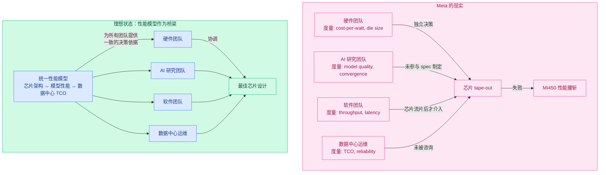
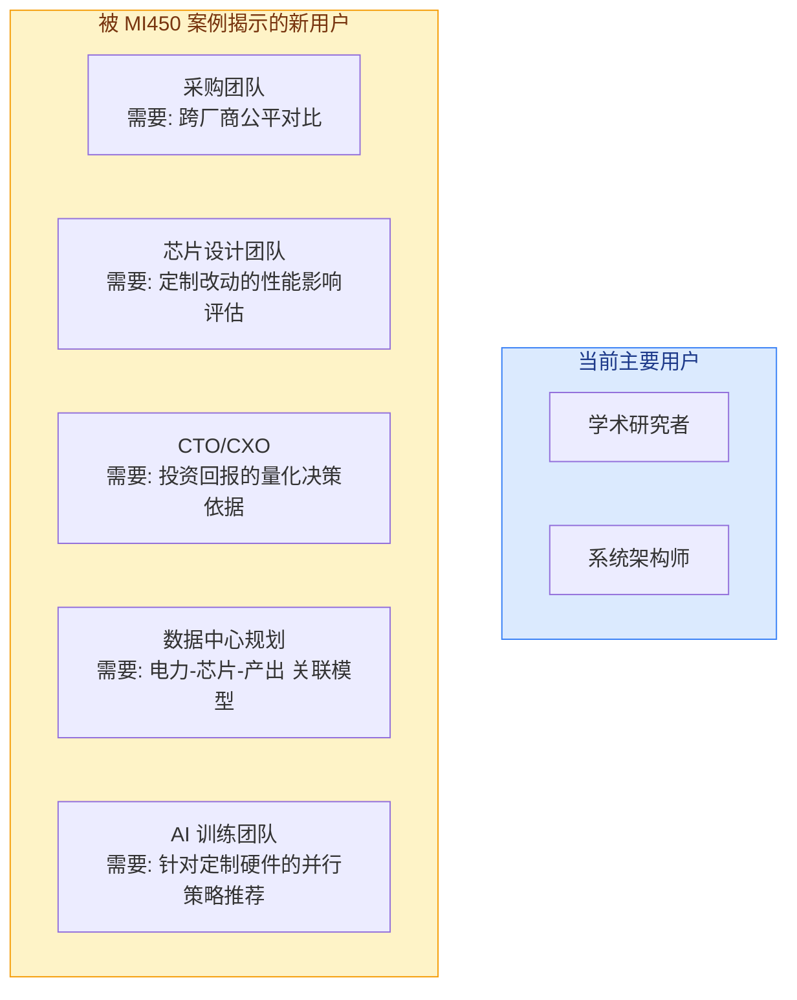

---
tags:
  - 业界动态分析
  - Meta
  - AI基础设施
  - AMD
  - 芯片设计
  - 组织文化
source: https://www.semianalysis.com/p/metas-infrastructure-team-needs-a-culture
date: 2026-07-27
rating: ⭐⭐⭐⭐⭐
---

# SemiAnalysis: Meta 基础架构团队需要一场文化变革 — 深度解读

> **原文**: "Meta's Infrastructure Team Needs A Culture Reset" | SemiAnalysis | 2026年7月22日
> **涉及机构**: Meta, AMD, Nvidia, TSMC
> **核心议题**: Meta 的 AI 芯片战略失误暴露了组织文化的深层问题

---

## 一、背景

### 1.1 事件概要

2026年7月22日，SemiAnalysis 发布了一篇引爆科技圈的深度分析《Meta's Infrastructure Team Needs A Culture Reset》。文章的核心指控是：**Meta 的基础架构团队存在严重的组织文化问题，直接导致其与 AMD 联合开发的定制 MI450 AI 芯片性能被腰斩（计算能力减半、内存大幅缩减）**。

这篇付费文章迅速被多家中文媒体（36氪、美股研究社、Bitget）转载解读，与 Meta 同周宣布的 $600 亿 AMD 大单形成鲜明对比——在一场全行业瞩目的战略合作背后，是芯片设计环节的系统性失败。

### 1.2 时间线

| 时间 | 事件 |
|------|------|
| 2023 | Meta "效率年" — 裁员 21,000+ 人 |
| 2024 | 与 AMD 启动定制 MI450 芯片合作 |
| 2024 底 | MTIA v1 部署推荐系统，Meta 首款自研芯片 |
| 2025 初 | Iris 芯片 tape-out; Nvidia GPU 订单继续扩大 |
| 2025 底 | 基础架构领导层离职潮 |
| 2026 Q1 | 资本支出上调至 $1,250 - $1,450 亿 |
| 2026年7月16日 | Meta 与 AMD 宣布 $600 亿+、6GW 合作 |
| **2026年7月22日** | **SemiAnalysis 发布文化重置文章** |
| 2026年9月 | Iris 芯片量产启动 |

### 1.3 核心矛盾

```
Meta 战略层的宏大叙事:
    Zuck 的超级智能愿景
    → $1,450 亿年资本支出
    → 6GW AMD 合作
    → 自研芯片组合 (MTIA + Iris + MI450)
    
        VS
    
基础设施层的现实:
    MI450 性能腰斩
    → 组织孤岛无法协同
    → "成本优先"文化导致设计失误
    → 人才流失与士气危机
```

---

## 二、SemiAnalysis 的核心论点详解

### 2.1 MI450 定制芯片的失败

Meta 与 AMD 的合作目标是定制一款专为 Meta AI 工作负载优化的 MI450 GPU。这款芯片基于 TSMC 2nm (N2) 工艺，原本应成为 Meta 降低对 Nvidia 依赖的战略支柱。

但 SemiAnalysis 的爆料显示，Meta 定制版 MI450 与 AMD 标准版相比：

| 指标 | AMD 标准 MI450 | Meta 定制 MI450 | 影响 |
|------|:-------------:|:---------------:|:----:|
| 计算能力 | 参考设计 | 减半 (~50%) | 吞吐量严重受限 |
| 内存容量 | 标准规格 | 大幅缩减 | 限制模型规模/batch size |
| 适用场景 | 训练+推理 | 仅推理 | 战略价值大幅缩水 |

**根因 （按 SemiAnalysis 的分析）：**

1. **工程决策脱离业务场景** — 硬件团队以理论效率指标（cost-per-watt、die size）驱动设计，而非实际的 AI 模型运行性能。芯片是按"每瓦特理论算力"优化的，不是按"Llama 4 推理吞吐"优化的。

2. **成本优化的"胜利"是失败的胜利** — 硬件团队成功降低了单芯片成本，但 50% 算力损失意味着需要 2 倍芯片才能达到同等效果 — 整个数据中心的 TCO 反而上升。

3. **组织孤岛** — 硬件团队独立设计芯片，AI 研究团队未参与 spec 制定，数据中心运维团队未被咨询，软件团队在芯片流片后才被引入。缺少端到端交付的跨职能负责人。

4. **"快速行动"文化反噬** — 芯片设计流程中仿真和验证不足，匆忙决策导致设计缺陷。裁员 3 万+ 的同时资本支出冲上 $1,450 亿，组织士气严重分裂。

### 2.2 与同行的对比

| 公司 | 自研芯片 | 状态 | 策略 |
|------|---------|------|------|
| Google | TPU (6+ 代) | ✅ 成功 | 15 年持续迭代，软硬件协同设计 |
| Amazon | Trainium/Inferentia | 🔄 持续改善 | 从 Annapurna Labs 收购建立芯片能力 |
| Microsoft | Maia | 🟡 早期 | 起步最晚，尚在验证阶段 |
| **Meta** | **MTIA / Iris / MI450** | **🔴 重大失败** | **多线出击但协同失败** |

Google 的 TPU 是"教科书式"的软硬件协同设计——从 TensorFlow 到 TPU，软件团队和硬件团队在同一栋楼里工作。Meta 的 MTIA 在推荐系统上算成功，但扩展到 LLM 训练/推理时暴露了组织能力的边界。

### 2.3 更深层的问题：裁员与文化冲突

SemiAnalysis 的文章暗示了一个更大的矛盾：**Zuck 同时在两个方向上全力冲刺——一边裁掉 3 万+ 员工追求"效率"，一边开出 $1,450 亿的资本支出支票。** 这种割裂直接破坏了基础设施团队的文化：

- 留下的人承受着"做更多、花更少"的压力
- 芯片设计这类需要深度思考、充分验证的工作在"Move Fast"文化下被催促
- 顶尖芯片设计师被 Nvidia、Google 以更高薪酬挖走
- 剩下的团队在缺乏资深指导的情况下仓促决策

---

## 三、Meta 的 AI 基础设施全景

### 3.1 芯片组合

```
Meta 的 AI 芯片矩阵 (2026)
┌─────────────────────────────────────────────────────────┐
│                                                         │
│  MTIA v1/v2    Iris           MI450 (定制)   MI300X/MI350│
│  ──────────    ────           ────────────   ───────────│
│  自研          自研           AMD 合作       AMD 采购    │
│  7nm/5nm       3nm           2nm (TSMC N2)  现有产品    │
│  推荐系统      AI 推理       大规模推理      训练+推理    │
│  ✅ 已部署     🔄 9月量产     🔴 开发中      ✅ 已部署   │
│                                                         │
│  + 海量 Nvidia GPU (H100, B200, 未来 Vera Rubin)        │
│                                                         │
└─────────────────────────────────────────────────────────┘
```

### 3.2 $600 亿 AMD 合作的真相

就在 SemiAnalysis 文章发布前一周（7月16日），Meta 与 AMD 宣布了 AI 行业历史上最大的芯片交易之一：

| 维度 | 细节 |
|------|------|
| 交易价值 | $600 亿+（部分报道称 $1,000 亿+） |
| 电力承诺 | 6GW AI 基础设施 |
| 芯片类型 | 定制 AMD Instinct MI450 (TSMC 2nm) |
| AMD 认股权证 | Meta 获得 1.6 亿股 AMD 股票权证 |
| 对比 | AMD 同时与 OpenAI 签署了 6GW 协议，与 Anthropic 签署了 2GW 协议 |

SemiAnalysis 的文章实际上解释了这项交易背后的"丑陋真相"：Meta 之所以需要 AMD 定制芯片，是因为自研芯片路线 (MTIA/Iris) 无法满足 LLM 训练和推理的需求，而 MI450 定制项目本身也因为组织问题陷入困境。

### 3.3 Zuck 的超级智能赌注

Mark Zuckerberg 正在执行一个名为 "Meta Superintelligence" 的计划：

- **目标**：人工超级智能（ASI）
- **资本承诺**：到 2030 年投入数千亿美元建设数据中心
- **策略**：垂直整合——从芯片到数据中心到基础模型到产品

但华尔街的耐心正在消磨。Meta 的市值在 2025-2026 年间对每一次 capex 上调都做出负面反应：

> "Meta just bumped its 2026 capex forecast up to as much as $145 billion for the AI boom—and investors flinched." — Fortune

---

## 四、行业影响

### 4.1 对 AMD 的影响

- 尽管 MI450 定制芯片出现问题，AMD 的 AI 业务仍处于历史最好时期
- 同时与 Meta (6GW)、OpenAI (6GW)、Anthropic (2GW) 签署协议
- MI450 是 AMD 首款 2nm GPU，技术实力得到验证
- 但 SemiAnalysis 的曝光可能让其他潜在客户对 AMD 的定制芯片能力产生疑虑——问题真的只是 Meta 的，还是 AMD 的设计流程也有责任？

### 4.2 对 Nvidia 的影响

- **短期利好**：Meta 的 MI450 失败意味着它需要更多 Nvidia GPU
- **长期不确定**：Meta 的 AMD 合作规模（6GW）仍在扩大，哪怕芯片性能不如预期
- 多供应商策略是超大规模客户的共识，Nvidia 的垄断地位在缓慢松动

### 4.3 对行业组织文化的启示

SemiAnalysis 这篇文章最具价值的部分不是技术分析，而是 **"组织文化如何影响硬件竞争力"** 的案例研究：

**Google 模式** → 15 年持续迭代 TPU，软硬件深度整合，形成 Google 的 AI 护城河
**Meta 模式** → 多线出击但缺乏协同，裁员与投资矛盾，芯片设计文化断层

这给其他正在自研 AI 芯片的公司（微软、亚马逊、字节跳动）一个清晰的警示：**芯片设计不仅是技术问题，更是组织问题。**

---

## 五、关键启示

1. **硬件设计需要跨职能深度协作** — 芯片的 specs 不能由硬件团队独立决定。AI 研究、软件工程、数据中心运维必须在设计阶段就参与。Meta 的"硬件做硬件、AI 做 AI"模式是 MI450 失败的根源。

2. **成本优化有陷阱** — 将硬件成本作为唯一 KPI 会导致次优的系统级结果。Meta 团队优化了 chip cost-per-watt，但 50% 的算力损失意味着总体 TCO 不降反升。

3. **裁员与投资的矛盾不可持续** — 裁掉 30,000+ 人同时把 capex 推到 $1,450 亿，传递了混乱的信号。芯片设计需要经验丰富的团队，而"效率年"留下的团队缺乏资深工程师的指导。

4. **"Move Fast" 不适合芯片设计** — 软件可以快速迭代、发布后修复。芯片的 design spin 成本高达数千万美元、周期 6-12 个月。"Move Fast" 文化在芯片领域直接转化为设计缺陷。

5. **垂直整合的两面** — Google 是垂直整合的成功范例（TPU），Meta 目前是反面教材。区别不在于"做不做自研芯片"，而在于组织能否承载这种整合所需的跨团队协作深度。

---

## 六、对性能建模仿真领域的启发

MI450 的失败本质上是一个**度量鸿沟（Measurement Gap）**问题。Meta 的硬件团队拥有精确的芯片级性能模型（cost-per-watt、die size、频率），但没有（或没使用）能回答"这颗芯片跑 Llama 4 能出多少 token"的系统级性能模型。这个缺口直接导致了数十亿美元的决策失误，对性能建模仿真领域有深刻的启示。

### 6.1 角色：性能模型是"跨团队翻译层"

Meta 的 MI450 失败中最核心的组织问题是**不同的团队使用不同的决策度量**。



**性能模型应该成为组织的统一度量语言**，就像 Google TPU 团队使用的"从架构模型到编译器到运行时"的全栈性能模拟器。当硬件、AI、软件、运维团队使用同一个模型预测性能时，他们被迫对齐优先级——而不是各自优化不同的 KPI。

### 6.2 应用场景扩展：性能模型的未用武之地

MI450 案例揭示了几个性能建模的**高价值应用场景**，其中许多场景在现有的学术工作中尚未被充分覆盖：

| 应用场景 | 决策问题 | 谁需要它 | 现有工作覆盖 |
|---------|---------|---------|------------|
| **芯片定制协商** | "这个定制改动（减内存、砍计算单元）会降低模型吞吐多少？节省的成本值得吗？" | 硬件团队 + 采购团队 | ❌ 几乎没有 |
| **采购竞标评估** | "$60B 的 AMD 方案 vs 继续买 Nvidia，3 年 TCO 差异是多少？" | CTO / CFO | ⚠️ 厂商自己提供，缺独立第三方 |
| **芯片设计空间探索** | "如果多给 20% die area 给 SRAM，推理吞吐提升多少？" | 芯片架构师 | ✅ Vidur, GenZ 等可做 roofline |
| **数据中心规划** | "6GW 电力配额，是装 AMD MI450 还是 H200 还是混合，产出的 tokens/day 最大？" | 基础设施规划 | ❌ 缺少跨厂商公平对比模型 |
| **训练效率优化** | "同为 MI450，FSDP vs Megatron 哪种并行策略对这颗定制芯片的 memory hierarchy 最优？" | AI 训练团队 | ⚠️ 部分覆盖，但无芯片定制感知 |
| **软件栈适配决策** | "为了迁就 MI450 的缩减内存，需要引入 activation checkpointing，代价多少吞吐？" | 软件团队 | ⚠️ 现有模型粒度不够细 |

**特别值得注意的是"芯片定制协商"场景**，这是当前的盲区。当 Meta 的硬件团队对 AMD 说"帮我们把 ALU 砍掉一半、内存砍掉 30%，这样省 40% 成本"时，他们需要的是一个性能模型能立刻回答："砍掉这些后，Llama 4 的推理延迟会从 50ms 变成 120ms，你需要 2.4 倍的芯片才能达到同等吞吐——你的"成本节约"根本不划算。"

### 6.3 用户画像的重定义：谁应该使用性能模型？

目前的性能建模仿真工具（Vidur、LLMServingSim、GenZ）的主要用户是学术研究者和系统架构师。MI450 案例提示了更广泛的用户群体：



这些新用户对性能模型的要求与学术用户不同：
- **易用性** > **精度**：采购团队不需要 5% 以内误差，但需要"我周一提交芯片配置，周二看到吞吐预估"
- **跨厂商公平性**：模型不能偏向任何硬件供应商
- **可解释性**："为什么 MI450 比 H200 便宜但总 TCO 更高"——需要能追溯到具体瓶颈
- **TCO 集成**：性能模型需要与成本模型（电力、冷却、数据中心空间）对接

### 6.4 对建模范式发展的启示

| 方向 | 当前学术主流 | MI450 案例启示的缺失 | 需发展的方向 |
|------|------------|-------------------|------------|
| **度量维度** | 延迟/吞吐/利用率 | 需要连接到芯片设计参数 | 芯片架构 ↔ 性能的**双向模型** |
| **抽象层次** | 单层（算子级或系统级） | 需要跨层次（晶体管→tokens→$) | **多层次可组合模型** |
| **验证方式** | 回测已发布数据 | 需要用于**未流片芯片**的预测 | 前瞻性验证方法论 |
| **用户界面** | 命令行/API | 需要**交互式假设分析** | 芯片设计空间浏览器 |
| **商业闭环** | 技术指标 | 需要连接到**TCO 和 ROI** | 性能+成本联合优化 |

### 6.5 总结：一个价值数百亿美元的招标邀请

MI450 的 50% 算力损失意味着 Meta 可能浪费了 $200-300 亿（按 AMD 协议价值计算）。这个数字是整个性能建模仿真学术界年预算的数百倍。

**性能建模仿真不应该只是论文里的精度竞赛。** 在 LLM 走向万亿美元规模的时代，性能模型将成为基础设施决策的"审计工具"——不是锦上添花，而是 10-figure 级决策的必需品。

**趋势预测：**
1. **从学术工具走向工业决策系统** — 未来 2-3 年，每家超大规模公司都会内部开发类似的系统
2. **跨厂商公平比较模型将成为基础设施采购的标配** — 类似 Gartner Magic Quadrant 但更技术化
3. **芯片设计阶段的性能评估将成为 ASIC 开发的必选流程** — 没有经过性能模型验证的定制芯片 spec，不应该进入 tape-out
4. **性能模型平台化** — 类似 CoreWeave、Lambda Labs 等 GPU 云服务商会开始提供"在你的模型 + 你的工作负载下，买我们的 GPU 比买别家划算多少"的性能预测服务

---

## 参考文献

- SemiAnalysis: "Meta's Infrastructure Team Needs A Culture Reset" (2026-07-22) — 付费墙
- SemiAnalysis: "The Future of Meta Superintelligence: A 1 Year Progress Update"
- SemiAnalysis: "Meta Compute: Everyone Wants To Be A Neocloud"
- 36Kr: "Meta定制AMD MI450芯片算力减半、内存大幅缩减 — SemiAnalysis 指出这是 Meta 企业文化的悲哀"
- finance.biggo.com: "Meta Sabotages Its Own AI Chip Ambitions?"
- WSJ: "Meta and AMD Agree to AI Chips Deal Worth More Than $100 Billion"
- CNBC: "Meta strikes AI chip deal with AMD days after committing to deploy millions of Nvidia GPUs"
- Fortune: "Meta just bumped its 2026 capex forecast up to as much as $145 billion"
- The Guardian: "Meta agrees $60bn deal with chipmaker AMD despite AI bubble fears"
- Tom's Hardware: "The custom AI ASIC state of play (May 2026)"
- Reuters: "Meta's Zuckerberg pledges hundreds of billions for AI data centers"
- SiliconANGLE: "AMD shares jump 8% on $100B+ AI chip deal with Meta"
