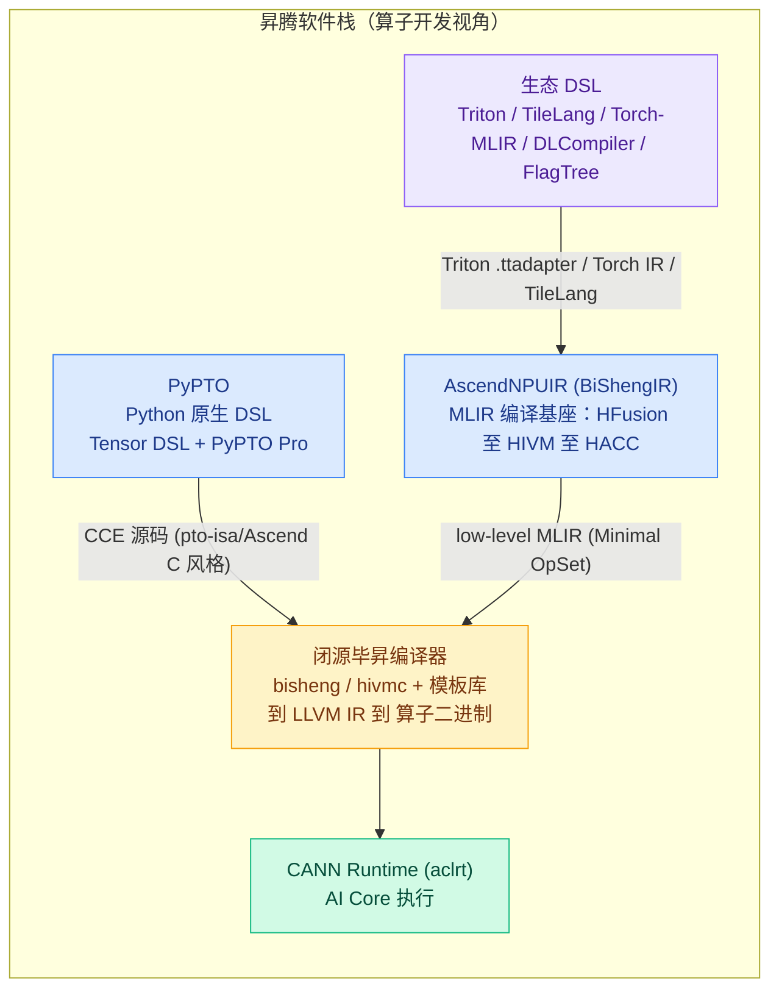
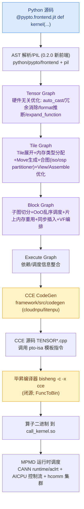
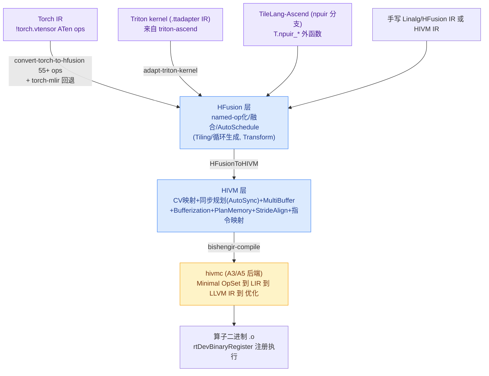

---
tags:
  - 开源项目分析
  - 昇腾
  - DSL
  - AI编译器
  - MLIR
  - CANN
  - 对比分析
source: "https://gitcode.com/cann/pypto ; https://gitcode.com/Ascend/AscendNPU-IR"
created: 2026-09-03
license: "PyPTO: CANN Open Software License 2.0（非 OSI）；AscendNPUIR: Apache-2.0"
open_source: true
---

# PyPTO vs AscendNPUIR 昇腾编程 DSL 对比分析

> **分析基线**：2026-09-03 快照。PyPTO 源码仓 `gitcode.com/cann/pypto`（master，CANN 9.2.0 dev）+ 在线文档；AscendNPU-IR 源码仓 `gitcode.com/Ascend/AscendNPU-IR`（master，commit 0415186）+ 在线文档。均通读核心文档并抽样核验源码。
>
> **一句话结论**：两者不是同一层的东西——**PyPTO 是"面向 Python 用户的昇腾原生算子/模型编程 DSL + 全栈自研编译器"**（对标华为版 Triton/TileLang，但抽象更高、宣称到整网级）；**AscendNPUIR（BiShengIR）是"昇腾的 MLIR 编译基座/算子编译 IR"**（对标 LLVM-MLIR/TritonGPU-IR 生态位），它自己不定义 Python DSL，而是让 Triton、TileLang、Torch-MLIR 等生态 DSL/框架"降落到昇腾"。二者最终都在同一闭源"毕昇编译器（bisheng/hivmc）"处汇合生成算子二进制。

---

## 一、概览

| 属性 | PyPTO | AscendNPUIR（BiShengIR） |
|------|--------|--------------------------|
| **定位** | CANN 推出的**面向 AI 加速器的高效编程框架（Python DSL 全栈）**：简化融合算子乃至**整个模型网络**开发 | 基于 **MLIR** 构建、**面向昇腾亲和算子编译的中间表示**：把高层算子表达编译成昇腾算子二进制，开放给生态 DSL/框架 |
| **仓** | gitcode.com/cann/pypto | gitcode.com/Ascend/AscendNPU-IR（GitHub 镜像 Ascend/AscendNPU-IR） |
| **发布时间线** | 2025-12 首次上线；v0.1.0 2026/01；v0.2.0 2026/04（新 AST 前端）；源码随 CANN 版本出 tag（8.5.0、9.0.0-beta.1…） | 随 CANN 演进发版 v1.0.0↔CANN 8.5.0、v1.1.0↔CANN 9.0.0、v1.2.0↔CANN 9.1.0；持续活跃（2026-09 仍有合并） |
| **许可证** | CANN Open Software License Agreement 2.0（华为专有条款，非 OSI 开源协议） | Apache-2.0 |
| **技术底座** | 自研 Python 前端（AST 解析/PIL）+ 自研 C++ 多级计算图 IR + Pass 引擎 + CCE CodeGen | MLIR（vendor llvm-project 19.1.7 分支 + torch-mlir 分支）+ 自研方言/Pass/Conversion + hivmc 后端 |
| **语言形态** | Python DSL：`@pypto.frontend.jit` 装饰器 + Tensor API；另有 PyPTO Pro（`@pl.jit`，SPMD+Reg API） | 方言级 IR（.mlir）+ 命令行工具；用户也可经 Triton/TileLang/Torch 写高层代码 |
| **用户** | 算法/算子/系统开发者（Tensor 层已开放；Tile/Block 层框架内部） | 编译工具链/生态 DSL（Triton-Ascend、TileLang-Ascend、Torch-MLIR 等）与深度调优用户 |
| **支持硬件** | Ascend 950PR/950DT、Atlas A3、Atlas A2（Pro 仅 950PR/DT） | Ascend 950PR/950DT（v1.1+）、Atlas A3、Atlas A2（v1.0 起） |
| **产物** | JIT `call_kernel.so` / 离线二进制；CCE 源码（TENSOR*.cpp）可查 | 算子二进制 `.o`（+ MLIR 中间产物全可见） |
| **规模** | C++ src ~34 万行 + Python ~6 万行（tests 另 ~40 万行）；主流水线 53 个 Pass；公开算子 ~135（C++ Opcode ~308） | 主树 ~51 万行 + 内嵌 hivmc 后端镜像 ~18 万行；自研方言 op ~477、Pass ~297；LIT 用例 969 个 |
| **生态位类比** | Triton/TileLang（华为原生 Python DSL）+ 自研"编译器+运行时" | TritonGPU-IR / LLVM-MLIR（昇腾版编译基座） |

---

## 二、定位与设计哲学：不是一个物种，别当二选一

### 2.1 PyPTO：让"算子开发者"消失的自动化 DSL

PyPTO 的设计理念（`introduction.md`「设计理念」）非常直白：传统 AI 开发被割裂为算法开发者与算子开发者，根因是高性能算子太复杂——类似 CPU 乱序执行与编译器成熟之前，程序员要手动排流水。PyPTO 想复刻"编译器接管一切"的历史：

- **计算层**：用 Tensor 而非元素描述计算，保留最大优化空间（内存布局、数据搬运、多算子融合）。
- **编译层**：`Tensor Graph → Tile Graph → Block Graph → Execution Graph` 四段图逐级 Lowering，各阶段模块化 Pass。
- **执行层**：CodeGen 产出 **PTO 虚拟指令**（实际为 CCE 源码调用 pto-isa 模板指令），再经**毕昇编译器**编成可执行代码，设备侧 **MPMD** 调度。
- 宣称适用场景覆盖"融合算子 → 大模型组件（Attention/MoE/FFN）→ 动态 Shape/整网 → 集群训练（hcomm）"。

关键事实：**当前只开放 Tensor 层**（`program_paradigms.md`：「当前版本仅开放Tensor层次编程」）。Tile/Block 是编译器内部层——这意味着 PyPTO 的默认体验是"声明式 + 自动 Tiling + 自动合图"，性能专家只能通过 `set_vec_tile_shapes` / `set_cube_tile_shapes` / pass 配置间接干预。**PyPTO Pro** 是补"控制力"的姊妹前端：SPMD 显式多核、二维 Tile、TileGroup 流水、Reg API 寄存器级向量——但**仅支持 950PR/950DT**（A2/A3 明确不支持）。

### 2.2 AscendNPUIR：开放的编译基座，让生态语言"使能昇腾"

AscendNPUIR（内部名 BiShengIR）定位（`README_zh.md` / `introduction.md`）：基于 MLIR、面向昇腾算子编译的中间表示，"提供昇腾完备表达能力"并"支持生态框架灵活对接"。其哲学是把**硬件能力表达为分层方言，把编译优化做成开源 Pass 集**，让上层生态（Triton、TileLang、Torch-MLIR）低成本获得昇腾后端：

- 自研方言自下而上抽象：硬件底层指令（HIVM/AVE/AscendDPX）→ 核内资源/内存 → 核间同步 → 异构 Host/Device launch（HACC）。
- 高层提供自动优化（融合、切分、同步、内存规划、CV 流水），低层提供细粒度控制（片上地址、流水插入位置、乒乓开关）。
- 它**不创造新的用户语言**，而是作为"语言后端"存在——写 Triton 的人在 `kernel[grid](...)` 上无感使用昇腾；写 MLIR 的人可直接在三层 IR 任意一层接入。

### 2.3 设计哲学对比

| 维度 | PyPTO | AscendNPUIR |
|------|-------|-------------|
| 核心命题 | "把算子开发变简单"（用户侧体验） | "把昇腾硬件表达开放"（编译器侧基础设施） |
| 面向对象 | 算法/算子工程师（Python） | 编译器工程师、生态 DSL/框架作者、深度调优者 |
| 抽象主张 | 从模型/整算子级 Tensor 图一路自动降到核 | 从 Linalg 级 named-op 到指令级多层 IR，每层可停靠 |
| 表达主体 | Python AST（装饰器 + Tensor API） | MLIR 方言文本 + Conversion/Pass 流水 |
| 优化归属 | 框架内自动（Pass 引擎 53 个主流水 Pass） | 开源的方言 Pass 集（~297 个），用户可自定义 Pass/接入 Transform |
| 生态策略 | 自己就是"前端"，向上对接 PyTorch（eager + aclgraph） | 做所有生态 DSL 的"共同后端"，自己不锁定用户语言 |
| 开放程度 | 源码可见但 CANN OSL 2.0；后端强依赖闭源 bisheng 与 pto-isa | Apache-2.0；MLIR 层全开放；hivmc/模板库仍部分闭源 |

---

## 三、语义对比（核心）

> 语义维度上两者最本质的差别：**PyPTO 的用户可见语义是"图/算子级声明式 Python"**（Tiling、Block、同步都是编译器替你决定的内部结构）；**AscendNPUIR 的用户可见语义是"方言级 tile/指令操作"**（存储层级、核、流水都显式出现在 IR 里）。PyPTO 把语义藏在图里，NPUIR 把语义写在方言里。

### 3.1 编程模型与抽象层级

**PyPTO 三层语义（Tensor/Tile/Block）**：

| 层 | 语义 | 状态 |
|----|------|------|
| Tensor | Tensor（dtype/shape/format/name）声明式 Op；Op 逻辑上不受存储位置与规模约束 | ✅ 用户层开放（唯一开放层） |
| Tile | Tensor 的 sub-Tensor，按 TileShape 切分；Tile Op 限定输入输出同核 L1，显式体现访存与依赖 | ⚠️ 框架内部（用户只能配 TileShape） |
| Block | 单 AI Core 上运行的计算子图，多次实例化完成整体计算 | ⚠️ 框架内部 IR（block_graph_pass） |

辅助概念：View（零拷贝子区间）、Assemble（子块拼大 Tensor），服务动态 shape 与循环；`SymbolicScalar` 表达符号值。

**PyPTO Pro**：SPMD 外层 + SIMD 内层；二维 Tile（Tile API）、RegTensor/MaskReg（Reg API，寄存器级）、SIMT API、Utils API；`pl.range(core_id,total,num_cores)` 跨步分块、`block_dim` 逻辑核数、混合 Kernel 1:2 时 Vector 段 `get_block_idx` 范围翻倍 + `get_subblock_idx`。

**AscendNPUIR 方言语义栈**：

| 方言 | 语义 | 关键内容 |
|------|------|---------|
| **HFusion**（Hybrid Fusion） | 硬件相对无关的融合层，基于 **MLIR Linalg 扩展**（继承全部 Linalg op + 扩展 named op），保留高层语义 | 转换层（对接 Arith/Math/Torch）、预处理（表达式化简、BF16/Bool 合法化）、融合处理（自动生成 Device Kernel + Host Tiling 函数）；41 个 op |
| **HIVM**（Hybrid ISA Virtual Machine） | 昇腾 tile 级指令抽象：计算/搬运/同步，屏蔽底层指令参数 | ① CV 核映射（Mix Kernel 拆 AIC/AIV、核间同步、CVPipeline、AutoSubTiling 1:2）② 核内片上内存映射（PlanMemory/对齐/地址分配）③ 核内处理单元映射（流水同步 AutoSync、SIMD 指令映射）；113 个 `hivm.hir.*` op（mmadL1/v 系列/DMA nd2nz/set_flag/wait_flag/custom…） |
| **HACC** | 异构异步计算调用：Host/Device 编程模型 + launch 语义 | **纯属性方言**（20+ 属性：`hacc.entry`、`hacc.function_kind<DEVICE/HOST>`、`block_dim`、tiling/workspace 推导函数绑定），无 Ops |
| **Annotation / Scope** | compiler hint 与作用域容器 | `annotation.mark`（键值 hint，被各 Pass 消费）；`scope.scope/return`（`tcore_type=CUBE/VECTOR`、`no_inline`） |
| **symbol** | 动态 shape 符号量 | `symbolic_int`（min/max 约束）+ `bind_symbolic_shape`（affine 绑定张量动态维） |
| **AVE / AscendDPX** | 950（RegBase）专用 | AVE 84 个 op（A5 向量引擎 SIMD 指令级）；AscendDPX 222 个 op（SIMT，Ascend SIMT dialect base） |
| 社区扩展 | math_ext/memref_ext 等 | `mathExt` 4 op、`memref_ext.alloc_workspace` 1 op、Arith/MemRef/SCF/Tensor/Vector/Triton/Torch/LLVMIR 等扩展目录 |

对比要点：
- PyPTO 的"三层"是**编译流程的阶段语义**（用户只见 Tensor）；NPUIR 的"方言栈"是**可停靠的编程/接入层级**（Torch IR / Linalg·HFusion / HIVM 三层都能写）。→ 语义暴露面不同。
- 两者都定义了"Tile 级操作"概念：PyPTO Tile Op ≈ 单核 L1 内访存约束的子操作；NPUIR HIVM op 是"任意维度/大小的 tensor/memref Tile 级操作 + 地址空间标注"。抽象口味相近，但前者藏在图里、后者是 IR 一等公民。

### 3.2 数据与内存模型

| 维度 | PyPTO | AscendNPUIR |
|------|-------|-------------|
| 数据基本单元 | Tensor（Python 对象，含 dtype/shape/format/name）→ 编译期切 Tile | `tensor`/`memref`（MLIR 标准）+ `#hivm.address_space<gm/ub/l1/l0a/l0b/l0c>` 标注 |
| 视图/切片 | View/Assemble（零拷贝子区间/拼接），大量 Pass 处理 | `memref.subview`/`tensor.extract_slice` + Flatten/StrideAlign 等 Pass |
| 动态 shape | `pypto.Tensor([-1,32])`/`pypto.DYNAMIC` + SymbolicScalar；编译期 shape 推断 | `symbol.symbolic_int` + `bind_symbolic_shape`；动态 shape 编译 |
| 片上内存分配 | 自动：assign_memory_type、PlanMemory 等价物在 Block 阶段（memory_reuse/GlobalMemoryReuse） | 显式 Pass：PlanMemory（liveness+alias+三级分配 → pointer_cast）、MultiBuffer（WAR 消除、乒乓）、StrideAlign（行宽对齐 32B/512B） |
| 对齐约束 | TileShape 需 32B 对齐（FAQ 有专文） | UB/L1 32B、L0A/B/C 512B、BT/FP 64B（PlanMemory 文档） |
| 地址表达 | 用户不可见（自动） | 用户可见：地址偏移、显式 GM/UB/L1/L0 |

### 3.3 执行/并行模型（语义上差异最大处）

- **PyPTO = MPMD（设备侧任务图调度）**：整段计算编译成"异构任务集合 + 依赖关系"（Execute Graph），由设备侧运行时按依赖把任务派发到不同核，**避免 SPMD 的全局同步**；动态控制流由 **AICPU** 承担（control_flow_kernel.cpp）。这是 PyPTO 声称能做"整网/多算子融合 + 集群"的底气——调度语义从 Host 下沉到 Device。
- **PyPTO Pro = SPMD 外层 + SIMD 内层**：所有 AI Core 跑同一 kernel、按逻辑索引分片；1:2 Cube/Vector 混合时 Vector 段逻辑核数翻倍；无显式核间通信 API（靠 stage/mutex 自动核间同步）。
- **AscendNPUIR = 传统"内核编译"模型 + 多种核内并行语义**：
  - 编译产物是**单算子/融合算子内核 .o** + Host 侧 tiling 启动（CANN runtime `rtDevBinaryRegister` 注册执行）——与 PyPTO 的"设备侧自主调度"是两种执行哲学；
  - 核内并行：SIMD（Vector 方言 + AVE 引擎 VF 融合/掩码/Combine）、SIMT（950：TritonGPU 方言对接 HIVM，昇腾亲和 Layout/共享内存/指令映射，`ascend_dpx` 222 op）、**SIMD/SIMT 混合编译**；
  - 多核并行：`scf.for` + AutoBlockify（逻辑块→物理块循环折叠）、AutoSubTiling（AIC:AIV=1:2 分核）、AutoSync 跨核 `sync_block_set/wait`。

> 一句话：PyPTO 把"调度"做成语言语义（MPMD 任务图）；NPUIR 把"调度"做成 Pass 与方言（把 SPMD/SIMT 内核编好、同步插好），运行时仍由 Host/CANN 驱动。

### 3.4 控制流与动态性语义

| PyPTO | AscendNPUIR |
|-------|-------------|
| `pypto.loop()`/`pypto.cond()`/`pypto.function()`/`loop_unroll`——Python 层控制流被 AST 捕获；符号边界循环；AICPU 执行动态控制流 kernel | 控制流沿用标准 `scf.for`/`scf.if`；动态 shape 走 `symbol` 方言 + `dyn` 相关 Pass；tile 循环由 AutoSchedule/HFusion 生成 |
| 循环内 View/Assemble 读写子 Tensor（`output[offset:end,:]=...`） | 循环内 subview/slice + Bufferization |
| 语义层面"loop over tiles"是用户可写的第一等结构（配合动态 shape） | 循环/Tiling 主要由编译器生成（用户也可在 MLIR 手写 scf.for + HIVM op） |

两者都宣称支持动态 shape；PyPTO 把它做成 Python 符号表达式体验，NPUIR 用 symbol 方言 + affine 约束表达。

### 3.5 同步与流水语义

| 机制 | PyPTO（Tensor 层自动） | PyPTO Pro（显式） | AscendNPUIR（Pass 化/IR 显式） |
|------|----------------------|------------------|-------------------------------|
| 核内同步 | Block 阶段自动插入（insert_sync、tune_sync_for_vf） | TileGroup `mutex_id` + `@pl.jit(auto_mutex=True)` 自动插同步 | AutoSync：GraphSyncSolver（图算法分配 event/flag ID）+ InjectSync + pipe_barrier/set_flag/wait_flag（HIVM op 显式） |
| 多缓冲/乒乓 | 自动（n_buffer_merge、memory_reuse SrcDstBufferMerge） | TileGroup `next()/current()` 轮转 | MultiBuffer Pass（N 槽，GM/L1/L0C/UB 分层收益；默认 A5=2 份、A2/A3=4 份） |
| Cube-Vector 融合流水 | 自动合图 + VF（vector-fusion）编排 | stage 机制 + Preload 标签（950） | CV 全链：NormalizeMatmul→InlineFixpipe→InsertLoadStoreForMixCV→CVPipeline（Unroll/Preload 两种流水模式）→AutoSubTiling 1:2 |
| 同步可见性 | 用户不可见 | 用户可感知（mutex/stage） | IR 里显式 set/wait/sync_block；用户可禁自动同步手动插 |

### 3.6 算子表达与融合

- **PyPTO**：公开 Python Tensor 算子 **~135 个**（docs 逐算子页：math/matmul/reduction/joining/indexing/creation/comparison/mutating/conv/convbp/quantization/distributed/random…），内部 Opcode 枚举 **~308**。融合是**框架内部自动的**：Tensor Graph 冗余消除 → Tile Graph"合图"（graph_partition/iso_partitioner/osp_partitioner 同构子图检测 + supernode 构建）→ Block 级 VF。用户**不写融合**，只写大算子/多算子，融合交给编译器。
- **AscendNPUIR**：HFusion named-op（41 个，含 arange/reduce_with_index/cast/elemwise_unary_binary/atomic_cas/sort/gather/cumsum/print/barrier…）+ HIVM 指令级 op（113）是语义层；融合由 **HFusion AutoSchedule**（DimensionAnalyzer → Transform 融合原语 → Tiling 候选生成/选择 → AutoScheduleInterpreter）与 `hfusion_auto_schedule` Pass 完成；**也可以完全不融合**，逐 op 编。用户若写 HIVM IR，融合与否完全自决。
- Torch 生态输入时：NPUIR 支持 55+ ATen 算子直转 HFusion named op（`convert-torch-to-hfusion`），未覆盖回退上游 torch-mlir——即"能认多少框架算子"是显式清单；PyPTO 则把 torch 语义收敛到自己 ~135 个 Python API 里（converter.from_torch）。

### 3.7 性能控制面（谁在哪个粒度说话）

| PyPTO（Tensor 层） | PyPTO Pro | AscendNPUIR |
|--------------------|-----------|-------------|
| `set_vec_tile_shapes` / `set_cube_tile_shapes`（自动 Tiling 的旋钮） | 显式 Tiling 切分、Tile 尺寸自己定 | IR 层一切显式：tile 尺寸、buffer 份数、地址、同步位置 |
| `set_pass_config` / `set_codegen_options` / `set_host_options`（28 个 config API） | TileGroup 缓冲轮转设计 | `bishengir-compile` 数百编译选项（--enable-* 开关每个 Pass） |
| 符号化/成本模型（cost_model、tools tuner） | stage/Preload 流水编排 | Transform dialect + 自定义 Pass |
| 性能分析：泳道图、PMU（tools/profiling）、DUMP_DEVICE_PERF | 同左（共享工具链） | `--bishengir-print-ir-before/after`、--enable-tuning-mode、inject_barrier 调试 |
| 控制粒度：粗（语义上"别管我"） | 中（Tile/流水级） | 细（指令/地址/同步级） |

---

## 四、技术架构与编译流水对比

### 4.1 PyPTO 流水线（自研，非 MLIR）

要点：
- 代码生成按目标平台分 `cloudnpu`（A2/A3/910 系：cube/vector/mte/scalar 分算子族生成器）与 `litenpu`（950 系）两套。
- "PTO 虚拟指令"并非字节码，而是**模板化 CCE 指令调用**（pto-isa 独立仓 `cann/pto-isa`，含 `TAdd<T...>`、`__ca__/__cb__` 地址空间等），由**毕昇编译器（bisheng）**最终编译——PyPTO 自研到"指令模板"为止，后端复用闭源毕昇。
- 动态控制流：Device 侧 AICPU 承担 control_flow_kernel；Host 侧 machine/ 模块（host/runtime/device/compile，~4.8 万行）负责 launcher/runner/context/bundle/distributed。
- 规模：framework C++ src 1,177 文件/34 万行（passes 351 文件/10.3 万行、interface 41.3 文件/15.3 万行、codegen 44/1.4 万、machine 205/4.8 万）；Python pypto 64 文件/2.5 万行、pypto_pro 66 文件/2.9 万行、pybind 26 文件。主流水线 Pass 53 个（Tensor 9/Tile 27/Block 17）+ 23 类 checker + 30 个 pass_utils。

### 4.2 AscendNPUIR 流水线（MLIR 分层）

要点：
- 工具链：`bishengir-compile`（主驱动：高层→low-level，输入输出皆 MLIR）、`bishengir-opt`（单 Pass 调试）、`bishengir-lsp-server`、**`hivmc`**（low-level HIVM Minimal OpSet → LIR → LLVM IR → 二进制；A3/A5 双后端）。`bishengir/hivmc/` 目录是仓库内跟踪的后端源码镜像（~1,314 文件/18.4 万行），对应 CANN `tools/bisheng_compiler` 的开源部分。
- 自研 vs 社区：对 MLIR 的增强优先放 `include/bishengir/Dialect` 独立扩展；无法隔离的改动提交到 Ascend 维护分支（llvm-project `llvmorg-19.1.7`、torch-mlir `main-20250716`），用 `BSPUB_DAVINCI_BISHENGIR` 宏隔离。
- 规模：方言 op ~477（HFusion 41 + HIVM 113 + AVE 84 + AscendDPX 222 + 小方言 17），Pass ~297（HIVM 113 最大头）；LIT 用例 969 个 .mlir；端到端 Integration 仅 1 例（VecAdd，需 CANN+模板库）。
- 端到端仍依赖闭源件：构建模板库需 `--bisheng-compiler`；运行时需 CANN toolkit（`tools/bishengir` 分发或 `pip install ascendnpu-ir`）。

### 4.3 直接对比

| 架构维度 | PyPTO | AscendNPUIR |
|----------|-------|-------------|
| IR 体系 | 自研 C++ 图 IR（四段图），**不基于 MLIR** | MLIR 方言体系（Linalg/Memref/SCF + 自研方言） |
| 前端 | 自研 Python AST 解析（装饰期，非记录模式） | 三路：Torch IR / Triton .ttadapter / 手写 MLIR |
| Pass 框架 | 自研 pass_mgr/pass_registry/pass_dependency | MLIR PassInfrastructure + Passes.td |
| 代码生成 | 自研 CCE CodeGen → 输出 CCE 源码（模板指令） | hivmc：MLIR→LIR→LLVM IR→二进制（LLVM 生态） |
| 与闭源边界 | 到"pto-isa 模板指令"为止，之后交给闭源 bisheng | MLIR 全开放；hivmc 部分开源；模板库/端到端需闭源 bisheng |
| 调试手段 | 图中间产物 JSON、泳道图、PMU、datadump | IR dump before/after 每 Pass、bishengir-opt、device_print(DFX) |
| 语言服务 | — | bishengir-lsp-server |

---

## 五、现有框架/生态支持对比

### 5.1 PyPTO 的对接面

| 对接对象 | 方式 | 证据 |
|---------|------|------|
| **PyTorch（eager 单算子）** | `@pypto.frontend.jit` kernel 直接用 `torch_npu` 的 npu Tensor 实参调用；pybind 层 `converter.from_torch` 识别张量取数据指针；首调 JIT 编译缓存二进制 | `pytorch_integration.md`；examples |
| **PyTorch（整网图捕获）** | kernel 包 `@allow_in_graph`（torch_npu 图内放行），外层 `torch.compile(..., backend="eager", dynamic=True)` + `torch.npu.NPUGraph()` capture/replay，消除 Host 下发开销 | `pytorch_integration.md`；`examples/03_advanced/aclgraph/` |
| **MindSpore / TensorFlow** | 公开文档未见具体接入路径（无 MindSpore/TF 专项文档） | 全仓检索 |
| **集群训练** | v0.1.2 起支持集群训练；`python/pypto/op/distributed` + framework codegen_distributed；运行依赖 hcomm；GDR 性能案例 | CHANGELOG、源码 |
| **CANN 运行时/工具链** | Host 经 CANN runtime（aclrt）下发；IDE 工具链可视化编译中间图与泳道图；dump_tensor/profiling 工具 | docs、tools/ |
| **自身生态** | pypto-gym 样例仓（融合算子 + 大模型适配样例）；examples 21 个（FFN/attention/layer_norm/aclgraph…） | README |

### 5.2 AscendNPUIR 的对接面

| 对接对象 | 方式 | 证据 |
|---------|------|------|
| **PyTorch / Torch-MLIR** | IR 接入：Torch IR → `convert-torch-to-hfusion`（55+ ATen 算子直转 HFusion named op，mul/add→linalg.binary_fn、abs/exp→unary_fn、sum/max.dim→linalg.reduce/hfusion.reduce_with_index…）→ 回退上游 torch-mlir lowering；`bishengir-compile -enable-torch-compile=true` | `framework_interface.md` |
| **TensorFlow / MindSpore** | 文档声明"支持框架（PyTorch/TensorFlow/MindSpore）接入"，但具体 conversion 仅 Torch 落地（TF/MindSpore 需自行经 MLIR 或 DSL 路径） | `framework_interface.md` |
| **Triton** | **Triton-Ascend** 外部工程负责 Triton→MLIR（.ttadapter），本仓 `adapt-triton-kernel` + op 映射表（load/store→memref.copy、AtomicRMW→hivm.store/hfusion.atomic_xchg、AddPtr→reinterpret_cast…）；支持 Triton 扩展 `tl.parallel/scope/multibuffer/sync_block_set`；950 SIMT 路径 GPUToDPX/TritonGPU→HIVM | `triton_interface.md` |
| **TileLang** | **TileLang-Ascend（branch npuir，TVM/tile-lang DSL）**：`T.npuir_*` 外部函数落到 HIVM；install_npuir.sh 可构建本仓 | `tile_lang_interface.md` |
| **DLCompiler / FlagTree** | 基于 Triton 的跨架构编译器已对接 | `user_of_npuir/users.md` |
| **CANN 自定义算子/模板库** | `hivm.hir.custom "name"`（CoreType/Pipe/VFMode(simd/simt/mix)/bitcode/source/compile 属性）→ 内置模板库或用户函数链接；与闭源 bisheng compiler 协同 | `custom_op.md` |
| **分发** | CANN Toolkit `tools/bishengir` 包 + PyPI `pip install ascendnpu-ir`（v1.0: py3.9-3.12；v1.1: py3.10-3.13） | version_compatibility |

### 5.3 小结

- **PyPTO 是"应用侧生态"**：它对接的是**最终用户框架**（torch_npu eager/aclgraph），让 PyTorch 用户无感调用 PyPTO 算子；对 DSL 生态它是"竞争者"（自己就是 DSL）。
- **NPUIR 是"编译器侧生态"**：它对接的是**语言/编译器前端**（Triton/TileLang/Torch-MLIR/DLCompiler/FlagTree），自己不面向普通算法用户；对 PyPTO 这类自研 DSL 它是"潜在公共后端"。

---

## 六、能力范围对比

| 能力 | PyPTO | AscendNPUIR |
|------|-------|-------------|
| 算子表达粒度 | 单算子 / **融合算子 / 模型组件级（FFN、Attention、MoE）**；动态 shape 整算子 | 单算子 / 融合算子内核（torch/triton 前端按 kernel 编译）；无"整网"概念 |
| 算子/op 覆盖 | 公开 ~135 Python API（含 matmul/conv/convbp/softmax/topk/quantize/atomic/distributed…），内部 ~308 opcode | 方言 op ~477（HFusion 41 + HIVM 113 + AVE 84 + AscendDPX 222 等），指令层覆盖更细 |
| Torch 算子覆盖 | 由自身 API 收敛（不逐 ATen 算子承诺） | `convert-torch-to-hfusion` 显式 55+ ATen + torch-mlir 回退 |
| 融合 | 自动（合图/同构子图/VF），用户不可控 | 自动（AutoSchedule/HFusion）+ 可控（IR/Pass 开关） |
| Cube-Vector 融合 | 自动（Block 阶段）；Pro 用 stage 编排（950） | 自动（InsertLoadStoreForMixCV/CVPipeline/AutoSubTiling）且 IR 可见 |
| 多核/多卡 | MPMD 设备侧任务调度；hcomm 集群（v0.1.2+） | SPMD 内核编译 + Host 启动；多核体现在 blockify/核间同步，多卡靠宿主框架 |
| SIMT | Pro 提供 SIMT API（逐线程，950） | TritonGPU→HIVM SIMT 路径 + ascend_dpx 222 op（950）；SIMD/SIMT 混合 |
| 动态 shape | ✅ Tensor 层一等公民（SymbolicScalar/loop/cond） | ✅ symbol 方言 + 动态 shape 编译 |
| 硬件范围 | A2/A3/950（Tensor 层）；Pro 仅 950 | A2/A3（v1.0+）；950（v1.1+，feature_a5/regbase 分支） |
| 编译产物 | JIT .so / 离线二进制；CCE 中间源码可查 | .o 二进制；全链路 MLIR 文本可见可改 |
| 调试/DFX | 图 dump、泳道图、PMU、datadump、golden 校验 | IR dump、device_print（DFX，16KB UB 缓冲/核）、inject_barrier 排障 |
| 语言服务/IDE | 文档称 IDE 工具链可视化 | bishengir-lsp-server + CLI 全功能 |
| 端到端用例数 | examples 21 + pypto-gym（更多） | Integration 端到端 1（VecAdd），LIT 969 |

---

## 七、成熟度与治理

| 维度 | PyPTO | AscendNPUIR |
|------|-------|-------------|
| 版本节奏 | v0.1.0(2026/01)→v0.2.0(2026/04)，随 CANN tag（8.5.0/9.0.0-beta.1）；master 标注 CANN 9.2.0 dev | v1.0.0(CANN 8.5)→v1.1.0(CANN 9.0)→v1.2.0(CANN 9.1)，release 分支 + feature_a5/regbase |
| 成熟度信号 | 新项目（上线 ~9 个月）；Tensor 层才开放，Tile/Block 未开放；0.x 版本 | 更成熟：v1.x、被 Triton-Ascend/TileLang/DLCompiler/FlagTree 采用、SIG 治理 |
| 许可证 | CANN OSL 2.0（**非 OSI 标准**：分发/修改受华为条款约束） | Apache-2.0（宽松、可商用） |
| 测试 | C++ tests 640 文件/22 万行 + Python tests 885 文件/19.8 万行 | LIT 969 个 .mlir + unittests；Integration 少（需真实 CANN 环境） |
| 文档 | 700+ 页（API 参考 278 页密集自动生成式），教程/FAQ/环境变量齐全；多型号内容裁剪标记 | 中英双语 Sphinx ~46 篇/侧，逐 op 语法/属性表；质量高但与代码有少量不同步（op/Pass 计数、个别选项默认值） |
| 依赖闭源程度 | 高：pto-isa 独立仓、bisheng 编译器、CANN runtime/hcomm | 中：MLIR 层开源；hivmc 部分开源；模板库/端到端需闭源 bisheng |
| 社区/治理 | GitCode Issues/讨论 + 贡献指南 + Zread AI 学习入口 | GitCode + GitHub 镜像 + SIG AscendNPU-IR + CODEOWNERS/OWNERS 规范 + 提交模板（Assisted-by: AI） |

---

## 八、关系判断：竞争、互补还是分层？

1. **硬件代际重叠，语义层不重叠**：两者都支持 A2/A3/950，最终产物都汇入闭源毕昇编译器。但在语义栈上 PyPTO 位于"用户 DSL + 整算子编译"层，NPUIR 位于"编译器 IR + 生态接入"层——**一个向上接管框架用户，一个向下接管生态 DSL**。

2. **"950（RegBase）"是两者的交锋点**：PyPTO Pro（SPMD+SIMD+Reg API）与 NPUIR 的 SIMT 路径（TritonGPU→HIVM + ascend_dpx + AVE）都瞄准 950 的新硬件能力（寄存器层、Warp Scheduler、Cube-Vector 数据通路、ND-DMA）。形式不同（华为原生 Python DSL vs Triton/MLIR 生态路线），但目标都是"在 950 上提供从 SIMD 到 SIMT 的完整表达"——**Pro 是华为对 950 的原生答案，NPUIR+生态 DSL 是开放答案**。

3. **开源策略暗示产品分工**：PyPTO（CANN OSL 2.0、自研 IR、闭源后端依赖）像是 CANN 面向商业客户的"官方高效编程框架"；NPUIR（Apache-2.0、MLIR 生态、被多家第三方编译器采用）是华为在"生态开放"战线上的棋子——让 Triton/TileLang 等社区语言低成本使能昇腾，争取开发者生态。两者短期平行推进，长期不排除 PyPTO/Pro 前端下沉到 NPUIR 后端（当前开源代码未见耦合，但"毕昇编译器"这一共同枢纽为未来合并留了接口）。

4. **对昇腾开发者的实际含义**：
   - 想用 Python 快速开发算子/融合算子、要动态 shape/整算子/图捕获体验 → **PyPTO（Tensor 层）**；
   - 要在 950 上做极致手工优化（寄存器/流水/显式同步）且喜欢 Python → **PyPTO Pro**；
   - 已有 Triton/TileLang 代码要迁昇腾，或想深度介入编译（IR/Pass）→ **AscendNPUIR（经 Triton-Ascend/TileLang-ascend 或直接写 MLIR）**；
   - 做编译器/工具链/第三方框架对接昇腾 → **AscendNPUIR**（开放 IR 才是可依赖的接口）。

---

## 九、个人评价

- **PyPTO 的野心最大、风险也最大**：把"算子/整网级自动编译 + MPMD 设备侧调度"做成产品，抽象高度远超 Triton/TileLang（它们仍要求用户写 kernel 循环），但代价是——用户控制面窄（Tile/Block 未开放）、新前端刚换（0.2.0 AST 解析）、许可证限制分发、后端系于闭源 pto-isa/bisheng。它更像华为"算子开发终结者"叙事的一部分：如果成功，普通用户再也不用写 Ascend C/Triton。
- **AscendNPUIR 是更"正统"的编译器基建**：MLIR 分层、Conversion 优先、生态先行（Triton 是实际最大入口），工程上扎实（方言/Pass/测试体系完整），Apache-2.0 给了生态信任。但它本质是"让昇腾成为 Triton/TileLang 的一个后端"，不解决昇腾原生开发者体验问题——用户仍然要面对 Triton 生态的语义与昇腾硬件之间的缝隙（layout、同步、tiling 都得编译器扛）。
- **判断**：对昇腾生态，二者是"原生 DSL（自研）vs 开放 IR（生态）"的双轨战略。PyPTO（尤其 Pro）的价值要在 950 大规模出货后才能验证性能上限；NPUIR 的价值已被 Triton-Ascend 等第三方采用部分兑现。真正值得跟踪的信号：① PyPTO 何时开放 Tile/Block 层并补 A2/A3 的 Pro；② NPUIR 何时把 hivmc 完全开源、Integration 用例规模化；③ 二者是否会收敛（PyPTO 前端 → NPUIR 后端），这决定昇腾工具链的长期形态。

---

## 十、参考来源

1. PyPTO 文档中心：https://pypto.gitcode.com/
2. PyPTO 源码仓：https://gitcode.com/cann/pypto （docs/zh/tutorials：introduction、program_paradigms、development/compile、network_integration/pytorch_integration、appendix/glossary；docs/zh/pypto_pro/tutorials/introduction；framework/src/passes、framework/src/codegen、python/pypto、python/pypto_pro）
3. PyPTO 官方镜像站：https://www.pypto.ai/pypto/zh/
4. AscendNPUIR 文档：https://ascendnpu-ir.gitcode.com/zh_cn/index.html
5. AscendNPU-IR 源码仓：https://gitcode.com/Ascend/AscendNPU-IR （bishengir/include|lib|tools、bishengir/hivmc、docs/source/zh_cn：introduction/architecture、introduction/introduction、developer_guide/dialects、developer_guide/features、developer_guide/conversion/framework_interface|triton_interface|tile_lang_interface|interface_api、introduction/quick_start/version_compatibility|installing_guide、user_of_npuir/users）
6. GitHub 镜像：https://github.com/Ascend/AscendNPU-IR
7. 生态：Triton-Ascend（gitcode.com/Ascend/triton-ascend）、TileLang-Ascend（github.com/tile-ai/tilelang-ascend tree/npuir）、DLCompiler、FlagTree、CANN 社区版文档（hiascend.com）

> 局限说明：① PyPTO 的 pto-isa（PTO 虚拟指令本体）为独立仓/随 CANN 分发，本仓仅见调用形式，指令级语义以 CANN 安装包为准；② 两仓均为浅克隆单 commit，未做 git 历史/活跃度定量分析；③ NPUIR 文档与代码存在少量不同步（op/Pass 计数、个别选项默认值），本报告数量均以源码/TableGen 实况为准。
