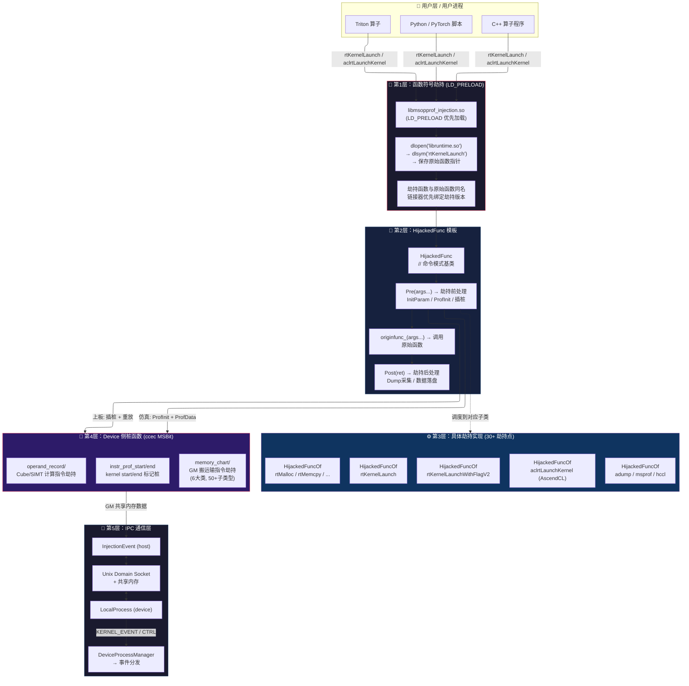
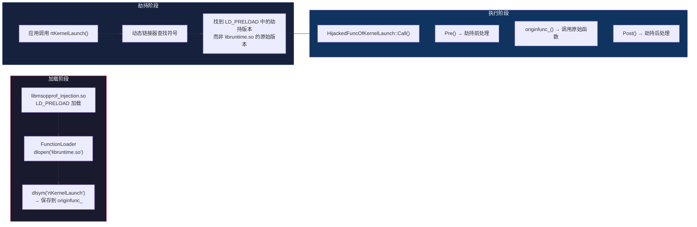
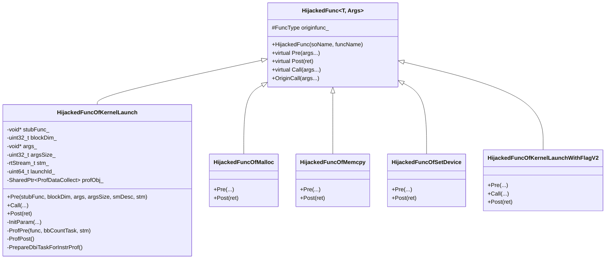
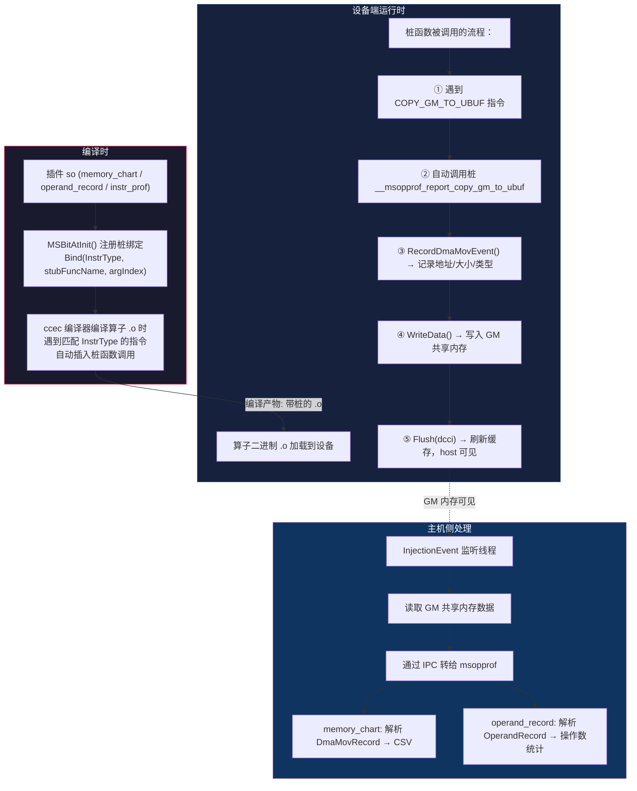
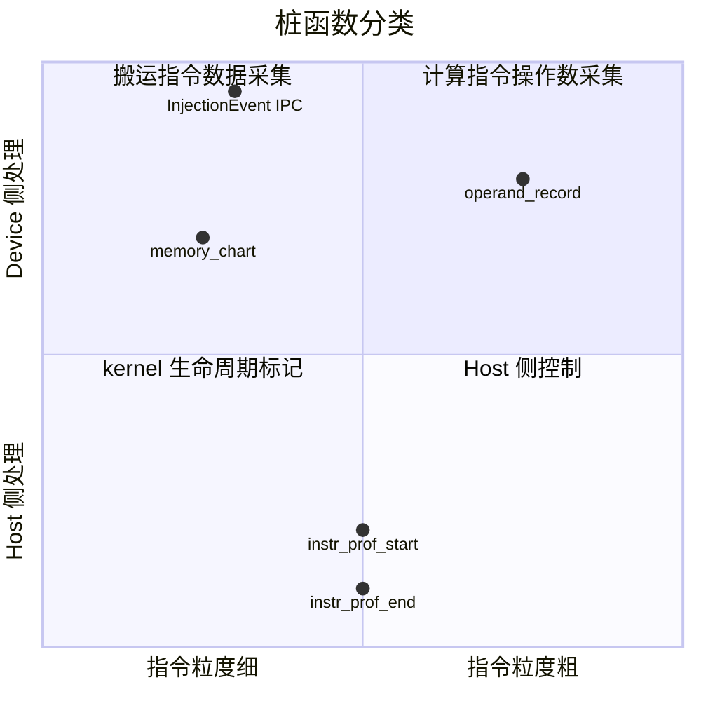
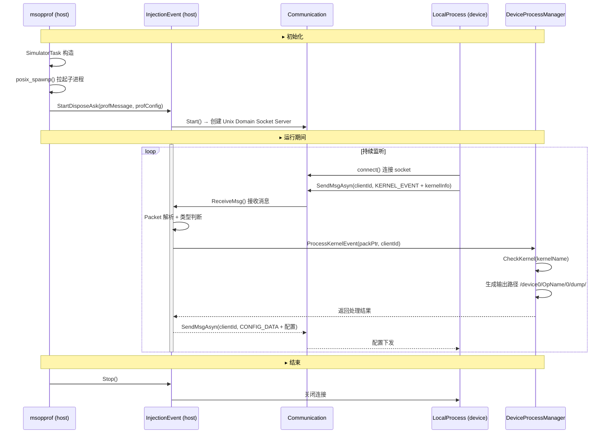
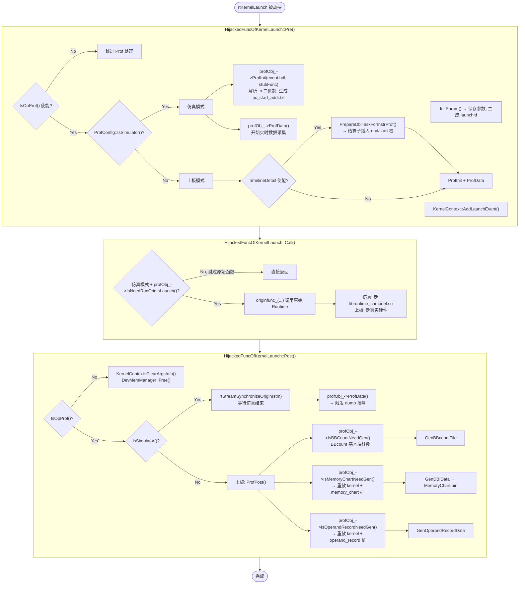
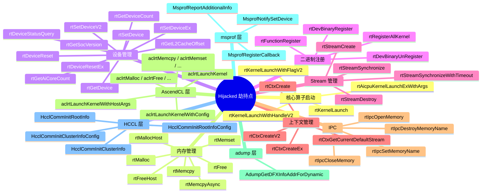
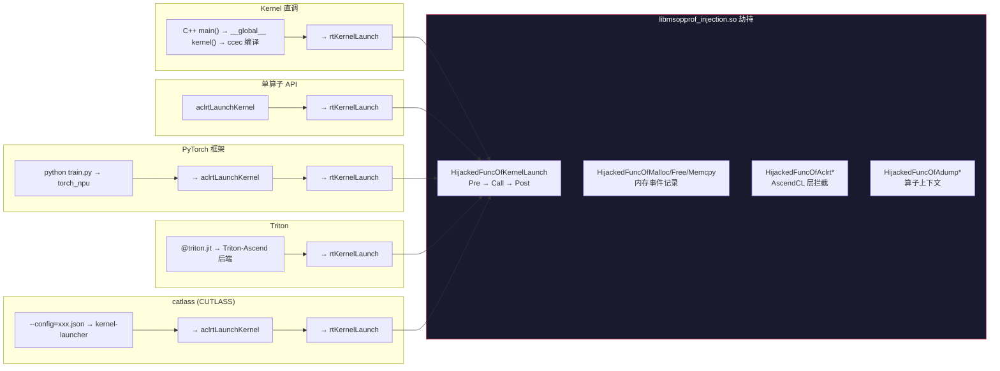

# msOpProf Simulator 模式深度技术分析

> 项目：Ascend/msopprof (MindStudio Ops Profiler)
> 分析日期：2026-05-11
> 标签：#昇腾 #msopprof #算子调优 #仿真器

---

## 一、整体架构概览

msOpProf 是华为昇腾 AI 算子的性能调优工具，支持两种运行模式：

| 模式 | 用途 | 数据来源 |
|------|------|----------|
| **msOpProf (device)** | 上板调优 | 真实 NPU 硬件 PMU 计数器 |
| **msOpProf simulator** | 仿真调优 | 昇腾指令级仿真器 |

**simulator 模式下**，工具通过 `LD_PRELOAD` 劫持 Runtime API（`rtKernelLaunch` 等），在仿真环境中采集指令流水、代码热点、内存通路吞吐率等微观性能数据，最终通过 MindStudio Insight 呈现。

---

## 二、五种算子接入方式的支持机制

### 1. Kernel 直调（Ascend C Kernel Direct Call）

**调用路径**：
```
用户 C++ main() → 调用 kernel 函数 → ccec 编译器 → .o 可执行二进制
```
**msopprof 执行方式**：
```bash
msprof op simulator --soc-version=Ascend910B1 --output=./output ./my_app blockdim 1
```
**机制详解**：
- `OpSimProf::GetTask()` → 创建 `SimulatorTask`
- `SimulatorTask` 设置环境变量：
  - `LD_PRELOAD=libmsopprof_injection.so:libruntime_camodel.so` → 劫持 Runtime 调用
  - `CAMODEL_SOC_VERSION=Ascend910B1` → 通知仿真器芯片型号
  - `CAMODEL_LOG_PATH=...` → dump 输出路径
  - `IS_SIMULATOR_ENV=true` → 标记仿真环境
- `OpRunner::RunOpBinary()` → `ExecBinaryRunner::Run()` → `posix_spawnp()` 拉起用户应用
- 用户应用的 `rtKernelLaunch` 调用被劫持 → 仿真器生成指令日志
- 应用退出后 → `SimDataParse::Execute()` 解析 dump 文件

**关键点**：
- 编译需加 `-g` 选项才能生成代码热点图
- kernel 名称通过 `--kernel-name` 指定，支持通配符
- 多算子场景通过 `--launch-count=N` 限制采集数量

### 2. 单算子 API 调用

**调用路径**：
```
用户程序 → aclrtLaunchKernel() / rtKernelLaunch() → Runtime 层 → 硬件/仿真器
```
**msopprof 劫持架构**（核心创新点）：

```
libmsopprof_injection.so (LD_PRELOAD)
├── Runtime 劫持 (rtKernelLaunch, rtMalloc, ...)
├── ascendcl_impl 劫持 (aclrtLaunchKernel, ...)
├── adump 劫持 (上下文信息采集)
└── msprof 劫持 (MC2 算子打点信息)
```

注入库拦截 `rtKernelLaunch` 后：
1. 提取 kernel 名称、二进制路径、参数
2. 通过 `InjectionEvent` IPC 机制传回 host 侧
3. 与仿真器 `DvcAttachLogCallback` 通信获取指令日志
4. 可以选择**实时解析**（`ENABLE_CA_LOG_TRANS=true`）或**事后解析**（dump 文件）

**关键点**：
- 实时代码路径在 `RealTimeDataParser` 中实现，用于减少磁盘 IO
- 通信使用 `Communication` 模块（共享内存/管道），`Packet` 封装消息
- `--config` 模式直接跑 `.o` 二进制，通过 `kernel-launcher` 拉起

### 3. PyTorch 框架算子

**调用路径**：
```python
import torch
import torch_npu
x = torch.randn(1024).npu()
y = x + x  # → torch_npu → aclrtLaunchKernel → rtKernelLaunch
```
**msopprof 启动方式**：
```bash
msprof op simulator --soc-version=Ascend910B1 --output=./output python train.py
```
**机制**：
- PyTorch 算子调用 torch_npu 插件 → 最终调用 `aclrtLaunchKernel`
- `libmsopprof_injection.so` 在 `LD_PRELOAD` 中拦截此调用
- 对 msopprof 来说，PyTorch 脚本只是一个产生 `rtKernelLaunch` 调用的应用
- **完全透明**：用户无需修改 PyTorch 代码

**关键点**：
- 不支持 Python `print()` 打印 device 侧变量
- 编译 `torch_npu` 算子时需加 `-g`（或通过环境变量控制）
- 仿真器单核场景不支持多卡、MC2、HCCL 类型算子

### 4. Triton-Ascend 算子

**调用路径**：
```python
@triton.jit
def add_kernel(x_ptr, y_ptr, output_ptr, n_elements, BLOCK_SIZE: tl.constexpr):
    ...
```
- Triton 编译器 → Triton-Ascend 后端 → 生成 `.o` 二进制文件
- Triton Runtime → `rtKernelLaunch` 启动

**msopprof 使用**：
```bash
# 编译 Triton 算子时开启 debug 信息
export TRITON_DISABLE_LINE_INFO=0

# 运行仿真调优
msprof op simulator --soc-version=Ascend910B1 --output=./output python triton_add.py
```

**关键点**：
- `TRITON_DISABLE_LINE_INFO=0` 使 Triton 生成调试行信息，支持代码热点图
- Triton 生成的 `.o` 文件同样通过 Runtime 接口启动，劫持机制自动生效
- 编译 Triton 算子时需指定 `--simulator` 模式

### 5. CUTLASS (catlass) 算子

**调用路径**：
```bash
# catlass 编译
bash scripts/build.sh --simulator 00_basic_matmul
# 生成 .o 文件
```
**msopprof 使用**（`--config` 模式）：
```json
{
  "kernel_name": "basic_matmul",
  "kernel_path": "./00_basic_matmul.o",
  "blockdim": 8,
  "mode": "ca",
  "device_id": 0,
  "magic": "RT_DEV_BINARY_MAGIC_ELF_AICUBE",
  "test_cases": [...]
}
```
```bash
export LD_LIBRARY_PATH=${INSTALL_DIR}/tools/simulator/Ascend910B1/lib:$LD_LIBRARY_PATH
msprof op simulator --config=./matmul_test.json --output=./output
```

**机制**：
- `--config` 模式不使用 `posix_spawnp`，而是用 `kernel-launcher` 工具（`bin/kernel-launcher`）
- `SimulatorTask` 构造时识别 `config_` 非空 -> 设置 `opRunMode=RUN_KERNEL`
- 调用链：`GenOpConfig` 生成配置 → `RuntimeToTargetLib` 软链 runtime 到临时路径 → `kernel-launcher` 拉起
- CUTLASS/Ascend 的 `catlass` 算子需用 `--simulator` 参数编译

**关键点**：
- 编译命令加 `--simulator` 选项，确保二进制可在仿真环境运行
- `magic` 字段区分算子类型（AICUBE/AIVEC/ELF）
- 与 `--application` 模式不同，`--config` 模式必须用 `LD_LIBRARY_PATH` 而不是 `--soc-version`

---

## 三、仿真器对接机制

### 3.1 仿真器类型发现

仿真器存放在 `${ASCEND_HOME_PATH}/tools/simulator/` 目录，支持多种芯片：

| 芯片系列           | 目录名                               | 示例 SOC 版本        |
| -------------- | --------------------------------- | ---------------- |
| Atlas 910B     | `Ascend910B1/` ~ `Ascend910B4-1/` | Ascend910B1      |
| Atlas 310P     | `Ascend310P1/` ~ `Ascend310P7/`   | Ascend310P1      |
| Atlas 950 (A5) | `Ascend950*` 多种变体                 | Ascend950PR_9599 |
| Atlas 310B     | `Ascend310B1/` ~ `Ascend310B4/`   | Ascend310B1      |

源码中 `GetSimulators()` 函数自动扫描 `tools/simulator/` 目录下的 `Ascend*` 子目录。

### 3.2 仿真器选择方式

两种方式，**必须二选一**：

1. **`--soc-version=Ascend910B1`**（推荐，用于 `--application` 和 `--export` 模式）
   - `SimulatorTask` 自动设置 `LD_LIBRARY_PATH` = `${ASCEND_HOME}/tools/simulator/Ascend910B1/lib`
   - 特殊处理：`Ascend950` 系列映射为 `dav_3510`

2. **`LD_LIBRARY_PATH` 环境变量**（必须，用于 `--config` 模式）
   - `export LD_LIBRARY_PATH=${INSTALL_DIR}/tools/simulator/Ascend910B1/lib:$LD_LIBRARY_PATH`
   - 通过 `GetSocVersionFromEnvVar()` 从路径中提取 SOC 版本

### 3.3 仿真器对接接口

```
msopprof ←→ libmsopprof_injection.so ←→ libruntime_camodel.so (仿真器 Runtime)
                                       ←→ 仿真器内核 (指令模拟)
```

核心交互接口（在 `sim_data_parser.h` 相关的 `DvcAttachLogCallback` 中定义）：

```c
// 注册回调函数类型
typedef union DvcLogCbFnUnion {
    DvcInstrLogCb_t instrLogCb;   // 指令日志回调
    DvcMteLogCb_t mteLogCb;       // MTE 日志回调
    DvcIcacheLogCb_t icacheLogCb; // icache 日志回调
    DvcIfuLogCb_t ifuLogCb;       // IFU 日志回调
} DvcLogCbFnUnion_t;

// 注册函数
void DvcAttachLogCallback(DvcLogType_t log_type, DvcLogCbFnUnion_t fn_union);
void DvcSetLogLevel(uint32_t file_print_level, uint32_t screen_print_level, uint32_t flush_level);
```

### 3.4 数据流全过程

```
用户应用 (C++/Python)
    │
    │ rtKernelLaunch()
    ▼
libmsopprof_injection.so (LD_PRELOAD 劫持)
    │
    ├─→ 采集 kernel 上下文 (.o 路径, kernel名, 参数, blockdim)
    ├─→ 通过 Communication 模块 (IPC) 传给 msopprof host
    │
    ▼
仿真器 (libruntime_camodel.so + 芯片模型)
    │
    ├─→ 模拟指令执行
    ├─→ 生成 .dump 文件:
    │   ├── instr_log.dump (指令执行日志)
    │   ├── instr_popped_log.dump (指令出队日志)
    │   ├── reg_log.dump (寄存器日志)
    │   └── icache_log.dump (icache 日志)
    │
    ▼
SimDataParse (多线程解析)
    │
    ├─→ 按 core 粒度并行解析 (ThreadPool)
    │   ├── instr_log_parser → 指令流水数据
    │   ├── mte_log_parser → 搬运带宽数据
    │   └── icache_parser → 缓存未命中数据
    │
    ├─→ 计算器层
    │   ├── compute_load_calculator
    │   ├── instr_detail_calculator (GPR使用, 冲突, 向量利用率)
    │   ├── process_bytes_calculator (数据搬运量)
    │   └── ub_conflict_calculator
    │
    └─→ 可视化层
        ├── core_timeline_visualizer (分核流水图)
        ├── subcore_timeline_visualizer (子核流水图)
        ├── hotspotmap_visualizer (代码热点图)
        └── mte_log_visualizer (搬运带宽图)
```

### 3.5 实时解析 vs 事后解析

| 特性 | 实时解析 (RealTime) | 事后解析 (Dump) |
|------|--------------------|-----------------|
| 触发条件 | `ENABLE_CA_LOG_TRANS=true` | `--dump=on` 或默认 |
| 数据源 | IPC 通信流 | 落盘 dump 文件 |
| 适用场景 | Atlas A2/A3（A910B 默认关闭） | Atlas 310P/所有 |
| 特点 | 低延迟，省磁盘 | 完整数据，可重放 |

---

## 四、扩展指南

### 4.1 添加新芯片仿真器

1. **放置仿真器库**：
   ```bash
   # 将仿真器 so 放入
   ${ASCEND_HOME_PATH}/tools/simulator/AscendNewChip/lib/
   # 必须包含 libruntime_camodel.so
   ```

2. **注册芯片映射**（在 `core/PlatformConfig.h`，此为 submodule）：
   ```cpp
   // SOC_STRING_TO_CHIP_PRODUCT 映射
   {"AscendNewChip", ChipProductType::ASCEND_NEW_CHIP}
   ```

3. **添加时钟频率**（在 `sim_defs.h`）：
   ```cpp
   const std::map<ChipProductType, int> CLOCK_SPEED_SERIES_MAP{
       {ChipProductType::ASCEND_NEW_CHIP, 2000}, // MHz
   };
   ```

4. **自动发现** — `GetSimulators()` 自动扫描新目录

### 4.2 添加新的算子接入方式

所有最终调用 `rtKernelLaunch` / `aclrtLaunchKernel` 的方式**自动支持**。对于特有的 launch 接口：

1. **添加劫持接口** → 参考 `plugin/instr_prof_start/`
2. **注册 PacketHandler** → 在 `InjectionEvent` 中注册新的 packet 类型处理
3. **添加解析逻辑** → 在 `parse/data_parser/` 下实现新 Parser

### 4.3 扩展解析/可视化能力

解析层使用**插件系统**（`parse/plugin/plugin_manager.h`，`plugin_interface.h`），新增插件只需实现 `PluginInterface` 接口并注册。

### 4.4 注意点

- `--config` 模式只能用 `LD_LIBRARY_PATH`，不能用 `--soc-version`
- 仿真不支持 MC2 和 HCCL 类型算子
- 仿真核数不能超过物理核数
- 编译必须加 `-g` 才支持代码热点图
- 不支持 `-O0` 编译选项

---

## 五、劫持架构源码分析 — Mermaid 图解

### 5.1 是否开源？

**是，劫持架构的源码完全开源**，分布在两个仓库中：

| 仓库                | 路径                                  | 内容                               |
| ----------------- | ----------------------------------- | -------------------------------- |
| **msopprof** (主仓) | `csrc/op_profiling/plugin/`         | Device 侧 MSBit 桩函数（ccec 编译）      |
| **msopprof** (主仓) | `csrc/op_profiling/prof_injection/` | Host 侧 IPC 通信 & 事件处理             |
| **msopcom** (子模块) | `csrc/runtime/`                     | Runtime 劫持核心（rtKernelLaunch 等）   |
| **msopcom** (子模块) | `csrc/acl_rt_impl/`                 | AscendCL 劫持（aclrtLaunchKernel 等） |
| **msopcom** (子模块) | `csrc/ascend_dump/`                 | adump 劫持（算子上下文）                  |
| **msopcom** (子模块) | `csrc/profapi/`                     | msprof 劫持（MC2 打点）                |
| **msopcom** (子模块) | `csrc/hccl/`                        | HCCL 劫持                          |
| **msopcom** (子模块) | `csrc/kernel_injection/`            | MSBit 核心库（编译器桩插入系统）              |

子模块地址：`https://gitcode.com/Ascend/msopcom.git`（MulanPSL-2.0 协议）

预编译的 `libmsopprof_injection.so` 由 msopcom 编译产出，存放在主仓的 `lib64/` 目录。

### 5.2 整体劫持架构 — 泳道图



### 5.3 函数符号劫持原理



**关键代码** — 非 `dlsym(RTLD_NEXT)`，而是显式 `dlopen` + 函数指针保存：

```cpp
// msopcom/csrc/core/HijackedFuncTemplate.h
explicit HijackedFunc(const std::string soName, const std::string& funcName)
    : originfunc_{reinterpret_cast<FuncType>(GET_FUNCTION(soName, funcName))} { }

// msopcom/csrc/core/FunctionLoader.h — GET_FUNCTION 宏展开为:
//   void* handle = dlopen(soName.c_str(), RTLD_LAZY | RTLD_LOCAL);
//   auto func = dlsym(handle, funcName.c_str());
```

**被劫持函数命名约定** — 原始 API 通过 `RuntimeOrigin.h` 重命名为 `XxxOrigin`：

```cpp
// msopcom/csrc/runtime/RuntimeOrigin.h
RTS_API rtError_t rtKernelLaunchOrigin(const void *stubFunc, uint32_t blockDim,
    void *args, uint32_t argsSize, rtSmDesc_t *smDesc, rtStream_t stm);
// — 共约 30+ 个 Runtime API 均有 Origin 版本
```

### 5.4 HijackedFunc 模板层级架构



### 5.5 rtKernelLaunch 劫持完整流程 — 泳道图

```mermaid
sequenceDiagram
    participant App as 用户应用
    participant Hook as HijackedFuncOfKernelLaunch
    participant KCtx as KernelContext
    participant Prof as ProfDataCollect
    participant DBITask as DBI 插桩任务
    participant Orig as OriginFunc (原始 Runtime)
    participant Sim as 仿真器 / 硬件

    App->>Hook: rtKernelLaunch(stubFunc, blockDim, args, argsSize, smDesc, stm)

    rect rgb(20, 30, 50)
        Note over Hook: ▸ Pre() 阶段 — 劫持前处理
        Hook->>Hook: InitParam() 保存所有参数, 生成 launchId
        Hook->>KCtx: AddLaunchEvent(stubFunc, blockDim, stm)
        KCtx-->>Hook: event 信息 (hdl, stubFunc, pcStartAddr)

        alt 仿真模式 (IsSimulator)
            Hook->>Prof: ProfInit(event.hdl, stubFunc) 解析 .o 二进制
            Hook->>Prof: ProfData(stm) 开始实时采集
        else 上板模式 + TimelineDetail 使能
            Hook->>DBITask: PrepareDbiTaskForInstrProf()
            DBITask->>DBITask: 给算子 .o 插入 end/start 桩函数
            Hook->>Prof: ProfInit + ProfData 开始采集
        else 上板模式 + 基本模式
            Hook->>Prof: ProfInit + ProfData 开始采集
        end
    end

    rect rgb(40, 30, 50)
        Note over Hook: ▸ Call() 阶段 — 原始函数调用
        alt 仿真模式 + ProfData 无需原始 launch
            Hook-->>App: 跳过 originfunc_() 直接返回
        else 默认
            Hook->>Orig: originfunc_(stubFunc, blockDim, args, argsSize, smDesc, stm)
            Orig->>Sim: 执行 kernel launch (硬件执行 / 仿真器模拟)
            Sim-->>Orig: 执行完成
            Orig-->>Hook: rtError_t 返回值
        end
    end

    rect rgb(20, 30, 50)
        Note over Hook: ▸ Post() 阶段 — 劫持后处理
        alt 仿真模式
            Hook->>Orig: rtStreamSynchronizeOrigin(stm) 等待仿真完成
            Hook->>Prof: ProfData() 触发 dump 数据采集
        else 上板模式
            Hook->>Prof: ProfPost()
            Prof->>Prof: BBcount — 基本块计数
            Prof->>Prof: MemoryChart — 搬运数据采集 (memory_chart 桩)
            Prof->>Prof: OperandRecord — 计算指令操作数 (operand_record 桩)
            Prof->>Prof: GenBBcountFile / GenDBIData / GenOperandRecordData
        end
        Hook->>KCtx: ClearArgsInfo()
    end
```



### 5.6 CCEC MSBit 二进制插桩机制



**MSBitAtInit 绑定示例**（插件加载时自动执行）：

```cpp
// memory_chart/dynamic_bind.cpp — 50+ 绑定点
extern "C" {
std::vector<std::tuple<InstrType, std::string, std::vector<uint16_t>>> BIND_FUNCTION {
    // DMA_MOV 类
    {InstrType::COPY_GM_TO_UBUF,    "__msopprof_report_copy_gm_to_ubuf",   {0, 1, 2}},
    {InstrType::COPY_UBUF_TO_GM,    "__msopprof_report_copy_ubuf_to_gm",   {0, 1, 2}},
    {InstrType::COPY_GM_TO_CBUF,    "__msopprof_report_copy_gm_to_cbuf",   {0, 1, 2, 3}},
    // MOV_ALIGN 类
    {InstrType::COPY_GM_TO_UBUF_ALIGN_B16, "...", {0, 1, 2, 3}},
    // LOAD_2D 类
    {InstrType::LOAD_GM_TO_CA,      "__msopprof_report_load_gm_to_ca",     {0, 1, 2, 3}},
    // DMA_MOV_ND2NZ 类
    {InstrType::COPY_GM_TO_CBUF_MULTI_ND2NZ_B8, "...", {0, 1, 2, 3}},
    // MOV_FP 类
    {InstrType::COPY_MATRIX_CC_TO_GM_F32, "...", {0, 1, 2, 3}},
    // ND_DMA_OUT_TO_UB 类
    {InstrType::NDDMA_OUT_TO_UB_B8, "...", {0, 1, 2, 3}},
    // ... 共 6 大类, 50+ 子类型
};
void MSBitAtInit() {
    for (auto it : BIND_FUNCTION) { Bind(get<0>(it), get<1>(it), get<2>(it)); }
}
```

**桩函数实现示例** — 每条搬运指令对应一个 `MSOPPROF_REPORT`：

```cpp
// 每个宏展开为一个 aicore 函数，使用 __gm__ 指针直接写共享内存
MSOPPROF_REPORT(copy_gm_to_ubuf, __ubuf__ void *dst, __gm__ void *src, uint64_t config)
{
    // 1. 检查 memInfo 有效性 → TryGetBlockIdx 获取 blockIdx
    // 2. 创建 DmaMovRecord 结构体 (dst, src, pc, nBurst, lenBurst, ...)
    // 3. WriteData<DmaMovRecord>(memInfo + offset, record)
    // 4. Flush(memInfo) → dcci 指令刷新 dcache
    RecordDmaMovEvent<MemType::GM, MemType::UB>({EXTRA_PARAMS, ...}, config, ...);
}
```

### 5.7 四种桩的类型详解



| 桩类型 | 绑定指令类型 | 数量 | 核心功能 |
|--------|------------|------|---------|
| **instr_prof_start** | `BEFORE_KERNEL_STACK_FRAME` | 1 | kernel 开始前启动 SimtCall 线程，记录 pcOffset |
| **instr_prof_end** | `BEFORE_KERNEL_END` | 1 | kernel 结束时插入 DFX_REGION 标记，强行刷新 buffer |
| **memory_chart** | COPY/DMA/LOAD/MOV/SET 等 | 50+ | 劫持所有 GM 相关搬运指令，记录搬运量、地址、类型 |
| **operand_record** | MAD/FFMA/FMUL/FADD/ATOM/RED 等 | 100+ | 劫持 Cube/SIMT 计算指令，记录操作数类型和计算量 |

### 5.8 IPC 通信时序



### 5.9 仿真模式 vs 上板模式 — 决策流程图



### 5.10 被劫持的 Runtime API 全景



### 5.11 五种算子接入方式的劫持路径对比



### 5.12 关键发现总结

1. **劫持入口点不止一个** — Runtime 层 30+ 口被劫持（rtKernelLaunch、rtMalloc、rtMemcpy 等），AscendCL 层也有独立劫持（aclrtLaunchKernel 等）
2. **劫持 + LD_PRELOAD + 同名函数 三重机制** — 非传统 `dlsym(RTLD_NEXT)` 实现，而是通过 `FunctionLoader` 显式 `dlopen` + 函数指针保存
3. **Device 侧桩函数通过编译器扩展实现** — ccec MSBit 机制在编译期将桩函数插入算子 .o 二进制，不是运行时 ABI 注入
4. **仿真模式下插桩需求大幅简化** — 只插 instr_prof 桩（start/end 标记），memory_chart 和 operand_record 由仿真器指令日志替代
5. **算子 .o 二进制解析**通过 `ParseMetaDataFromBinary` 在劫持时完成，提取 kernel 名称、参数元数据
6. **所有五种算子方式最终汇聚到一个劫持点** — `rtKernelLaunch`，无论上层是 PyTorch、Triton 还是 catlass

## 六、关键代码位置

| 功能           | 文件路径                                                                  |
| ------------ | --------------------------------------------------------------------- |
| 主入口          | `csrc/op_profiling/main.cpp`                                          |
| 参数解析         | `csrc/op_profiling/interface/ms_op_prof.cpp`                          |
| 仿真 Profiling | `csrc/op_profiling/profiling/simulator/op_sim_prof.cpp`               |
| 仿真任务执行       | `csrc/op_profiling/profiling/simulator/run/simulator_task.cpp`        |
| 仿真数据解析       | `csrc/op_profiling/profiling/simulator/data_parse/sim_data_parse.cpp` |
| 注入劫持         | `csrc/op_profiling/plugin/instr_prof_start/`                          |
| IPC 通信       | `csrc/op_profiling/prof_injection/injection_event.cpp`                |
| 指令解析         | `csrc/op_profiling/parse/data_parser/instr_parser/`                   |
| 可视化          | `csrc/op_profiling/parse/data_visualizer/`                            |
| Runner       | `csrc/op_runner/op_runner.cpp`                                        |
| 芯片定义         | `csrc/op_profiling/common/defs.h`                                     |
| SOC 映射       | `csrc/include/thirdparty/ascend_hal/core/PlatformConfig.h`            |
