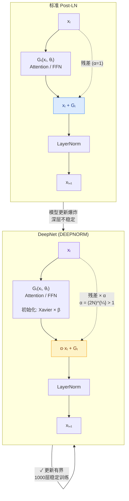

---
tags:
  - 论文分析
  - 模型结构
  - 深层Transformer
  - 残差连接
  - 训练稳定性
  - 微软
arxiv: "2203.00555"
authors: "Hongyu Wang, Shuming Ma, Li Dong, Shaohan Huang, Dongdong Zhang, Furu Wei"
institutions: "Microsoft Research"
created: 2026-07-25
rating: ⭐⭐⭐⭐⭐
---

# DeepNet: Scaling Transformers to 1,000 Layers

## 一、论文概览

| 项目 | 内容 |
|------|------|
| **论文标题** | DeepNet: Scaling Transformers to 1,000 Layers |
| **作者** | Hongyu Wang, Shuming Ma, Li Dong, Shaohan Huang, Dongdong Zhang, Furu Wei |
| **机构** | Microsoft Research |
| **发表** | NeurIPS 2022 |
| **arXiv** | [2203.00555](https://arxiv.org/abs/2203.00555) |
| **代码** | [https://github.com/microsoft/unilm](https://github.com/microsoft/unilm) |

### 核心贡献

DeepNet 提出了一种极其简洁但有效的 Transformer 训练稳定性方法——**DEEPNORM**（深度归一化）。该方法通过两个关键改动：

1. **缩放残差连接**：在残差连接上乘以一个大于 1 的常数因子 **α**
2. **缩放初始化**：对 FFN、v_proj、out_proj 的 Xavier 初始化乘以一个小于 1 的常数因子 **β**

这一改动使得模型更新幅度被常数界控制，成功将 Transformer 扩展到 **1,000 层**（2,500 个子层），比此前的最深 Transformer 模型深一个数量级。

> **核心洞察**：深层 Transformer 训练不稳定的根本原因是**模型更新爆炸（exploding model update）**，而非梯度过大。DEEPNORM 通过理论推导出的 α 和 β 绑定了模型更新幅度。

## 二、问题背景

### 深度扩展的困境

随着 GPT-3、Gopher、GLaM 等大模型的涌现，模型参数已从百万级增长到万亿级。然而，尽管参数量爆炸式增长，这些模型的**深度**却始终受限（如图 1 所示）。例如：

- BERT-large: 24 层
- GPT-3: 96 层
- GLaM: 64 层

问题根源在于 Transformer 深层训练不稳定。

### Post-LN vs Pre-LN 的两难

| 方案 | 优点 | 缺点 |
|------|------|------|
| **Post-LN**（原始 Transformer） | 性能好 | 深层训练不稳定，容易发散 |
| **Pre-LN** | 训练稳定 | 底层梯度大、顶层梯度小，性能比 Post-LN 低 0.5-1.0 BLEU |

DEEPNORM 的设计目标是**兼具 Post-LN 的性能和 Pre-LN 的稳定性**。

### 此前方法的局限

之前的工作从不同角度尝试解决问题，但未能扩展到 1,000 层：

- **更好的初始化**：DS-init (Zhang et al., 2019a)、T-Fixup (Huang et al., 2020) — 最多支持数百层
- **更好的架构**：ReZero (Bachlechner et al., 2020)、NormFormer (Shleifer et al., 2021)、DLCL (Wang et al., 2019)
- **更好的归一化位置**：Admin (Liu et al., 2020)

## 三、技术方法详解

### 3.1 不稳定性的根因分析

作者通过精妙的控制实验，系统性地揭示了深层 Transformer 不稳定的真正原因。

**Post-LN-init 实验**：作者设计了一个对比模型 Post-LN-init，在第 l 层初始化时将权重缩小 $k_l = N - l + 1$ 倍（底层缩小更多），但保持 Post-LN 架构不变。

关键发现：

1. **梯度爆炸不是根因**：Post-LN-init 的顶层梯度比 Post-LN 更大，但却成功收敛（图 3）。
2. **模型更新爆炸才是根因**：Post-LN 在训练初期模型更新 $\|\Delta F\|$ 急剧爆炸（图 4a），随后陷入局部极值几乎不再更新。
3. **链式反应**：模型更新爆炸 → LN 输入 $\|x\|$ 剧增 → LN 反向梯度 $\frac{\partial LN(x)}{\partial x} = O(\frac{\sqrt{d}}{\|x\|})$ 急剧减小 → 梯度消失 → 无法逃离局部极值。

公式表达：

$$
\| \Delta F \| = \| F(x, \theta_i) - F(x, \theta_0) \|
$$

### 3.2 DEEPNORM 架构

DEEPNORM 的数学形式极为简洁：



**图解**：DeepNorm 与 Post-LN 的唯一区别在于残差连接乘上 α (>1) 且参数初始化缩放 β。但正是这个微小的变化，让模型更新幅度从 O(N)（随层数爆炸）降为 O(1)（与层数无关的常数）。

$$
x_{l+1} = LN(\alpha \cdot x_l + G_l(x_l, \theta_l))
$$

其中 $\alpha$ 是一个大于 1 的常数（对残差连接进行上缩放），$G_l$ 是第 $l$ 个子层的函数。

#### 伪代码

```python
def deepnorm(x):
    return LayerNorm(x * α + f(x))

def deepnorm_init(w):
    if w is ['ffn', 'v_proj', 'out_proj']:
        nn.init.xavier_normal_(w, gain=β)
    elif w is ['q_proj', 'k_proj']:
        nn.init.xavier_normal_(w, gain=1)
```

### 3.3 α 和 β 的理论推导

#### 核心定理

**定理 4.2**：对于 N 层 DeepNet $F(x, \theta)$，模型更新满足：

$$
\| \Delta F \| \leq \sum_{i=1}^{2N} \frac{\sqrt{v_i^2 + w_i^2}}{\alpha} \| \theta_i^* - \theta_i \|
$$

对于原始 Post-LN（$\alpha = 1, v_i = w_i = 1$），得到 $\| \Delta F \| = O(\sum_{i=1}^{2N} \| \theta_i^* - \theta_i \|)$，随深度**线性累积**，这正是深层 Transformer 不稳定的根源。

#### α 和 β 的具体值

作者的目标是使模型更新 $\|\Delta F_{ed}\| = \Theta(\eta)$（与学习率同阶）。通过选择合适的 α 和 β 使公式中的每项系数为 $\Theta(1)$：

| 架构 | α | β |
|------|---|---|
| **Encoder-only** (如 BERT) | $(2N)^{1/4}$ | $(8N)^{-1/4}$ |
| **Decoder-only** (如 GPT) | $(2M)^{1/4}$ | $(8M)^{-1/4}$ |
| **Encoder-decoder** Encoder | $0.81(N^4 M)^{1/16}$ | $0.87(N^4 M)^{-1/16}$ |
| **Encoder-decoder** Decoder | $(3M)^{1/4}$ | $(12M)^{-1/4}$ |

其中 $N$ 为编码器层数，$M$ 为解码器层数。

#### 推导思路（简化版）

1. **Attention 的简化**：Lemma 4.1 证明 Q、K 投影不影响 Attention 输出的量级，只有 V 投影和 O 投影贡献量级。因此 Attention 可简化为 $Attn(Q, K, V) \stackrel{\Theta}{=} v \cdot w \cdot V$。

2. **SGD 更新绑定**：假设 SGD 更新 $\theta^* = \theta - \eta \frac{\partial L}{\partial \theta}$，模型更新 $\|\Delta F_{ed}\|$ 可展开为各层更新的加权和。

3. **解方程求解**：设置 $\alpha_d^2 = (3M)^{1/2}$ 使迭代项系数为 $\Theta(1)$，同时 $v_d^2 + w_d^2 = (3M)^{1/2}$ 且 $v_d = w_d = \beta_d$，解得 $\alpha_d = (3M)^{1/4}, \beta_d = (12M)^{-1/4}$。

### 3.4 与 Post-LN 的对比


图 5 显示：Post-LN 的模型更新随深度爆炸式增长，而 DeepNet 的模型更新几乎为常数，不随深度变化。

## 四、实验评估

### 4.1 WMT-17 英德翻译

| 模型 | LN 类型 | 6L-6L | 18L-18L | 50L-50L | 100L-100L |
|------|---------|:-----:|:-------:|:-------:|:---------:|
| Vanilla Post-LN | Post | 28.1 | 28.8 | diverged | diverged |
| DS-Init | Post | 27.9 | 28.4 | diverged | diverged |
| Admin | Post | 27.9 | — | diverged | diverged |
| ReZero | No LN | 26.9 | diverged(fp16) | — | — |
| R-Fixup | No LN | 27.5 | 27.7 | 26.7 | diverged |
| T-Fixup | No LN | 27.5 | 27.9 | 27.5 | diverged |
| Vanilla Pre-LN | Pre | 27.0 | 28.0 | 27.4 | 27.4 |
| DLCL | Pre | 27.4 | 28.2 | diverged | 27.5 |
| NormFormer | Pre | 27.0 | 28.3 | 27.8 | diverged |
| **DeepNet (ours)** | Deep | **27.8** | **28.8** | **29.0** | **28.9** |

**核心结论**：
- DeepNet 是唯一在所有深度下都成功训练的模型
- Pre-LN 类模型虽然稳定，但比 DeepNet 低 0.5-1.0 BLEU
- DeepNet 兼具 Post-LN 的高性能（甚至更优）和 Pre-LN 的稳定性

### 4.2 IWSLT-14 深度缩放实验

在 10L-10L 到 100L-100L 范围内以 10 层为间隔进行实验，DeepNet 在所有深度下都稳定收敛，BLEU 随深度持续提升（图 6）。

### 4.3 大规模学习率、批量大小和隐藏维度

DeepNet 在以下极端设置下仍然稳定：
- 学习率：5e-4 → 1.5e-3（标准为 5e-4）
- 批量大小：64×4k → 256×4k
- 隐藏维度：512 → 1024

### 4.4 OPUS-100 多语言翻译

| 模型 | 层数 | 参数量 | X→En | En→X | 平均 |
|------|:----:|:------:|:----:|:----:|:----:|
| Baseline (Zhang et al., 2020) | 48 | 254M | 31.4 | 24.0 | 27.7 |
| **DeepNet** | **200** | **863M** | **33.2** | **29.0** | **31.1** |
| **DeepNet** | **1,000** | **3.8B** | **33.9** | **30.2** | **32.1** |

### 4.5 与 M2M-100 的巅峰对决

| 模型 | 层数 | 参数量 | WMT | OPUS | TED | Flores |
|------|:----:|:------:|:---:|:----:|:---:|:------:|
| M2M-100 (Fan et al., 2021) | 48 | 12B | 31.9 | 18.4 | 18.7 | 13.6 |
| **DeepNet** | **200** | **3.2B** | **33.9** | **23.0** | **20.1** | **18.6** |

> **200 层 DeepNet（3.2B 参数）以不到 1/3 的参数量，全面超越 48 层 M2M-100（12B 参数），平均高出 5 BLEU 以上。**

这一结果有力证明：**深度扩展（deep scaling）是比宽度扩展（wide scaling）更高效的模型扩展方向**。

### 4.6 深度缩放律


实验发现 BLEU 随深度呈**对数增长**：

$$
L(d) = A \log(d) + B
$$

其中 $d$ 是深度，$A, B$ 是与超参数相关的常数。这表明深度扩展虽然有效，但也存在边际递减效应。

## 五、亮点与局限

### 亮点

1. **极简设计**：仅需修改残差缩放的 α 和初始化缩放的 β，代码改动极小
2. **理论完备**：从模型更新爆炸的根因诊断到 α、β 的闭式解，理论链条完整
3. **效果显著**：1000 层稳定训练，200 层 3.2B 模型超越 48 层 12B SOTA
4. **一统江湖**：统一了 Post-LN（高性能）和 Pre-LN（高稳定）的优势
5. **通用性**：支持 Encoder-only、Decoder-only、Encoder-decoder 三种架构的 Unified 公式

### 局限

1. **实验覆盖不够广**：论文主要在机器翻译任务上验证，缺乏 NLP 预训练（如 BERT、GPT）、视觉 Transformer（ViT）、多模态等领域的实验
2. **训练代价**：1000 层模型虽然参数仅为 3.8B，但深度带来的计算和通信开销在实际部署中需要考虑
3. **缩放律的通用性**：BLEU 随深度对数增长的规律是否适用于其他任务和架构尚需验证
4. **与 Adam 的适配**：理论分析基于 SGD，实验使用 Adam，理论到实践的 gap 缺乏严格分析

### 后续发展

该论文提出的 DEEPNORM 已被广泛应用，成为训练极深 Transformer 的标准技术之一。后续工作在多个领域验证了其有效性：
- 语言模型预训练（如 ERNIE 3.0、PanGu-α）
- 视觉 Transformer（如 BEiT-3）
- 多模态模型（如 VLMo）

## 相关链接

- [arXiv 论文](https://arxiv.org/abs/2203.00555)
- [GitHub 代码 (UniLM)](https://github.com/microsoft/unilm)
- [NeurIPS 2022 Proceedings](https://papers.nips.cc/paper_files/paper/2022/hash/...)
- [OpenReview](https://openreview.net/forum?id=...) (NeurIPS 2022)

---

*分析撰写于 2026-07-25，基于论文 arXiv:2203.00555v1*
