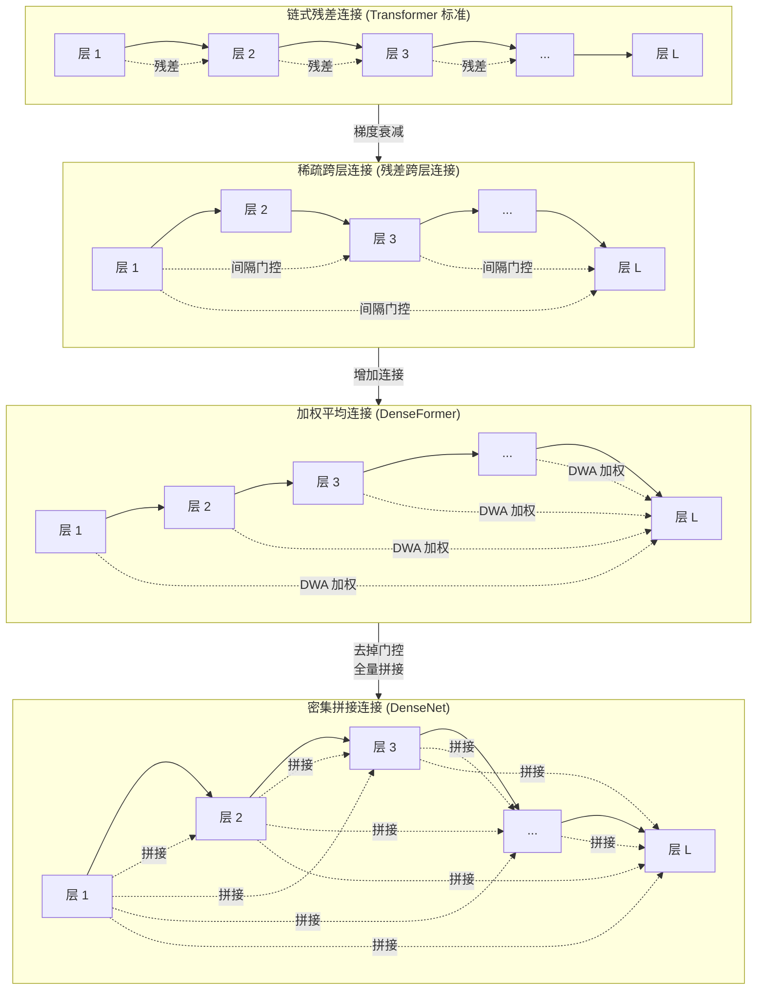

---
tags:
  - 论文分析
  - 模型结构
  - 跳跃连接
  - DenseNet
  - Transformer变体
  - DenseFormer
  - 密集连接
arxiv: "1608.06993"
authors: "Gao Huang, Zhuang Liu, Geoff Pleiss, Laurens van der Maaten, Kilian Q. Weinberger"
institutions: "Cornell University & Facebook AI Research"
created: 2026-07-25
rating: ⭐⭐⭐⭐
---

# DenseNet 在 Transformer 中的延伸：从密集连接到稀疏跨层连接

## 一、概览

DenseNet（Densely Connected Convolutional Networks）是 CNN 时代最具影响力的架构创新之一，其核心思想——**每层接收所有前层的输出作为输入**——从根本上改变了深度网络的信息流设计范式。这一思路近年来被系统性地引入 Transformer 架构，催生了 DenseFormer、Densely Connected Transformer (DCT) 等一系列工作。

本综述梳理这条技术路线的沿革，将以下工作串联为一条完整的演化线索：

| 工作 | 发表 | 核心贡献 | 与 DenseNet 的关系 |
|------|------|---------|------------------|
| **DenseNet** | CVPR 2017 | 密集连接：$x_l = H_l([x_0, x_1, ..., x_{l-1}])$ | 奠基性工作 |
| **DenseFormer** | ICML 2024 | Depth-Weighted Averaging (DWA) | 将 Dense 连接引入 Transformer 层间 |
| **H-DenseFormer / DCT** | MICCAI 2023 | Densely Connected Transformer block | 医学图像分割中的密集连接 Transformer |
| **残差跨层连接** | — | 隔 N 层稀疏跨层连接 | 密集连接的稀疏化变体 |

---

## 二、DenseNet 原理解析



### 2.1 动机

随着 CNN 深度增加，**梯度消失** 问题日益严重。ResNet 通过恒等映射（skip connection）解决了这一问题，但其残差路径是**加法性**的——每个残差块只学习对输入的修正（residual），特征在传递过程中存在信息衰减。DenseNet 提出一个更激进的方案：**既然深层网络需要直接访问浅层特征，为什么不直接把所有前层的输出都拼接起来？**

### 2.2 公式化表达

标准的 DenseNet 中，第 $l$ 层的输入是所有前层输出的拼接：

$$x_l = H_l([x_0, x_1, ..., x_{l-1}])$$

其中 $H_l(\cdot)$ 是一个复合函数（BN → ReLU → Conv），$[\cdot]$ 表示通道维度的拼接（concatenation）。

对于 $L$ 层的 DenseNet，共有 $L(L+1)/2$ 条直接连接——是传统 $L$ 层网络的 $O(L)$ 倍。

### 2.3 三个关键优势

1. **缓解梯度消失**：梯度可以直接通过多条短路径反向传播到浅层，避免了在深层逐层衰减。
2. **特征复用（Feature Reuse）**：浅层的低级特征（边缘、纹理）可以直接被深层利用，无需重复学习。
3. **参数效率**：每个 $H_l$ 只需要学习极少的特征图（growth rate $k$，通常仅 12-32），因为大量信息直接从前层拼接而来。

> 对比 ResNet：ResNet 的残差连接是**加法**，每一层仍需要学习完整的特征变换；DenseNet 的拼接连接允许每层只贡献少量新特征，通过 **复用已有特征** 实现高效学习。

### 2.4 关键设计细节

- **Growth Rate $k$**：每层新增特征图的数量，控制模型容量。$k$ 越小参数越少，但需要更多层。
- **Bottleneck 层**：在 $3 \times 3$ 卷积前插入 $1 \times 1$ 卷积降维，减少输入通道数，提高计算效率（DenseNet-B）。
- **Transition 层**：在 dense block 之间插入 $1 \times 1$ 卷积 + $2 \times 2$ 平均池化，压缩通道数并下采样（DenseNet-C）。
- **DenseNet-BC**：同时使用 bottleneck 和 compression，在 ImageNet 上以远少于 ResNet 的参数达到相近甚至更好的性能。

### 2.5 局限

- **显存占用高**：需要保存所有前层的特征图用于拼接，训练时显存开销随深度平方增长。后续工作（如 Memory-Efficient DenseNet）通过共享计算缓解此问题。
- **计算图复杂**：密集连接导致计算图稠密，推理时无法通过简单的层并行化加速。

---

## 三、DenseNet → Transformer 的延伸工作

### 3.1 DenseFormer: Enhancing Information Flow in Transformers via Depth Weighted Averaging

**发表**：ICML 2024 | **arXiv**: [2402.02622](https://arxiv.org/abs/2402.02622)
**作者**：Matteo Pagliardini, Amirkeivan Mohtashami, Francois Fleuret, Martin Jaggi (EPFL)

#### 3.1.1 核心发现

DenseFormer 是 **最直接继承 DenseNet 思路的 Transformer 工作**。论文观察到与 DenseNet 类似的"边际收益递减"现象：增加 Transformer 深度到一定程度后，性能提升趋于平缓。受 DenseNet 启发，他们提出让每个 Transformer block 的输出**加权平均**地来自所有前层。

#### 3.1.2 方法：Depth-Weighted Averaging (DWA)

标准 Transformer 的信息流是链式的：

$$X_i = B_i(X_{i-1})$$

DenseFormer 在每个 Transformer block 之后插入 DWA 模块：

$$Y_i = \text{DWA}_i(X_0, X_1, ..., X_i) = \sum_{j=0}^{i} \alpha_{i,j} X_j$$

其中 $\alpha_{i,j}$ 是可学习的标量权重，满足 $\sum \alpha_{i,j} = 1$（通过 softmax 归一化）。第 $i$ 个 block 的**真实输入**是加权平均结果 $Y_{i-1}$，而非单一的前一层输出 $X_{i-1}$。

公式化：

$$\begin{aligned}
X_0 &:= \text{Embedding}(X) \\
Y_0 &:= X_0 \\
\forall i=1,\dots d,\; X_i &:= B_i(Y_{i-1}) \\
\forall i=1,\dots d,\; Y_i &:= \sum_{j=0}^{i} \alpha_{i,j} X_j
\end{aligned}$$

**与 DenseNet 的对比**：
- **DenseNet**：拼接（concatenation）→ 通道数线性增长
- **DenseFormer**：加权平均（weighted average）→ 特征维度不变
- DenseFormer 避免了 DenseNet 的显存爆炸问题，同时保留了"所有前层直接可访问"的设计精神

#### 3.1.3 实验发现

1. **更好的困惑度**：48 层 DenseFormer 的性能等同于 72 层标准 Transformer，但速度快 45%、参数少 45%。
2. **数据效率更高**：在相同训练时间预算下，DenseFormer 始终优于标准 Transformer。
3. **加权 skip 连接不足**：对照实验表明，**仅仅给残差连接加可学习缩放因子不够**——DenseFormer 的性能增益来自于**直接访问所有前层输出**，而非简单的加权残差。

#### 3.1.4 DWA 权重可视化

![Figure 5: DWA 权重模式]

论文可视化学习到的 $\alpha$ 权重矩阵，发现一个**非常一致且规律的模式**：

- 每个 DWA 模块给予**当前层的权重最高**
- **浅层（接近 embedding 层）获得较高权重**，表明模型持续复用早期提取的特征
- 这种模式在 48 层和 72 层模型上高度一致，说明 DenseFormer 学到了**结构化的信息复用策略**，而非随机分布

#### 3.1.5 效率优化的 Dilated DenseFormer

为降低 DWA 的计算开销，论文提出 $k\text{x}p$-DenseFormer：
- **Dilation $k$**：每 $k$ 层共享一个 DWA 模块，而非每层都设
- **Period $p$**：DWA 只考虑最近 $p$ 层的输出，而非全部前层

例如 $4\text{x}5$-DenseFormer（dilation=4, period=5）在几乎不损失性能的前提下大幅降低了推理时间开销。

#### 3.1.6 核心结论

> **DenseFormer 证明 DenseNet 式的密集连接在 Transformer 上同样有效**——它不仅提升了性能/参数的权衡曲线，更重要的是揭示了 Transformer 内部存在**结构化的跨层信息复用**这一深层性质。

---

### 3.2 H-DenseFormer & Densely Connected Transformer (DCT)

**发表**：MICCAI 2023 | **arXiv**: [2307.01486](https://arxiv.org/abs/2307.01486)
**作者**：Jun Shi, Hongyu Kan, Shulan Ruan 等 (中国科学技术大学)

#### 3.2.1 研究背景

医学图像分割中多模态融合（PET-CT、MRI 多序列）是核心挑战。H-DenseFormer 将密集连接引入 CNN-Transformer 混合架构，用于肿瘤分割任务。

#### 3.2.2 DCT Block

DCT（Densely Connected Transformer）block 是本文的核心设计，它将标准 Transformer block 替换为**内部密集连接**的结构：

具体而言，DCT block 内部的多头注意力层和 FFN 层之间采用稠密连接模式——每个子层的输入是所有前子层输出的拼接，与 DenseNet 中的 dense block 设计同构。

#### 3.2.3 架构

H-DenseFormer 整体架构包含三个关键模块：

1. **MPE（Multi-path Parallel Embedding）模块**：每模态分配独立编码路径，使用 DCT block 提取全局特征，然后融合所有路径语义送入分割网络编码器。
2. **DCT blocks**：在 MPE 路径和编码器中替代标准 Transformer block，降低计算复杂度。
3. **CNN-Transformer 混合设计**：编码器结合 CNN 的局部建模和 DCT 的全局上下文建模。

#### 3.2.4 实验结果

在 HECKTOR21（PET-CT 头颈癌）和 PI-CAI22（前列腺癌 MRI）两个公开数据集上，H-DenseFormer 在降低计算复杂度的同时，超越了当时的 SOTA 方法。

#### 3.2.5 与 DenseFormer 的区别

| 维度 | DenseFormer | H-DenseFormer / DCT |
|------|-------------|-------------------|
| 密集连接位置 | **层间**（block 之间） | **层内**（block 内部的子层之间） |
| 聚合方式 | 加权平均 | 拼接（concatenation） |
| 应用领域 | 通用 NLP（语言建模） | 医学图像分割 |
| 密集程度 | 每层加权平均所有前层 | 使用 dense block 结构 |

---

### 3.3 其他相关工作

除上述两篇核心工作外，还有多个方向与 DenseNet→Transformer 的延伸相关：

#### 3.3.1 残差流（Residual Stream）研究

最近的 **Residual Stream Duality** (arXiv:2603.16039) 从理论角度重新审视了 Transformer 的信息流组织。它将 Transformer 解码器视为沿**序列位置**和**层深度**两个维度演化的系统，论证了残差流（residual stream）不仅是连接管道，更是模型的表征计算组件。这一视角与 DenseNet/DenseFormer 的"信息复用"精神高度一致。

#### 3.3.2 加权残差连接

- **Skips with Gains**（DenseFormer 论文中的对照实验）：给标准残差连接加可学习缩放因子，发现效果远不如 DenseFormer——说明**密集连接的核心优势在于提供多条可访问的信息路径**，而非简单的加权控制。
- **ReZero** (Bachlechner et al., 2020)：在残差连接中引入可学习的零初始化缩放因子，加速深层 Transformer 训练。虽然不如 DenseFormer 般密集，但同样关注跨层信息流动的优化。

#### 3.3.3 Vision Transformer 中的密集连接

- **Dense-Swin / DenseViT** 等视觉 Transformer 变体在 Swin Transformer 或 ViT 内部引入 DenseNet 式的 dense block 结构，提升视觉特征的复用效率。

---

## 四、与残差跨层连接的关系

### 4.1 对比表格

| 维度 | DenseNet 系列 (DenseFormer / DCT) | 残差跨层连接 |
|------|-----------------------------------|-------------|
| **连接策略** | 密集连接：所有前层 → 当前层 | 稀疏连接：隔 N 层选一个 |
| **连接数量** | $O(L^2)$ 条直接连接 | $O(L)$ 条跨层连接 |
| **信息流** | 每层可访问全部历史信息 | 每层只能访问特定间隔层的信息 |
| **参数量** | DenseFormer 增加可忽略参数（$\alpha$ 权重） | 增加可学习的门控参数 |
| **显存开销** | DenseFormer 低（加权平均），DCT 高（拼接） | 较低 |
| **梯度流动** | 极多短路径，梯度消失概率很低 | 有限短路径，但仍优于纯链式 |
| **理论动机** | 最大化特征复用和信息流动 | 在效率与信息流动间取得平衡 |

### 4.2 设计哲学的分野

两条路线代表了**连接密度**这一连续谱系上的两个极端：

```
链式 (Transformer) ── 稀疏跨层 (残差跨层连接) ── 密集平均 (DenseFormer) ── 密集拼接 (DenseNet/DCT)
     O(L)                ~O(L) 但更优                 O(L²) 可学习加权                    O(L²) 拼接
```

- **残差跨层连接** 认为：不是所有跨层连接都有价值。通过 **门控选择** 和 **间隔采样**，在极少增加计算的前提下提供关键的信息捷径。
- **DenseNet 系列** 认为：**所有前层都可能有用**。与其判断哪些连接重要，不如让所有信息都可用，让模型自己决定如何组合。
- **折中方案**：DenseFormer 的 $k\text{x}p$-DenseFormer（dilated DenseFormer）通过 dilation 和 period 参数控制稠密程度，实质上是向稀疏化方向的调整。

### 4.3 互补性

两者并非互斥——一个有趣的方向是将残差跨层连接的**门控选择**与 DenseFormer 的**加权平均**结合：在 Dense 连接上引入门控，让模型动态选择哪些前层信息对当前层更有用。目前尚无公开工作探索这一组合。

---

## 五、亮点与局限

### 5.1 DenseNet 系列的共同亮点

1. **深度直觉**：从 DenseNet 到 DenseFormer，一脉相承的核心洞察是——**深度网络的层不应被孤立地看待，信息流动越自由，模型越强大**。
2. **参数高效**：DenseNet 通过特征复用大幅减少参数量；DenseFormer 用极少量额外参数（$\alpha$ 权重矩阵，约几千个）即可显著提升性能。
3. **理论启示**：DWA 权重可视化揭示 Transformer 存在**结构化跨层信息复用**模式，为理解深层 Transformer 的内部工作机制提供了经验证据。
4. **即插即用**：DenseFormer 的 DWA 模块可轻松嵌入现有 Transformer 实现，无需改动注意力或 FFN 内部结构。

### 5.2 局限与开放问题

1. **计算开销**：DenseFormer 的 DWA 需要额外的前向/反向传播，在超大模型（100B+）上仍需谨慎设计 dilation/period 来平衡效率。
2. **特征维度爆炸**（DCT 等使用拼接的方法）：继承了 DenseNet 的显存问题，限制了可扩展性。
3. **缺乏理论深度**：尽管 DenseFormer 有漂亮的可视化结果，但对 **为什么密集连接有效** 的理论分析仍停留在直观层面（梯度流动、特征复用），缺乏类似 ResNet 的神经正切核（NTK）视角的严格分析。
4. **任务覆盖不足**：DenseFormer 主要验证了语言建模任务，在翻译、分类、推理等任务上的效果有待验证。DCT 局限于医学图像分割。
5. **与残差跨层连接的对应关系未被系统研究**：从密集连接（DenseFormer）到稀疏连接（残差跨层连接）的性能-效率 Pareto 前沿尚未被完整刻画。

---

## 六、总结与展望

DenseNet 的思想在 Transformer 时代重获新生，DenseFormer 和 H-DenseFormer/DCT 从不同角度展示了密集连接对 Transformer 的增益。这条技术路线与残差跨层连接代表的稀疏跨层连接形成了互补的探索方向。未来可能有以下演进：

1. **自适应密集程度**：根据任务或层深度动态调整连接密度，在训练早期密集、后期稀疏化。
2. **门控密集连接**：结合残差跨层连接的门控与 DenseFormer 的加权平均，实现动态路径选择。
3. **理论统一框架**：建立密集/稀疏跨层连接的统一数学框架，刻画连接密度与模型容量、梯度流的关系。
4. **大规模验证**：在 GPT / LLaMA 规模上验证 DenseFormer 的扩展性，探索是否能在缩放定律（scaling laws）层面带来实质性改善。

---

## 相关链接

- [DenseNet (CVPR 2017)](https://arxiv.org/abs/1608.06993) — [GitHub](https://github.com/liuzhuang13/DenseNet)
- [DenseFormer (ICML 2024)](https://arxiv.org/abs/2402.02622) — [GitHub](https://github.com/INFO-GCH/EPFL-DenseFormer)
- [H-DenseFormer / DCT (MICCAI 2023)](https://arxiv.org/abs/2307.01486) — [GitHub](https://github.com/shijun18/H-DenseFormer)
- [残差跨层连接技术分析](https://pastens.github.io/Knowledge/论文分析/模型结构/残差跨层连接技术分析)
- [Residual Stream Duality (arXiv:2603.16039)](https://arxiv.org/abs/2603.16039)
- [Highway Transformer 技术分析](https://pastens.github.io/Knowledge/论文分析/模型结构/Highway%20Transformer%20技术分析)
- [ResiDual 技术分析](https://pastens.github.io/Knowledge/论文分析/模型结构/ResiDual%20技术分析)
