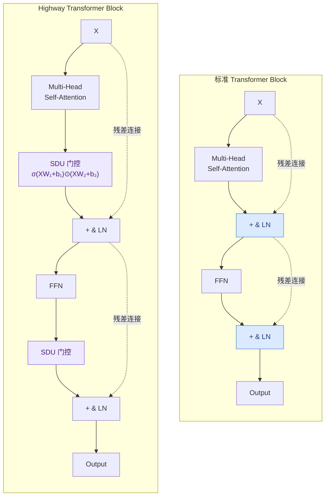

---
tags:
  - 论文分析
  - 模型结构
  - 残差连接
  - 门控机制
arxiv: "2004.08178"
authors: "Yekun Chai, Shuo Jin, Xinwen Hou"
institutions: "CAS & University of Pittsburgh"
created: 2026-07-25
rating: ⭐⭐⭐
---

# Highway Transformer: Self-Gating Enhanced Self-Attentive Networks

## 一、论文概览

| 项目 | 内容 |
|------|------|
| **标题** | Highway Transformer: Self-Gating Enhanced Self-Attentive Networks |
| **arXiv** | [2004.08178](https://arxiv.org/abs/2004.08178) |
| **机构** | Institute of Automation, Chinese Academy of Sciences & University of Pittsburgh |
| **发表** | ACL 2020 |
| **代码** | [Highway-Transformer](https://github.com/cyk1337/Highway-Transformer) |

### 核心贡献

1. **Self-Dependency Units (SDU)**：在 Transformer 的每个 Self-Attention 子层和 FFN 子层之后插入类 LSTM 的门控单元，在特征维度上控制信息流。**注意是每层都做门控，而非间隔 N 层**。
2. **收敛加速**：实验证明 SDU 门控能显著加速 Transformer 的训练和验证收敛过程，特别是在浅层（bottom layers）效果最为明显。
3. **互补性验证**：门控机制与循环机制（R-Transformer 的 localRNN、Transformer-XL 的 segment-level recurrence）相互兼容且互补。

## 二、问题背景

### Transformer 的局限

Transformer 的核心是多头点积自注意力（MHDPA），它通过计算序列中任意两个位置之间的注意力权重来捕获全局依赖关系。然而，注意力机制本质上关注的是 **词与词之间的关系权重**（contextual dependency），而忽略了 **单个特征维度上信息的重要性**（feature-wise importance）。

> 类比理解：阅读一句话时，我们既需要理解词之间的语法关系（注意力分布），也需要知道每个词本身的语义重要性（特征权重）。传统 Transformer 只做了前者。

### 门控机制的启发

LSTM 的门控机制（输入门、遗忘门、输出门）能够在特征维度上选择性地保留或丢弃信息。GLU（Gated Linear Units）将此思路引入 CNN，证明门控机制可以不依赖循环结构而有效建模序列。Dauphin et al. (2017) 的门控 CNN、Gehring et al. (2017) 的卷积 seq2seq、Wu et al. (2019) 的动态卷积都在不同方向上验证了门控的有效性。

本文的核心洞察：**既然门控在 CNN 上有效，那在 Transformer 上是否同样有效？是否可以同时利用注意力（全局依赖）和门控（特征重要性）？**

## 三、技术方法详解

### 3.1 Self-Dependency Units (SDU)

SDU 是一种轻量级的自门控机制，定义如下：

$$
T(X) = \Psi(XW_1 + b_1)
$$

$$
\text{SDU}(X) = T(X) \odot (XW_2 + b_2)
$$

其中：
- $X \in \mathbb{R}^{L \times d}$ 是输入表示
- $T(X)$ 是 **变换门（transform gate）**，通过 $\Psi$ 门控函数将线性投影的值映射到固定区间
- $\Psi$ 取 sigmoid ($\sigma$) 或 tanh 函数
- $W_1, W_2 \in \mathbb{R}^{d \times d}$ 和 $b_1, b_2 \in \mathbb{R}^{d}$ 是可训练参数
- $\odot$ 表示逐元素乘积

**门控函数的解释**：
- **tanh** 作为 "update gate"（更新门），将重要性范围限制在 $[-1, 1]$
- **sigmoid** ($\sigma$) 类似于 LSTM 的 "input gate"（输入门），将重要性映射到 $(0, 1)$，决定每个特征保留多少信息

### 3.2 Pseudo-Highway Connection

将 SDU 插入 Transformer block 的方式非常直接——在每个子层（SA 和 FFN）之后添加 SDU，与残差连接形成 **伪高速公路**：



**关键区别**：标准 Transformer 只有一条纯粹的恒等残差路径，而 Highway Transformer 在每个子层输出处额外插入 SDU 门控，对特征维度进行逐元素重要性调节——这就是"伪高速公路"的含义：除残差连接外，还有一条受门控控制的信息通道。

$$
U = \text{LN}\big(X + \text{Att}(Q,K,V) + \text{SDU}(X)\big)
$$

$$
O = \text{LN}\big(U + \text{FFN}(U) + \text{SDU}(U)\big)
$$

当 $\Psi$ 取 sigmoid 时，SDU 可以改写为 Highway Networks 的形式：

$$
\nabla[\sigma(g(X)) \cdot f(X)] = \sigma(g(X))\nabla f(X) + [1 - \sigma(g(X))]\sigma(g(X))f(X)
$$

其中 $\sigma(g(X))$ 为变换门，$(1 - \sigma(g(X)))$ 为携带门（carry gate），这与 Highway Networks 的精神一致——门控控制信息是以变换后的形式还是以原始形式通过。

**梯度分析**：

$$
\nabla[f(x) \cdot \Psi(g(x))] = \nabla f(x) \cdot \Psi(g(x)) + f(x) \cdot \nabla\Psi(g(x))
$$

梯度由两项之和组成，提供了 **无阻碍的信息流**。第一项是主梯度路径，第二项虽因门控函数的导数可能消失，但整体上类似 **乘法跳连接**（multiplicative skip connection），有助于优化过程快速走向局部最优点。

### 3.3 变体门控连接

论文还探索了两种变体：

1. **Highway Gate**（高速公路门控）：类似 Highway Networks，使用 $(1-T(X)) \odot X + T(X) \odot f(X)$ 的形式，将原始输入和变换后的输入通过门控融合。

2. **Gated MHDPA**（门控 MHDPA）：将 carry gate 和 transform gate 分别作用于注意力输出和变换输出：
   $$
   o(X) = (1 - T(X)) \odot \text{Att}(Q,K,V) + T(X) \odot f(X)
   $$

### 3.4 SDU 与 Transformer 的融合方式（图解）

```
Input X
  ├── MHDPA ──→ Add & Norm ──→ U
  └── SDU ────↑
  
U
  ├── FFN ────→ Add & Norm ──→ Output
  └── SDU ────↑
```

每个 Transformer block 中，SA 子层和 FFN 子层都伴生一个 SDU 分支，SDU 的输出与对应子层的输出相加再进入 LayerNorm。这种设计 **每层都做**，非间隔 N 层。

## 四、实验评估

### 4.1 任务与数据集

| 任务 | 数据集 | 模型 | 评估指标 |
|------|--------|------|---------|
| 语言建模（字符级） | PTB (char-level) | Transformer-L3, R-Transformer-L3 | loss, bpc, perplexity |
| 语言建模（词级） | PTB (word-level) | Transformer-L3, R-Transformer-L3 | loss, perplexity |
| 语言建模 | enwik8 | Transformer-XL (6层, 12层) | loss, bpc |

### 4.2 主要结果

**字符级 PTB LM（Transformer-L3）**：

| 模型 | 验证 PPL | 测试 PPL |
|------|---------|---------|
| Transformer-L3 | 1.541 | 1.495 |
| +σ SDU | 1.410 (↓8.5%) | 1.371 (↓8.3%) |
| +tanh SDU | **1.401 (↓9.1%)** | **1.364 (↓8.8%)** |

**词级 PTB LM（R-Transformer-L3）**：

| 模型 | 测试 PPL |
|------|---------|
| RT-L3 | 92.31 |
| +σ SDU | 87.88 |
| +tanh SDU | **84.92** |

**6层 Transformer-XL（enwik8）**：

| 模型 | 验证 bpc | 测试 bpc |
|------|---------|---------|
| L6-XL | 1.276 | 1.24339 |
| +σ SDU | **1.237 (↓3.1%)** | **1.21123 (↓2.6%)** |
| +tanh SDU | 1.241 | 1.21424 |

### 4.3 消融实验

**部分层门控**：在 6 层 Transformer-XL 上测试在层 1-3、层 3-6 以及层 1-6（去掉 FFN 门控）上添加 SDU 的效果。结果显示：

- **底层（L1-3）添加 tanh SDU 贡献最大**，验证 bpc 达 1.249
- **顶层（L3-6）添加门控反而可能损害测试性能**（验证 bpc 1.277，高于基线）
- 说明低层 Transformer 捕获局部信息，门控有助于增强浅层特征编码

**12层 Transformer-XL 深度网络**：

| 设置 | 测试 bpc |
|------|---------|
| L12-XL (baseline) | 1.07160 |
| +tanh L1-2（底层2层）| **1.06904 (↓)** |
| +tanh L1（仅第1层）| 1.06960 |
| +tanh L1-12（全部12层）| 1.12797 (↑，过早收敛) |
| +σ L1-2 | 1.07148 |

关键发现：**门控层数并非越多越好**。在深层网络上，仅在底层少数层加门控效果最佳；全层加门控会导致过早收敛（premature convergence），损害最终性能。

**训练时间成本**：

| 模型 | 时间成本（小时）|
|------|--------------|
| L6-XL (baseline) | 21.16 |
| +tanh SDU | 21.45 |
| +σ SDU | 21.87 |
| +highway gate | 21.93 |
| +gated MHDPA | 21.10 |

SDU 带来的额外时间开销极小，几乎可忽略。

### 4.4 门控机制的深入分析

1. **门控偏置可视化**：通过热图 t-SNE 散点图分析 SDU 门控偏置 $b_1$ 的分布，发现 6 层模型中偏置分布较均匀（各层都有积极影响），而 12 层模型中底层数层与高层有明显分离，验证了底层门控更有效的实验结论。

2. **σ vs tanh**：
   - **σ 门控**更稳定，在所有任务上都能提升或持平基线性能，不会导致过早收敛
   - **tanh 门控**在字符级任务上表现更好（零中心性质，能产生负权重），但在词级任务上容易过早陷入局部最优

3. **与循环机制的互补性**：SDU 在 R-Transformer（含 localRNN）和 Transformer-XL（含 segment-level recurrence）上的改进表明，特征维度上的门控与序列维度上的循环机制从不同角度贡献信息。

## 五、亮点与局限

### 亮点

1. **简洁有效**：SDU 仅有 $O(2d(d+1))$ 的额外参数量（对隐藏维度 512 来说不到 0.5M 参数），实现简单，改造极小，却能带来一致的收敛加速效果。
2. **即插即用**：可无超参数调整地附加到任意 Transformer 变体（基本 Transformer、R-Transformer、Transformer-XL）上。
3. **理论与实践结合**：梯度分析解释了门控作为乘法跳连接的加速原理；偏置可视化验证了不同深度层关注不同语义层次的已知假设。
4. **见解深刻**：揭示浅层门控贡献最大的规律，呼应了 SAN 底层关注局部性（localness）的观点，为后续研究提供了方向。

### 局限

1. **性能提升有限**：在 perplexity/bpc 上的绝对提升较小（约 1-3%），且部分配置（tanh 全层门控）甚至可能损害性能。
2. **仅在语言建模任务上验证**：论文未在机器翻译、文本分类、序列标注等其他常见 NLP 任务上评估。引言虽提及 NMT 但实验部分未涉及。
3. **深层网络的挑战**：12 层模型上全层加门控会导致过早收敛，未能给出完美的解决方案——如何在不引发过早收敛的前提下利用深层门控的优势仍待探索。
4. **缺乏与现代预训练模型的对比**：论文未在 BERT/GPT 规模上测试，SDU 对预训练-微调范式的影响未知。
5. **理论分析不够深入**：梯度分析较为浅显，未从优化景观（optimization landscape）角度定量解释门控加速收敛的原因。

## 六、与残差跨层连接的关系

Highway Transformer 与残差跨层连接（跨层间隔式门控残差）的核心区别在于 **门控插入的粒度**：

- **Highway Transformer**：在 **每一层** 的 Self-Attention 和 FFN 之后都插入 SDU，即每个 Transformer block 有两个门控点。论文通过消融实验发现，全部层加门控在深层模型中会导致过早收敛，最佳策略是在 **底层少数层** 加门控。
- **残差跨层连接**：间隔 N 层加门控，与 Highway 的区别在于稀疏性——更注重跨层的高速信息流动，而非每层内部的精细调控。
- **共同点**：两者都认为 Transformer 的残差连接信息流不够高效，需要额外的门控路径来辅助梯度传播和特征选择。

> 注：Highway Transformer 的 "Highway" 命名来源于 Highway Networks (Srivastava et al., 2015) 中 transform gate 和 carry gate 的二元门控结构，并非指实际的物理高速公路。SDU 的 $\sigma$ 门控可以自然分解为 $T(X)$（transform gate）和 $1-T(X)$（carry gate），实现信息的选择性通过。

## 相关链接

- [arXiv 原文](https://arxiv.org/abs/2004.08178)
- [GitHub 代码](https://github.com/cyk1337/Highway-Transformer)
- [Highway Networks (Srivastava et al., 2015)](https://arxiv.org/abs/1505.00387)
- [Gated Linear Units (Dauphin et al., 2017)](https://arxiv.org/abs/1612.08083)
- [Transformer-XL (Dai et al., 2019)](https://arxiv.org/abs/1901.02860)
- [R-Transformer (Wang et al., 2019)](https://arxiv.org/abs/1907.05572)
