---
tags:
  - 论文分析
  - 模型结构
  - 残差连接
  - Layer Normalization
  - 微软
arxiv: "2304.14802"
authors: "Shufang Xie, Huishuai Zhang, Junliang Guo, Xu Tan, Jiang Bian, et al."
institutions: "Microsoft Research & Renmin University of China"
created: 2026-07-25
rating: ⭐⭐⭐⭐
---

# ResiDual: Transformer with Dual Residual Connections

## 一、论文概览

**核心贡献：** 本文提出 **ResiDual**，一种名为 **Pre-Post-LN (PPLN)** 的新型 Transformer 架构。该架构通过**同时保留 Post-LN 和 Pre-LN 两条残差路径**，取两者之长而避其短：

- 从 **Pre-LN** 继承"梯度直达"能力，消除梯度消失
- 从 **Post-LN** 继承"表示多样性"能力，消除表示坍塌

理论证明：梯度范数有下界 + 表示多样性有下界。实验覆盖 IWSLT（小）、WMT（中）、OPUS-100（大）三个规模，全面超越 baseline。

| 方法 | 梯度消失 | 表示坍塌 | 训练稳定性 | 模型容量 |
|:---:|:---:|:---:|:---:|:---:|
| Post-LN | ✅ 有 | ❌ 无 | 需 warmup | 高 |
| Pre-LN | ❌ 无 | ✅ 有 | 稳定 | 受限 |
| **ResiDual** | ❌ 无 | ❌ 无 | 稳定（可无 warmup） | 高 |

---

## 二、问题背景

### Post-LN：梯度消失

Post-LN 的计算流程（以一个 block 为例）：

```
x^a_k = x^ln_k + f_k(x^ln_k; w_k)
x^ln_{k+1} = LN(x^a_k)
```

每个 block 之后紧跟 Layer Normalization。直觉上，**第 k 层的输出 $x^a_k$ 会在后续被归一化 $N-k$ 次**，梯度经过每层 LN 时都会被缩小。根据 Xiong et al. (2020)，**Post-LN 的梯度范数随深度指数衰减**，底层几乎接收不到梯度信号。

**为什么 Adam 也无法拯救？** 论文有一个巧妙的分析（Theorem 3.2）：当梯度 g ≈ 0 时，Adam 的 update $u(g) = \alpha \cdot \hat{m}^{(t)} / (\sqrt{\hat{v}^{(t)}} + \epsilon)$ 的条件数 κ̂ 非常大。计算示例：d=1024, ε=1e-6, α=1e-4 → κ̂ ≈ 3200。这意味着微小扰动会被放大数千倍，训练极不稳定。**Learning rate warmup 本质上是降低 α，从而降低 κ̂**。

实践中 Post-LN 必须使用 warmup（通常是 4k steps 线性 warmup），且深层模型（如 12 层以上）即使有 warmup 也经常无法收敛。

### Pre-LN：表示坍塌

Pre-LN 的计算流程：

```
x^ln_k = LN(x^a_k)
x^a_{k+1} = x^a_k + f_k(x^ln_k; w_k)
```

LN 放在每个 block 的**输入**处，梯度可以直接流过恒等路径，不会消失。但问题在于**表示坍塌**（Representation Collapse）：

- 所有 $f_k$ 的输出 $x^f_k$ 被累积到 $x^a_{N+1} = \sum_{k=1}^{N} x^f_k$ 中
- 深层 block 的输入 $x^ln_k$ 被 LN 约束到固定尺度
- 随着 k 增大，$x^ln_{k+1}$ 与 $x^ln_k$ 几乎无差异 → **深层 block "无事可做"**

论文用定量分析证明了这一点（Theorem 3.3）：假设 $x^f_k \sim N(0, \sigma^2 I)$，则 $x^ln_{k+1} - x^ln_k \sim N(0, \omega_k^2 I)$，其中 $\omega_k = \frac{\sqrt{2}}{\sqrt{k}(\sqrt{k-1} + \sqrt{k})}$，且 $E[|(x^ln_{k+1} - x^ln_k)_i|] \sim O(1/\sqrt{k})$。随着层数加深，相邻层的输入差异趋近于零。

直观含义：**加再多层，表达能力和浅层模型几乎一样。** 这是 Pre-LN 在深层场景下性能不如 Post-LN 的根本原因。

---

## 三、技术方法详解

### ResiDual / Pre-Post-LN (PPLN) 架构

核心思想：**同时维持两条残差路径，互不干扰，各司其职。**

```mermaid
flowchart LR
    subgraph PostLN["Post-LN"]
        direction TB
        P1["xᵢ"] --> P2["SA/FFN"]
        P2 --> P3["+"]
        P1 -.->|"残差"| P3
        P3 --> P4["LN"]
        P4 --> P5["xᵢ₊₁"]
        style P3 fill:#2d3748,stroke:#718096
    end

    subgraph PreLN["Pre-LN"]
        direction TB
        Q1["xᵢ"] --> Q2["LN"]
        Q2 --> Q3["SA/FFN"]
        Q3 --> Q4["+"]
        Q1 -.->|"残差"| Q4
        Q4 --> Q5["xᵢ₊₁"]
        style Q4 fill:#2d3748,stroke:#718096
    end

    subgraph RD["ResiDual (PPLN)"]
        direction TB
        R1["xᵢ"] --> R2["LN"]
        R2 --> R3["SA/FFN"]
        R3 --> R4["+ (左残差)"]
        R1 -.->|"Post-LN 残差<br/>保表示多样性"| R4
        R4 --> R5["LN"]
        R5 --> R6["LN → + (右残差)"]
        R1 -.->|"Pre-LN 残差<br/>保梯度流通"| R6
        R6 --> R7["Output"]
        style R4 fill:#553c9a,stroke:#9f7aea
        style R6 fill:#2b6cb0,stroke:#63b3ed
    end

    PostLN -->|"梯度消失 ⛔"| PreLN
    PreLN -->|"表示坍塌 ⛔"| RD
    RD -->|"✓ 两者兼得"| RD
```



#### 左残差（Post-LN 风格）—— 保表示多样性

```
x^a_k = x^ln_k + f_k(x^ln_k; w_k)
x^ln_{k+1} = LN(x^a_k)
```

这条路径和标准 Post-LN **完全一致**。LN 放在 add 之后，意味着 $x^ln_k$ 的值域被稳定约束，下层 block 的精细信息得以保留到上层。

#### 右残差（Pre-LN 风格）—— 保梯度流通

```
x^d_{k+1} = x^d_k + x^f_k
```

这条路径和 Pre-LN 一样，累加所有 $f_k$ 的输出，**中间不经过 LN 阻塞**。梯度可以直接通过 $x^d$ 路径回流到底层。

#### 最终输出

```
y = LN(x^a_{N+1}) + LN(x^d_{N+1})
```

两条路径的输出分别归一化后相加。注意这里对 $x^d$ 也做了 LN，但只做一次，不影响梯度回流。

### 直观理解

- **避免梯度消失**：即使 Post-LN 路径的梯度衰减到零，Pre-LN 路径的梯度依然直接回流，确保底层有足够梯度。
- **避免表示坍塌**：每个 block 的输入 $x^ln_k$ **完全由 Post-LN 路径决定**，不受 $x^d$ 路径影响。
  - 因此 block 间的表示差异与 Post-LN 相同（与深度无关），不会坍塌
  - 最终的 $y$ 也因包含 Post-LN 分支的贡献而保持多样性

### 理论分析

#### 梯度分析（Theorem 3.1, Equation 4-5）

ResiDual 第 k 层的梯度由两部分组成：

$$\frac{\partial L}{\partial w_k} = \left[\frac{\partial L}{\partial w_k}\right]_{\text{post}} + \left[\frac{\partial L}{\partial w_k}\right]_{\text{dual}}$$

- $\left[\frac{\partial L}{\partial w_k}\right]_{\text{post}}$：来自 Post-LN 分支，含 $N-k$ 个 LN Jacobian，指数衰减
- $\left[\frac{\partial L}{\partial w_k}\right]_{\text{dual}}$：来自 Pre-LN 分支，不含 LN 阻塞，仅 $O(\log(N-k)/\sqrt{N})$ 衰减

整体梯度范数保底：

$$\left\|\frac{\partial L}{\partial w_k}\right\|_F \approx \max\left(O((1/2)^{(N-k)/2} e^{\sqrt{N-k}}), O\left(\sqrt{\frac{\log(N-k)}{N}}\right)\right)$$

当 k 较小时，Pre-LN 分支主导，梯度不会消失；当 k 接近 N 时，Post-LN 分支主导。**始终存在非零下界。**

#### 表示分析（Theorem 3.6）

对于 Post-LN 和 ResiDual，假设 $x^f_k \sim N(0, \sigma^2 I)$，则：

$$x^ln_{k+1} - x^ln_k \sim N(0, \omega^2 I), \quad \omega = 2 - \frac{2}{\sqrt{1+\sigma^2}}$$

**$\omega$ 与 k 无关。** 这意味着无论网络多深，相邻层的输入差异保持恒定，深层 block 始终有"事可做"。

对比 Pre-LN 的 $\omega_k \sim O(1/\sqrt{k})$ → 随深度衰减到零 → 表示坍塌。

#### Adam 条件数分析（Theorem 3.2）

当梯度 g = 0 时，Adam update 的条件数：

$$\hat{\kappa} \approx \frac{\alpha \sqrt{d}}{\varepsilon}$$

对于 d=1024, ε=1e-6, α=1e-4 → κ̂ ≈ 3200。这说明当 Post-LN 底层梯度消失时，Adam 的 update 对噪声极度敏感，训练不稳定。**Post-LN 的 warmup 本质是降低 α → 降低 κ̂ → 稳定训练。**

---

## 四、实验评估

### 实验设置

| 数据集 | 语言对 | 规模 | 模型配置 |
|:---|:---:|:---:|:---:|
| IWSLT-14 | EN→DE | 140K | E6D6 / E12D12 |
| WMT | DE→EN | 1.4M | E6D6 / E18D18 |
| OPUS-100 | 100 语言 | 55M (110M 双向) | E18D18 |

Baseline 包括：Post-LN、Pre-LN、DeepNet、Admin、T-Fixup、DLCL、B2T。

### 主要结果

#### IWSLT (BLEU)

| 方法 | E6D6 | E12D12 |
|:---|:---:|:---:|
| Post-LN | 35.37 | ✗ Fail |
| Pre-LN | 35.12 | 35.18 |
| DeepNet | 35.34 | 35.39 |
| Admin | 35.50 | 35.67 |
| T-Fixup | 34.88 | 35.45 |
| **ResiDual** | **35.63** | **36.09** |

Post-LN 在 E12D12 下完全无法收敛。ResiDual 比 Pre-LN 高 0.9 BLEU。

#### WMT (平均 BLEU)

| 方法 | E6D6 | E18D18 |
|:---|:---:|:---:|
| Pre-LN | 26.10 | 26.57 |
| Post-LN | 26.59 | ✗ Fail |
| DLCL | 26.52 | 26.90 |
| T-Fixup | 26.43 | 26.94 |
| DeepNet | 26.38 | 27.13 |
| Admin | 26.49 | 26.86 |
| B2T | 26.53 | 27.30 |
| **ResiDual** | **26.85** | **27.65** |

#### OPUS-100 (平均 BLEU)

| 方法 | EX | XE | ALL |
|:---|:---:|:---:|:---:|
| Pre-LN (18层) | 27.9 | 32.8 | 30.3 |
| DeepNet (100层) | 29.0 | 33.2 | 31.1 |
| **ResiDual (18层)** | **28.7** | **33.4** | **31.0** |

ResiDual 仅用 18 层就逼近 100 层 DeepNet 的性能，说明**深度利用率极高**。

### Warmup 消融

| 方法 | Warmup | E6D6 | E12D12 |
|:---|:---:|:---:|:---:|
| Post-LN | ✅ | 35.37 | ✗ |
| Post-LN | ❌ | ✗ | ✗ |
| Pre-LN | ✅ | 35.12 | 35.18 |
| Pre-LN | ❌ | 32.28 | 31.82 |
| **ResiDual** | ✅ | 35.63 | 36.09 |
| **ResiDual** | ❌ | **35.76** | **35.57** |

关键发现：**ResiDual 无需 warmup**，且 E6D6 无 warmup 反而更好（35.76 > 35.63），说明训练稳定性和模型容量兼顾。

---

## 五、亮点与局限

### 亮点

1. **简洁优雅**：不引入额外参数，仅修改残差连接方式即可同时解决两个核心问题
2. **理论扎实**：对梯度范数和表示多样性给出了严格下界，并分析了 Adam 条件数
3. **通用性强**：小中大三个规模数据集 + 多个深度配置均稳定 SOTA
4. **实用价值高**：无需 warmup，降低训练成本和调参门槛

### 局限

1. **实验范围有限**：仅在机器翻译任务上验证，未在 LLM 预训练、图像分类等场景测试
2. **额外计算开销**：双残差路径需要维护 $x^a$ 和 $x^d$ 两个状态变量，并做两次 LN
3. **FP16 数值问题**：论文提到 $x^d_k$ 可能超出 FP16 范围，需手动缩放（不影响最终结果，因 LN 对标度不变）
4. **理论假设较强**：分析中假设了正态分布、权重正交初始化等理想条件，实际表现可能略有偏差
5. **未与其他 SOTA 架构对比**：未与 Sandwich-LN、NormFormer 等更近期的架构比较

### 思考与展望

ResiDual 的核心洞察是：**Pre-LN 和 Post-LN 的残差路径各有利弊，与其取舍，不如共存。** 这一思路启发了后续的一些工作，例如在 LLM 中尝试混合归一化策略。如果将 Post-LN 路径改为 Sandwich-LN（在 f 内部也加 LN），是否能在更深层场景下效果更好？这是值得探索的方向。

---

## 相关链接

- **论文**: https://arxiv.org/abs/2304.14802
- **代码**: https://github.com/microsoft/ResiDual
- **FairSeq**: https://github.com/facebookresearch/fairseq
- **OPUS-100**: https://github.com/bzhangGo/zero
