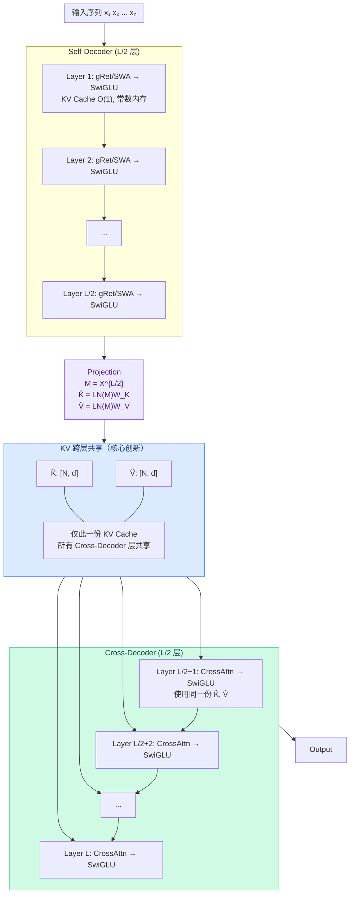
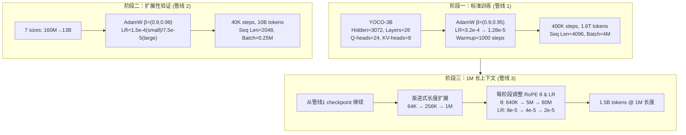
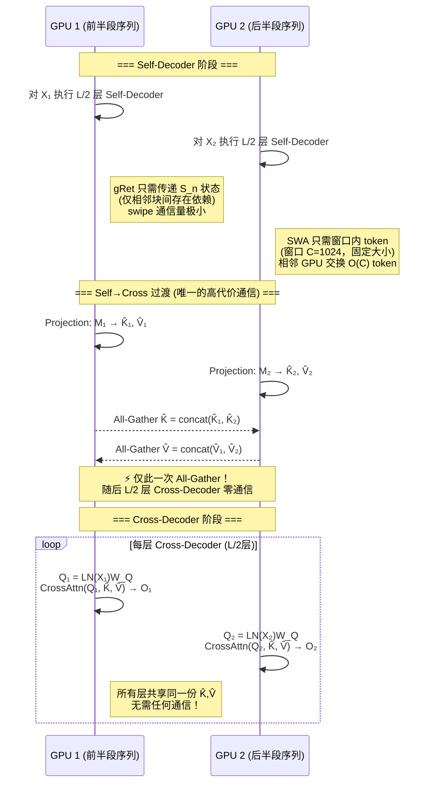
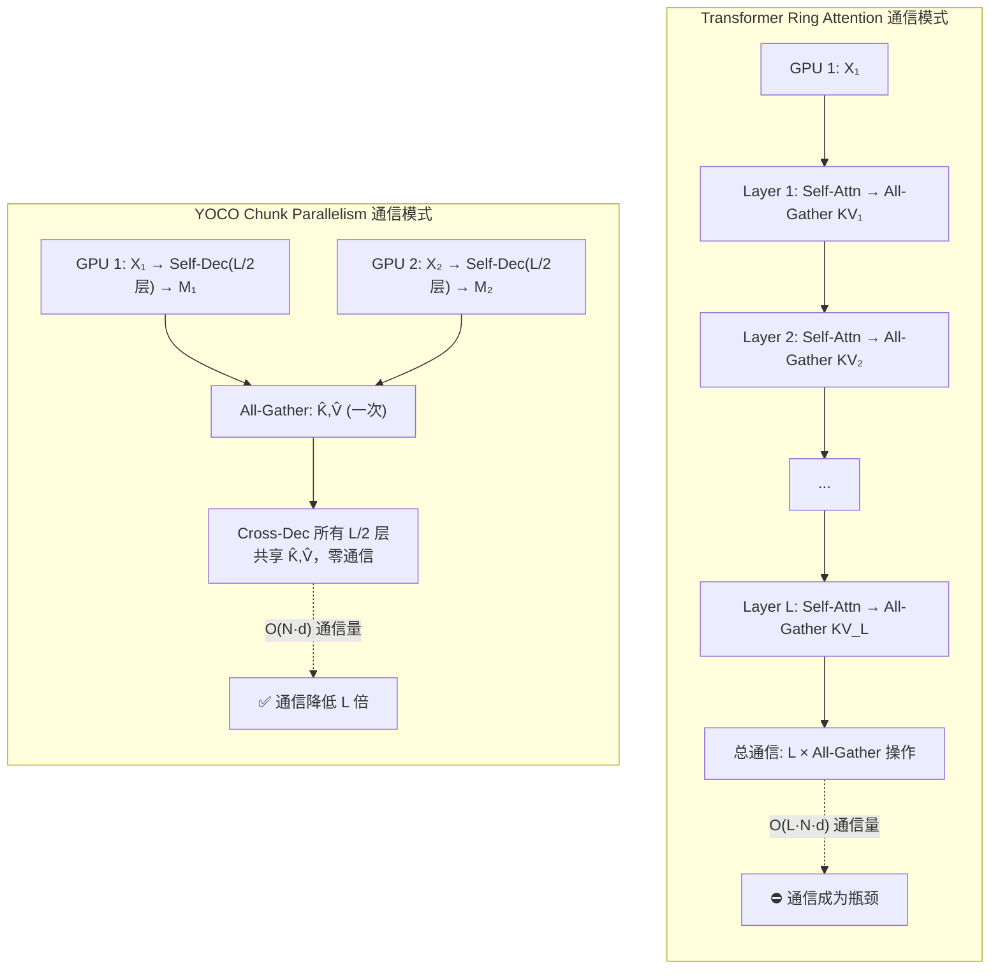
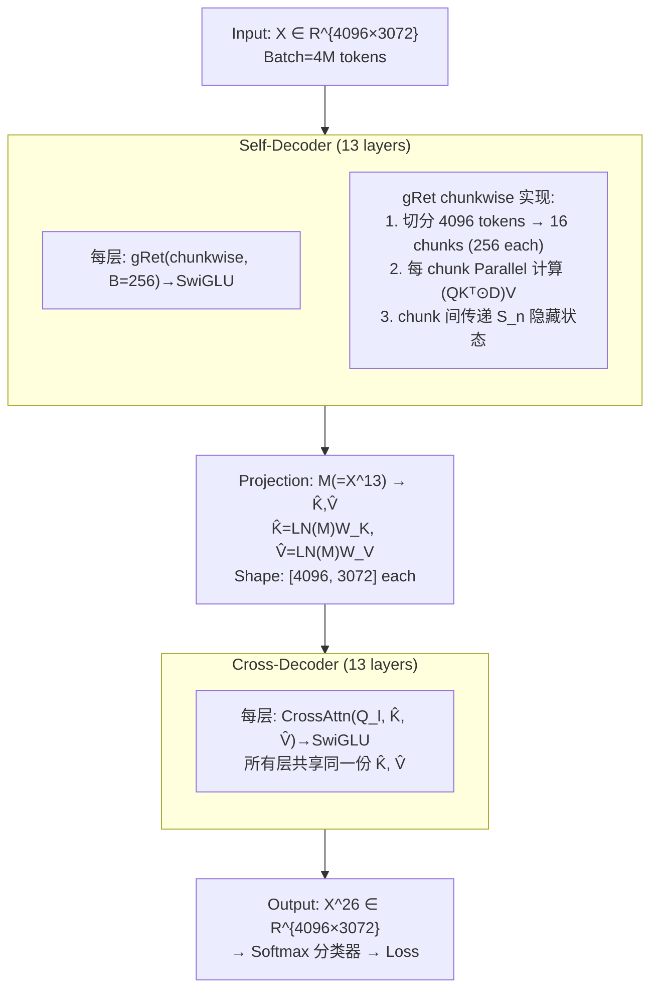
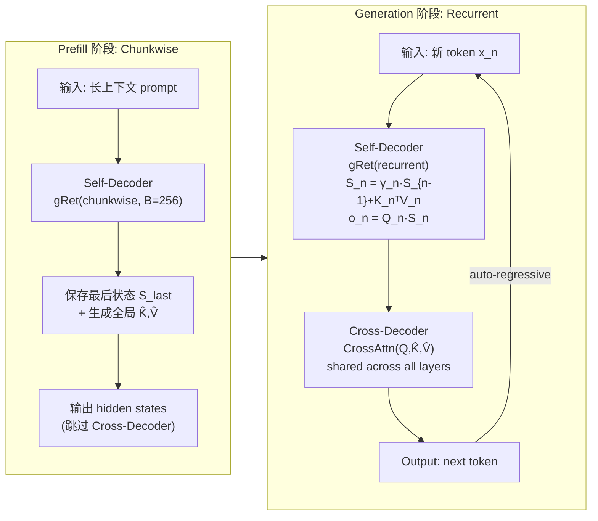

---
tags:
  - 论文分析
  - 模型结构
  - LLM架构
  - Decoder-Decoder
  - KV-Cache优化
  - 长上下文
  - 微软
source: "https://aka.ms/YOCO"
arxiv: "2405.05254v2"
authors: "Yutao Sun, Li Dong, Yi Zhu, Shaohan Huang, Wenhui Wang, Shuming Ma, Quanlu Zhang, Jianyong Wang, Furu Wei"
institutions: "Microsoft Research & Tsinghua University"
created: 2026-07-24
rating: ⭐⭐⭐⭐⭐
---

# YOCO (You Only Cache Once) — Decoder-Decoder 架构深度分析

> **You Only Cache Once: Decoder-Decoder Architectures for Language Models**
> arXiv:2405.05254v2 | 2024-05-08

---

## 一、论文概览

| 属性 | 内容 |
|------|------|
| **标题** | You Only Cache Once: Decoder-Decoder Architectures for Language Models |
| **arXiv** | [2405.05254v2](https://arxiv.org/abs/2405.05254v2) |
| **机构** | Microsoft Research & Tsinghua University |
| **代码** | [https://aka.ms/YOCO](https://aka.ms/YOCO) (官方) + [FLA Triton kernels](https://github.com/sustcsonglin/flash-linear-attention) |
| **核心方向** | 高效 LLM 推理架构设计 |
| **同类工作** | RetNet, Mamba, H3, Jamba, GLA |

### 核心贡献

1. **提出 Decoder-Decoder 架构 YOCO** — 将 LLM 拆分为 Self-Decoder（高效编码全局 KV）和 Cross-Decoder（跨层复用同一份 KV Cache），实现**全程只缓存一次 KV**
2. **Gated Retention (gRet)** — 在 Retention 基础上引入数据控制的门控衰减机制，统一并行/循环/分块循环三种计算范式
3. **推理效率革命** — KV Cache 减少 **80×** (65B)，Prefill 加速 **71.8×** (1M context)，吞吐提升 **9.6×** (512K)
4. **1M 上下文原生支持** — 渐进式长度扩展至 1M token，Needle-in-Haystack 近满分
5. **Chunk Parallelism 分布式训练** — Cross-Decoder 只需一次 All-Gather，大幅降低长序列训练通信开销

---

## 二、技术方法详解

### 2.1 架构设计



**架构核心创新 — KV 跨层共享**：Self-Decoder 每层使用 gRet/SWA（O(1) KV Cache），输出 M 被投影为一组全局 K̂, V̂。Cross-Decoder 所有 L/2 层共享**同一份** K̂, V̂——推理时只需缓存一次，Prefill 也只需计算一次 cross-attention 的 key/value。

#### Self-Decoder

- 使用 **Efficient Self-Attention (ESA)**，推理时 KV Cache 复杂度 O(1)
- Block 结构: `ESA → residual → RMSNorm → SwiGLU → residual`
- Causal masking 确保自回归属性
- 输出 M = X^{L/2} 用于生成全局 KV Cache

#### Cross-Decoder

- Self-Decoder 输出生成全局 KV Cache: K̂ = LN(M)W_K, V̂ = LN(M)W_V
- **所有 L/2 个 Cross-Decoder 层共享同一份 K̂, V̂**
- Cross-attention 支持 GQA，进一步节省 KV Cache
- Block 结构: `CrossAttention → residual → RMSNorm → SwiGLU → residual`

#### 推理优势

| 维度 | Transformer | YOCO |
|------|------------|------|
| **KV Cache 复杂度** | O(N·L) | **O(N + C·L)** ≈ O(N) |
| **KV Cache 节省** | — | **约 L 倍** (层数越多越省) |
| **Prefill 复杂度** | O(L·N²·D) | **O(L·N·D)** (线性) |
| **Prefill 加速** | — | Cross-Decoder 跳过，仅跑一半层 |

### 2.2 Gated Retention (gRet)

gRet 是 YOCO 默认的 Self-Decoder 实现，在 RetNet 基础上引入**数据控制的门控衰减**。

**三种等价计算范式：**

```
1. 并行范式 (训练/prefill)
   Q = (XW_Q)⊙Θ, K = (XW_K)⊙Θ, γ = sigmoid(XW_γ)^(1/τ)
   gRet(X) = (QKᵀ⊙D)V

2. 循环范式 (推理/生成)
   S_n = γ_n·S_{n-1} + K_nᵀV_n
   gRet(X_n) = Q_n·S_n    ← 常数内存，O(1) KV Cache

3. 分块循环范式 (训练/prefill 最佳实践)
   块内并行 + 块间循环，综合并行和循环优势
```

**关键设计：**
- γ = sigmoid(XW_γ)^(1/τ)：**数据控制衰减**，不同 token 有不同的遗忘率
- Head-wise gate（非 element-wise），充分利用 NVIDIA Tensor Core
- Multi-Head: GroupNorm per head + swish gate (`(swish(XW_G)⊙Y)W_O`)

### 2.3 Sliding-Window Attention (SWA)

替代 gRet 的另一种 ESA 选项：
- 窗口大小 C = 1024（实验中）
- KV Cache 复杂度 O(N) → O(C) = 常数
- Simple but effective

### 2.4 Chunk Parallelism 分布式训练

```
GPU 1: X₁ → Self-Dec → M₁  ──┐
                               │  All-Gather KV 一次
GPU 2: X₂ → Self-Dec → M₂  ──┤  (跨层只需一次通信)
                               │
                               ▼
                     K̂, V̂ = Projection(M₁||M₂)
                          ↓
               Cross-Decoder (共享 KV)
```

核心创新：只需**一次 All-Gather** 收集 KV Cache，各 Cross-Decoder 层共享同一份。相比 Transformer 每层都需通信，通信量降低 L 倍。

---

## 三、实验评估

### 3.1 语言建模性能 (3B 模型)

训练配置：Hidden=3072, Layers=26, Q-heads=24, KV-heads=8, 非嵌入参数 2.8B, 训练 1.6T tokens

| 模型 | ARC-C | ARC-E | BoolQ | Hellaswag | OBQA | PIQA | Winogrande | SciQ | Avg |
|------|:-----:|:-----:|:-----:|:---------:|:----:|:----:|:----------:|:----:|:---:|
| **YOCO-3B (1T)** | **0.379** | **0.731** | 0.645 | 0.689 | **0.298** | 0.763 | **0.639** | 0.924 | **0.634** |
| OpenLLaMA-3B-v2 | 0.339 | 0.676 | 0.657 | 0.700 | 0.260 | 0.767 | 0.629 | 0.924 | 0.619 |
| StableLM-3B-4E1T | — | 0.666 | — | — | — | 0.768 | 0.632 | 0.914 | — |
| **YOCO-3B (1.6T)** | 0.413 | 0.747 | 0.638 | 0.705 | 0.300 | 0.773 | 0.651 | 0.932 | **0.636** |
| StableLM-3B-4E1T 1.6T | — | 0.688 | — | — | — | 0.762 | 0.627 | 0.913 | — |

**结论：YOCO 在相同计算量下达到或超越 Transformer 的语言建模性能。**

### 3.2 扩展性曲线 (160M → 13B)

横跨 7 个模型规模（160M, 400M, 830M, 1.4B, 2.7B, 6.8B, 13B），训练 10B tokens：

- **YOCO_gRet 在所有规模上优于 Transformer**
- YOCO_SWA 与 Transformer 持平
- gRet + Attention 的混合归纳偏置具有互补性（类似 Jamba 的发现）

### 3.3 长上下文评估 (1M context)

**Needle-in-a-Haystack：** YOCO-3B-1M 在 1M 上下文中接近完美（>98%）

**Multi-Needle Retrieval (128K length)：**

| 模型 | Size | N=1 | N=2 | N=4 | N=8 |
|------|:----:|:---:|:---:|:---:|:---:|
| **YOCO-3B-1M** | **3B** | **0.98** | **0.98** | **0.84** | **0.56** |
| LWM-1M-text | 7B | 1.00 | 0.90 | 0.76 | 0.62 |
| MiniCPM-128K | 2.4B | 1.00 | 1.00 | 0.54 | 0.56 |
| ChatGLM3-128K | 6B | 0.94 | 0.72 | 0.52 | 0.44 |

**结论：YOCO-3B 以一半参数量达到或超越 7B 长上下文模型的表现。**

### 3.4 推理效率分析

| 指标 | 上下文长度 | Transformer | YOCO | 提升 |
|------|:---------:|:----------:|:----:|:----:|
| **GPU 内存** | 32K | — | **~2× 更少** | 2.0× |
| **GPU 内存** | 1M | 116.6GB | **12.4GB** | **9.4×** |
| **KV Cache/Token** | 65B 模型 | — | — | **80×** |
| **Prefill 延迟** | 32K | — | — | **2.87×** |
| **Prefill 延迟** | 512K | ~180s | **<6s** | **30.3×** |
| **Prefill 延迟** | 1M | ~300s | — | **71.8×** |
| **Throughput** | 512K | 4.5 tok/s | **43.1 tok/s** | **9.6×** |

### 3.5 细粒度 PPL 对比 (160M 模型)

| 模型 | Valid. PPL | AR-Hit PPL | First-Occur PPL |
|------|:---------:|:---------:|:--------------:|
| **YOCO_gRet** | **3.530** | **1.199** | **4.067** |
| YOCO_SWA | 3.553 | 1.202 | 4.094 |
| Transformer | 3.564 | 1.219 | 4.104 |
| gRetNet (standalone) | 3.600 | 1.354 | 4.116 |
| Hybrid H3 | 3.591 | 1.251 | 4.130 |
| RetNet | 3.633 | 1.466 | 4.131 |
| Mamba | 3.645 | 1.555 | 4.126 |

YOCO_gRet 在所有指标上最优，说明 **gRet + Cross-Attention 的混合设计优于纯 SSM/Retention**。

---

## 四、相关论文与工作

### 4.1 同组系列工作 (Microsoft Research)

| 论文 | arXiv | 关系 | 时间 |
|------|-------|------|------|
| **RetNet (Retentive Network)** | [2307.08621](https://arxiv.org/abs/2307.08621) | gRet 的前身，提出 Retention 机制 | 2023-07 |
| **LongNet** | [2307.02486](https://arxiv.org/abs/2307.02486) | 同一团队，Dilated Attention 扩展到 1B tokens | 2023-07 |
| **Long-term Memory Augmented LLMs** | — | KV Cache 索引+RAG 原生支持 (YOCO 未来方向) | 2023 |

### 4.2 高效序列建模 (外部同期工作)

| 论文 | arXiv | 方法 | 与 YOCO 关系 |
|------|-------|------|-------------|
| **Mamba** | [2312.00752](https://arxiv.org/abs/2312.00752) | 选择性 SSM，线性时间 | Table 6 直接对比，Mamba PPL 最差，YOCO 大幅领先 |
| **H3 (Hungry Hungry Hippos)** | [2212.14052](https://arxiv.org/abs/2212.14052) | SSM + Attention 混合 | 与 YOCO 混合设计思路一致，但 YOCO 采用 Decoder-Decoder 而非同层交错 |
| **Jamba** | [2403.19887](https://arxiv.org/abs/2403.19887) | Transformer + Mamba 混合 | 与 YOCO 共享"混合归纳偏置互补"的结论 |
| **GLA (Gated Linear Attention)** | [2312.06635](https://arxiv.org/abs/2312.06635) | 数据控制门控线性注意力 | gRet 的数据控制门控思路与之平行 |
| **GateLoop** | [2311.01927](https://arxiv.org/abs/2311.01927) | 全数据控制线性循环 | 与 YOCO gRet 的 head-wise gate 思路相似 |
| **Zoology** | [2312.04927](https://arxiv.org/abs/2312.04927) | 高效语言模型召回分析 | 分析了 RetNet/Mamba 等模型的召回能力边界 |

### 4.3 推理/训练优化框架

| 框架 | 关系 |
|------|------|
| **flash-linear-attention (FLA)** | YOCO 的 gRet Triton kernel 基于此实现 |
| **vLLM** | 当前标准推理框架，YOCO 式架构可天然整合 PagedAttention |
| **FlashDecoding** | 用于 Transformer 基线，YOCO 在相同优化下仍大幅领先 |
| **Ring Attention / DeepSpeed Ulysses** | 长序列分布式训练方案，YOCO 的 Chunk Parallelism 更高效 |

---

## 五、代码与实现

### 5.1 官方代码

- 链接: [https://aka.ms/YOCO](https://aka.ms/YOCO) (Microsoft Research 官方)
- 包含：模型定义、训练脚本、推理脚本、长上下文扩展脚本
- 基于 gRet + Triton Kernel（基于 FLA 库）

### 5.2 FLA (Flash Linear Attention)

- 仓库: [https://github.com/sustcsonglin/flash-linear-attention](https://github.com/sustcsonglin/flash-linear-attention)
- YOCO 的 gRet Triton kernel 基于此实现
- 提供硬件高效的线性注意力算子（chunkwise 范式）
- 支持：RetNet, GLA, gRet, Mamba 等

### 5.3 训练策略与通信行为深度解析

YOCO 的训练涉及三个关键维度：**gRet 计算范式选择**、**Chunk Parallelism 分布式通信**、以及**多阶段训练策略**（标准训练 → 扩展分析 → 长上下文扩展）。

---

#### 5.3.1 训练全貌：三条训练管线

YOCO 论文执行了三条独立的训练管线，分别服务于不同的验证目标：

| 管线 | 模型规模 | 训练 Tokens | 序列长度 | Batch Size | 目标 |
|------|:------:|:---------:|:------:|:---------:|------|
| **管线 1: 标准训练** | 3B | 1.6T (400K steps) | 4096 | 4M | 验证 YOCO 在充足训练下的建模能力 |
| **管线 2: 扩展曲线** | 160M→13B | 10B (40K steps) | 2048 | 0.25M | 验证 YOCO 跨规模的扩展性 |
| **管线 3: 长上下文扩展** | 3B (from 管线1) | 11.5B (继续训练) | 64K→256K→1M | 4M (保持) | 验证 YOCO 的 1M 上下文能力 |



---

#### 5.3.2 gRet 计算范式：训练用 Chunkwise，推理用 Recurrent

gRet 的核心优势是**三种等价计算范式**，训练和推理可以按需切换，没有任何近似损失：

| 范式 | 适用场景 | 复杂度 | 模式 |
|------|---------|--------|------|
| **Parallel** | 小规模训练 / 短序列 prefill | O(N²) | 全并行矩阵乘，内存密集 |
| **Chunkwise** | 大规模训练 / 长序列 prefill | O(N·B) | Chunk size=256，块内并行 + 块间循环 |
| **Recurrent** | Generation / 推理 decode | O(N) | 状态 S_n 增量更新，**O(1) KV Cache** |

```mermaid
flowchart LR
    subgraph Training["训练/长序列 Prefill: Chunkwise 范式"]
        direction TB
        TC1["输入 X: [N, d]"] --> TC2["切分为 Chunks<br/>Chunk Size B=256"]
        TC2 --> TC3["每个 Chunk 内<br/>Parallel: (QKᵀ⊙D)V"]
        TC3 --> TC4["Chunk 间<br/>Recurrent: S_i = γ_i·S_{i-1} + ..."]
        TC4 --> TC5["输出 O: [N, d]"]
    end

    subgraph Inference["推理 Decode: Recurrent 范式"]
        direction TB
        IR1["输入 x_n: [1, d]"] --> IR2["Q_n = x_n W_Q · Θ_n<br/>K_n = x_n W_K · Θ_n"]
        IR2 --> IR3["S_n = γ_n·S_{n-1} + K_nᵀV_n<br/>(O(1) 状态更新)"]
        IR3 --> IR4["o_n = Q_n·S_n<br/>(O(1) 计算)"]
    end

    Training -.->|"等价（数学证明见Appendix B）"| Inference
```



**Chunkwise 范式的关键参数：**
- Chunk size B = 256（平衡并行度和内存）
- 块内使用 Parallel 范式（Tensor Core 友好）
- 块间使用 Recurrent 范式传递隐藏状态 S
- 相比纯 Parallel：节省 FLOPs；相比纯 Recurrent：减少迭代次数

---

#### 5.3.3 Chunk Parallelism：YOCO 的分布式训练通信机制

这是 YOCO 训练中最有工程价值的设计。当序列长度达到数十万甚至百万 token 时，必须将序列切分到多个 GPU 上（Sequence Parallelism）。YOCO 的架构优势使通信模式相比 Transformer 有本质差异：

**核心洞察：架构解耦 → 通信解耦**



**对比 Transformer 的 Sequence Parallelism (Ring Attention)：**



| 通信维度 | Transformer (Ring Attn) | YOCO (Chunk Parallelism) |
|---------|------------------------|-------------------------|
| **Self-Decoder 通信** | 每层 All-Gather QKV | gRet: 仅传递 S_n 状态 (O(d²)) |
| **Cross-Decoder 通信** | 每层 All-Gather KV | **仅一次** All-Gather 后零通信 |
| **总通信次数** | 2L 次 All-Gather | 1 次 All-Gather + L/2 次微小传递 |
| **通信量级** | O(L·N·d) | **O(N·d)** |
| **GPU 内存碎片** | 每层 KV Cache 分散 | 全局 KV 集中管理 |

---

#### 5.3.4 标准训练管线细节（管线 1：YOCO-3B）

| 参数 | 值 | 说明 |
|------|-----|------|
| **Hidden dim** | 3072 | |
| **Layers** | 26 | Self-Decoder 13 层 + Cross-Decoder 13 层 |
| **FFN dim** | 8192 | SwiGLU |
| **Q-Heads** | 24 | Head dim = 128 |
| **KV-Heads** | 8 | GQA ratio = 3:1 |
| **非嵌入参数** | 2.83B | |
| **Vocab size** | 100,288 | tiktoken-cl100k_base |
| **训练长度** | 4096 | |
| **Batch size** | 4M tokens | |
| **Optimizer** | AdamW | β=(0.9, 0.95), weight_decay=0.1 |
| **LR schedule** | 3.2e-4 → 1.28e-5 | 1000 warmup + linear decay to 5T schedule |
| **总训练步数** | 400K steps | 1.6T tokens |
| **Dropout** | 0.0 | |
| **训练语料** | 类似 StableLM-3B-4E1T | 精选多源语料 |

**训练过程中的 gRet 计算流程：**



---

#### 5.3.5 扩展曲线训练（管线 2）

训练 7 个模型规模（160M→13B），每个训练 40K steps / 10B tokens，序列长度 2048。

| Size | Hidden | Layers | Heads | LR |
|------|--------|--------|-------|------|
| 160M | 768 | 12 | 12 | 1.5e-4 |
| 400M | 1024 | 24 | 16 | 1.5e-4 |
| 830M | 1536 | 24 | 12 | 1.5e-4 |
| 1.4B | 2048 | 24 | 16 | 1.5e-4 |
| 2.7B | 2560 | 32 | 20 | 7.5e-5 |
| 6.8B | 4096 | 32 | 32 | 7.5e-5 |
| 13B | 5120 | 40 | 40 | 7.5e-5 |

> **注意：** Transformer 的 FFN 为 8/3·d，YOCO 的 FFN 为 3·d，以对齐参数量。

---

#### 5.3.6 1M 上下文扩展训练（管线 3）

从 YOCO-3B 的 checkpoint 继续训练，通过**渐进式长度扩展** + **RoPE θ 缩放** + **数据上采样**逐步扩展上下文窗口。

```mermaid
gantt
    title YOCO 渐进式 1M 上下文扩展策略
    dateFormat X
    axisFormat %s
    
    section 阶段 1: 64K
    Seq Len = 65,536     :a1, 0, 100
    RoPE θ = 640,000     :a2, 0, 100
    LR = 8×10⁻⁵          :a3, 0, 100
    Tokens = 6B          :a4, 0, 100

    section 阶段 2: 256K
    Seq Len = 262,144    :b1, 100, 180
    RoPE θ = 5,000,000   :b2, 100, 180
    LR = 4×10⁻⁵          :b3, 100, 180
    Tokens = 4B          :b4, 100, 180

    section 阶段 3: 1M
    Seq Len = 1,048,576  :c1, 180, 250
    RoPE θ = 80,000,000  :c2, 180, 250
    LR = 2×10⁻⁵          :c3, 180, 250
    Tokens = 1.5B        :c4, 180, 250
```



**1M 训练的关键策略：**

| 维度 | 策略 |
|------|------|
| **渐进式长度** | 64K → 256K → 1M，每阶段让模型逐步适应更长上下文 |
| **RoPE θ 缩放** | 每阶段放大 RoPE base θ：640K → 5M → 80M，保证高频位置编码不退化 |
| **LR 衰减** | 每阶段降低学习率：8e-5 → 4e-5 → 2e-5，防止长序列梯度不稳定 |
| **数据上采样** | 根据序列长度对长文本提高采样率（参考 [FPN+ 24]），确保有效训练信号 |
| **无长指令微调** | 公平对比，不使用长指令调优数据 |
| **Chunk Parallelism** | 1M 阶段使用 Appendix A 的 Chunk Parallelism 降低通信开销和显存碎片 |

---

#### 5.3.7 推理阶段的 gRet 范式切换

训练完成后，推理时 gRet 无缝切换到 Recurrent 范式，实现 **O(1) KV Cache**：



**关键：Prefill 时 Cross-Decoder 被完全跳过** — 这是 YOCO 实现 30× 以上 prefill 加速的根本原因。Cross-Decoder 的输出不影响全局 KV Cache 的生成，计算依赖图天然支持提前退出。

---

#### 5.3.8 实践建议

**训练：**
1. **默认使用 gRet + Chunkwise B=256** — 论文在所有训练管线中均使用此配置
2. **长序列训练必须启用 Chunk Parallelism** — 当 seq_len > 32K 时，通信成为瓶颈，Chunk Parallelism 降低 L 倍 All-Gather 次数
3. **渐进式长度扩展优于一次性扩展** — 1M 训练从 64K 起步，三步到位，避免训练不稳定
4. **RoPE θ 缩放随长度线性放大** — θ 从 640K (64K seq) 到 80M (1M seq)，约 125× 放大

**推理：**
5. **Prefill 阶段：Chunkwise 范式 + 跳过 Cross-Decoder**，实现 O(N) prefill
6. **Decode 阶段：Recurrent 范式**，Self-Decoder 保持 S_n 状态，Cross-Decoder 使用共享的 K̂,V̂
7. **Triton Kernel 基于 FLA 库**，chunk size=256，硬件高效

---

## 六、亮点与局限

### 亮点

- **架构创新突出** — Decoder-Decoder 设计是 LLM 架构范式的突破性思考，将 "cache once" 从口号变成可验证的理论
- **推理效率飞跃** — 80× KV 减少 + 71.8× Prefill 加速是数量级级别的提升，非渐进式改进
- **质量一致性** — 在多个规模（160M→13B）和训练 token 量（1T→1.6T）上验证了与 Transformer 持平甚至更优的建模能力
- **1M 原生上下文** — 无需 special position encoding hack，架构本身支持极长上下文
- **Chunk Parallelism** — 训练通信只 All-Gather 一次，对长序列分布式训练有本质优势
- **混合归纳偏置** — gRet (线性注意力) + Cross-Attention (全局注意力) 的组合被证明优于纯 SSM/纯 Attention

### 局限

- **未开源完整模型权重** — 截至分析时，YOCO-3B 的模型权重尚未在 HuggingFace 公开发布
- **代码可获取性受限** — 官方代码链接 (aka.ms/YOCO) 在不同地区访问不稳定
- **仅验证 3B 规模** — 最大实验模型为 3B，更大规模（30B+）的效果和推理优势属于外推
- **gRet 的硬件效率未充分分析** — Triton kernel 的 MFU 未与 FlashAttention-2 直接对比
- **Zero-SCROLLS 长上下文基准** — 论文附录显示 YOCO 在长文本理解（Qasper, NarrativeQA）上提升幅度不如 Needle Retrieval 显著
- **未讨论 MoE 扩展** — YOCO + MoE 的推理效率收益未探讨

---

## 七、个人评价

YOCO 是 2024 年最具启发性的 LLM 架构论文之一。它的核心洞察 — **既然 KV Cache 是推理瓶颈，为什么不干脆只缓存一次？** — 简单优雅，但需要 Decoder-Decoder 这种架构重构才能实现。

与 Mamba/H3 等 SSM 路线不同，YOCO **不抛弃 Attention**，而是通过 Cross-Attention 保留全局上下文建模能力，同时用 gRet 解决 Self-Decoder 的缓存膨胀问题。这种"混合而不牺牲"的设计哲学更为务实。

**关键启示：**
1. "Attention is all you need" 的反面不是"不要 Attention"，而是**给 Attention 一个合理的缓存预算**
2. Decoder-Decoder 架构使 **Prefill 加速成为架构特性而非工程优化**，这是相比 vLLM/FlashDecoding 等工程优化的本质优势
3. YOCO 的 Chunk Parallelism 对长序列训练的通信优化，可能在万卡集群上价值比推理加速更大
4. 如果 YOCO + BitNet + Groq 真如论文所展望的那样组合，**端侧部署 100B+ 模型可能不再是幻想**

**推荐指数：⭐⭐⭐⭐⭐** — 必读论文，尤其对于关注 LLM 推理效率和下一代架构的研究者和工程师。

---

## 参考文献

1. Yutao Sun et al. "You Only Cache Once: Decoder-Decoder Architectures for Language Models." arXiv:2405.05254, 2024.
2. Yutao Sun et al. "Retentive Network: A Successor to Transformer for Large Language Models." arXiv:2307.08621, 2023.
3. Albert Gu, Tri Dao. "Mamba: Linear-Time Sequence Modeling with Selective State Spaces." arXiv:2312.00752, 2023.
4. Tri Dao et al. "Hungry Hungry Hippos: Towards Language Modeling with State Space Models." arXiv:2212.14052, 2022.
5. Opher Lieber et al. "Jamba: A Hybrid Transformer-Mamba Language Model." arXiv:2403.19887, 2024.
6. Songlin Yang et al. "Gated Linear Attention Transformers with Hardware-Efficient Training." arXiv:2312.06635, 2023.
7. Songlin Yang, Yu Zhang. "FLA: A Triton-based library for hardware-efficient implementations of linear attention mechanism." https://github.com/sustcsonglin/flash-linear-attention, 2024.
8. Jiayu Ding et al. "LongNet: Scaling Transformers to 1,000,000,000 Tokens." arXiv:2307.02486, 2023.
9. Hao Liu et al. "Ring Attention with Blockwise Transformers for Near-Infinite Context." arXiv:2310.01889, 2023.
10. Simran Arora et al. "Zoology: Measuring and Improving Recall in Efficient Language Models." arXiv:2312.04927, 2023.
