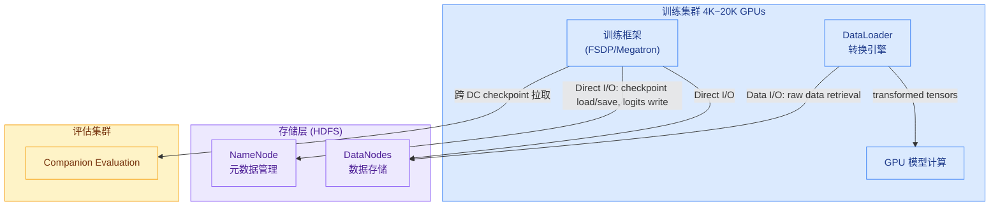
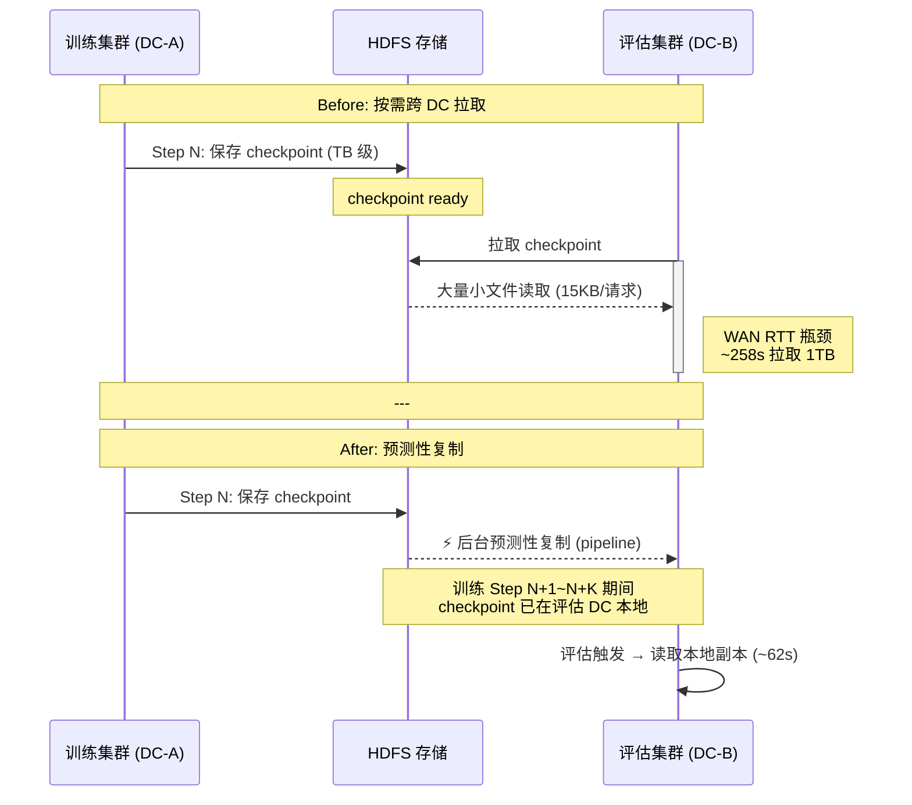
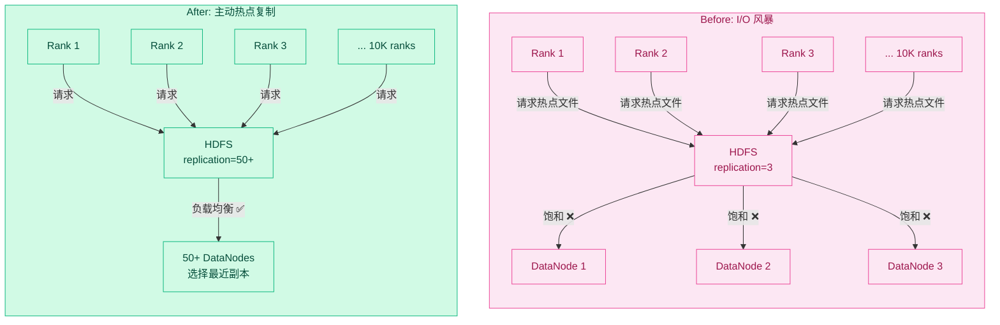
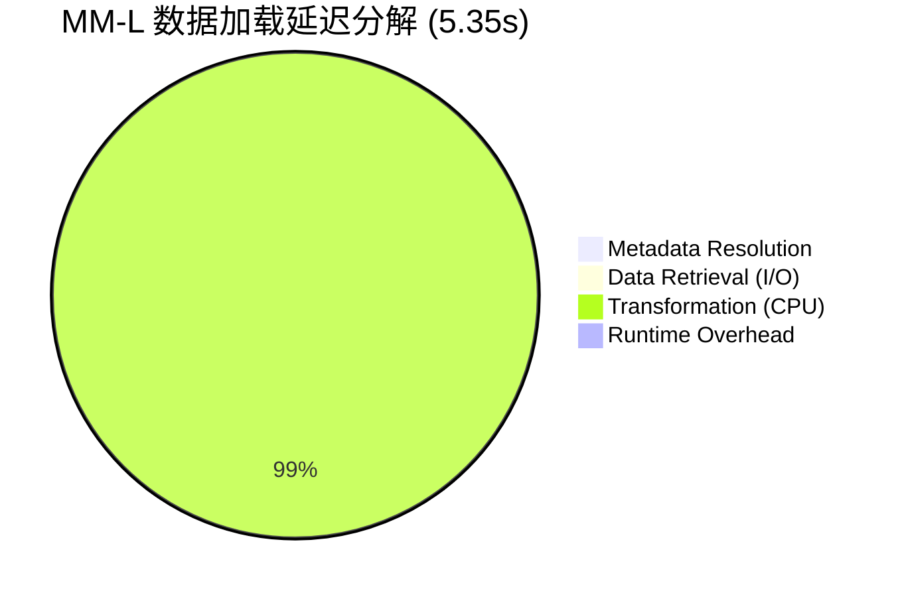
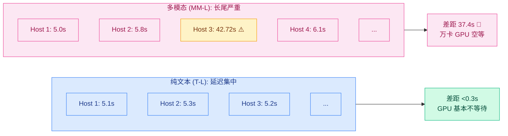
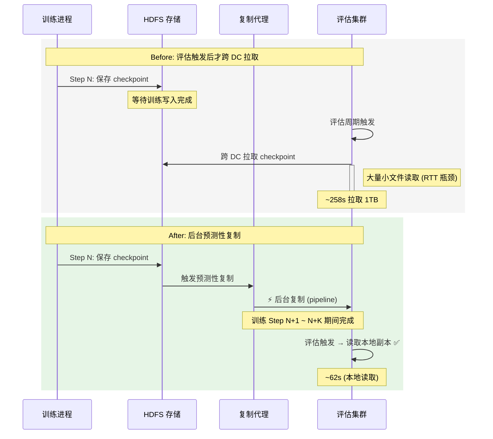
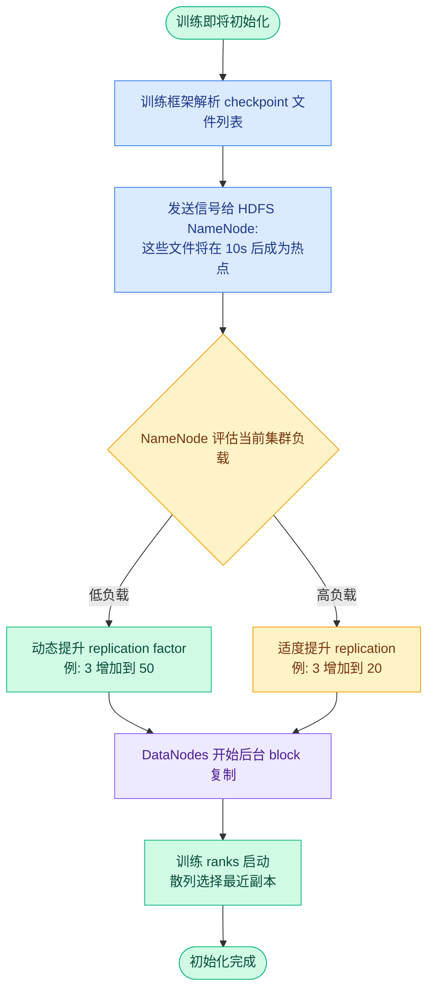
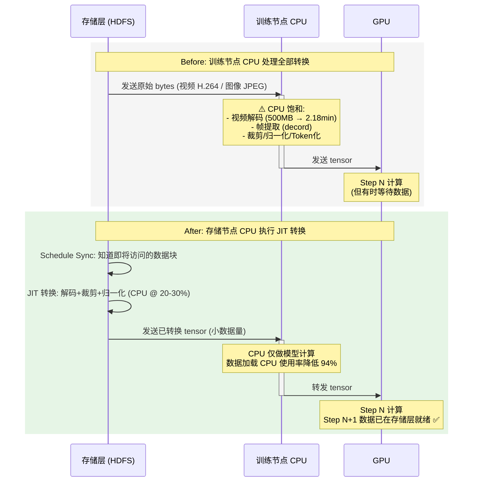
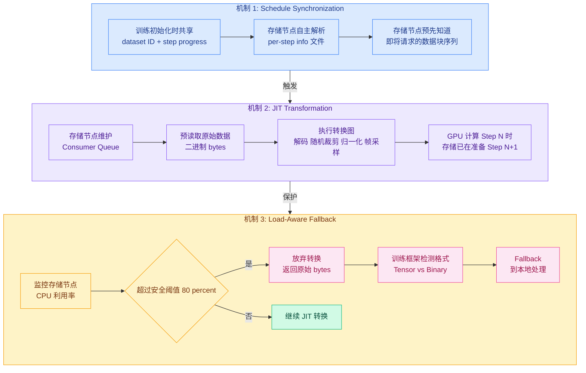
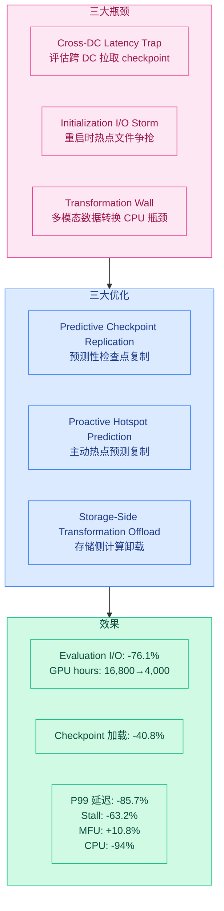

---
tags:
  - 论文分析
  - 训练系统
  - 存储系统
  - 数据管道
  - ByteDance
source: https://www.usenix.org/system/files/osdi26-chen-luofan.pdf
authors: Luofan Chen, Chenhan Wang, Weidong Zhang, Jinxin Chi, Hequan Zhang, Zanbo Wang, Chenyuan Wang, Lishu Luo, Sijin Wu, Junqi Hu, Jun Wang, Cheng Chen, Lixin Huang, Liyang Zhao, Yong Tian, Jun Guo, Youhui Bai, Wencong Xiao, Kang Chen, Cheng Li
institutions: USTC, ByteDance Seed, ByteDance, Tsinghua University
venue: OSDI 2026
created: 2026-07-27
rating: ⭐⭐⭐⭐⭐
---

# ByteDance LLM 预训练数据管道 深度技术分析 (OSDI 2026)

> **Teaching The Old Dog New Tricks: Building Efficient Data Pipelines for Large-Scale LLM Pre-training**

## 一、论文概览

| 属性 | 内容 |
|------|------|
| **标题** | Teaching The Old Dog New Tricks: Building Efficient Data Pipelines for Large-Scale LLM Pre-training (Operational Systems) |
| **会议** | OSDI 2026 (20th USENIX Symposium on Operating Systems Design and Implementation) |
| **机构** | USTC（中国科学技术大学）+ ByteDance Seed + ByteDance + Tsinghua University |
| **代码/数据** | 论文称将发布匿名化 traces（尚未发布） |
| **核心问题** | 大规模 LLM 预训练中数据管道的 I/O 瓶颈 |
| **存储系统** | HDFS（Hadoop Distributed File System） |

### 核心贡献

1. **系统刻画**：基于 30,000 个训练作业、90 天的生产 traces，揭示了预训练数据访问的三个此前未被充分报道的瓶颈：跨数据中心延迟陷阱、初始化 I/O 风暴、多模态转换墙
2. **三种软件定义优化**：
   - **Predictive Checkpoint Replication**（预测性检查点复制）：将 companion evaluation 的 I/O 时间减少 76.1%
   - **Proactive Hotspot Prediction**（主动热点预测）：将检查点加载时间减少 40.8%
   - **Storage-Side Transformation Offloading**（存储侧转换卸载）：将数据加载停顿减少 63.2%
3. **通用性论证**：证明这些优化不是系统特定的，而是解决了 LLM 时代的基础架构不匹配问题，适用于传统和现代存储系统

---

## 二、技术方法详解

### 2.1 预训练数据管道架构

论文的生产环境中，训练系统采用 HDFS 作为底层存储骨干（支持 EB 级数据），数据管道由两部分组成：

**三个执行阶段的 I/O 特征：**

| 阶段 | I/O 行为 | 关键特征 |
|------|---------|---------|
| **初始化 (Initialization)** | 同步加载完整 checkpoint | 数千 workers 同时请求少量热点文件，引发 I/O 风暴 |
| **迭代训练 (Iterative Training)** | DataLoader 异步预取 + checkpoint 定期持久化 | 持续读写，但主要是异步后台 |
| **Companion Evaluation** | 跨 DC 拉取最新 checkpoint + benchmark 数据集 | 与训练并行，在不同集群上执行 |

### 2.2 三大瓶颈的深度剖析

#### 瓶颈 1：Cross-DC Latency Trap（跨数据中心延迟陷阱）

**现象**：Companion evaluation 需要在远程数据中心加载最新 checkpoint。虽然 checkpoint 总大小为数 TB（分片后每片 ~100MB），但评估过程需要先读取大量小张量元数据，导致受 RTT 限制而非带宽限制。

**量化数据**：
- 使用 P2P 方式跨 DC 拉取 1TB checkpoint 需要约 258 秒
- 其中 metadata-intensive small reads（平均 15KB/请求）占主导
- 评估周期浪费 16,800 GPU hours → 优化后降至 4,000

**根因**：Safetensor 格式将每个 tensor 存为独立文件 → 大量小文件读取 → WAN RTT 成为瓶颈而非带宽

**跨 DC 交互时序（Before vs After）：**

#### 瓶颈 2：Initialization I/O Storm（初始化 I/O 风暴）

**现象**：训练频繁重启（debugging、failure recovery），重启时所有 workers 同步加载 checkpoint，争抢同一组热点文件（global metadata、shared embedding）。

**量化数据**：
- 不同 trace 的 checkpoint 加载时间：T-S 137.58s，MM-S 300.33s（初始值）
- 数千 workers 同时请求 → 存储节点饱和 → 尾延迟阻塞整个集群

**根因**：HDFS 的 gang scheduling 效应 — 所有 ranks 作为 barrier 同步启动，最慢的 rank 决定整个集群的启动时间

**I/O 风暴 vs 主动复制的对比：**

#### 瓶颈 3：Transformation Wall（多模态转换墙）

**现象**：多模态训练中，CPU 上的数据转换（视频解码、图像处理）成为瓶颈，GPU 等待数据。

**量化数据**：
- 转换占数据加载总时间的 **94.4%**（MM-L trace：5.05s of 5.35s）
- I/O 读取本身仅 13.6ms（可忽略）
- 最长宿主需 42.72s 处理单个 batch，平均仅 5.35s → 37.4s 的 straggler gap
- 单个极端 case：500MB H.264 视频解码需 2.18 分钟
- 每天浪费超过 10,000 GPU hours

**根因**：训练节点 CPU 被模型计算和媒体处理双重饱和，而存储节点 CPU 利用率仅 20-30%（等待 I/O 中断）

**转换时间分解（MM-L trace）：**

**多模态 straggler 效应：**

### 2.3 三种优化方案详解

#### 优化 1：Predictive Checkpoint Replication（预测性检查点复制）

**核心思路**：Companion evaluation 有固定的周期（每 N steps），因此可以**提前**将最新 checkpoint 复制到评估集群所在的数据中心。

**预测性复制泳道图（Before vs After）：**

**Signal-Driven Prioritization**：当训练检测到异常（loss spike、quality degradation）时，触发紧急评估信号，分配带宽优先完成关键检查点复制。

**效果**：Companion evaluation I/O 时间减少 **76.1%**，GPU hours 浪费从 16,800 降至 4,000。

#### 优化 2：Proactive Hotspot Prediction（主动热点预测）

**核心思路**：训练框架在 checkpoint 加载前将热点文件列表**提前通知**存储系统，存储层主动复制这些文件以分散 I/O 压力。

**主动热点复制机制：**

**复制因子调整的决策流程：**

**关键设计考量**：
- 论文排除了 P2P 方案（如 NCCL、UCX），因为 P2P 的全对全流量会干扰同集群其他训练任务的 NCCL collectives
- 选择 hierarchical client-server 模型以保证确定性的 SLA
- 热点预测是基于 workload determinism — 训练脚本执行路径是确定的

**效果**：Checkpoint 加载时间减少 **40.8%**（MM-S：300.33s → 优化后数值）

#### 优化 3：Storage-Side Transformation Offload（存储侧转换卸载）

**核心思路**：利用存储节点上闲置的 CPU 资源执行数据转换（解码、裁剪、归一化），将存储层升级为 **Disaggregated Pre-processing Engine**。

**存储侧转换卸载泳道图（Before vs After）：**

**三个核心机制详解：**

1. **Schedule Synchronization** — 训练初始化时共享 dataset ID 和 step progress，存储节点自动解析后续数据块序列
2. **Just-in-Time (JIT) Transformation** — 存储节点维护 Consumer Queue，预读取原始数据并执行转换图（解码、random crop、归一化），GPU 计算 Step N 时存储已在准备 Step N+1 的 tensor
3. **Load-Aware Fallback** — 存储节点 CPU 超过安全阈值（80%）时，放弃转换返回原始 bytes，训练框架检测格式后 fallback 到本地处理

**为何不用离线转换？** 论文给出了两个核心理由：
- **存储膨胀**：解码后视频膨胀 40×+，图像膨胀数倍，PB 级数据解码后需要 EB 级存储
- **缺乏灵活性**：转换参数（crop size、frame count、resolution）随模型变化，任何改动都需要重新生成整个数据集

**为何不用专用转换集群（如 tf.data service、Ray Data）？** 
- **网络放大**：解码后 tensor 膨胀 50-100×，传输会饱和数据中心网络
- **资源弹性差**：专用集群需要在多模态高峰时保有大容量，在纯文本训练时闲置

**效果**：
- P99 data loading latency 降低 **85.7%**
- Training stall 减少 **63.2%**
- MFU 相对提升 **10.8%**
- Training host 数据加载 CPU 使用率降低 **94%**

---

## 三、实验评估

### 3.1 生产环境数据集

论文从 30,000 个训练作业中选择 5 个代表性任务，覆盖 70% 的总 GPU hours：

| Trace | 策略 | 类型 | Checkpoint Size | 集群规模 |
|-------|------|------|----------------|---------|
| T-S (Text Small) | FSDP2 | 纯文本 | ~1-5 TB | ~4K GPU |
| T-L (Text Large) | Megatron | 纯文本 | ~5-10 TB | ~4K GPU |
| MM-S (MultiModal Small) | FSDP | 多模态 | ~1-5 TB | ~4K GPU |
| MM-L (MultiModal Large) | FSDP2 | 多模态 | ~1-5 TB | ~10K GPU |
| MM-O (MultiModal Omni) | FSDP | 多模态 | ~5-10 TB | ~20K GPU |

### 3.2 I/O 特征量化

| 指标 | T-S | T-L | MM-S | MM-L | MM-O |
|------|:---:|:---:|:----:|:----:|:----:|
| **Data Loading Latency (s)** | 5.77 | 5.51 | 8.64 | 5.29 | 6.16 |
| **Read Checkpoint Latency (s)** | 137.58 | 0.01* | 300.33 | 139.25 | 106.83 |
| **Save Checkpoint Latency (s)** | 56.27 | 25.74 | 106.83 | 68.31 | 128.60 |
| **Step Time (s)** | 14.03 | 8.27 | 19.20 | 18.17 | 14.39 |

*\* T-L 的 checkpoint read latency 异常低（0.01s），可能因为 Megatron 的 checkpoint 已被预加载*

### 3.3 优化效果汇总

| 优化 | 指标 | 优化前 | 优化后 | 提升 |
|------|------|:------:|:------:|:----:|
| Predictive Checkpoint Replication | Evaluation I/O 时间 | 258s | ~62s | **-76.1%** |
|  | 每次评估浪费 GPU hours | 16,800 | 4,000 | **-76.2%** |
| Proactive Hotspot Prediction | Checkpoint 加载时间 | 300.33s | ~177s | **-40.8%** |
| Storage-Side Transformation Offload | P99 Data Loading Latency | - | - | **-85.7%** |
|  | Training Stall | - | - | **-63.2%** |
|  | MFU 提升 | - | - | **+10.8%** |
|  | Host CPU 使用率 | - | - | **-94%** |

---

## 四、亮点与局限

### 亮点

1. **来自真实生产环境的数据**：30K traces、90 天、4K-20K GPU、EB 级存储 — 这个规模在公开文献中极为罕见
2. **Workload determinism 的核心洞察**：预训练的执行路径是确定性的 — 训练脚本固定、数据访问顺序固定、checkpoint 周期固定。这一洞察是三个优化的共同基础
3. **不完美的现实选择**：使用 HDFS 而不是 3FS/AIStore 等 AI-native 存储，是基于 data gravity 的现实决策 — EB 级数据的迁移成本极高。论文证明了"旧系统 + 软件优化"可以满足 LLM 训练需求
4. **存储侧计算的巧妙利用**：20-30% 的存储节点 CPU 利用率是"已经付过钱但闲置"的资源，offloading 转换任务到存储侧几乎零边际成本
5. **优雅的 fallback 设计**：Load-aware fallback 确保存储节点 CPU 过载时不会影响核心存储功能

### 局限

1. **依赖 HDFS 特定的架构**：Predictive replication 和 Proactive hotspot prediction 依赖 HDFS 的 NameNode + DataNode 架构和动态 replication factor 调整能力 — 对象存储（S3、Azure Blob）不一定支持相同的复制语义
2. **Storage-side offload 的假设前提**：存储节点必须有闲置 CPU。对于云对象存储（S3）或 lean storage appliances，这一假设不成立
3. **未开源代码/数据**：论文称"将发布匿名化 traces"，但截至分析时尚未发布，无法复现或进一步研究
4. **评价的通用性受限**：Companion evaluation 是 ByteDance 特有的做法 — 并非所有组织都有独立的 evaluation 集群
5. **查询层面的优化为主**：三个优化都集中在读取路径，对 checkpoint 写入性能的优化（如 FastPersist、ByteCheckpoint）讨论较少

---

## 五、个人评价

这是一篇典型的 **OSDI 系统论文**：来自产业界（ByteDance）的大规模生产环境经验，以严谨的 trace 分析驱动问题发现，用简单的软件优化解决复杂的架构问题。

**最大的价值**不在于三个优化本身（单独看每个优化都不是完全新的 idea — 预取、复制、卸载都是成熟技术），而在于**系统性的问题刻画和优化间的协同**：作者首先证明了"旧系统（HDFS）+ 新需求（LLM training）"之间存在三个根本性的架构不匹配，然后用三组针对性优化展示了**在应用层暴露 workload determinism 可以弥补架构鸿沟**。这比"换一个 AI-native 存储系统"更务实。

**"What If" 讨论（Section 6）** 是全篇最精彩的章节之一 — 逐一反驳了 P2P 分发、专用转换集群、AI-native 存储三个"显而易见"的替代方案，每个反驳都有扎实的工程理由（多租户干扰、网络放大、数据重力）。这种"我们试过了但没选"的透明讨论在学术论文中非常罕见。

如果你在做 LLM 训练的存储基础设施，这篇论文提供了一个**实用主义的工程哲学**：不要被 AI-native 系统的 hype 迷惑，在现有基础设施上通过暴露应用层语义，可以实现 80-90% 的收益。

| **评分**：⭐⭐⭐⭐⭐（OSDI 级别的系统贡献，来自生产环境的第一手经验，数据翔实，逻辑严谨）

---

### 附：三大优化全景图

