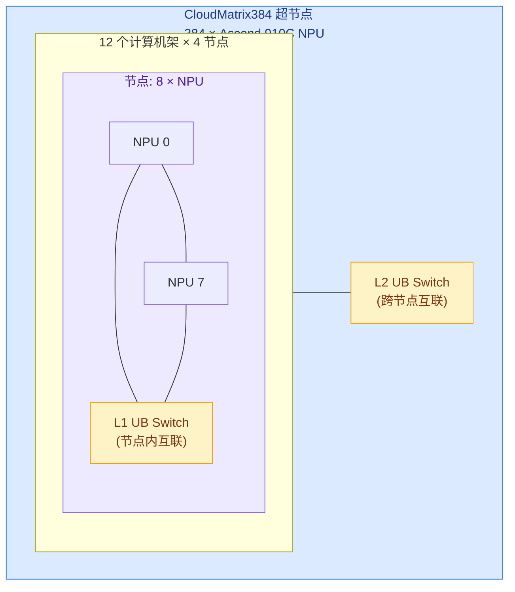
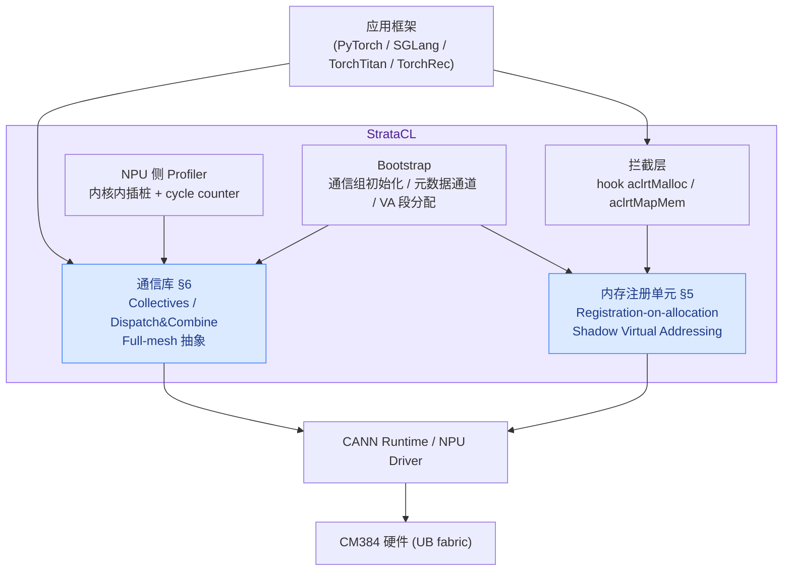
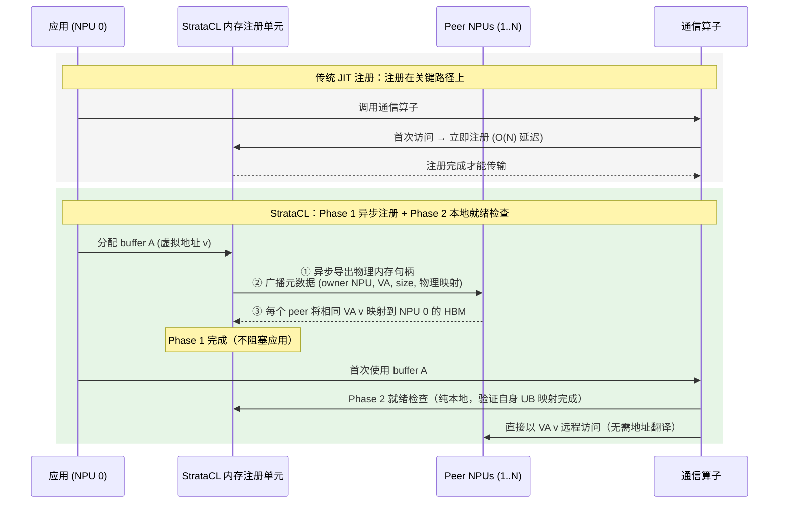
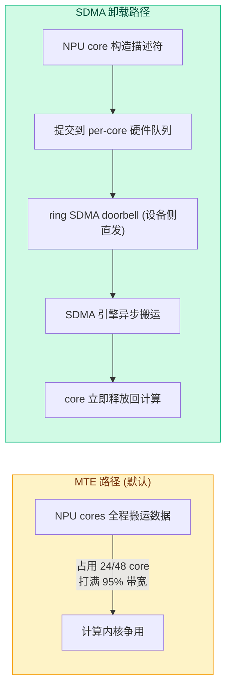

---
tags:
  - 论文分析
  - 训练系统
  - 通信优化
  - 超节点
  - 华为昇腾
source: https://arxiv.org/abs/2607.26444
arxiv: 2607.26444
authors: [Tiancheng Hu, Jin Qin, Yuzheng Wang, Ke Liu, TangShengsheng Li, Sheng Wang, Zhongzhe Hu, Tianlun Hu, Wei Wang, Lijun Li, Jingbin Zhou, Xiaoming Bao, Hongwei Sun, Jieru Zhao, Huimin Cui, Tao Xie, Chenxi Wang]
institutions: [北京大学, 中科院计算所 SKLP, 中国科学院大学, 上海交通大学, 华为]
created: 2026-08-11
rating: ⭐⭐⭐⭐
venue: arXiv 2026-07
open_source: false (论文声明源码将在发表后开源，目前无公开仓库)
---

# StrataCL 深度技术分析：面向生产超节点的 Fabric 原生通信库

## 一、论文概览

| 属性 | 内容 |
|------|------|
| **标题** | StrataCL: Fabric-Native Communication Library for Production Supernodes |
| **arXiv** | [2607.26444](https://arxiv.org/abs/2607.26444) (v1, 2026-07-29) |
| **机构** | 北京大学 + 中科院计算所 SKLP + 国科大 + 上海交通大学 + 华为 |
| **平台** | 华为 CloudMatrix384（UB fabric 超节点），原型验证于 NVIDIA DGX B200 |
| **代码** | 未开源（"The source code will be released upon publication"） |
| **规模** | ~21K 行 Ascend C/C++ + 5K 行 Python；集成 PyTorch / SGLang / TorchTitan / TorchRec |

### 核心贡献

1. **Registration-on-allocation**：截获内存分配 API，在后台异步完成用户缓冲区的远程可达注册，把注册开销彻底移出通信关键路径，且兼容 VMM API 分配器（如 PyTorch expandable-segment allocator），零侵入框架。
2. **Shadow virtual addressing（影子虚拟寻址）**：为每个 NPU 分配互不重叠的虚拟地址段，使同一缓冲区在所有 NPU 上可见为相同虚拟地址，通信算子无需做 peer-to-peer 地址翻译。
3. **Fabric 原生通信算子**：full-mesh 编程抽象 + 负载均衡的 NPU-core 分区（最小 makespan + per-peer fan-out 上限，LPT 近似调度）+ NPU 驱动 SDMA 卸载，分别解决同步开销、core 级长尾、以及计算-通信重叠下的 core 争用。

### 关键成果

| 指标 | 提升 |
|------|------|
| Collective bus bandwidth | 最高 **1.6×**（vs HCCL-zerocopy，中小报文） |
| MoE dispatch/combine bus bandwidth | 最高 **1.4×**（vs CANN EP zerocopy，+22.6%~36.7%） |
| LLM 推理吞吐（DS V4 Flash, 192 dies） | **1.9×** vs HCCL，1.6× vs HCCL-zerocopy |
| P99 TTFT / P99 TPOT（15 req/s） | 降低 **2.2×** / 1.1× |
| LLM 训练迭代时间（DS V3.2 671B, 512 dies） | 降低 **1.4×**（-18%~24% vs HCCL-zerocopy） |
| Recsys 训练迭代时间（DLRM, 128 dies） | 降低 **1.3×**（~23% vs HCCL） |

---

## 二、背景与动机

### 2.1 问题：通信库的 buffer-centric 架构

分布式 LLM 中通信算子占端到端时间 10%~40%（推理）和 30%~45%（训练），随规模扩大通信/计算比可超 50%。主流通信库（NCCL / HCCL / RCCL）路径本质是 **buffer-centric**：用户缓冲区由应用框架（PyTorch、SGLang）分配，通信缓冲区由通信运行时单独管理，二者分离导致：

- **冗余暂存拷贝**：AllGather 跨 N 个 rank、每 rank M 字节时，HCCL 需先把每个用户输入 buffer 拷入内部通信 buffer，再把聚合的 N·M 字节拷回用户输出 buffer，产生 (1+N)·M 字节的 staging 流量；
- **昂贵的用户缓冲区注册**：RDMA 注册需 pin 页、经 PCIe BAR 建 DMA 映射、创建 MR 元数据并在 rank 间交换，可达数毫秒，在 MoE 这类动态分配场景下甚至抵消 zero-copy 收益。

### 2.2 超节点带来的新机会（以 CloudMatrix384 为例）

**CM384 关键特性：**

1. **高带宽低延迟**：UB fabric 提供近 400 GB/s 带宽、纳秒级远程 HBM 访问延迟，拉近了远程与本地 HBM 的差距——用户 buffer 与内部通信 buffer 之间的拷贝占比显著上升，用户 buffer 直通通信收益巨大。
2. **全局统一物理地址空间**：所有 NPU 的 HBM 物理地址被映射进统一的 UB 地址空间，本地虚拟地址直接映射到远程 HBM 物理页即可访问，注册流程比 RDMA 简单一个数量级（实测平均 **9× 快**）。

**Ascend 910C 硬件视角**：每颗 910C 是双 die 封装，SIO 互联 540 GB/s；每个 die 24 个 AI Core（各含 1 个 Cube 单元 + 2 个 Vector Core/AIV），通信内核跑在 AIV 上；每 die 64 GB HBM @ 1.6 TB/s；另有 SDMA 引擎支持 NPU 间数据搬运（默认经主机 API 启动）。

### 2.3 三条关键观察（Motivation）

**观察 1：JIT 注册既不便宜也不可扩展。** UB 注册虽降到微秒级，但每次 mapping 要拿写侧 page-table 锁，同 rank 的 per-peer 映射必须串行，注册 N-rank 通信组约为 O(N) 延迟/rank。缓存只能缓解静态模式；MoE 推理的 dispatch buffer 大小随 batch 动态变化，JIT 注册反复回到关键路径。预注册大内存池的方案则造成 HBM 碎片税：DS V4 Flash 推理每 die 损失 1-2 GiB，DS V3.2 671B 训练损失 3-4 GiB（禁用 expandable segments 时），直接压降 batch size。

**观察 2：同步开销取代传输成为新瓶颈。** ring / PAT / recursive halving-doubling 等多步算法在 RDMA 集群有效，但在 UB 上多步间的累计同步开销在小报文下占主导。full-mesh 单逻辑步完成：<1 MiB 时平均快 2×+，64 KiB 处最高 **4.5×**（ring 在 64 KiB 时同步占端到端 ~77%）；>16 MiB 后 ring 反超。

**观察 3：NUMA 长尾 + core 争用。** UB 两级拓扑带来非均匀访问（die-to-die 210 GB/s@0.2µs vs 节点内 170 GB/s@0.7µs vs 跨节点 150 GB/s@2.1µs，跨节点延迟高 10×、带宽低 29%），高并发 full-mesh 下分配给慢路径的 core 明显拖尾；且打满 95% 峰值 UB 带宽需要 24/48 个 NPU core，与 FSDP 参数预取、Two-micro-Batch Overlapping 等重叠场景的计算内核争抢 core（实测 HCCL 使并发计算内核慢 25%，zerocopy 降至 13%）。

---

## 三、技术方法详解

### 3.1 总体架构

拦截层只对**物理内存事件**触发（新建 caching-allocator segment、VMM 页映射），普通 tensor 分配/释放不产生开销。

### 3.2 Registration-on-allocation（分配即注册）

**核心洞察**：一个 buffer 的物理内存分配与首次通信使用之间通常隔着很长的间隔——LLM 推理实测**至少 2.6 秒**（期间是 graph capture、KV cache 分配、权重加载等 warm-up）。现代框架分配器（PyTorch caching allocator）在启动时预留大段 VA 并跨迭代复用，因此常见 tensor 分配只是从预映射段取地址。

- **正确性**：Phase 2 就绪检查是**纯本地**操作，每个 NPU 只验证自己的 UB 映射是否完成，无跨 NPU 同步，开销可忽略。
- **VMM API 分配器兼容**（PyTorch expandable-segment）：将运行时 remapping 视为轻量增量注册——只对新增物理页重新应用 shadow mapping，而非注册整个 VA 段；若新映射区域在异步映射完成前就被访问，则退化为同步 barrier（不劣于 JIT）。实测 remapping 只在 <4% 的 MoE 请求 batch 中触发，且 map 与首次使用间仍有数十毫秒计算间隔，足以隐藏映射延迟，端到端开销 <0.6%。
- **元数据广播**：通过 CPU 侧直连 peer 主机 DRAM 的快速路径（StrataCL 扩展全局 UB 物理地址映射、配置 BIOS 路由、在 UB switch 安装地址解码表），把广播延迟从 NPU 中继路径的 60µs 降到 **7-8µs**。
- **注销（Deregistration）**：UB 允许多个 VA 映射同一物理页，因此 peer 侧 shadow mapping 只是独立别名——本地可立即回收 VA，peer 侧 UB 解映射后台异步进行；被释放的物理段在所有 UB 映射移除前不复用于新的通信分配，避免过期远程访问。

### 3.3 Shadow Virtual Addressing（影子虚拟寻址）

传统多 rank 下同一物理内存在不同 NPU 上被映射到不同虚拟地址，通信算子必须做 peer-buffer 地址翻译并维护逐 rank 元数据，规模一大开销显著。StrataCL 的思路：**把虚拟地址规划与物理内存所有权解耦**。

- 初始化时给每个 NPU 分配一段互不重叠的虚拟地址范围（VA 空间远大于物理 HBM，预留开销可忽略）；
- NPU i 在地址 v 分配 buffer 时，StrataCL 在所有 peer 上做 shadow mapping：peer 保留相同的虚拟地址 v，映射到 NPU i 的 HBM 物理页；
- 映射完成后所有 NPU 用**同一个虚拟地址 v** 访问该 buffer，通信算子零地址翻译。

### 3.4 Full-mesh 编程抽象

将通信算子分解为 remote-slice 传输集合：`⟨peer, src, dst, bytes, op, flag⟩`，改变 op 与 slice map 两个字段即可表达不同算子。

- **数据搬运类（AllGather / AllToAll）**：pull 模式——每个 rank 直接读远程 slice 写本地输出 buffer，无生产者-消费者握手；
- **归约类（AllReduce / ReduceScatter）**：远程操作数先 load 进片上 SRAM，再累加进本地目标 buffer；多 core 写同一内存时用 MTE 的原子指令做本地回写（SRAM→HBM 变成原子 RMW），多个 core 无锁累加部分和；
- **统一内核骨架**：frontend 只生成 slice map 和 src/dst 虚拟地址，backend 负责调度执行，使 §3.5/§3.6 的后端优化可以在统一抽象之下叠加。

### 3.5 Workload-balanced NPU-core Partitioning（负载均衡核分区）

**问题**：full-mesh 高并发下两类不均衡——(i) 流量不均（AllToAllv / MoE dispatch/combine 的 peer 间流量差异）；(ii) 非均匀内存访问（UB 拓扑导致同流量不同延迟）。naive 的 per-peer 固定 core 组策略下，重/慢 peer 的 core 拖尾，其余 core 在完成 barrier 处空等。

**建模**：最小 makespan 问题 + per-peer fairness 约束：

- 每个 peer 的 payload B_p 切成细粒度传输单元，单元大小 S_t 按 UB tier 选择（大单元降低策略生成开销，小单元更精细均衡）；
- 单元成本模型 `τ(s) = α_t + s/β_t`（α_t 为 tier t 实测访问延迟，β_t 为带宽），同时捕获流量不均（单元数）与非均匀访问（tier 相关延迟/带宽）；
- 目标 `min max_c L_c`（最小化预测 straggler），约束 `F_{k,p} ≤ H_t`（每个 stripe 内指向同一 peer 的 core 数上限，避免 fan-out 突发和 UB 争用）；
- 该问题是 NP-hard（从经典 P||C_max 归约），采用 **LPT 风格 list scheduler** 近似求解，输出每个 core 的任务列表，core 按序发远程内存指令。

**开销与复用**：32-rank 128 MiB AllGather 上策略生成约 **40µs**（<0.5% 算子延迟），复杂度 O(U log U + U log C)；规则 collectives 形状稳定时策略可**跨迭代缓存复用**；MoE dispatch/combine 用**层次化变体**（token placement → expert-window 聚合 → peer-window 分区），策略生成输入规模只取决于活跃 expert window 和 peer 数而非 token 数，长 prefill 也能扛住。

**效果**：最快/最慢 core 完成时间差距从 **~43% 降到 ≤5%**，makespan 降低 **19%**。

### 3.6 NPU-driven SDMA Offloading（NPU 驱动 SDMA 卸载）

打满 UB 带宽需要大量 NPU core 参与搬运，与重叠的计算内核争抢。StrataCL 改为**完全设备侧**发 SDMA：NPU core 构造描述符、并发提交到 per-core 硬件队列、直接 ring doorbell，绕开 CANN runtime 与主机控制路径（传统 host-triggered 路径对细粒度传输太贵）。

**两种完成机制**（按数据消费方式选择）：

| 机制 | 消费方式 | 同步手段 | 适用 |
|------|---------|---------|------|
| (I) 轮询状态标志 | 内核内消费（fused dispatch/combine） | 发送方在正常描述符后追加 tail 描述符写 peer 状态标志，少数 core 轮询本地标志 | 延迟敏感，设备侧保持同步 |
| (II) SDMA notification | 跨内核消费（collective 后跟独立计算内核） | notify record 追加进同一有序 SDMA 队列，AI CPU 等待通知后再放行下游 | 吞吐导向的重叠场景 |

**权衡**：比 MTE 路径慢约 **9%**（描述符构造开销），但 NPU-core 占用降低 **>95%**——描述符提交约 90µs，传输期间 core 全部释放给并发计算，对 FSDP 预取、TBO 等重叠场景净收益显著。

### 3.7 NPU-side Profiler（NPU 侧剖析器）

现有剖析器（Nsight Systems / MindStudio 只有粗粒度 inter-kernel 时间线；Nsight Compute 不把延迟归因到开发者定义的通信阶段）不足以诊断内核内行为。StrataCL 提供轻量 NPU 侧剖析器：

- 在协议阶段边界插入内联探针，用片上 cycle counter 打时间戳；
- 每个 NPU core 写自己的 host-pinned trace buffer 切片，解码成 per-core 时间线；
- 支持手动（命名 begin/end 探针）与自动（受 Neutrino 启发，向已编译内核注入探针，无需改源码）两种插桩；
- 暴露同步尾延迟、拓扑相关慢路径、NPU-core 过度占用，指导算子优化。

---

## 四、实验评估

平台：CM384 超节点，最多 512 NPU dies。指标统一用 NCCL 约定的 bus bandwidth (GB/s)。

### 4.1 算子级微基准（32 rank，2 节点，per-rank 载荷 1 MiB~1 GiB）

**Collectives（AllGather / AllReduce）：**
- HCCL-zerocopy 比 HCCL 平均 ~1.3×（消除 staging 冗余拷贝）；
- StrataCL 在中小报文区间**最高 1.6×** 于 HCCL-zerocopy（full-mesh 免多步同步 + 负载均衡分区）；
- 大报文区间 HCCL-zerocopy 反超 ~6%（full-mesh 并发远程访问 fan-out 与网络争用），论文承认可用 workload-aware 算子选择策略（大报文切回多步算法）补齐；
- 扩展实验（AllToAll / Broadcast / P2P / ReduceScatter）趋势一致；P2P 两者接近（单跳直传，无算法同步与分区空间）。

**MoE dispatch/combine（EP=32, 4096 token/batch, hidden 7168, top-8 experts）：**

| Bus BW (GB/s) | Dispatch (HT) | Combine (HT) | Dispatch (LL) | Combine (LL) |
|---|---:|---:|---:|---:|
| HCCL | 61 | 61 | 50 | 55 |
| CANN EP zerocopy | 98 | 85 | 61 | 68 |
| **StrataCL** | **106** | **93** | **82** | **79** |

- CANN EP 比 RDMA 版 DeepEP（CX7 400Gb/s IB）平均高 1.4×（UB 物理带宽更高 + 免 NIC 转发路径）；
- zerocopy 再提升：HT 模式 +8.8%、LL 模式 +25.3%；
- StrataCL 全部场景最高，比 CANN EP zerocopy 高 **22.6%~36.7%**（workload-balanced 分区处理 expert-routing 不均，缓解 core 长尾）。

### 4.2 端到端生产负载（三工作负载设置见下表）

| Workload | 模型 | NPU dies | 并行度 |
|---|---|---|---|
| LLM 推理 | DS V4 Flash (SGLang, 分离式部署, TBO+MTP) | 192 | Prefill DP32+EP32 / Decode EP16+DP16 |
| LLM 训练 | DS V3.2 671B (TorchTitan) | 512 | FSDP128+TP4+EP64, BS512, seq 4096 |
| Recsys 训练 | DLRM (TorchRec, Criteo TB, 7TiB 嵌入表) | 128 | DP+MP (表级分片) |

**LLM 推理**（对比基线：HCCL；HCCL-zerocopy 用全 HBM 预注册池实现，是"乐观"基线）：
- HCCL-zerocopy 只提升 1.2×——预注册池禁用 expandable-segment 分配器、增加 1.6 GiB 碎片，batch size 被迫降 3，部分抵消算子级收益；
- StrataCL 提升 **1.9×**（vs HCCL）与 **1.6×**（vs zerocopy）：registration-on-allocation 保住 expandable-segment 与相同 batch size，workload-balanced 分区 + SDMA 卸载让通信内核在 TBO 下不与计算内核争 core；
- 15 req/s 下 P99 TTFT 降低 **2.2×**、P99 TPOT 降低 **1.1×**。

**LLM 训练**：
- HCCL-zerocopy 仅 -6% 迭代时间（训练内存压力大且持久，池方案额外 ~3 GiB 碎片）；
- StrataCL 比 zerocopy 再降 **18%~24%**（registration-on-allocation 免池碎片 + SDMA 卸载缓解 FSDP 预取与计算争用）；
- 后期迭代收益变小：gate 层逐渐改善 expert 负载均衡，流量更均匀，分区优化的空间收窄。

**Recsys 训练**：
- StrataCL 比 HCCL 降 **~23%**、比 zerocopy 降 ~16%；
- 嵌入缓存越小 / per-worker batch 越大，收益越明显（缓存 miss 增多 → 远程嵌入传输占比更大）。

### 4.3 消融与专项实验

**推理吞吐消融**（逐项叠加）：

| 配置 | 相对吞吐 |
|---|---|
| HCCL 基线 | 1.0× |
| + JIT 用户 buffer 注册 | 1.1×（注册延迟吃掉大部分 zero-copy 收益） |
| + Registration-on-allocation | 1.4× |
| + Workload-balanced 分区 | 1.7× |
| + SDMA offloading | **1.9×** |

**可扩展性**：AllGather 峰值带宽 32→256 ranks，StrataCL full-mesh 略低于 HCCL-zerocopy ring，但差距随 rank 数**亚线性增长**，256 ranks 时仍在 10% 以内。

**SDMA 卸载专项**（32-rank 128 MiB AllGather）：MTE 路径 core 全程忙碌；SDMA 路径 core 只参与描述符提交，占用降 **>95%**，代价 ~9% 延迟。

**负载均衡专项**：最慢/最快 core 完成时间差距 43% → ≤5%，makespan -19%。

**Allocation-to-communication 间隔统计**：三个生产负载中最小间隔也有数秒（graph capture、KV cache 分配、权重加载等 warm-up），远大于微秒~毫秒级的注册成本，证实分配即注册可行。

**NVIDIA 泛化性**（DGX B200, NVLink 5.0, 8 GPU）：注册即分配使 NCCL AllGather 免 staging，端到端 DS V4 Flash serving 吞吐从 NCCL 1.0× → UBR(JIT) 1.2× → **RoA 1.3×**；8 GPU 下收益温和（JIT 注册成本在小规模未被放大），更大 NVLink-domain 规模预期收益增加，与 CM384 观察一致。

---

## 五、亮点与局限

### 亮点

1. **切中超节点时代的真问题**：当 fabric 带宽把传输延迟压下去后，注册开销、同步开销、core 争用成为新的三座大山。StrataCL 对每个问题都给出了机制级答案，且三者通过统一 full-mesh 抽象正交叠加（消融实验证明 1.1→1.4→1.7→1.9× 逐项可加）。
2. **Registration-on-allocation 洞察简洁有力**：利用"分配到首次通信至少 2.6 秒"的客观间隔做后台异步注册，比 NCCL UBR / HCCL-zerocopy 的 JIT 更进一步；且兼容 PyTorch expandable-segment（增量 shadow remap + CPU 直连 DRAM 快速广播），解决了预注册池的 HBM 碎片税——这是 zerocopy 基线在生产落地中真正翻车的地方。
3. **工程完成度高**：21K 行 C++ + 5K 行 Python，集成四大生产框架，含 NPU 侧剖析器指导调优，并在 NVIDIA 平台做了泛化验证（不是华为定制一招鲜）。
4. **实验规范**：全部端到端负载用真实生产模型（DS V4 Flash / DS V3.2 671B / DLRM+Criteo），报告了 baseline 的"乐观"实现细节（全 HBM 预注册池），消融、可扩展性、专项验证齐全。

### 局限

1. **大报文反超未解决**：full-mesh 在 >16 MiB 及高 rank 数下 fan-out/网络争用导致峰值带宽输给 ring（~6%，256 ranks 内 <10%），论文只提"workload-aware 算子选择策略"作为未来方向，未实现验证。
2. **依赖全局统一地址空间**：核心机制（registration-on-allocation、shadow VA）建立在整个 fabric 是单一物理地址空间之上，对 RDMA 集群不适用（NVIDIA 原型也只在 NVLink 域内验证）；无法解决 scale-out 网络的零拷贝问题。
3. **SDMA 卸载有 9% 延迟税**：对延迟敏感的小报文算子（非重叠场景）未必划算，论文未给出自动选择 MTE/SDMA 路径的策略。
4. **未开源**：声称发表后开源，当前无法复现；且 21K 行 Ascend C++ 深度绑定 CANN 栈，移植成本不低。
5. **资源型论文**：workload-balanced 分区理论部分（NP-hard 归约、LPT 界）放在附录，正文缺少与 MSCCL++ / TACCL 等算法综合类工作的系统对比实验。

---

## 六、个人评价

StrataCL 是 2026 年超节点通信库方向上完成度最高的系统论文之一。它把"零冗余通信"从算子级（zerocopy）推进到**生命周期级**（注册过程与数据路径解耦），这个视角对 GB200 NVL72 同样成立——NCCL UBR 的 JIT 注册在 NVLink 域大 scale 下会重演 CM384 的 O(N) 问题，StrataCL 的 NVIDIA 原型（1.3×）已经给出信号。

对读者最有价值的三个可迁移思想：**(1)** 超节点上"同步开销 > 传输开销"的认知反转（full-mesh vs ring 的 4.5× 差距）；**(2)** 把分配器生命周期当作系统优化机会（分配-使用间隔是天然异步窗口）；**(3)** 用硬件 DMA 引擎做通信卸载时，设备侧描述符队列 + doorbell 直发是绕开主机控制路径的关键。局限也很典型：所有增益建立在单一物理地址空间上，full-mesh 的大报文天花板未闭合——这两点恰好是下一代 scale-up/scale-out 混合架构通信库的开放问题。

---

## 参考文献

- 论文：[StrataCL: Fabric-Native Communication Library for Production Supernodes](https://arxiv.org/abs/2607.26444)，arXiv:2607.26444
- CM384 相关：[Serving Large Language Models on Huawei CloudMatrix384](https://arxiv.org/abs/2506.12708)、[xDeepServe](https://arxiv.org/abs/2508.02520)
- 对比基线：NCCL UBR、HCCL-zerocopy、DeepEP、DeepEP-Ascend、SwiftEP、TACCL、MSCCL++、ConCCL、DMA Collectives、ARK、TokenWeave、T3、Lagom
