---
tags:
  - 论文分析
  - 训练系统
  - 流水线并行
  - MoE
  - 异构训练
  - 阿里云
source: https://www.usenix.org/conference/osdi26/presentation/hu-weifang
arxiv: null (conference-only, open-access PDF at USENIX)
authors: [Weifang Hu, Langshi Chen, Man Yuan, Youyang Yao, Xiulong Yuan, Li Tian, Yong Li, Wei Lin, Xuanhua Shi, Zhengping Qian, Jingren Zhou]
institutions: [华中科技大学, 阿里云]
created: 2026-07-29
updated: 2026-07-29
rating: ⭐⭐⭐⭐⭐
venue: OSDI '26
open_source: false (闭源，部署于阿里内部生产集群)
---

# Tessera: 面向万亿参数异构MoE训练的全方位流水线并行框架

> **Tessera: A Holistic Pipeline Parallelism Framework for Trillion-Parameter Heterogeneous MoE Training**
>
> 阿里云 + HUST | OSDI '26 | 生产部署2025年4月起

---

## 一、论文概览

| 属性 | 内容 |
|------|------|
| **标题** | Tessera: A Holistic Pipeline Parallelism Framework for Trillion-Parameter Heterogeneous MoE Training |
| **会议** | OSDI '26 (20th USENIX Symposium on Operating Systems Design and Implementation) |
| **机构** | 华中科技大学 (SCTS/BDTS) + 阿里云 |
| **开源状态** | ❌ 闭源（阿里内部Megatron-LM fork，2025年4月起生产运行） |
| **代码规模** | 11,000行 Python + 2,000行 C++ |
| **核心指标** | 吞吐量 +20%~33%，万亿参数达 39% MFU |
| **关键词** | Pipeline Parallelism, MoE, Heterogeneous, Overlap Scheduling, Dynamic Bubble Optimization |

### 核心贡献一览

1. **揭示划分-重叠循环依赖** — 异构MoE模型中，划分决定重叠对的构成，重叠效率决定何种划分最优。现有分阶段优化（先划分→再调度）无法解决。
2. **细粒度Overlap Scheduler** — 将每层操作分解为任务DAG（Dispatch/MLP/Combine/Attention），对每种层组合合成定制化交错调度方案。
3. **Overlap-Aware Partitioner** — 通过profile每个候选重叠对的实际后重叠开销（post-overlap cost），用MILP选择最小化瓶颈边缘开销的划分。
4. **Dynamic Bubble Optimizer (DBO)** — 运行时预测MoE路由随机性导致的空闲槽，将可移动任务注入这些槽位回收吞吐量。
5. **大规模生产验证** — 4,096~12,288 GPU，Qwen3/Qwen3-Next预训练，持续生产运行15个月+。

---

## 二、背景与问题

### 2.1 从均匀Transformer到异构MoE

传统大模型（图1a）由均匀的Transformer砖块堆叠，每层都是 Self-Attention + FFN。这是现有流水线并行系统（GPipe、1F1B、Zero Bubble）的**隐含假设**：所有重叠对结构相同，单一固定模板即可。

**Qwen3-Next**（图1b）打破了这一假设。它每4层按 3:1 模式组合：

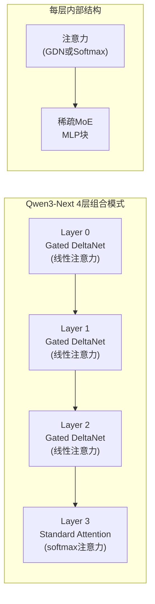

每个注意力层后跟一个稀疏MoE块（Qwen3-Next: TopK=10/512）。在生产序列长度下，不同注意力类型产生**高达10倍的计算时间不对称性**。

### 2.2 核心难题：划分与重叠的循环依赖

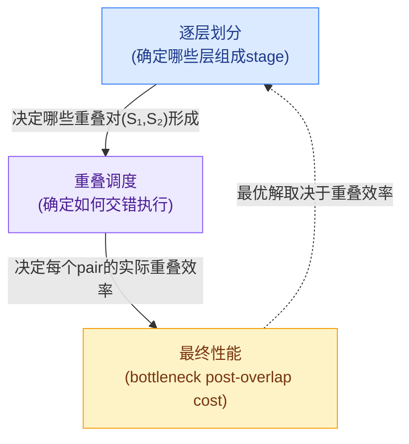

这是一个**鸡-蛋问题**（cyclic dependency）：
- 划分边界确定哪些层组合形成重叠对（pair types）
- 重叠效率决定哪种划分是最优的
- → 无法独立优化其中之一

现有系统中，需要**领域专家花费数周**为每个新模型架构手工调整划分与重叠。

### 2.3 三个层次的问题

#### ① 组合爆炸：重叠调度空间

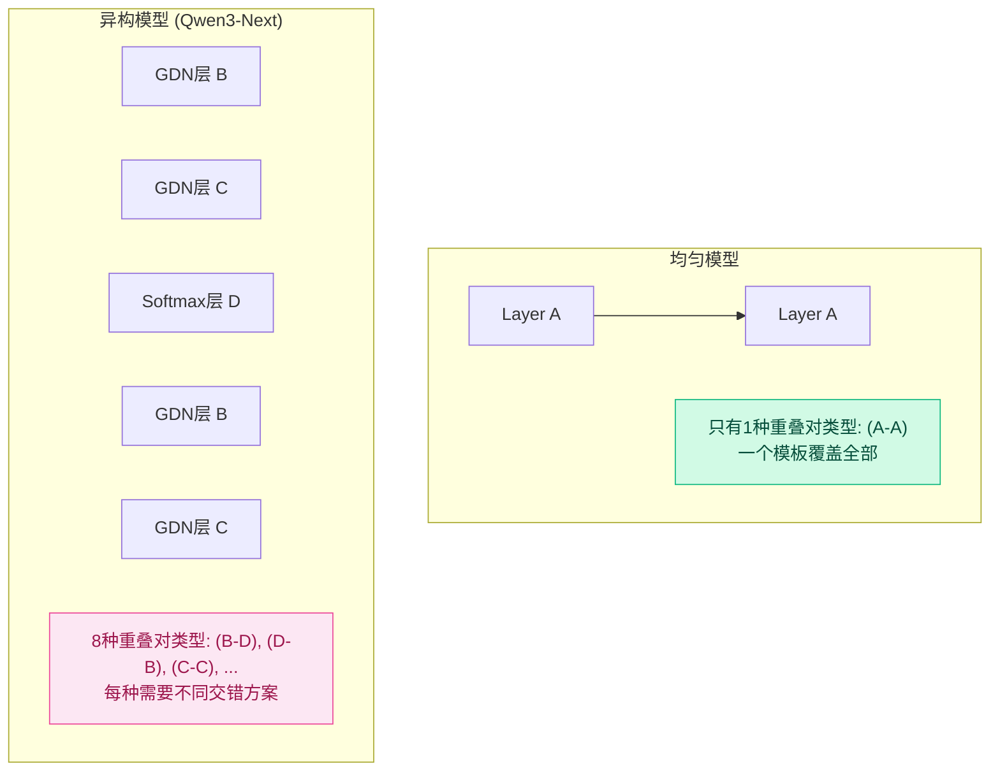

均匀模型：每个重叠对都是 (A-A)，一个模板通吃。

Qwen3-Next即使是2-stage流水线也产生**最多8种不同的重叠对类型**（B-D、D-B、C-C等）。每种需要独特的细粒度交错调度，因为计算密集型chunk可以良好隐藏通信密集型chunk的A2A，而两个通信密集型chunk会留下显著暴露延迟。

#### ② 重叠效率差异 — 定量分析

论文profiling数据（Qwen3-Next-80B, 128 GPU, 256K序列长度）：

| 重叠对类型 | 重叠延迟降低 | 原因 |
|------------|:----------:|------|
| C-C（计算+通信互补） | **41.6%** | 一侧计算密集，另一侧隐藏了A2A |
| D-D（两侧计算密集） | **14.0%** | 几乎没有A2A通信可隐藏 |

这意味着**串行时间平衡的划分在执行时会严重失衡**：一个按串行FLOPs平衡的方案，在重叠后C-C对仅需58.4%的串行时间，而D-D需要86.0%。论文测量显示，串行平衡划分的瓶颈后重叠代价比重叠感知划分高**1.14×**。

#### ③ 运行时随机性：MoE路由波动

Qwen3-Next中每个token仅激活512个expert中的10个（TopK=10/512）。这种**极稀疏路由**意味着：

- 每个expert收到的token预期份额更小
- 每个expert/rank的token数在不同迭代间**相对波动更大**
- 产生**短暂的空闲槽**（ephemeral idle slots），静态计划无法预测

论文发现，并非所有rank-local工作都在微批次关键路径上。将任务分为：
- **Backbone tasks**：关键路径任务，定义stage延迟
- **Movable tasks**：时间灵活的任务（Wgrad计算、梯度规约），可填充瞬时间隙

---

## 三、Tessera设计详解

### 3.1 总体架构

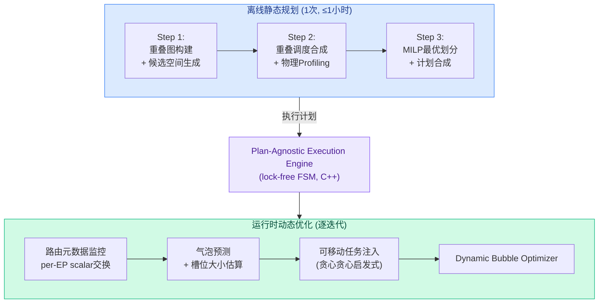

### 3.2 静态规划（Static Planning）

Tessera固定高层流水线调度模板（如interleaved 1F1B），在模板内联合优化划分和重叠调度。

#### Step 1: 重叠图（Overlap Graph）

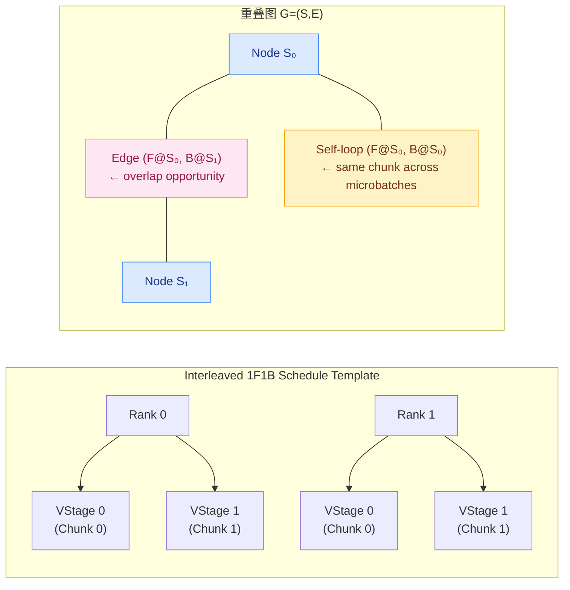

- 节点S = 虚拟流水线stage（在交错调度中，每个物理rank可以有多个虚拟stage）
- 边E = 模板创建的重叠机会
- 每条边记录端点操作的pass方向（F/B），相同端点对可能产生多条边
- 从串行代价平衡的基线划分出发，通过扰动层边界生成每个节点的候选集C_s
- 候选限制在**基线的有界邻域**内，保持可解性

#### Step 2: 重叠调度 — 任务分解

论文将每层分解为细粒度调度单元（task），每个task有类型（Comp/Comm）、持续时间和依赖约束：

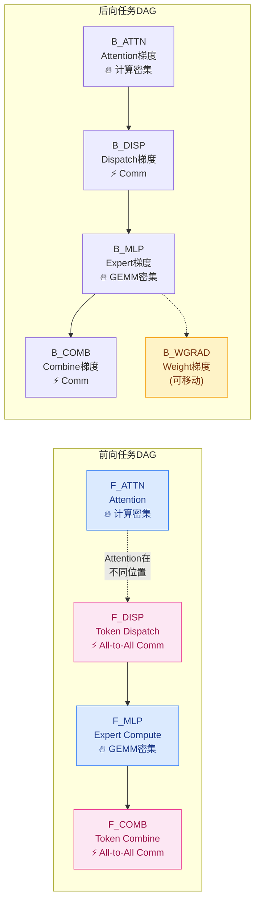

**两种资源类型**：
- **Comp（计算）** — GEMM、Attention、MLP（SM核心占用）
- **Comm（通信）** — A2A Dispatch/Combine（NVLink/RoCE + SM预留）

#### 事件驱动列表调度器（Algorithm 1）

给定两个任务DAG（D₁, D₂，来自不同chunk和微批次），合成最小makespan的交错调度：

```
Algorithm 1 事件驱动重叠调度

Ready ← 初始任务（无未满足依赖）
while Ready ∪ Running ≠ ∅ do
    for 资源 r ∈ {Comp, Comm} 空闲时:
        τ ← SELECT(Ready[r])    // 骨干优先 + gap-fit
        if IS_MOVABLE(τ) and Running ≠ ∅ and SHOULD_DEFER(τ, Time) then
            move τ from Ready[r] to Pending[r]   // 延迟到空闲槽
        else
            SCHEDULE(τ, Time)
    Time ← 下一个任务完成事件
    Update Ready with newly unblocked tasks
    // 回填延迟的可移动任务
    for τ ∈ Pending 按逆序:
        BACKFILL(τ, S)
```

**两个关键启发式**：
1. **Backbone-first alignment**：骨干任务优先；gap-fit规则选择持续时间最接近互补资源剩余窗口的任务
2. **Conditional deferral**：可移动任务在"不扩展pair makespan"时才延迟放置

#### 物理Profiling（关键决策）

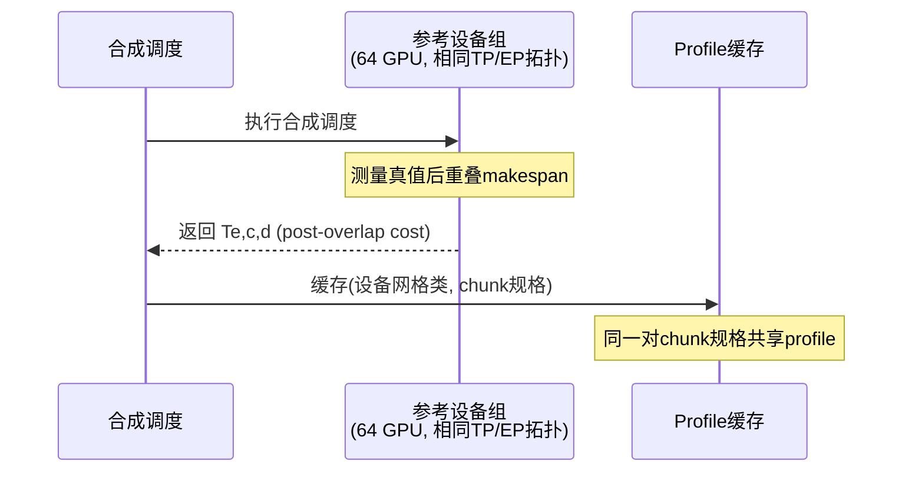

**为什么必须物理profiling，而非理论估计？**

| 因素 | 影响 |
|------|------|
| SM争用 | EP通信kernel预留~20 SM → 重叠的Attention/MLP kernel慢10-20% |
| 粗粒度task | 一个task包含多个kernel，kernel间干扰无法忽略 |
| 缓存状态 | 累积执行状态影响后续kernel性能 |
| host-side launch开销 | 非计算开销 |

理论估计与硅执行的**平均偏差约5%**。

论文对比了更低成本的 **primitive-level profiling**（复用task primitive间的profile数据）：

| 方法 | 平均误差 | 尾误差 | 适用性 |
|------|:-------:|:------:|:------:|
| 理论估计 | ~5% | >5% | 仅用于候选调度合成 |
| Primitive-level profiling | 降低平均误差 | **可达15%** | 低开销fallback |
| **Chunk-pair profiling（默认）** | 最准确 | 最准确 | 生产用途 |

尾误差为什么致命？因为MILP依赖相对代价比较——**少数误估的重叠对可能改变选择的瓶颈边缘或划分边界**。

#### Step 3: Overlap-Aware划分选择

每个候选重叠对(c,d)在边e上的后重叠代价 T_{e,c,d} 通过物理profiling测量后，划分选择简化为**图标记问题**：

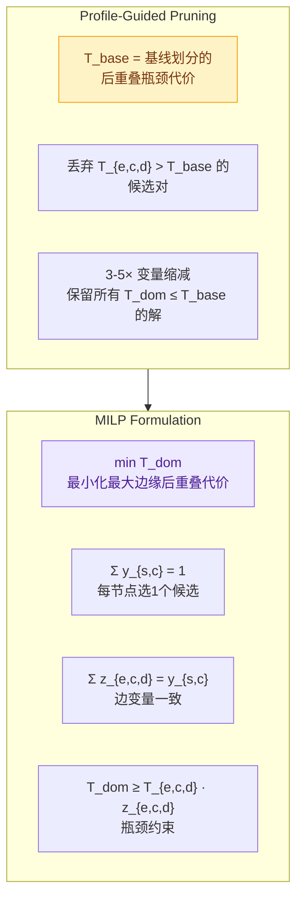

**复杂度**：O(N·vp·K²)，其中N=rank数，vp=每rank虚拟stage数，K=每stage候选数。

**实际求解时间**（64核服务器）：

| 配置 | 决策变量 | 剪枝后 | 求解时间 |
|------|:-------:|:------:|:-------:|
| M-PP8-C2 | 9,358 | 1,782 | 0.34s |
| L-PP8-C2 | 23,180 | 6,993 | 1.51s |
| M-PP8-C4 | 16,192 | 5,505 | 0.82s |
| L-PP8-C4 | 35,904 | 12,207 | **4.22s** |

#### 3.2.3 交错微批次重叠机制

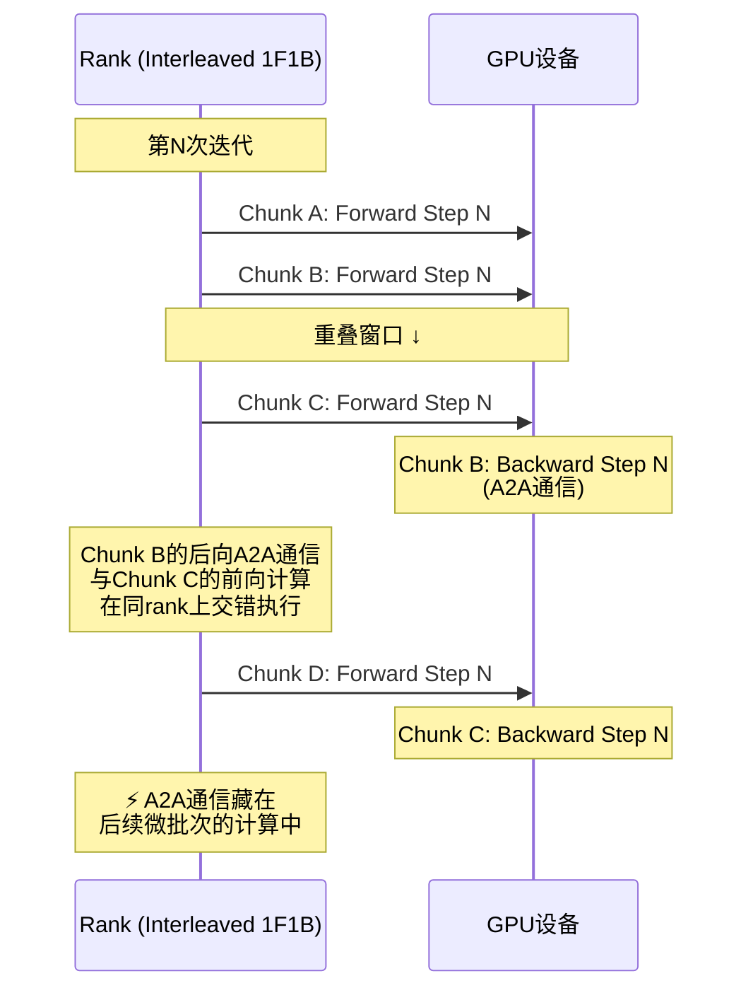

**与Intra-microbatch重叠的关键差异**：

| 维度 | Intra-microbatch (Comet等) | Inter-microbatch (Tessera) |
|------|---------------------------|---------------------------|
| 方式 | 切分序列维度，融合通信+计算kernel | 不同微批次的操作在rank上交错 |
| GEMM强度 | ❌ 序列切分碎片化GEMM，降低算术强度 | ✅ 保持完整GEMM计算强度 |
| 后端耦合 | ❌ 需要特定kernel融合，升级困难 | ✅ 后端模块化，可独立升级 |
| 适用性 | 对kernel融合和SM利用率敏感 | 对计算/通信比敏感 |

### 3.3 Dynamic Bubble Optimization (DBO)

#### 为什么需要运行时优化？

即使最优静态规划也无法处理：
- MoE路由变化：每迭代每个expert收到的token数波动
- 基础设施抖动：10K+ GPU网络的拥塞和交换机争用

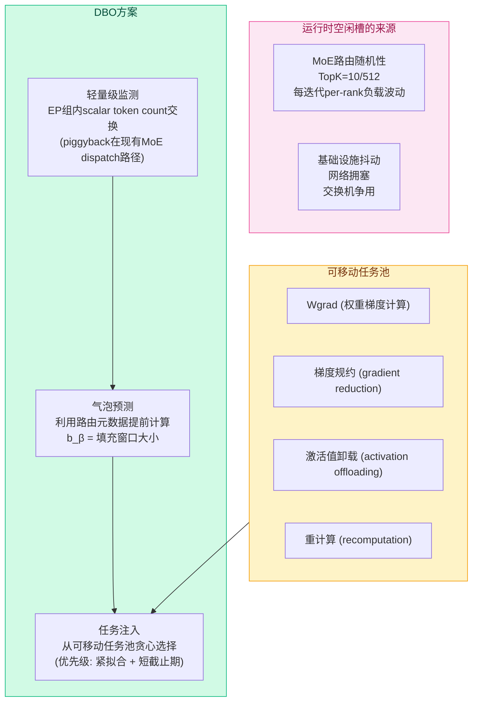

#### 气泡预测与槽位大小估算

```
Algorithm 2 动态气泡填充

输入: token分布T, 离线profile P, 可移动任务池Q

B ← GET_TARGET_SLOTS()          // 从静态计划获取预标注目标槽位
for 每个目标槽位 β ∈ B:
    b_β ← ESTIMATE_BUBBLE_SIZE(T, P, β)  // 异步估算
    if b_β > 0:
        在可移动任务池Q中搜索
        选择最适合的task σ (紧拟合 + 小截止期裕量)
        SCHEDULE(σ, on rank r, at time t_start)
        Remove σ from Q
```

**关键设计决策**：

1. **预标注目标槽位**：静态规划在MoE计算任务后的结构边界处标注候选槽位。这两个chunk可能来自不同微批次，具有独立token分布，它们的延迟可能朝相反方向偏移——所以槽位大小迭代间波动很大。

2. **异步窗口计算**：token分布在前向dispatch阶段就已解析，在目标槽位仍然远程等待时就完成了b_β计算。**填充决策与有用计算同时进行**。

3. **有界池容量**：延迟Wgrad会延长激活值和梯度的生命周期，增加峰值内存。论文通过per-GPU可移动任务池上限（cap）控制，配置化。生产中使用**cap=8**。

4. **保证执行**：若deadline slack接近零仍未找到合适槽位，强制注入主执行流，优先保证正确性。

5. **开销**：槽位估算 + 任务选择 < 10µs。

#### 内存权衡详情

| 策略 | 性能收益 | 峰值内存代价 |
|------|---------|:-----------:|
| 静态（无DBO） | 基线 | 69.3% per-GPU预算 |
| w/ DBO（cap=8） | -5.4% iter time | +2~4个百分点 → 72.9% |
| always-keep（只监控不延迟） | ~1%开销 | 同静态 |

峰值内存增加2-4个百分点的原因是延迟可移动任务时，其输入的激活值和梯度必须保持存活。当内存紧张时，Tessera可将**激活卸载和重计算也表示为可移动任务**，调度到合适的流水线气泡中。

### 3.4 工程实现架构

#### Plan-Agnostic Execution Engine

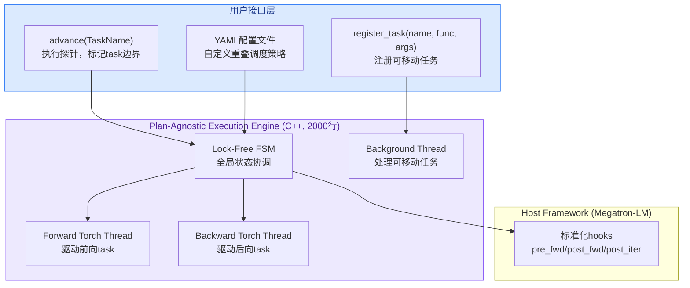

**设计要点**：

- 主forward/backward Torch线程驱动各自任务，在指定yield点暂停与FSM同步
- 后台线程独立处理可移动任务注册
- advance()探针将连续执行切割为命名task，但不将张量计算移出host框架
- YAML可指定自定义交错序列（如 `B_COMB:L1 → F_ATTN:L0 → F_DISP:L0`）

#### Shadow Padding（影子填充）

**问题**：Interleaved 1F1B需要微批次数量M能被流水线大小K整除（M%K=0）。但M由收敛要求的global batch size决定，K由设备内存限制决定，两者经常冲突。

**Tessera解决方案**：注入shadow actions（空操作，跳过计算但执行必要的流水线通信，发送伪张量）。

- 不参与loss累积、梯度缩放和优化器计算
- 通过配置plan文件即可实现，无侵入代码修改
- **开销仅~0.5%**

---

## 四、Tessera vs Zero Bubble vs DualPipe 深度对比

Tessera不是第一个提出优化流水线并行的系统。Zero Bubble（Qi et al., ICLR 2024）和DualPipe（DeepSeek-V3, 2025）代表了流水线并行优化的两个关键里程碑。本部分从设计哲学、核心机制、适用范围三个维度进行系统性对比。

### 4.1 各系统的核心设计哲学

| 维度 | Zero Bubble | DualPipe (DeepSeek-V3) | Tessera (本论文) |
|------|:-----------:|:---------------------:|:----------------:|
| **发表** | ICLR 2024 | DeepSeek-V3 Tech Report, 2025 | **OSDI 2026** |
| **代码** | [开源](https://github.com/sail-sg/zero-bubble-pipeline-parallelism) | 闭源（HAI-LLM框架） | **闭源**（阿里内部） |
| **设计哲学** | 拆分后向，消除气泡 | 双向管道 + 手工SM分配，隐藏通信 | 联合优化 + 自动化 + 运行时自适应 |
| **核心假设** | 均匀Transformer层 | 均匀MoE层 | **异构MoE层** |
| **自动化程度** | 半自动（手动拆分 + 自动搜索） | **纯手工**（手动设计调度 + 手动调SM比） | **全自动**（合成+profile+MILP+运行时） |

### 4.2 机制对比

```mermaid
flowchart TD
    subgraph ZB["Zero Bubble 机制"]
        ZB1["标准后向<br/>拆分为: B(输入梯度) + W(权重梯度)"]
        ZB2["将W从关键路径移出<br/>允许F/B/W自由交错"]
        ZB3["F→B→W<br/>变为 F→B→F→B→...→W→W→W"]
        ZB4["结果: 接近零气泡<br/>(同步语义下)"]
        ZB1 --> ZB2 --> ZB3 --> ZB4
    end

    subgraph DP["DualPipe 机制"]
        DP1["后向也拆为 B+W<br/>(继承ZeroBubble)"]
        DP2["每chunk分4组件: ATTN→A2A_DISP→MLP→A2A_COMB"]
        DP3["手工设计F/B对的重叠模式<br/>手工调整compute/comm SM比例"]
        DP4["双向管道: 从两端喂入微批次"]
        DP5["结果: 全隐藏A2A + PP通信"]
        DP1 --> DP2 --> DP3 --> DP4 --> DP5
    end

    subgraph TS["Tessera 机制"]
        TS1["后向拆分B+W (继承ZeroBubble)"]
        TS2["任务DAG分解: 每chunk粒度更细<br/>(DISP/MLP/COMB/ATTN/ATTN-W/MLP-W)"]
        TS3["自动合成每对层组合的<br/>定制化重叠调度"]
        TS4["物理Profiling校准<br/>理论与硅片差距(~5%)"]
        TS5["MILP联合优化划分 + 重叠"]
        TS6["DBO运行时自适应路由随机性"]
        TS1 & TS2 --> TS3 --> TS4 --> TS5 --> TS6
    end

    style ZB fill:#dbeafe,stroke:#3b82f6,color:#1e3a8a
    style DP fill:#fef3c7,stroke:#f59e0b,color:#78350f
    style TS fill:#d1fae5,stroke:#10b981,color:#064e3b
```

### 4.3 逐项深度比较

#### 4.3.1 任务分解粒度

| 粒度 | Zero Bubble | DualPipe | Tessera |
|------|:-----------:|:--------:|:-------:|
| 后向拆分 | B + W ✅ | B + W ✅ | B + W ✅ |
| 通信+计算拆分 | ❌ 未显式区分 | ✅ A2A_DISP/COMB独立 | ✅ DISP/COMB为独立task |
| 注意力类型区分 | ❌ 假设一致 | ❌ 假设一致（DeepSeek-V3为统一MLA） | ✅ GDN vs Softmax分别处理 |
| SM资源管理 | ❌ | ✅ 手工调compute/comm SM占比 | ✅ 通过物理profiling隐式捕获 |
| 每chunk task数 | ~3 (F/B/W) | ~5-7 (ATTN/A2A/MLP/A2A/B/W) | ~6-8 (ATTN/DISP/MLP/COMB/ATTN-W/MLP-W) |

**关键差异**：
- Zero Bubble主要解决了**气泡消除**问题（F/B/W交错），但不处理通信隐藏
- DualPipe在Zero Bubble基础上增加了**通信/计算拆分**，通过手工设计重叠模式隐藏A2A
- Tessera在DualPipe基础上进一步增加了**异构感知**——不同层类型（GDN vs Softmax）有完全不同的计算轮廓，需要不同的调度方案

#### 4.3.2 重叠调度方法

| 方法 | Zero Bubble | DualPipe | Tessera |
|------|:-----------:|:--------:|:-------:|
| 调度生产方式 | **自动搜索**（给定模型+内存约束） | **纯手工设计** | **自动合成**（事件驱动列表调度器） |
| 每对新组合 | 同模板适用所有 | 同模板适用所有（DeepSeek-V3均匀） | **每种层组合独立合成** |
| SM分配 | 不涉及 | 手工调优（固定比例） | Profiling隐式捕获 |
| 理论vs硅片校准 | 不涉及 | 不涉及（手工设计+手工调优） | **物理Profiling**（平均偏差~5%） |

**DualPipe的手工设计局限**：
DualPipe为每个F/B对设计了一个固定的重叠模式（图4），并在DeepSeek-V3上手工调整了SM分配比。这在均匀MoE架构（DeepSeek-V3所有层都是MLA+MoE）上有效，但无法推广到Qwen3-Next这类异构架构。Tessera论文指出，DualPipe的"一个模板适用所有"假设在面对3×重叠效率差异时会失效。

#### 4.3.3 划分策略

| 方法 | Zero Bubble | DualPipe | Tessera |
|------|:-----------:|:--------:|:-------:|
| 划分目标 | 串行代价平衡 | 层数平衡 | **后重叠代价平衡** |
| 划分方法 | 自动搜索 | 手工分配 | **MILP + 物理Profiling** |
| 是否感知重叠效率 | ❌ | ❌ | ✅ |
| 划分-调度是否联合优化 | ❌ 分阶段 | ❌ 手工串行 | **✅ 联合优化** |

**核心突破**：
Tessera证明了"串行平衡 ≠ 并行平衡"——一个在后重叠代价上平衡的划分可能比串行平衡划分好**1.14×**。Zero Bubble和DualPipe都没有考虑这一效应，因为它们都假设所有层的重叠效率一致。

#### 4.3.4 运行时自适应

| 能力 | Zero Bubble | DualPipe | Tessera |
|------|:-----------:|:--------:|:-------:|
| 静态计划自适应 | ❌ | ❌ | ✅ DBO |
| MoE路由波动处理 | ❌ 不涉及 | ❌ 依赖Aux-Loss平衡 | ✅ **利用路由元数据预测空闲槽** |
| 基础设施抖动处理 | ❌ | ❌ | ✅ **DBO可扩展覆盖**（历史预测器） |
| 内存自适应 | ❌ | ❌ | ✅ **有界可移动任务池**（Configurable Cap） |
| 开销 | — | — | **<10µs** |

Zero Bubble和DualPipe完全依赖静态计划：
- 如果MoE路由波动导致某个rank的MLP计算延长，它们无法做任何事
- DeepSeek-V3通过Aux-Loss Load Balancing和动态专家调整来减少路由波动本身，但无法消除波动导致的空闲槽
- Tessera的DBO是**唯一一个主动利用运行时气泡来填充有用工作的系统**

#### 4.3.5 适用范围

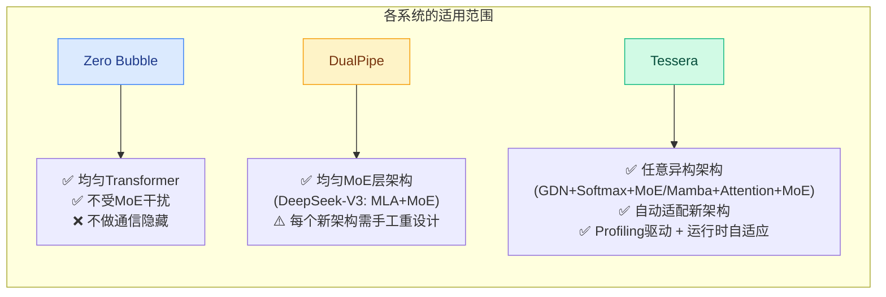

实际生产中的成功案例说明了这一差异：

| 案例 | 适用系统 | 原因 |
|------|---------|------|
| Qwen3（标准MoE，均匀层） | ZB / DualPipe / Tessera皆可 | 均匀架构，重叠效率一致 |
| DeepSeek-V3（MLA+MoE，均匀） | DualPipe已证明有效 | 均匀层，手动设计一个模式就够 |
| **Qwen3-Next（GDN+Softmax+MoE）** | **只有Tessera** | 3×重叠效率差异，手动模式无法覆盖 |
| **Nemotron-3 Super（Mamba+Attention+MoE）** | **只有Tessera** | 异构注意力+MoE，混合架构 |
| 未来未知异构架构 | **Tessera**（自动适配） | 不需手工重设计 |

### 4.4 从Zero Bubble到DualPipe到Tessera的演进路线

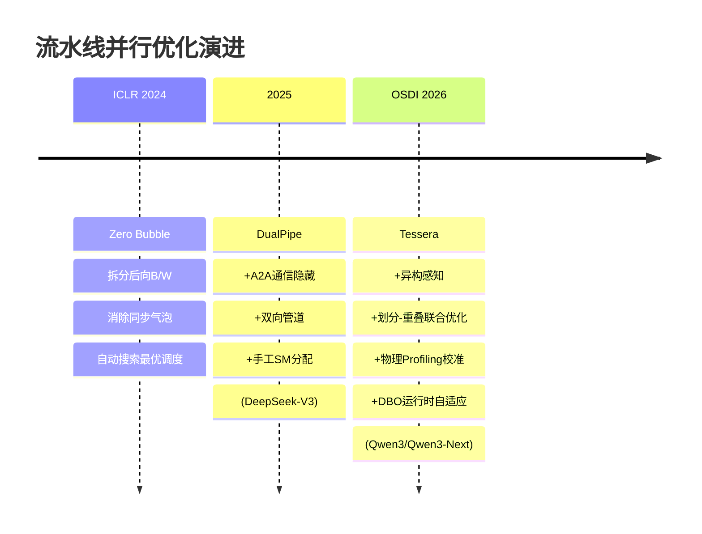

### 4.5 性能对比（跨论文）

| 指标 | Zero Bubble vs 1F1B | DualPipe vs 标准PP | Tessera vs 内部基线 |
|------|:------------------:|:-----------------:|:------------------:|
| 吞吐量提升 | +23%~31% | ~（DeepSeek未单独消融） | **+20%~33%** |
| MFU | ~（不同量纲） | ~37%†（DeepSeek-V3 671B 整体） | **39.0%**（万亿参数） |
| vs Megatron-Core MoE | — | — | **1.24× MFU** |
| 气泡消除 | 接近零气泡 | 大幅减少 | +DBO进一步消减 |
| 通信隐藏 | ❌ | ✅ A2A全隐藏 | ✅ 73%~26%（依赖计算密度） |
| 运行时自适应 | ❌ | ❌ | ✅ |

†DeepSeek-V3训练效率参数：在2048 H800上，模型FLOPs利用率未直接报告，但从训练时长691,200 GPU-hour和总token数14.8T估算，MFU约在37%左右。

### 4.6 关键差异总结

**Zero Bubble**是对标准流水线并行的根本性改进——通过拆分后向消除了"气泡天生不可避免"的假设。但它不处理：
- MoE通信隐藏（无A2A感知）
- 层异构性（假设均匀）
- 运行时动态（完全静态）

**DualPipe**在Zero Bubble基础上增加了通信重叠——通过精细的手工设计实现了A2A和PP通信的完全隐藏。但它：
- 需要大量人工投入（每个新架构手工重设计）
- 假设均匀层结构
- 无运行时自适应

**Tessera**将流水线并行优化的自动化程度推到了新高度——从手动设计变为profile-driven自动化。它：
- 自动处理任意层类型组合（无需手工设计）
- 首次发现并解决了划分-重叠循环依赖
- 唯一提供运行时自适应（DBO）
- 但：需要1小时的物理profiling开销

用一句话概括演进：**Zero Bubble消除了气泡，DualPipe重叠了通信，Tessera让这一切自动发生并对异构层和运行时动态自适应。**

---

## 五、所有性能提升点的全面分析

### 5.1 三个增益来源的量化分解

#### 增益来源①：重叠感知划分（~9%）

论文2周生产部署trace（Qwen3-XL, 8,192 GPU）明确分解了静态规划的增益：

- **负载均衡（~9%）**：Overlap-aware partitioner平衡的是后重叠代价而非串行FLOPs。将C-C（41.6%重叠率）和D-D（14.0%重叠率）的差异考虑在内，故意创建串行不平衡但并行互补的分配。
- **延迟隐藏**：将A2A通信藏在其他微批次的计算中。

#### 增益来源②：动态气泡填充（3.4%~5.4%）

- 256-GPU Qwen3-Next-M：DBO降低迭代时间5.4%（基线划分）和4.4%（重叠感知划分）
- 6,144-GPU Qwen3-L：DBO单独降低PP气泡641ms → 3.4%吞吐量提升
- 8,192-GPU Qwen3-XL：DBO激活后MFU从~34%跳到39%

#### 增益来源③：细粒度重叠调度（~1% vs ILP）

+DEFER启发式在1.07%（EP32）/0.76%（EP8）以内接近ILP最优解，而求解时间从数小时降至<1分钟。

### 5.2 影响增益大小的关键因素

#### 因素A：计算/通信比

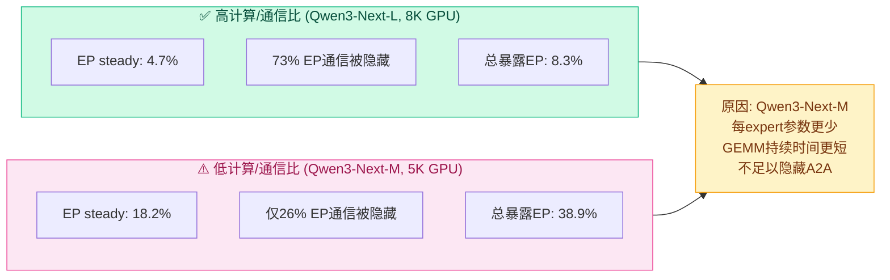

#### 因素B：模型成熟度

| 模型 | 基线MFU | 提升 | 说明 |
|------|:-------:|:----:|------|
| Qwen3-L (8/128 MoE) | 29.7% | +22.0% | 成熟，已高度优化 |
| Qwen3-Next-M (10/512 MoE) | 16.7% | +20.0% | 新架构，缺乏全套优化 |
| Qwen3-Next-XL (10/512) | 15.9% | **+32.8%** | 最稀疏，提升空间最大 |

新部署的模型（Qwen3-Next）缺乏kernel融合和通信合并等成熟全栈优化，基线MFU显著较低（15.9%-19.6%）。但这意味着Tessera在这些模型上的**相对增益更大**。

#### 因素C：重叠对的多样性

Qwen3系列（标准MoE，重复Same Attention+MoE）获益较小但仍有提升：
- 生产划分包含不均匀的边界chunk（embedding/output-head chunks）
- 边界偏移改变后重叠代价 → overlap-aware partitioner仍贡献

### 5.3 迭代时间分解

```
Qwen3-Next-L (8,192 GPU, 9.886s/iter):

┌──────────────────────────────────────────────────────┐
│  EP通信(已隐藏): 73%   暴露EP: 8.3% (819ms)          │
│  PP气泡: 8.5% (835ms)                                │
│    ├─ residual imbalance: 366ms                       │
│    └─ warmup/cooldown: 469ms                          │
│  暴露EP + 空闲 = 17% = 1680ms ≈ 当前瓶颈             │
│  其中40%暴露EP来自warmup/cooldown阶段                 │
└──────────────────────────────────────────────────────┘
```

从底部向上的分析：
1. 完全隐藏的EP通信（73%）→ 好
2. 暴露的EP通信（8.3%）：40%来自warmup/cooldown（流水线启动/排空阶段，气泡不可避免）
3. PP气泡（8.5%）：split between residual stage imbalance (366ms) and inherent 1F1B warmup/cooldown (469ms)
4. 合计暴露EP + PP空闲 = 17% = **300ms 改进空间仍存在**

### 5.4 与State-of-the-Art的逐个比较

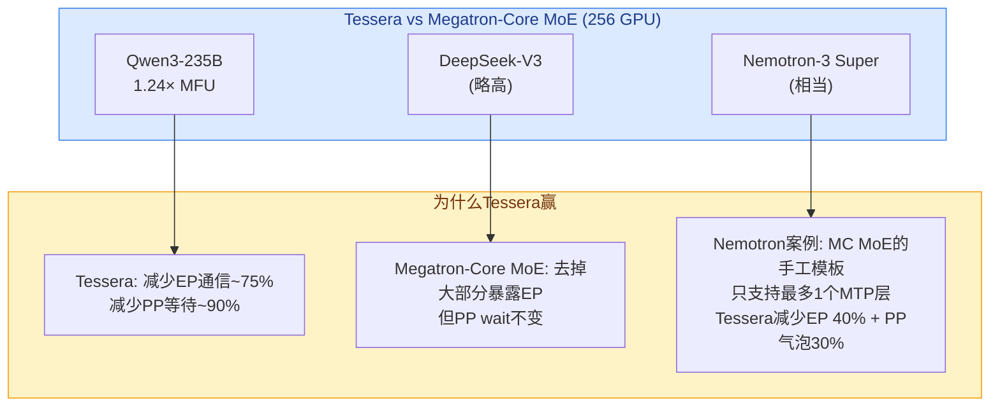

### 5.5 理论vs实际差距的深入分析

```
合成调度器 → 理论makespan → 物理Profiling

偏差约5%，来源分解：

1. SM争用 (主要)
   EP通信kernel预留约20 SM
   → 同步执行的Attention/MLP kernel慢10-20%
   → 稳定的可预测干扰

2. 粗粒度task
   一个通信密集型task可能包含小计算kernel
   → 残余干扰或甚至串行化
   → 不同pair间不均匀

3. 跨primitive效应
   → 连续kernel间的接力重叠 (relay overlaps)
   → 累积缓存状态
   → host-side launch开销
   → 导致primitive-level profiling尾误差达15%

→ 结论: chunk-pair profiling是必要的
```

### 5.6 可扩展性特征

- **Planner不随集群规模增长**：一个模型并行设备网格生成一次计划，在DP rank间复制。从4,096到12,288 GPU，规划问题规模不变。
- **DBO按EP组独立运行**：无跨replica协调。更多GPU = 更多独立DBO实例，而非更大的规划问题。
- **Profile缓存**：相同（设备网格类, chunk规格）的结果跨rank和replica共享。

---

## 六、实验评估

### 6.1 生产环境性能全景

| 工作负载 | TopK/Exp | 模型规模 | 集群规模 | 基线MFU | Tessera MFU | 加速比 |
|----------|:-------:|:--------:|:--------:|:-------:|:----------:|:-----:|
| Qwen3-L | 8/128 | Large | 8,192 GPU | 29.7% | 36.3% | **+22.0%** |
| Qwen3-XL | 8/128 | Trillion | 8,192 GPU | 32.0% | 39.0% | **+21.8%** |
| Qwen3-Next-M | 10/512 | Medium | 4,096 GPU | 16.7% | 20.0% | **+20.0%** |
| Qwen3-Next-L | 10/512 | Trillion | 8,192 GPU | 19.6% | 24.0% | **+22.5%** |
| Qwen3-Next-XL | 10/512 | Trillion | 12,288 GPU | 15.9% | 21.1% | **+32.8%** |

### 5.2 分阶段部署时间线

```
Qwen3-XL (8,192 GPU) — 2周生产trace (2025年4月5日-19日)

MFU
↑
40% ─ ─ ─ ─ ─ ─ ─ ─ ─ ● ─ ─ ─ ● ─
35% ─ ─ ─ ─ ─ ─ ─ ● ─ ─ ─ ─ ─ ─ ─
30% ─ ─ ● ● ● ─ ─ ─ ─ ─ ─ ─ ─ ─ ─
25% ─ ─ ─ ─ ─ ─ ─ ─ ─ ─ ─ ─ ─ ─ ─
    Apr5         Apr9      Apr16
    基线        Phase 1   Phase 2
              静态规划   启用DBO
```

- Phase 1 (4月9日): 基线→静态规划 → ~13%即时提升（负载均衡~9% + A2A隐藏）
- Phase 2 (4月16日): 启用DBO → MFU 39.0%，吞吐量波动显著降低

### 5.3 各类基线对比

| 对比对象 | Qwen3-235B | DeepSeek-V3 | Nemotron-3 Super |
|----------|:----------:|:-----------:|:----------------:|
| vs 内部Megatron | 1.27× | 1.24× | 1.13× |
| vs Megatron-Core MoE | **1.24×** | 略高 | 相当 |

### 5.4 重叠调度质量

| 调度策略 | EP32理论 | EP32实测 | EP8理论 | EP8实测 |
|----------|:--------:|:--------:|:-------:|:-------:|
| FIFO（拓扑序） | 基线 | 基线 | 基线 | 基线 |
| +Align（骨干优先+gap-fit） | 大部分增益 | 大部分增益 | 大部分增益 | 大部分增益 |
| **+Defer（Tessera）** | **距ILP 1.19%** | **距ILP 1.07%** | **距ILP 0.12%** | **距ILP 0.76%** |
| ILP（CBC, 300s budget） | 最优参考 | 最优参考 | 最优参考 | 最优参考 |

### 5.5 位级精确性

在确定性模式下，trillion-scale Qwen3-Next上有无Tessera优化产生**位级一致的loss轨迹**。这证实了Tessera的调度变换不会引入任何数值分歧。

---

## 七、亮点与局限

### 亮点

- 🏆 **真正从生产出发**：来自阿里万亿参数MoE训练的真实痛点，非学术玩具
- 🎯 **洞察深刻**：划分与重叠的循环依赖是新的理论贡献，适用于任何异构流水线场景
- 🔧 **完整系统**：离线规划 + 静态执行 + 动态运行时三位一体
- 🚀 **生产验证充分**：4K~12K GPU，多架构（Qwen3/DeepSeek-V3/Nemotron-3），持续运行15个月+
- 🧩 **模块化设计**：Plan-Agnostic + Plugin架构，对host框架无侵入（仅13K行代码注入20-33%增益）
- 🛠️ **好工程**：Shadow Padding、有界池、YAML自定义调度、Profile缓存、位级等价验证
- 🎯 **尊重物理现实**：不使用理论估计替代实际profiling；诚实报告理论与硅片的差距

### 局限

- 🔒 **闭源**：核心代码不公开，无法独立复现或对比
- 📉 **应用场景有限**：专为流水线并行中的inter-microbatch overlap设计，不直接适用于其他并行模式
- ⚠️ **依赖计算密度**：当计算/通信比较低时（Qwen3-Next-M），重叠收益显著下降（仅26% EP通信被隐藏）
- 💰 **Profiling成本**：虽1小时内完成，但每次模型架构变更需重新profiling
- 🧠 **仍需人工干预**：advance(TaskName)探针仍需手动插入模型定义，未完全自动化
- 🌐 **基础设施依赖**：RoCE网络下验证，Infiniband或其他拓扑可能表现不同

---

## 八、个人评价

Tessera是2026年OSDI最具影响力的系统论文之一。它不是在已有流水线并行框架上做增量优化，而是**从第一性原理重新审视了异构MoE训练的核心矛盾**——划分与重叠的循环依赖。

从研究角度看，Tessera标志着"分阶段优化"时代的终结。未来模型只会更异构（Hybrid Mamba/Attention/MLA等），联合优化将成为标准方法。

从工程角度看，Tessera展示了顶尖工业研究的成熟度：
- 清晰的架构分层（离线规划 + 静态执行 + 动态优化）
- 对硅片物理现实的尊重（理想要靠profiling校准，而非假设）
- 系统性思考（不仅解决静态划分问题，还应对路由随机性和基础设施抖动）
- 诚实报告局限（计算/通信比依赖性、内存代价、warmup/cooldown气泡）

最令人印象深刻的是**13K行代码注入20-33%的吞吐量提升**——这是系统设计效率的典范。论文在诚实报告偏差（理论vs硅片）和局限性（低计算密度场景的有限收益）方面也是学术写作的范本。

---

## 参考文献

1. Tessera: A Holistic Pipeline Parallelism Framework for Trillion-Parameter Heterogeneous MoE Training. OSDI '26.
2. DeepSeek-AI. DeepSeek-V3 Technical Report, 2025.
3. Qwen3 Technical Report, 2025.
4. Narayanan et al. Efficient Large-Scale Language Model Training on GPU Clusters Using Megatron-LM. SC '21.
5. Huang et al. GPipe: Efficient Training of Giant Neural Networks Using Pipeline Parallelism. NeurIPS '19.
6. Qi et al. Zero Bubble (Almost) Pipeline Parallelism. ICLR '24.
7. DeepSeek-AI. DeepSeek-V3 Technical Report, 2025.
8. Zhang et al. Comet: Fine-grained Computation-communication Overlapping for Mixture-of-Experts, 2025.
9. Zheng et al. Alpa: Automating Inter- and Intra-Operator Parallelism. OSDI '22.
10. Hwang et al. Tutel: Adaptive Mixture-of-Experts at Scale. MLSys '23.
11. Rajbhandari et al. DeepSpeed-MoE. ICML '22.
