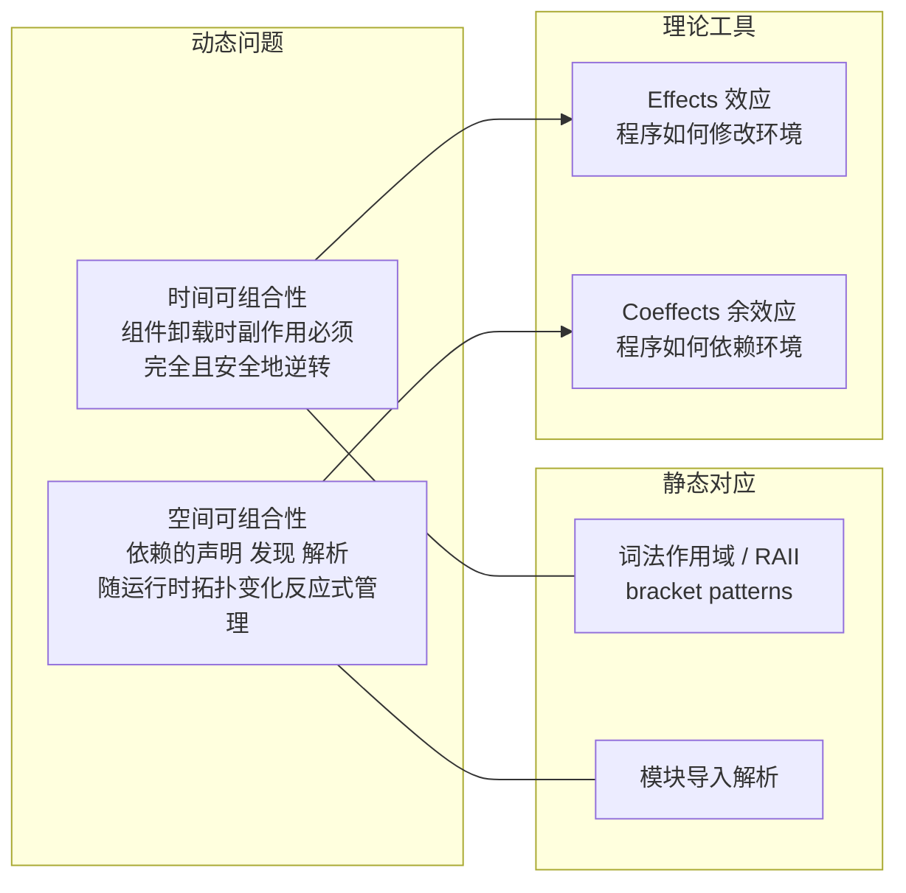
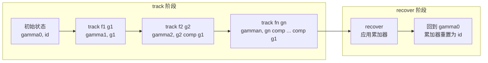
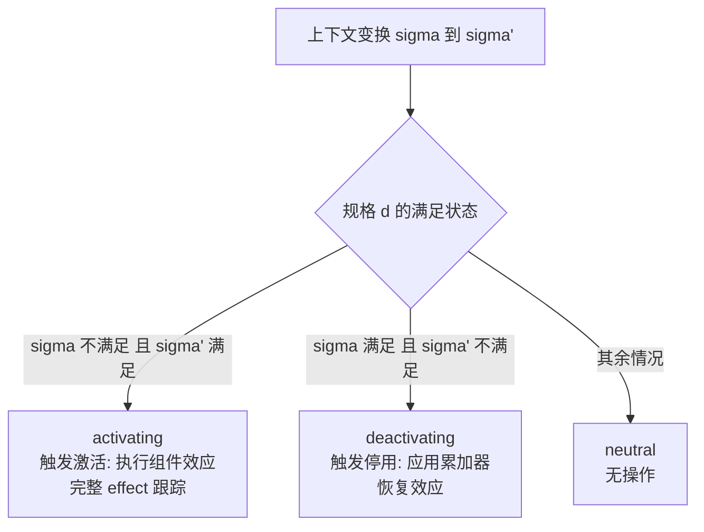
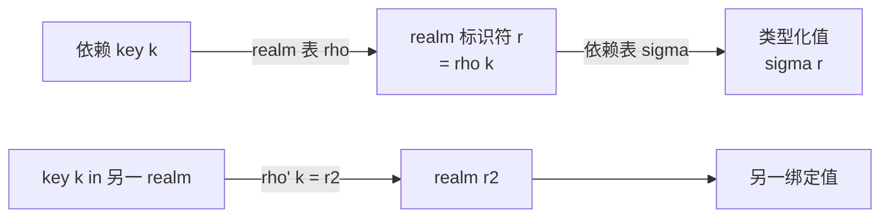
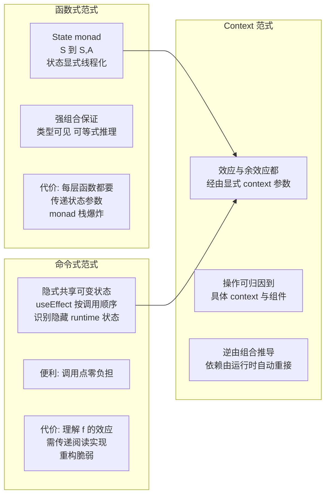
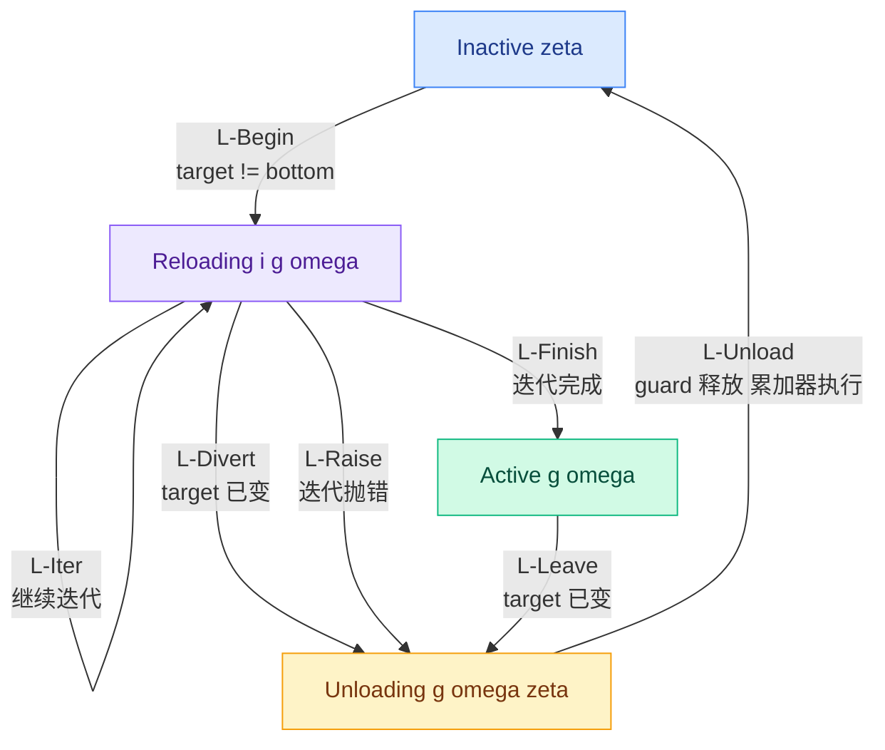
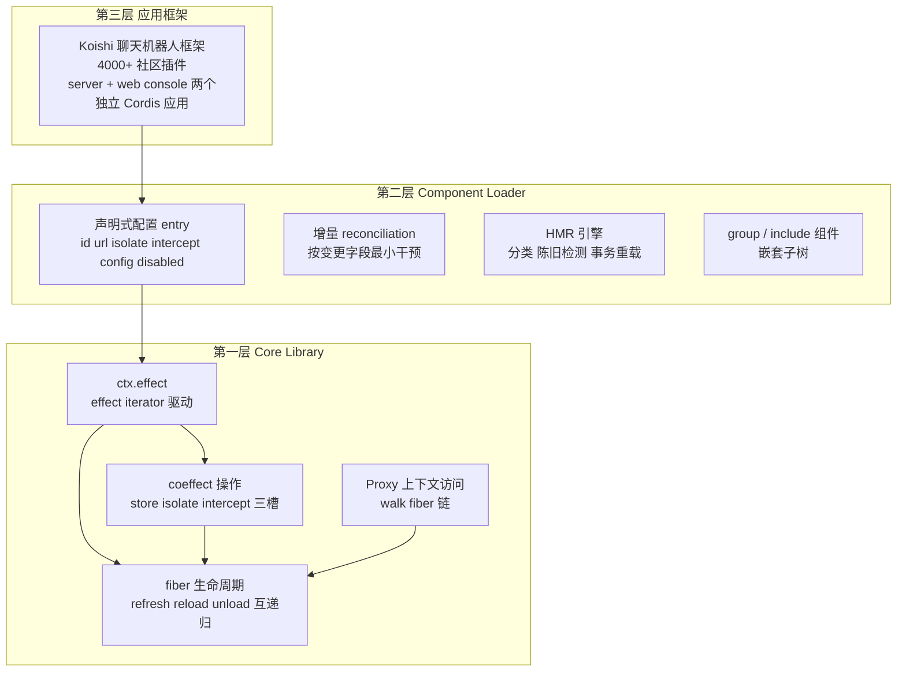

---
tags:
  - 论文分析
  - 软件系统
  - 编程范式
  - 形式化方法
  - 动态组合
source: https://github.com/cordiverse/paper
github: https://github.com/cordiverse/cordis
authors: [Yifan Shi, Wei Zhang, Tianyi Cui]
institutions: [Peking University, DeepSeek-AI]
created: 2026-08-14
rating: ⭐⭐⭐⭐
venue: preprint
open_source: true (cordiverse/cordis, TypeScript, ~1951 stars)
---

# Cordis：时空可组合性编程范式 深度技术分析

> **A Programming Paradigm for Spatiotemporal Composability** — Yifan Shi (北大/DeepSeek-AI), Wei Zhang (北大), Tianyi Cui (DeepSeek-AI)。88 页长文，含完整操作语义与五族元理论定理。

## 一、论文概览

| 属性 | 内容 |
|------|------|
| **标题** | A Programming Paradigm for Spatiotemporal Composability（时空可组合性编程范式） |
| **机构** | Peking University + DeepSeek-AI |
| **代码** | [cordiverse/cordis](https://github.com/cordiverse/cordis)（TypeScript，~1951 stars，Cordis v4） |
| **论文仓库** | [cordiverse/paper](https://github.com/cordiverse/paper)（786 stars） |
| **案例系统** | Koishi 聊天机器人框架（4000+ 社区插件，基于 Cordis v3；论文呈现 v4） |
| **arXiv** | 无（preprint，仅 GitHub 发布） |

### 核心贡献

1. **可逆效应（revertible effects）**：把经典 effect 概念提升为运行时机制——每个上下文变换都携带显式逆（inverse），运行时跟踪这些逆并在组件卸载时组合执行，实现**局部时间可组合性**。
2. **反应式余效应（reactive coeffects）**：把经典 coeffect 概念提升为运行时机制——组件声明依赖规格，每次上下文变化都按规格分类为 activating / deactivating / neutral 并触发生命周期迁移，实现**局部空间可组合性**。
3. **Context 范式**：将 effect 上下文与 coeffect 上下文统一为单一上下文类型 Γ∞，其上由 coeffects 装配出观察等价 ≃ 为 effects 提供独立性，构成一种自足的编程范式。
4. **动态组合演算**：把上述机制组合成组件（component）概念，配 fiber 生命周期操作语义，元理论把时空可组合性从单个组件提升到整个交错组件系统（Preservation / Temporal / Spatial / Progress / Confluence 五族定理）。
5. **Cordis 元框架**：核心库（effect 跟踪 + coeffect 解析）+ 声明式组件加载器（配置对账 + 热模块替换），Koishi 生产案例验证。

### 一句话定位

> **给"插件系统/自进化 agent 的运行时动态装卸"补上形式地基**——把 effect/coeffect 从"编译期类型标注"改造成"运行时机制"，使得组件卸载时副作用被结构性地完全回收、依赖变化被反应式地重新接线，而这一切不再依赖开发者自律。

---

## 二、问题背景：动态组合的两个维度

现代软件越来越多地在**运行时**组合组件：插件架构（VSCode 扩展）、自进化 agent harness（AI 生成并替换自身组件）。传统组合（函数调用、模块导入、类继承）在编译期解析、运行期固定；动态组合则要求组件**运行时装载、卸载、重配置**，且理论地基远不如静态组合成熟。

论文把动态组合的需求拆成两个**正交**维度：



| 维度 | 静态情形 | 动态情形 |
|------|---------|---------|
| **时间**（Temporal） | 退化为词法作用域（RAII、bracket 模式） | 长生命周期、有状态、**无词法边界**的效应；作用域在运行期才出现 |
| **空间**（Spatial） | 退化为模块导入解析 | 依赖在运行期**出现、消失、换身份**；拓扑持续演化 |

### 动机案例 1：VSCode 插件系统

- **时间局限**：所有扩展运行在共享的 extension host 进程中，**无法单独卸载某个扩展的代码**。禁用/卸载含可执行代码的扩展（top-100 中 87 个）必须重启整个 host，丢弃所有扩展的运行时状态。`deactivate` 钩子只是 host 退出时的优雅关闭回调，不是热卸载；且把"效应清理"与"效应创建"分离在 activate/deactivate 两处，违反关注点局部性，完整性难以验证。
- **空间局限**：`extensionDependencies` 几乎无人使用（top-100 中仅 7 个声明非内置依赖）。扩展间交互通过 `vscode.extensions.getExtension(...).exports`，返回值是**无类型的 `any`**，没有可检查的接口契约。扩展被导向固定的 host 扩展点，而非彼此依赖。

### 动机案例 2：自进化 Agent Harness

未来的 harness 会**持续生成并部署对自身组件的修改**，同时连续服务请求，且人工监督很少甚至没有。没有时间可组合性：每次自我修改都要全量重启、丢弃进程内累积状态；故障的自我修改甚至可能禁用掉用于恢复的进程本身。没有空间可组合性：每个模块只能临时拼凑地检测其依赖的变化；天真的代码替换会静默破坏依赖方或在重载时才暴露循环依赖。

### 粗粒度变通的代价

OS 提供进程粒度的时间可组合性，容器编排提供服务粒度的空间可组合性——但这只是"重启代替恢复"，代价是：每次重启丢弃缓存/连接/部分计算（重建需数秒到数分钟），为维持可用性需冗余副本；容器级编排无法表达共享地址空间内的组件依赖，且把本地函数调用变成网络开销。**粒度不匹配**：现代系统在更细粒度上组合，需要与组件同级的效应/依赖管理抽象。

---

## 三、核心机制（一）：Revertible Effects —— 时间维度

### 3.1 核心思想

时间可组合性 = "卸载时环境恢复到组合前状态"。这要求组件对环境做的每个修改既可**跟踪**又可**恢复**。论文的建模：一个效应是函数

```
Γ → Γ × (Γ → Γ)
```

输入当前上下文 Γ，输出修改后的上下文 **加上** 一个显式逆函数。把逆交给运行时 = 可跟踪；逆能还原 = 可恢复。这种效应叫 **revertible effect（可逆效应）**。

### 3.2 Effect Context：跟踪机制

定义 **effect context**：∂Γ ≔ Γ × (Γ → Γ)，即一对 `(γ, φ)`：

- **γ : Γ** —— 当前上下文状态；
- **φ : Γ → Γ** —— **累加器（accumulator）**，即到目前为止所有已执行效应的逆的复合，也就是"把上下文恢复到初始状态"的函数。

初始 effect context 为 `(γ₀, idΓ)`。

**track** 变换把一对 `(f, g)`（前向函数 f + 候选逆 g）提升为 effect context 上的变换：

```
trackΓ(f, g) : (γ, φ) ↦ (f(γ), φ ∘ g)
```

应用 f 修改状态，同时把 g 复合进累加器。**recover** 变换应用累加器并重置：

```
recoverΓ : (γ, φ) ↦ (φ(γ), idΓ)
```



**关键定理（soundness invariant）**：若每个逆 g 都满足 `g(f(γ)) = γ`（在其应用点处真的还原），则任意序列效应后执行 recover 一定回到初始状态。这一"跟踪与恢复都保组合"的性质（track 是 twisted composition monoid 的幺半群同态，Theorem 5）使得**恢复是结构保证而非开发者义务**。

### 3.3 从"给定逆"到"现场提供逆"：Effect Functions

track/recover 模型有两个理想化问题：逆是**先验给定**的（一个 g 要适用于所有状态），且 recover 是**全有或全无**（不能选择性撤销单个效应）。论文在输入侧和输出侧同时增强：

- **输入侧**：`Γ → Γ × (Γ → Γ)` —— 在效应应用处返回逆（逆由调用方现场提供，而非预先固定）；
- **输出侧**：`∂Γ → ∂Γ × (∂Γ → ∂Γ)` —— 返回更高层的逆，从而**可以单独撤销一个效应而保留其他效应**。

这给出 **effect function**：𝔈Γ ≔ Γ → Γ × (Γ → Γ)，及其 **witnessed 版本** 𝔈Γ*（要求逆在应用点确实还原：`g(δ) = γ`）。witnessed 版本的逆是**单边逆**（只要求 g∘f = id，不要求 f∘g = id），这比可逆计算弱得多、也实用得多。

效应组合用新算子 ⋄：

```
f ⋄ g = γ ↦ let (δ, s) = g(γ) in let (ε, t) = f(δ) in (ε, s ∘ t)
```

逆以**相反顺序**累积（twisted composition），所以卸载时逆以 **LIFO** 顺序执行（Theorem 16），与 RAII/作用域栈的习惯一致。

### 3.4 效应的独立性：任意顺序撤回

单个累加器只支持 LIFO；但真实场景中，卸载组件 A 时，A 的逆要穿过 B、C 等后来组件的效应（交错序列）。要支持**任意顺序**撤回（Corollary 21），需要**独立性**条件（Definition 19）：两个效应的所有变换（前向映射与所有产出的逆）两两**交换**，且一方的变换不干扰另一方产出的逆。论文在 3.3.2 节通过观察等价把独立性落地为**key 的可交换性**（Theorem 42）——见第五节。

> **直观理解**：独立 = "我和你的操作互不干扰"。注册事件监听器、往表里加条目这类操作天然可交换；插入 middleware 链这类有序操作不可交换。不可交换的顺序敏感部分，交给 coeffects（依赖声明）去强制，而不是由效应系统硬扛。

---

## 四、核心机制（二）：Reactive Coeffects —— 空间维度

### 4.1 Coeffect Context：依赖表

论文把经典的 IoC 容器形式化。**coeffect context**：

```
Σ ≔ (k : K) ⇀ 𝒱_k
```

一个有限偏函数：把依赖 key 映射到类型化值。关键操作 `set(k, v)` 的类型是 `Σ ⇀ Σ × (Σ ⇀ Σ)`——**恰好就是一个 effect function**（𝔈Σ*）！这是效应与余效应协同的第一处体现：

> **coeffect 操作本身就是 effect，而 effect 是可逆的** —— 依赖注册自动获得跟踪与回收。

### 4.2 规格与通知：反应式分类

组件声明依赖规格 `d ⊆ K`，满足谓词：

```
σ ⊨ d  ⟺  ∀k ∈ d. k ∈ dom(σ)
```

每次上下文变换 σ → σ' 按规格分类：



由于所有 Σ 的变更都经由 effect function（逆会恢复原 domain），**每次满足性变化都可检测**——这就是反应性的代数基础：效应系统保证每个 coeffect 变化都被观察到。

### 4.3 隔离（Isolation）与拦截（Interception）

依赖表再扩展两个机制，都采用 **derived realization**（派生新上下文而非改写共享表，恢复 = 丢弃派生上下文，无需显式逆）：

**Coeffect Isolation**（隔离）：`Σiso ≔ (K ⇀ R) × ((r : R) ⇀ 𝒱_r)` —— 两层映射：key 先经 realm 表 ρ 解析到隔离域标识符 r，再查依赖表。同一逻辑 key 在不同 realm 解析到不同值。这本质上是**运行时 ad-hoc 多态**：多租户、测试环境、组件沙箱可按需隔离同一依赖。



**Coeffect Interception**（拦截）：`Σinter ≔ ((k:K) → ℳ_k) × ((k:K) ⇀ (ℳ_k → 𝒱_k))` —— 每个 key 带一个 metadata monoid（合并 ⊕ 右偏，上下文携带的元数据优先）。访问时求值 `σ(k)(d(k) ⊕ ι(k))`：组件声明的元数据与上下文携带的元数据合并后喂给 provider。这让外层上下文**不修改组件本身**就能约束组件如何使用某个依赖（如：社区组件只读数据库，核心组件全权）——是 6.3 节能力式访问控制的载体。

---

## 五、Context 范式：统一与观察等价

### 5.1 统一上下文类型

把 effect 上下文与 coeffect 上下文递归地合成一个自相似类型：

```
Γ∞ ≔ μΓ. Γ × (Γ → Γ) × Σ
```

三个投影：当前状态 Γ（递归）、累加器 Γ → Γ、coeffect 上下文 Σ。∂-塔（∂Γ, ∂²Γ, ...）被统一进单一类型。由于 𝒱 类型族无约束，**系统需要跨组件共享的任何状态都能编码为一个依赖**——Σ 不限于组件间依赖，它涵盖所有共享可变状态。组件与环境的每次交互都穿过这个实体。

层级组合："插拔"字面化——装载组件 = 执行其效应（plug in）；卸载 = 恢复其效应（unplug，不影响其他运行中组件）；父上下文聚合管理所有子级效应，支持任意嵌套。

### 5.2 观察等价 ≃：让"恢复"变得现实

定理 7 断言的是**状态相等**，这是理想化：free 释放内存块不会恢复 malloc 之前的堆布局；generative name 被丢弃后，下一次创建是全新的名字。所以所有相等要读作**观察等价 ≃**：两个状态相关当且仅当**没有观察者能区分它们**。

观察者能看到什么？**coeffects**——每个 coeffect 自带等价关系（Definition 24）。于是：

- 上下文间的关系由各 key 的等价装配而成：`σ ≃ σ' ⟺ dom 相同 ∧ 每个绑定值 ≃-相关`（Definition 33）；
- 在 ≃ 下，未被任何 key 绑定的部分（堆布局、名字）被**遗忘**——这正是让定理 7 在现实中成立的关键；
- 对 coeffect 上的操作，定义**不可区分性** ≈（所有测试程序在两者上定义性相同、结果相同，Lemma 35 证明它是操作尊重的最粗关系）。

**这如何为 effects 提供独立性？**（Theorem 42）若一个 key 上的所有操作两两独立（Definition 39），则任何由这些操作构造的 coeffect-mediated effect function 都独立（Definition 19）。不同 key 上的操作天然独立（Theorem 40）。于是 3.1.3 节留下的"独立性假设"被结构性满足：**只要每个 key 发布的是可交换接口**，整个系统的组件效应就两两独立。可交换性是对 key 提供者的义务，而非消费方的义务。

### 5.3 范式定位



Context 范式取两者之长：**函数式的可追溯性 + 命令式的易用性**。开发者只需为每个原子操作提供逆、声明依赖，复合逆与依赖重接线全部自动。

---

## 六、动态组合演算（Calculus of Dynamic Composition）

### 6.1 组件、Fiber 与 Registry

- **组件** ℭΓ ≔ (d, p, e)：coeffect 规格 d（从环境读什么）、provision p（向环境写什么）、见证效应函数 e（激活时贡献的效应 + 撤回它们的逆）。d 与 p 是同一接口的两个方向。**单一来源纪律**：同一 key 至多一个 provider（provision 两两不相交）。
- **Fiber**：组件的一次实例化，携带自己的生命周期状态 θ、父指针 π、自己的 coeffect 表 σ、退休标志 τ。
- **Registry**：状态 γ 持有 fiber 树。**coeffect 上下文是从活跃 fiber 的表联合推导的**（σ_γ ≔ ⋃ 活跃 fiber 的表），而非单独存储。fiber 名是原子（动态生成局部名字的纪律，类似 Pitts-Stark）。

### 6.2 生命周期状态机

基础演算只有两态（Inactive / Active），由五个规则驱动：三个编排规则（O-Insert、O-Retire、O-Remove——编排者只请求 fiber 存在或停止存在，从不直接设生命周期状态）+ 两个生命周期规则（L-Reload、L-Unload）。

**核心机制是 target view**：`target_n(γ)` 把组件声明的每个 key 映射到当前提供它的 fiber 名（若应停止运行则为 ⊥）。fiber 持有 **committed view** ω（它激活时所依赖的解析结果）。**生命周期完全由 target 与 committed 的比较驱动**：不一致就迁移。这就是反应式纪律在演算中的形态——任何 target 变化（无论来自退休还是 coeffect 解析变化）都触发迁移。

真实运行时还需要处理四件事，论文逐一放宽"原子、即时、无失败"三个理想化：



| 放宽项 | 机制 | 规则 |
|--------|------|------|
| **退出（Withdrawal）** | L-Leave 把 fiber 标记为 Unloading（**停止提供 coeffects**，但保留自己的 committed view 供 teardown 读取）；L-Unload 受 **guard** 约束：`¬relied_n(γ)`——只有没有其他 installed fiber 的 committed view 解析到 n 时才执行累加器。这保证 provider 在依赖方全部停用前**不撤回绑定**（Theorem 63 排序） | L-Leave, L-Unload |
| **迭代（Iteration）** | 激活可包含多个效应（effect iterator 𝔈Γiter，可视为**reified delimited continuation**，即 yield 结构）；L-Divert 可在迭代边界中止（部分回滚） | L-Begin, L-Iter, L-Finish, L-Divert |
| **异步（Asynchrony）** | 迭代返回 Future；**惯性（inertia）**：一旦发射，迭代必须落地，不能拒绝——target 在飞行中变化只能"落地后再停用" | 无新规则，限制 L-Divert 的选项 |
| **失败（Failure）** | 迭代可 raise（𝔈Γfail）；L-Raise 先恢复再记录：路由进 Unloading 携带错误 outcome，到达 Inactive(ξ)，**不重试**（L-Begin 要求 Inactive(⊥)），失败只记录在 fiber 上不传播给父级（兄弟组件继续运行） | L-Raise |

### 6.3 元理论：五族定理

| 定理族 | 断言 | 关键假设 |
|--------|------|---------|
| **Preservation**（Theorem 59） | 规则保持 registry 良构（树形、provision 不相交、committed view 指向 installed provider） | 良构定义 |
| **Temporal**（Theorem 61 + Corollary 62） | **Recovery exactness**：在 pairwise independent 序列中，运行 n 的累加器得到"n 从未激活过"的状态（去掉控制字段）；卸载后组件贡献归零 | pairwise independence |
| **Spatial**（Theorem 63 + 64） | **Ordering**：provider 的卸载严格晚于所有依赖方停用；**Resolution coherence**：一次激活的所有迭代针对同一个解析（target 变化要么在迭代边界中止、要么落地后停用） | guard |
| **Progress**（Theorem 66） | 无死锁（非静默状态必有规则可应用）+ 终止（每个 fiber 的步数有界，`S(n) ≤ (K+4)(V(n)+1)`） | ≺ 无环、迭代长度有界、名字集有限 |
| **Confluence**（Theorem 73） | 生命周期关系收敛：**动态历史的静默状态 = 按依赖序一次性静态装配的结果**（canonical form）；任何两条序列（同编排输入）到达 ≃-且 ≈-相关的状态 | pairwise independence + 组件在其 provision 上完备（total） |

**Confluence 的实际含义**：Cordis 应用可以被当作**静态装配**来推理——编排者增删组件、替换 provider、回滚替换之后，系统必然收敛到"一开始就把最终组合写死"会得到的状态。这是动态组合版的"增量计算与从头求值一致"（change propagation 的类比）。

---

## 七、Cordis 实现与 Koishi 案例

### 7.1 三层架构



### 7.2 核心库：理论 → 实现对照（Table 2 摘要）

| 理论（§3/§4） | 实现 |
|---------------|------|
| Γ∞ / γ ∈ Γ | `ctx`：一等上下文 + 上下文树 |
| 𝔈Γ, 𝔈Γiter, effectΓ(e) | `ctx.effect(callback)`（接受同步函数/迭代器，ad-hoc 多态） |
| Σ, Σiso, Σinter；get/set/isolate/intercept | `ctx[@@store]`, `ctx[@@isolate]`, `ctx[@@intercept]` 三个 symbol 槽；`ctx.get/set/isolate/intercept` |
| fiber ⟨d,p,e,π,σ,τ,θ⟩ | `fiber`（`fiber.inject`=d, `fiber.apply`=e, `fiber.parent`=π, `fiber.committed`=ω） |
| 累加器 g | `fiber.dispose`（逆的复合，LIFO） |
| target(γ,n) | `fiber.target`（由 refresh 重算；provider uid 的元组） |
| 惯性（Future） | `fiber.inertia`（在飞迁移的句柄） |
| O-Insert/O-Retire | `ctx.use` 及 callback 返回的闭包（注册即父级的一个普通 tracked effect） |
| L-Begin/L-Iter/L-Finish | execute 的迭代循环（Algorithm 1） |
| L-Divert / L-Leave / L-Unload / guard / L-Raise | 迭代边界 guard 失败 / refresh 标记 UNLOADING / unload 惯性链 / unload 等待通知的依赖方 / 记录错误并置 target=⊥ |

**关键实现要点**：

1. **ctx.effect**（Algorithm 1）：`execute` 把 callback 当 effect iterator 驱动，把每步产出的逆折进单一复合；guard（armed 标志）在迭代边界可中止——这是 §4.3.2 步边界中断的落地。dispose 前缀进父 context 的累加器 `ctx.dispose`（∂²Γ 递归结构）。
2. **coeffect 操作**（Algorithm 2）：`ctx.set` 是 ctx.effect 调用（绑定 + notify），返回的 dispose 删除绑定（+ notify）——安装与移除都通知依赖方。
3. **notify**（Algorithm 3）：对每个活跃 fiber 测试变更 key 是否在其 inject 中且 realm 解析相同，是则 refresh 并加入 affected 集合（供调用方等待）。**绑定只在 provider 处于 ACTIVE 时对依赖方可用**——provider 进入 UNLOADING 即停止提供，依赖方在绑定仍在时就开始自己的 teardown（这正是 Theorem 63 的运行时形态）。
4. **生命周期**（Algorithm 4/5）：`ctx.use` 创建 fiber；callback 触发 refresh（O-Insert 角色），其返回的闭包置 target=⊥ 并 unload（O-Retire 角色）。refresh/reload/unload **互递归**实现惯性：reload 完成后检查 target 是否仍匹配——匹配则 ACTIVE，否则链入 unload；unload 恢复所有 tracked effects 后，target 若已非 ⊥ 则链入 reload。unload 在恢复前 `await all(notify(...).map(f => f.await()))`——等待每个通知的依赖方到达 INACTIVE，这是 guard 的异步形态（依赖方图按需遍历而非预先分析，终止性由 Theorem 66 保证）。
5. **上下文访问**（Algorithm 6）：Proxy get trap 沿 fiber 链向上走：第一个 committed view 绑定该 key 的 fiber 授权访问；声明了却未提交（未加载）→ INACTIVE_ACCESS；走到 root 都无声明 → UNDECLARED_ACCESS。**与裸 ctx.get 的区别**：proxy 解析的是访问方自己的 view 并强制规格 d（声明即能力）；这同时是 teardown 期间依赖仍可读的原因。

### 7.3 Component Loader：声明式配置对账

- **entry**：声明单个 fiber 的持久记录（id/url/isolate/intercept/config/disabled）。**为什么 entry 足以作为权威规格**：支撑集（Definition 67）只读 τ, π, d, p 四个字段，entry 恰好全部给出（disabled→τ、父条目→π、url→组件声明的 d/p）。
- **增量对账**：按变更字段分派最轻操作——id/url 重建；isolate 重分配 realm（Algorithm 7，用 **delimiter 符号 δ_k** 判定绑定是否属于该 entry）；intercept 原地更新（读时生效无需重载）；config 交给组件自行 diff；disabled 卸载/重载。`@cordisjs/group` 把子条目列表作为 config，做**按键 diff 递归对账**；`@cordisjs/include` 加载外部 YAML/JSON 配置嫁接子树。
- **托管 realm**：`isolate: true` = 跟随 entry 的私有 realm（移动时携带）；字符串 = 全局共享 realm（移动改变共享关系）。realm 无 entry 引用时被丢弃。
- **为何增量对账是 sound 的**：Theorem 73（静默状态只由最终配置决定）、Theorem 66（系统必然静默）、Corollary 62（离开的 fiber 贡献归零）、Theorem 63（依赖只约束激活时机，不约束模块加载顺序 → **模块可并发加载**，这正是一份大配置的主要耗时点）。

### 7.4 HMR：无需注解接受边界的热替换

三阶段：**分类**（Algorithm 8，stashed 变更集 + externals 不可热替换集 → 不动点把模块标为 accepted/declined；import 环中未决的默认 declined）→ **陈旧 entry 检测**（Algorithm 9，entry 的传递依赖树与 accepted 相交即陈旧）→ **事务重载**（Algorithm 10：invalidate 缓存并备份，替换陈旧 entry 的 fiber；任何失败 → 恢复缓存、用备份重建所有陈旧 entry 并抛错，**系统绝不进入半重载状态**）。

因为 fiber 已经界定了组件的全部效应与 coeffects，"替换组件" = "dispose 旧 fiber（恢复一切）+ 从重载模块 use 新 fiber（重装一切）"。对比 webpack/vite HMR 需要开发者手写 module.hot.accept 边界，Cordis **不需要任何开发者注解**。

### 7.5 案例：Koishi

> **Cordis 与 Koishi 不是同一项目**：Cordis（cordiverse org）是通用元框架，Koishi（koishijs org）是构建在 Cordis 之上的聊天机器人应用框架（论文案例研究）。两者生态深度交织——Koishi 插件就是 Cordis 组件，cordiverse 的官方包（database 等）主要服务 Koishi 场景——但框架与应用是两个 org、两个项目。Koishi 当前使用 Cordis v3，论文呈现的 Cordis v4 独立演进。

- **规模**：开源聊天机器人框架，4 年开发，**4000+ 社区插件**（IM 适配器、数据库驱动、管理控制台、终端用户功能）。每个功能都是 context 原语之上的插件；Koishi 本体只贡献聊天机器人领域词汇。
- **跨运行时复用**：Koishi 的 web console 是**第二个独立的 Cordis 应用**——同一模型在浏览器/UI 运行时复现，论证了模型既表达力强（原语足以承载完整生产系统）又通用（固定的是效应/余效应的组合方式，不是领域或运行时）。
- **时间可组合性无认知负担**：插件作者无需写卸载路径；经由 context 的效应被自动跟踪、逆自动组合。以前靠作者自律的正确性现在由抽象一次性兑现。
- **空间可组合性跨开放生态**：IM 适配器提供平台接入、数据库驱动提供持久化、功能插件声明这些为 coeffects——**插件与其依赖通常由不同作者编写**，协调的只有连接它们的那个 coeffect。运行时切换存储后端/重连适配器只重激活解析发生变化的依赖方；依赖不可用的插件保持不激活、不报错。
- **威胁有效性（作者自述）**：单一生态、单一宿主语言，无法区分范式本身的优点与 TypeScript 实现/Koishi 特定领域的优点；是**存在性-采用性**证据而非对照实验；量化开销与生产率对比留作未来工作。

---

## 八、亮点与局限

### 亮点

1. **把 effect/coeffect 从类型层提升到运行时层**：经典效应系统（Moggi monad、Plotkin-Power 代数效应、graded types）都是编译期静态分析，词法作用域固定。论文把它们**具体化（reify）为运行时机制**，让动态组合获得与静态组合同等的形式保证——这是定位上的原创贡献。
2. **单边逆 + 现场提供**：比 Heunen 等人的 dagger/inverse arrows（全计算可逆、双侧逆、范畴结构推导）要求弱得多、实用得多——逆由调用方在应用点提供，复合逆由组合推导。这是能落地的关键设计。
3. **观察等价 ≃ 让形式化贴近物理现实**：明确承认"状态不能真正恢复"（堆布局、generative name），用 coeffects 装配的观察等价来商掉不可观察部分；并由此把效应独立性落地为 **key 接口可交换性**——义务落在 provider 的接口设计上，可操作。
4. **元理论完整且相互咬合**：Preservation / Temporal / Spatial / Progress / Confluence 五族定理，加上 guard 防死锁论证、inertia 异步模型、fiber 名 equivariance、vestigial entry 技术处理——证明链完整，Confluence 定理直接把"动态 = 静态"合法化。
5. **有大规模生产验证**：Koishi 4000+ 插件的开放生态是罕见的采用证据；HMR 无注解设计、增量对账、事务重载都是工程上可直接用的成果。
6. **对 agent 基建有直接指向性**：作者来自 DeepSeek-AI，动机明确指向**自进化 agent harness**——LLM 生成并替换自身组件。恢复保证 + 依赖协调正是连续自进化系统缺失的地基。

### 局限

1. **独立性/可交换性是未验证的义务**：元理论的关键假设（pairwise independence、key commutativity）落在 provider 的接口设计上，运行时**不检查 witness**（𝔈* 的逆正确性完全是组件作者义务）。作者在 5.1.1 明确承认，6.1 节划定边界。这限制了"结构性保证"的纯度——保证是结构性的，但前提是人给的。
2. **组件自身内存态不跨重载存活**：Cordis HMR 恢复旧 fiber 的 tracked effects 后从零重装新组件；组件自己的进程内状态（缓存、连接对象）除非放进更长生命的依赖，否则丢失。DSU 式状态前向迁移被明确列为 future work——对比 Kitsune、Erlang code_change 等，这是实际短板。
3. **依赖只有名义链接（key 名字）**：接口漂移（interface drift）与 key 碰撞（key collision）是开放问题（6.6）。键命名空间、peer dependency、结构化兼容三方案各有代价，统一模型留作开放问题。
4. **定量评估缺失**：无开销测量（代理/迭代器/notify 的运行时成本）、无与 OSGi/iPOJO 等替代架构的对照实验、无开发者生产率数据。threats to validity 作者自己写得很诚实。
5. **互依赖消除的成本**：循环依赖只能靠拆分为集成组件（请求-中介/策略-管理四组件模式），一般情形需要 O(n²) 量级的集成组件，虽不影响正确性与性能，但增加配置与认知负担。
6. **循环依赖 = 永久不激活**：与并发死锁不同，它可预测（从声明即可判定），但系统不会自动解决——运行时只能报告。

---

## 九、个人评价

**这是一篇"先有工程、后有理论"的论文**：Cordis 是 1951 stars 的成熟开源框架（Koishi 生态已在生产中使用多年），这篇论文的贡献是把 Cordis 已经在做的事**形式化**，并反向指导 v4 的语义精化（效应/余效应语义与加载器重构）。这与常见的"理论先行"论文路线相反，也让论文格外扎实——每个抽象都能对照到运行中的系统。

**最值得注意的设计选择**：

- 用**单边逆 + 累加器**而非全可逆计算——这是从"能证明"走向"能用"的关键让步，与 RCCS 的可逆进程演算、Nooks/Akeso 的运行时记录回收形成对照：Cordis 站在"组件自己提供逆"这一中间地带，换取语言无关性与细粒度。
- 用 **coeffects 的观察等价给 effects 提供独立性**——两个正交维度的衔接点处理得非常优雅（Theorem 42），这是论文最有理论味道的地方。
- 元理论刻意**不依赖调度器**（规则是纯反应式的，定理对所有步序列成立），所以 Confluence 不挑调度策略。

**对 DeepSeek 的指向性**：作者阵容（Shi 同时在北大与 DeepSeek-AI，Cui 在 DeepSeek-AI）与结论中的 future work 直接指向自进化 agent harness。**一个外部佐证**：Cordis v4 的 README 文档链接指向 `deepseek-harness.github.io/deepseek-harness/reference/cordis-primer`，`packages/core/README.md` 亦提及 DeepSeek——DeepSeek 正在把 Cordis 作为其 agent harness 项目的基础设施。这篇论文可以视为 DeepSeek 在"agent 自我修改的地基"上的一次理论布局：如果 agent 要能持续生成、替换、回滚自己的 harness 组件，Cordis 的恢复保证（Theorem 61/62）与依赖协调（Theorem 63/64）就是可证明的安全网。

**阅读建议**：系统/工程背景读者可从 §1（动机）、§5（实现）与 §6（讨论）读起，三者都自包含；理论背景读者再补 §3/§4 的证明。§6 的讨论（系统边界、服务复用、访问控制、语言独立性、依赖类型化与版本化、与语言/OS 的协同设计）本身是一份很好的"动态组合研究议程"。

---

## 参考文献

- 论文：Shi, Zhang, Cui. *A Programming Paradigm for Spatiotemporal Composability*. [github.com/cordiverse/paper](https://github.com/cordiverse/paper)
- 实现：Cordis v4. [github.com/cordiverse/cordis](https://github.com/cordiverse/cordis)（~1951 stars，TypeScript monorepo，packages/core 约 1.8K 行核心 + loader/group/hmr/include 等 10 个包，总计约 8.4K 行）
- 生态：Koishi 框架（koishijs/koishi）与 [koishi.chat](https://koishi.chat)
- 关键相关工作（论文 §7）：Effekt（effects as capabilities）、Heunen et al.（inverse arrows）、Granule（graded modal types）、OSGi DS / iPOJO（availability-reactive components）、R-OSGi（分布式服务）、Nooks / shadow drivers / Akeso（系统级回收）、Kramer-Magee quiescence / tranquility（动态更新）、webpack/vite HMR、React useEffect
