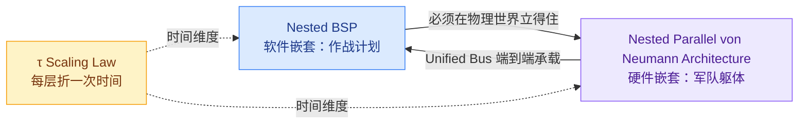
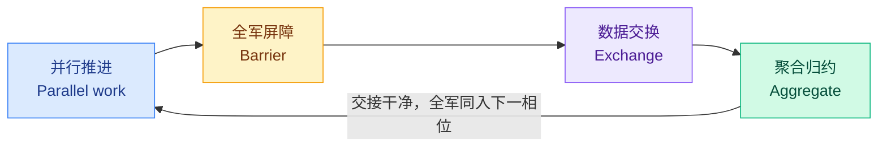
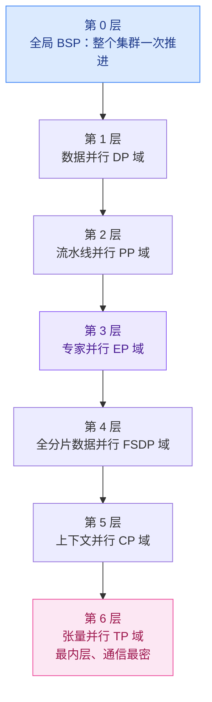
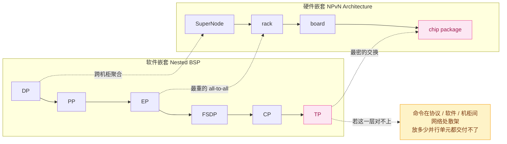
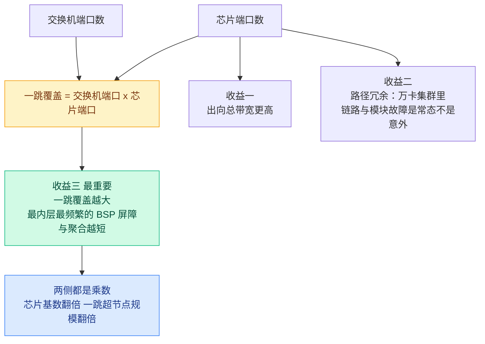

---
tags:
  - 论文分析
  - 软件系统
  - 并行计算模型
  - BSP
  - 体系结构
  - 互连网络
  - 超节点
  - UnifiedBus
  - 华为
source: https://arxiv.org/abs/2609.16787
arxiv: 2609.16787v1
authors: Liao Heng (廖恒)
institutions: Huawei Technologies Co., Ltd.
created: 2026-09-28
rating: ⭐⭐⭐（战略价值 ⭐⭐⭐⭐⭐ / 学术严谨性 ⭐⭐）
venue: arXiv Preprint (cs.DC, cs.AR) — position/vision paper
open_source: false（愿景论文，无代码；但其描述的 UnifiedBus 规范已公开）
related:
  - "[[Knowledge/论文分析/训练系统/StrataCL 深度技术分析]]"
  - "[[Knowledge/业界动态分析/OpenAI MRC 超级计算机网络协议深度分析]]"
---

# Nested BSP 与嵌套并行冯·诺依曼架构 深度技术分析

## Nested Parallel von Neumann Architecture and Nested BSP

> **一句话**：这不是一篇典型论文，而是一份"超节点体系结构宣言"——上半篇用 **Nested BSP** 把百万级并行锚定在一个计算模型上，下半篇用 **Unified Bus** 把它落到物理世界；核心口号是 **"many processors, still one computer"（百万处理器，仍是一台计算机）**。

---

## 一、论文概览

| 属性 | 内容 |
|------|------|
| **标题** | Nested Parallel von Neumann Architecture and Nested BSP |
| **arXiv** | [2609.16787v1](https://arxiv.org/abs/2609.16787)（2026-09-15 提交） |
| **作者** | Liao Heng（廖恒），唯一作者 |
| **机构** | Huawei Technologies Co., Ltd.（华为） |
| **篇幅** | 7 页，3 张图，8 篇参考文献 |
| **领域** | cs.DC（Distributed, Parallel, and Cluster Computing）主类，cs.AR（Hardware Architecture） |
| **类型** | Vision / Position Paper（无公式、无算法、无实验） |
| **代码** | 无。但论文所描述的 Unified Bus 规范已由华为公开（[unifiedbus.com](https://www.unifiedbus.com/en)，UB Base Spec 2.1） |
| **配套理论** | τ Scaling Law（T. He, *Science China Information Sciences*, 2026，论文仅引用不推导） |
| **前置工作** | UB-Mesh（同作者，[arXiv:2503.20377](https://arxiv.org/abs/2503.20377), IEEE Micro 2025） |

### 1.1 论文只问一个问题

> "when processors number a hundred thousand, or a million, do we still know how to design?"
> 当处理器数量达到十万、百万级，我们还知道怎么设计吗？

作者给出的历史判断有两句很锋利：

1. **冯·诺依曼只教了"怎么造一台计算机"，没说"怎么把这么多处理器变成一支军队"**。八十年来我们把这条路走到极致（把单处理器做更强），但"百万规模的指挥体系"从未被定义。
2. **八十年的错误外推**：把许多计算机用网络连起来，就得到一台更大的计算机。作者称之为 false extrapolation——机箱内像一台机器，机箱外各走各路。

### 1.2 两个互相咬合的扩展



- **扩展一：BSP → Nested BSP**（计算模型 / 编程范式）
- **扩展二：冯·诺依曼单机 → 嵌套并行冯·诺依曼架构**（体系结构 / 互连），**Unified Bus 是它的互连**
- **粘合剂：τ Scaling Law**——τ 管"时间怎么折叠"，架构管"计算栈怎么一层层立起来"

### 1.3 核心主张清单

| # | 主张 | 论据强度 |
|---|------|---------|
| 1 | 百万级并行的正确抽象是**递归嵌套的 BSP**，每层跑同样的"并行 → 屏障 → 交换 → 聚合"四步 | 结构性论证，无形式化定义 |
| 2 | 每层节点必须是**对等（peer）**：没有必须拥有所有屏障的主人，也没有只能服从的奴隶 | 价值主张 + 硬件对等实现 |
| 3 | **软件嵌套与硬件嵌套必须逐层对齐**，任何一层错位，命令在该层断裂 | 工程经验支撑，无量化 |
| 4 | 过去的互连是**悬崖**（出机箱带宽掉一个数量级），UB 的任务是把它铺成**斜坡** | 有具体数字（见 §4） |
| 5 | 把**内存语义**做进硬件：通信往返从数十微秒降到约 100 ns（约 500×） | 有具体数字，口径存疑 |
| 6 | **铜近光远、协议不变**；NPO 把电光边界从 1 m 内移到 10 mm，解耦散热/功耗/密度三大难题 | 物理第一性论证，最扎实的一段 |
| 7 | **对等**是嵌套不塌回中心队列的前提：CPU、NPU、内存、存储、NIC 同总线，谁都能发起 | 架构断言 |
| 8 | 单超节点可站 **8000+ 节点**；**256K 节点级**单台超级计算机系统**正在部署中** | 无细节、无验证 |

---

## 二、Nested BSP：百万规模的作战计划

### 2.1 回到经典 BSP：四个动作

Valiant（1990）与 McColl（1995）早就在 HPC 撞过这堵墙：把战役切成**相位（superstep）**。每个相位内各单位并行推进、互不等待；到达标记点后全军在一条线上**屏障**；屏障之后**交换**该交换的、**聚合**该聚合的；交接干净后一起进入下一相位。



论文用一句大实话总结了这套玩法：**"In plain terms: map and reduce."**（说白了就是 map 与 reduce。）

### 2.2 Nested BSP 的定义（论文口径）

论文的"形式化"只有一段话：

> 最外层是整个集群的 BSP。而这一层内部的每一次"并行推进"，本身又是一支更小的军队；在它自己的作用域内，它再跑一遍同样四步。再往里，又是一层，再往里，还有一层。**层中有层，递归到底。**

相对经典 BSP，Nested BSP 只多了一条**硬约束**：

> **每一层的单位都是对等的（peer）——没有必须拥有每一个屏障的主人，也没有只能服从的奴隶。并行是嵌套的，权威不是。**



### 2.3 软件嵌套：DP → PP → EP → FSDP → CP → TP

Fig.1 的六层（由外到内）：**DP → PP → EP → FSDP → CP → TP**。

论文特别强调了一个容易忽略的点：**每个大套娃里面不是一个小的，而是很多个小的**——一个 DP 里有多个 PP，一个 PP 里有多个 EP，一个 EP 里有多个 FSDP 分片。**这个"多"才是并行的来源。**

这其实就是工程实践中的 **通信域嵌套（process-group nesting）**：最内层是通信最频繁、距离最近的 TP 组，往外依次是 CP / FSDP / EP / PP / DP。把这个抽象写成表：

| 层 | 并行度 | 通信域粒度 | 通信频率 | 典型物理距离 | 对互连的要求 |
|---|--------|-----------|---------|-------------|-------------|
| 6（最内） | **TP** | 单机内 8 卡 | 每层每 token | 同板 / 同机 | 极高带宽、纳秒级延迟 |
| 5 | **CP** | 单机 ~ 跨机 | 每层 | 机内 / 相邻机柜 | 高带宽、低延迟 |
| 4 | **FSDP** | 跨机 | 每步一次 all-gather | 机柜内 / 超节点内 | 大消息、带宽敏感 |
| 3 | **EP** | 跨机，最重 | 每层 all-to-all | 超节点内 | **最难**：非规则通信 |
| 2 | **PP** | 跨机 | 每微批 | 超节点内 / 跨机柜 | 点对点、可容忍延迟 |
| 1 | **DP** | 跨机柜 | 每步一次 all-reduce | 跨机柜 / 跨数据中心 | 可容忍较高延迟 |

> **观察**：这个"由内到外 = 由频繁到稀疏、由近到远"的排序，与真实框架（Megatron 系）的通信组构造基本一致，是全文中"最像工程事实"的一段。但它是一个**理想化视图**：真实系统的 EP 与 DP 常是同一维度的两种切法（attention 走 DP、MoE 走 EP），并非严格的包含关系。

### 2.4 硬件嵌套：从 package 到 autonomous zone

Fig.2 给出硬件侧的套娃，由内到外：

**CORE → chiplet → chip package → board → rack → SuperNode → data hall → autonomous zone → data center → inter-DC**

论文明确划定了自己的战场：**不讨论最内层（怎么训练一个士兵）也不讨论最外层（园区之间怎么对话），只聚焦中间那段——package、board、rack、SuperNode、data hall、autonomous zone**。理由：十万、百万变一支军队的战场，就在这几层中间。**"订单必须逐层下达，一层都不能丢。"**

### 2.5 最关键的约束：两个套娃必须对齐

全文最有洞察力的一句判断：

> **The software nest above and this hardware nest must line up, layer by layer.**
> **Where a layer fails to match, the step scatters: in the protocol, in the software, in the network between racks. No matter how many parallel units are placed, they cannot deliver.**



这段论证的工程含义很清楚：**TP 一旦跨出它该在的那一层（例如跨机柜），损失不是线性的，是这层结构直接失效。** 这也是为什么"超节点"本质上不是"更大的集群"，而是"把某几层通信域收进一个物理盒子"。

### 2.6 τ Scaling Law：每层折一次时间

论文把 τ 定位于系统层，映射到这两个套娃上：

- 每一层、每一个物理尺度，τ 做的是**同一件事：折叠时间**。
- 玩法在每层都一样：本该一件件顺序做的事，摊到该层多个可同时工作的单位上，该层的**时间常数折短一次**。
- 折一次的地方：**package 内一次、board 上一次、rack 上一次、SuperNode 上一次、data hall 再一次**。
- **单层折一点，六层相乘。** 这才是整场战役时间真正降下来的原因。


论文还给出了这套嵌套的**分形自相似规律**（与物理世界同构）：

> 越往外：尺度越大、距离越远、带宽越低、延迟越高；越往里：尺度越小、距离越短、带宽越高、延迟越低。

**核验提示**：τ Scaling Law 出自 T. He, *A time scaling theory for multi-layer electronic systems*, Science China Information Sciences, 69, Art. 183401, 2026。本文对它是**引用式使用**——没有给出 τ 的定义式、没有推导、没有用 τ 去计算任何一层的时间常数，也没有验证"六层相乘"是否在真实系统上成立。所以"τ 折时间"在本篇中充当的是**叙事框架**而非可计算模型。

---

## 三、Nested Parallel von Neumann 架构：Unified Bus 硬件栈

### 3.1 问题定义：从"悬崖"到"斜坡"

论文对过去互连体系的失效模式刻画得相当准确：


关键判断：**"越远 = 越低带宽 = 越高延迟"是物理，可以接受；真正的失败不是缓坡而是悬崖。** 从"悬崖"到"斜坡"就是 UB 全部工作的定义。

### 3.2 Unified Bus 硬件必须做对的六件事

论文列出的"Six Things for Unified Bus Hardware"，逐条拆解：

#### 3.2.1 一份协议，机箱内外同一份

过去是两份：**箱内**总线快、纳秒级，但生来只够短距且出不了机箱；**箱外**网络能远，但每个边界都是收费站——解包、检查、重打包。机架内一种语言、机架间另一种语言，**每个边界都要一次搬运**。

> 论文给出的量级：大规模集群中，**超过 80% 的能量消耗在搬数据上**，其中很大一部分就丢在这些边界搬运处。

UB 的做法：把 "bus" 和 "unified" 合成**一个协议，从 package 一直到 autonomous zone，中间没有搬运**。

#### 3.2.2 让远端内存像手边的内存

过去搬数据要一层层爬到应用，再跨协议转换；一次 TCP/IP 往返是**数十微秒，大部分花在软件**。RDMA 大幅改善，但底层仍是"发消息、等回复"。**屏障与聚合全部卡在这里，规模越大卡得越死。**

换到**内存语义**后：原生 load / store，**一致性由硬件保证**。

| 指标 | 论文声称 |
|------|---------|
| 一次通信往返 | 数十 μs → **约 100 ns**（约 **500×**） |
| 单芯片 I/O 带宽 | **7.2 Tbps** 级 |

#### 3.2.3 拆掉主从，才有对等的地基

论文这段的批判力最强：

> 主从模式不是某条产品线的偶发，**它是传统计算机设计的默认模式**：CPU 是主、加速器是从；host 是主、device 是从；控制面拥有发起权，其他人只能等。**军队越庞大，中心越堵。加士兵不等于加强——一加一小于二。**

UB 的做法：CPU、NPU、内存、存储、NIC **同处一条总线且对等**，谁都能发起、谁都能响应。每一层 Nested BSP 的屏障与聚合**不必每个动作都回中心报备**。

> **没有这种对等，嵌套的作战计划就会塌回主人面前的队列；有了它，架构才能在没有单一咽喉的前提下扩展。**

#### 3.2.4 铜近光远，但语言不变

铜已经撞墙：**拉高单线速率 → 线变粗 + 距离变短**；上千根铜缆捆起来，粗到装不下。所以第一代 UB 从设计上就同时面向电与光：**近处铜保延迟，远处光保规模，介质变了协议不变。**

光侧选的是 **NPO（Near-Package Optics，近封装光互联）**。论文给出最干净的一段定量推理：

| 项 | 数值 |
|----|------|
| 完整电链路总损耗 | **> 20 dB** |
| NPO 一步消除 | **9 ~ 11 dB** |
| CPO 还能再省 | 约 **3 dB** |
| 光引擎形态 | 可作为**独立模块**构建、测试、更换 |
| 延迟 | **十纳秒级** |
| 整体成本 vs CPO | **低 40% 以上** |
| 生态 | 已是 **OIF 项目**，数十家伙伴参与 |

#### 3.2.5 不要把士兵塞进一个帐篷

老本能是"塞到极限"：更大的芯片、更满的机柜。**但算力随面积增长，I/O 带宽与功耗只随周长增长**——越塞，失配越严重。

论文给了两个非常具体的物理约束：

- **MW 级机柜**：仅散热就可能需要**数百平方米**；
- **GW 级机房**：可能只放得下**约一千个机柜**，却要占**一平方公里**，水管拉一公里。

结论很干脆：**大厅的地便宜，机柜里的芯片贵。** 所以不追 MW 机柜，让军队散开站，再用光把它绑成一台机器——**"stand sparsely, compute tightly"，物理上稀疏，逻辑上紧密。**

#### 3.2.6 每一代只打几场硬仗

> 一次挑 20 个物理极限，每个 90% 胜率，联合成功率接近零；挑 5 个，还能交付。**决定这一代接什么、把什么留给下一代，本身就是设计的一部分。**

这条不是技术指标，是**研发战略**——也从侧面说明本文的性质：它是路线宣言，不是研究论文。

### 3.3 落地三件事

| # | 要求 | 论文论证 | 论文未回答的 |
|---|------|---------|------------|
| 1 | **交换机必须高基数** | 路口出口越多，跨军传递越少；同规模下更少的中间层级，省下的延迟和功耗是真实的 | 具体基数、功耗/面积的代价曲线 |
| 2 | **计算芯片也必须是高基数** | 常被忽略。旧观念是"芯片只管算，一两条出线就够"。百万军中等于**整个营的通信挤一扇门** | 芯片端口与 die 面积/功耗的 trade-off |
| 3 | **高密度 NPO 把光推到计算芯片最边缘** | 电光转换离芯片边缘越近，剩下的铜段越短 → 得到"物理稀疏、逻辑紧密" | NPO 的可靠性/可维护性数据 |

第 2 条的三个收益被论文列为重点：



> **"Raise the product of these two radices"** ——提高两个基数的乘积，就设定了每一个嵌套硬件层的并行度。这句话是全文最"可操作"的工程结论。

### 3.4 尺度图：NPO 把电光边界内移两个数量级

Fig.3 给出的六层尺度，**从内到外横跨五个数量级**：


| 尺度层 | 物理尺度 | 过去 | NPO 之后 |
|--------|---------|------|---------|
| package | 10 mm | 铜 | **电光转换点在这里** |
| board | 10 cm | 铜（抗插入损耗） | 铜只走最后几厘米 |
| rack | 1 m | 铜（抗密度） | 交给光 |
| SuperNode | 10 m | 铜/光混合，需机箱边界转译 | 光，协议不变 |
| data hall | 100 m | 光 + 转译 | 光 |
| data center | 1 km | 光 + 转译 | 光 |

**最关键的一步**：过去电光边界大约在 **1 米**（出机箱才有光），意味着 **package → board → rack 整段全靠铜**，铜不给面子：拉高速率线就变粗、距离就变短，板子跟插入损耗斗、机柜跟密度斗，每一步都撞物理极限。

**NPO 把这个边界内移两个数量级，到封装边缘的 10 mm。铜只走最后几厘米，其余全交给光。** 边界一内移，外面每一层都松了：

- 板子不用再为几十根铜缆的插入损耗搏斗；
- 机柜不必塞满、不必堆到 MW 级；
- 机柜可以直接拉开——**光不在乎那段距离**；
- 外层每层可放大十倍尺度，元件可以摆得更稀；
- 而贯穿整个扩张过程，**逻辑上它仍是一台计算机**。

> 论文由此得出一个漂亮的结论：**"我们不必去挑战空间密度的极限。散热、功耗、可靠性这三道坎，不必再同时与物理极限作战。"** 这也正是"stand sparsely, compute tightly"落点所在。

---

## 四、关键数字与口径核验

### 4.1 论文声称的全部量化指标

| # | 指标 | 论文数值 | 出现位置 |
|---|------|---------|---------|
| 1 | 超节点规模 | **> 8000 节点** | 结论 |
| 2 | 聚合内存带宽 | **6.7 PB/s** | 结论 |
| 3 | 全互连带宽 | **400 Tbps** | 结论 |
| 4 | 全军屏障 | **< 10 μs** | 结论 |
| 5 | 已部署系统规模 | **256K 节点级**单台超级计算机 | 结论 |
| 6 | 通信往返 | 数十 μs → **~100 ns（500×）** | §3.2.2 |
| 7 | 单芯片 I/O 带宽 | **7.2 Tbps** 级 | §3.2.2 |
| 8 | 搬数据能耗占比 | **> 80%**（大规模集群） | §3.2.1 |
| 9 | 全电链路损耗 | **> 20 dB** | §3.2.4 |
| 10 | NPO 消除损耗 | **9~11 dB** | §3.2.4 |
| 11 | CPO 额外收益 | 约 **3 dB** | §3.2.4 |
| 12 | 成本优势 | NPO 比 CPO **低 > 40%** | §3.2.4 |
| 13 | MW 机柜散热占地 | **数百 m²** | §3.2.5 |
| 14 | GW 机房产出 | 约 **1000 机柜 / 1 km²**，水管 1 km | §3.2.5 |
| 15 | 尺度跨度 | package 10 mm → DC 1 km（**5 个数量级**） | Fig.3 |

### 4.2 算术核验：三处口径不明

**核验 1 — 聚合内存带宽 vs 单节点带宽**

```
6.7 PB/s ÷ 8192 节点 ≈ 818 GB/s / 节点
```

这个数值与一代 NPU 的本地 HBM 带宽量级一致（910C 为 1.6 TB/s/die，850 GB/s 则对应另一档配置）。**问题在于它的语义**："聚合内存带宽"等于**把所有节点的本地 HBM 带宽求和**，这个等式**只有在"远程访存≈本地访存"成立时才构成有效算力**。所以 6.7 PB/s 与其说是实测，不如说是**对等内存语义这句话的同义重述**——它是目标，不是结果。

**核验 2 — 400 Tbps 全互连 vs 7.2 Tbps 单芯片 I/O**

```
若按单芯片 7.2 Tbps:  7.2 Tbps x 8192 ≈ 59 Pbps
论文给出:             400 Tbps
比值:                 约 150 倍差异
等效到每节点:         400 Tbps ÷ 8192 ≈ 48.8 Gbps / 节点
```

两个数字**不可能在同一口径下同时成立**。合理猜测是 400 Tbps 指的是**单一交换层级 / 单平面 / 单向**的口径（论文未说明）。**这是一个明确的可修正点**：给出这么大的架构声明，必须附带测量口径（单/双向、是否含 bisection、是否 per-plane）。

**核验 3 — 全军屏障 < 10 μs**

这是全篇最激进的一条。屏障成本随规模的增长取决于**拓扑深度**与**硬件聚合方式**：若一跳覆盖 = 交换机端口 × 芯片端口 ≈ 8192（即单级交换），则路径延迟可做到 1~2 μs 量级；但**到达计数 / 求和的聚合必须由硬件在网内完成**，否则在单点串行累加 8192 个 arrival 就是 10⁴ ns 量级（≈ 数十 μs），直接击穿目标。

论文对此**只给结论、不给模型**：没有 barrier 成本 vs 节点数 vs 基数的解析式，也没有说明聚合是否全程在网内做。而"高基数"那一节（§3.3）隐约指的就是这件事——但从未把两者连起来。

### 4.3 与既有实测的对照（来自本仓库另一篇分析）

本仓库 [[Knowledge/论文分析/训练系统/StrataCL 深度技术分析]] 记录了 CM384 上 UB 的**实测 NUMA 分层**：

| 层级 | 延迟 | 带宽 |
|------|------|------|
| Die-to-Die（封装内 SIO） | **0.2 μs** | 210 GB/s |
| Intra-node（节点内 UB） | **0.7 μs** | 170 GB/s |
| **Inter-node（跨节点 UB）** | **2.1 μs** | 150 GB/s |

对照本文的声称：

- 论文的 **"~100 ns 往返"** 与**最强一档（die-to-die 0.2 μs）** 同量级——也就是说，**这个 500× 的漂亮数字对应的是最内层、最短距的场景**，而不是包住 8192 节点的整个超节点。
- **跨节点实测是 2.1 μs，比封装内高约 10 倍，带宽低 29%**。这与论文的 "distant memory must feel as natural as memory at hand"（远端内存要像手边的内存一样自然）**在数量级上仍有差距**。
- 结论：论文的"对等"是**协议权利上的对等（谁都能发起）**，不等于**物理性能上的对等**。论文的修辞把两者混在了一起。这一点必须明确区分，否则会误导性能建模（本仓库的 `Develop/超节点性能仿真器选型与设计（StrataCL 视角）.md` 正是为这种分层建模而写的）。

---

## 五、外部语境：这条路线在 2026 年的位置

> 本节内容分三类标注：**【论文】**= 论文原文，**【公开】**= 已核验的官方/公开材料，**【核验】**= 本笔记的交叉分析。

### 5.1 UB 正在从"专有"走向"规范"【公开】

论文结尾有一句很容易被忽略但**性质重大**的表述：

> **The Unified Bus Protocol specification is made openly available. The standard is designed to be larger than any single company: whoever connects to it obtains the same latency and the same linearity.**
> （UB 协议规范已公开。这个标准的设计目标是大于任何单一公司：任何接入者获得同样的延迟与同样的线性度。）

核验 [unifiedbus.com](https://www.unifiedbus.com/en) 当前（2026-09）公开内容：

| 文档 | 状态 |
|------|------|
| UB Base Specification | **2.1 已发布**（新特性：224/256 Gbit/s 速率、可靠重路由、更高系统带宽效率、更低多路径通信延迟） |
| UB Compatibility Test Specification | **2.0 已发布**（卷 1：物理层 / 数据链路层 / 网络层测试用例） |
| UB Firmware Specification | 公开 |
| UB Software Reference Design for OS | 公开 |
| UB Service Core / 管理运维软件架构参考设计 | 公开 |
| **UB SuperPoD Reference Architecture White Paper** | 公开（特性：总线互连、统一协议、对等协同、全资源池化、大规模组网、高可用） |
| 邮件列表 | ub-spec@ / superpod-ref@ / ub-discuss@（三个，已开放订阅） |
| 社区与生态伙伴 | "UB Community (Under Preparation)" |

**这意味着**：本仓库既有的 [[Knowledge/业界动态分析/OpenAI MRC 超级计算机网络协议深度分析]] 中"UB = 华为自有/专有"的表述**已经过时**——UB Base Spec 2.1 与兼容性测试规范均已公开，并已建立标准邮件列表。**"垂直整合 + 完全封闭"正在向"自有芯片 + 开放规范"演化**，与 NVIDIA NVLink Fusion 是同一逻辑：芯片自留，织网开放。

另一个同向证据：§3.2.4 提到的 **NPO 已成为 OIF 项目，数十家伙伴参与**——光互连这一层被明确交给标准组织。

### 5.2 硬件落地进度【公开】

论文只说了 "8000+ nodes" 与 "256K 节点级正在部署"，不给细节。公开报道可以补上落点（以下为 2026-09 Google News 检索到的头条标题，作为方向性证据，未逐篇核实）：

| 事实 | 来源头条 |
|------|---------|
| Atlas 950 SuperPoD = **8192 卡** | "Huawei Debuts Atlas 950 SuperPoD at MWC, Claims World's Most Powerful AI Node with **8192 Ascend Chips**" |
| **昇腾 960 超节点 = 全球首个采用 NPO 的超节点** | "Huawei Launches the World's First **NPO**-based SuperPoD – the Atlas **960E** SuperPoD" |
| 鲲鹏超节点 **最高 4096 节点互联**，通过灵衢实现内存统一编址 | 鲲鹏计算产业峰会 2026 报道 |
| 华为官方叙事与本文同源 | "华为开创 AI 时代计算架构：**让百万处理器成为一台计算机**"（华为官网） |
| 集群架构新叙事 | 华为杨超斌："**以灵衢互联为核心，打造集群与超节点协同的新计算架构**" |
| 现实痛点 | "十万卡集群算力利用率仅约两成，华为的解法是灵衢互联" |

**核验**：论文的 "8000+ nodes" 与 Atlas 950 SuperPoD 的 8192 卡**吻合**；论文的 NPO 主张与 Atlas 960（官方称全球首个 NPO 超节点）**吻合**；论文的"对等/灵衢"叙事与华为同期官方口径**完全同源**。也就是说，**本文的定位是"把已经发布的工程路线，上升为计算模型与体系结构理论"**。这也解释了为什么它没有实验——它不需要证明，它需要**命名与统摄**。

**待核验**：论文的 **256K 节点级**。公开报道中的超节点/集群数字（8192 / 4096 节点 / 更高规模的 SuperCluster）与 256K 并非直接对应，论文也未说明该系统的构成与拓扑。

### 5.3 三条 Scale-Up 路线对比【核验】

| 维度 | **UB / NPvN 架构**（本论文） | **NVLink + NVSwitch**（NVIDIA） | **MRC**（OpenAI / OCP，Scale-Out） |
|------|---------------------------|------------------------------|-----------------------------------|
| 定位 | Scale-Up 体系结构 + 计算模型 | Scale-Up 互连 | Scale-Out 传输层协议 |
| 单域规模 | 8000+ 节点（Atlas 950 = 8192） | NVL72（72 GPU）→ 更大域演进 | 10 万+ GPU 跨超节点 |
| 语义 | **原生内存语义**（load/store） | 内存语义（NVLink 域内） | 消息语义 + 每包带内存地址 |
| 协议开放性 | **规范公开**（UB Spec 2.1） | 私有（NVLink Fusion 允许第三方接入） | **OCP 开放标准** |
| 光互连 | **NPO**（已 OIF 立项，成本 < CPO 40%） | 铜为主 + 光模块延伸 | 标准以太网光模块 |
| 对等性 | **全对等（含芯片端口高基数）** | Switch-centric（交换芯片为中心） | 对等（包喷洒 + 多路径） |
| 理论包装 | **Nested BSP + τ Scaling Law** | 无公开计算模型 | 无 |
| 杀手级差异 | **计算模型与硬件栈分层对齐的显式主张** | 生态成熟度（CUDA/NCCL） | 多厂商生态与 10 万级规模 |

> **一句话对比**：NVIDIA 卖的是**成熟生态内的域**，OpenAI/MRC 解的是**域与域之间**，华为这篇解的是**如何论证"域可以多大 + 为什么它能成立"**。三者的"叙事层"完全不同——这也正是本文的真正贡献所在。

### 5.4 与既有笔记的交叉引用

- [[Knowledge/论文分析/训练系统/StrataCL 深度技术分析]] — 本文所述 UB 架构上的**实测数据来源**（CM384、NUMA 分层、StrataCL 的零冗余通信）。本文是"应然"，StrataCL 是"实然"。
- [[Knowledge/业界动态分析/OpenAI MRC 超级计算机网络协议深度分析]] — UB vs MRC 的完整对比；注意其"UB 专有"表述需按 §5.1 更新。
- [[Develop/超节点性能仿真器选型与设计（StrataCL 视角）.md]] — 本文给出的"软硬件双嵌套"恰好是性能仿真器需要建模的**分层结构**；把 Nested BSP 的六层通信域当作仿真器的抽象层次，是可落地的一步。
- [[Knowledge/论文分析/训练系统/Tessera 深度技术分析]] — 流水线并行侧的"异构层级"问题；与本文"两个套娃必须逐层对齐"是同一约束的两个视角。
- [[Knowledge/论文分析/软件系统/Cordis 时空可组合性编程范式 深度技术分析]] — 另一种"给分布式系统一个形式化底座"的尝试；与本文对照可见：Cordis 有演算与定理，本文只有结构断言。

---

## 六、亮点与局限

### 6.1 亮点

1. **把"超节点"从工程实现上升为计算模型。** Nested BSP 是 Valiant BSP 的自然递归推广，且只加了一条硬约束（每层对等）。这条约束把"技术选型"变成了"模型要求"——这正是华为需要的理论锚点。

2. **"两个套娃必须逐层对齐"是全篇最有洞察的一句话。** 它把无数工程经验（TP 不能跨机、EP 必须收进超节点、PP 可以容忍远距离）统一成一个判据：**任一层对不上，命令就在该层断裂，放多少并行单元都交付不了**。这个判据可以拿去做系统设计评审。

3. **对主从模式的批判抓住了真正的病根。** "主从不是某条产品线的偶发，而是传统计算机设计的默认模式"——host/device、CPU/accelerator、center/edge。并且给出了失效机制：**中心越堵，1+1 < 2**。这与公开报道的"十万卡集群利用率仅约两成"形成了叙事闭环。

4. **NPO 那一节是全篇唯一"物理第一性 + 定量"的论证。** 20 dB 电链路损耗中一步去掉 9~11 dB，CPO 只能再省 3 dB；电光边界从 1 m 内移到 10 mm，外层各放大 10×。**把散热、功耗、可靠性三道坎从"必须同时死磕物理极限"解耦出来**——这是真本事，也是可被工程检验的一段。

5. **"一跳覆盖 = 交换机端口 × 芯片端口"是一个被普遍忽略的乘法杠杆。** 通常人们只盯交换芯片基数；指出**计算芯片本身也必须高基数**，并给出三个收益（总带宽、路径冗余、最内层 BSP 层落在一跳内），是很有价值的工程洞察。

6. **敢于公开"每一代只打几场硬仗"。** 把"哪些物理极限这一代不碰"写进体系结构宣言，是少见的诚实。

### 6.2 局限

1. **没有形式化定义，也没有代价模型。** BSP 能活三十多年，靠的不是"四步循环"，而是它的**代价参数 (p, g, L)** 使其成为一个 **bridging model**——可以预测性能、可以指导算法设计。**Nested BSP 全文没有给出任何一个代价参数**：每层 barrier 代价是多少？交换/聚合代价怎么随层数增长？嵌套几层最优？这些问题一个都没有。它目前是一个**结构模式（map-reduce 递归）+ 架构愿景**，**不能用于性能预测或算法分析**。7 页、零公式。

2. **递归屏障的代价是"相乘"而非"取最大"——这是 Nested BSP 相对经典 BSP 的核心风险，论文完全没谈。** 经典 BSP 一个超步只需一次全局 barrier；Nested BSP 每层每超步都要 barrier，**总同步开销 ≈ Σ(各层 barrier 代价)**，而不是 max。论文只给出了最外层全集 barrier < 10 μs 的目标，**回避了"嵌套本身会放大同步开销"这个反问**。经典 BSP 赖以生存的"通信与计算重叠（h-relation）"在层层 barrier 之下也更难重叠。

3. **"对等"被偷换了两次。**（a）**协议对等 ≠ 性能对等**：StrataCL 实测 Ub 分层延迟 0.2 / 0.7 / 2.1 μs（约 10× 差），而论文宣称 "distant memory must feel as natural as memory at hand"。论文引用的"~100 ns 往返"实际上是最内层（die-to-die 一档）的数字，**被当成了整个架构的普遍属性**。（b）**协议对等 ≠ 能力对等**：CPU、NPU、内存、存储、NIC 同为 peer，但它们的能力、缓存一致性角色、失效模式并不对等。宪法上的平等与生理上的平等是两件事。

4. **"没有主人"与"一份作战计划、一套命令集"之间存在哲学张力。** 论文说"no master"，但同时要求"one plan, one command set, one computer"。**那么谁写这份计划？** 8192 节点规模的分布式一致决策本身就是共识问题（而这恰恰是最需要"中心"的地方）。论文用"对等"回避了这个治理问题。

5. **数字口径混乱，至少一处不自洽。** §4.2 已核验：单芯片 7.2 Tbps × 8192 ≈ 59 Pbps，与"全互连 400 Tbps"差约 150 倍；6.7 PB/s"聚合内存带宽"是本地带宽求和，**只在"远程≈本地"成立时才有意义**——即把待证结论当成了论据。这类数字出现在体系结构宣言里，会直接污染后续的性能建模与容量规划。

6. **与竞争路线零对比。** 全文没有一处提及 NVLink / NVSwitch / NVL72、没有提 UEC/以太网路线、没有提 MRC。一篇声称"重新定义计算机"的论文，**不与其他 Scale-Up 路线做任何定量比较**，说服力上是有缺口的。

7. **软件迁移成本被完全省略。** 现有 CUDA / NCCL / PyTorch / HCCL 生态**默认就是 master-slave**：stream/event/launch 队列、单一通信调度器。要吃到"对等 + 内存语义"的红利，通信库与运行时必须重写（StrataCL 干的就是这个活，代价约 21K 行 Ascend C/C++ + 5K 行 Python）。论文没有讨论这层成本，也没有给出编程接口。

8. **配套理论是自证式的。** τ Scaling Law 只被引用、不被推导、不被验证；"六层相乘"从未在真实系统上对数。这与 §1.1 批评的"八十年的错误外推"结构上同源——**换了一个方向的外推**。

9. **战略论文的文体风险。** 第 6 条"每代只打几场硬仗"、反复出现的军事隐喻（军队、作战计划、兵营）——写得好读，但也说明：**它的读者是战略层，不是实现层**。用它指导具体设计（例如"该不该把光引擎放到 10 mm"）会缺少可判定的细节。

---

## 七、个人评价

**这篇的价值不在"论文"，而在"宣言"。**

如果按学术论文的标准打分：7 页、8 篇参考文献、零公式、零实验、零形式化定义、多处数字口径不明——**作为对 BSP 的学术推广，它是不合格的**。Nested BSP 目前不是一个 bridging model，只是把"map-reduce 递归 + 全对等"这两个已有直觉重新命名并绑上了华为的工程路线。

但如果按**体系结构宣言**的标准打分，它相当出色，而且稀缺：

- 它**敢于命名一个被行业默认为"技术细节"的问题**——八十年来只教了怎么造一台计算机，没教怎么把百万个处理器变成一台计算机；
- 它把**散落的工程决策收拢到一条判据上**（两个套娃逐层对齐）；
- 它给出了**一条真正物理第一性的推理链**（NPO 把电光边界内移两个数量级 → 外层全部松绑 → 不必死磕空间密度）；
- 它明确说出了**这一代不做什么**。

它最像的东西不是论文，而是**当年的 "The Case for NUMA-aware..." 那一类立场文本，或者 NVIDIA 的 GTC 架构演讲被写成文章**。判断它的标准应该是："读完以后，华为的工程选择是否变得可理解、可预测？"——答案是**是**。读完它，8192 卡的 SuperPoD、NPO、高基数芯片端口、灵衢全对等，全都串成了一条线。

**它能成为学术意义上的 Nested BSP 吗？**需要补三样东西：

1. **形式化 + 代价参数**：定义每层的 (p_l, g_l, L_l)，给出嵌套深度 k 与总时间/总同步开销的关系式；
2. **回答"嵌套 barrier 代价相乘"的反问**：给出 barrier 代价随层数/基数/节点数的解析式，并证明嵌套在什么条件下优于扁平 BSP；
3. **至少一组 8192 节点上的一手数据**：全军 barrier、all-to-all、all-reduce 的微基准 + 一个端到端训练/推理用例，并明确每一个数字的测量口径。

在此之前，它是一份**写得非常好的路线文件**——而这样的文件本身是有价值的：**一个产业需要一个能被反复引用的故事，才能把 8200 卡、光电封装、高基数端口、全对等这些零散投入组织成一个方向。**

---

## 参考文献

1. Liao Heng, *Nested Parallel von Neumann Architecture and Nested BSP*, arXiv:2609.16787v1 [cs.DC], 2026-09-15. https://arxiv.org/abs/2609.16787
2. L. G. Valiant, *A bridging model for parallel computation*, Communications of the ACM, 33(8):103–111, 1990.（经典 BSP）
3. W. F. McColl, *Scalable computing*, in Computer Science Today, LNCS 1000, pp. 46–61, 1995.
4. J. von Neumann, *First draft of a report on the EDVAC*, 1945.
5. H. Liao et al., *UB-Mesh: A hierarchically localized nD-fullmesh data center network architecture*, IEEE Micro, 45(5):20–29, 2025. arXiv:2503.20377
6. T. He, *A time scaling theory for multi-layer electronic systems*, Science China Information Sciences, 69, Art. no. 183401, 2026.（τ Scaling Law）
7. OIF, *2026Q2 Meeting Press Releases*, https://www.oiforum.com （NPO 立项）
8. Unified Bus, https://www.unifiedbus.com/en （UB Base Spec 2.1 等公开规范）

**本笔记引用的仓库内交叉材料**

- [[Knowledge/论文分析/训练系统/StrataCL 深度技术分析]] — CM384 / UB 实测分层数据
- [[Knowledge/业界动态分析/OpenAI MRC 超级计算机网络协议深度分析]] — UB vs MRC 对比
- [[Develop/超节点性能仿真器选型与设计（StrataCL 视角）.md]] — 超节点性能建模视角

---

> **分析日期**：2026-09-28 | **论文版本**：v1（2026-09-15） | **图 1/2/3 的 Mermaid 重构由本笔记绘制**，非论文原图
